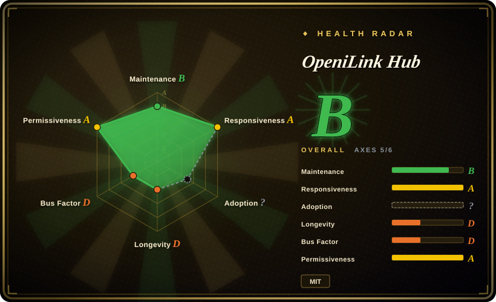

# OpeniLink Hub

A young self-hosted Go/React control plane for iLink-connected WeChat bots, combining multi-bot management, message tracing, WebSocket/Webhook delivery, an App Registry, and SQLite or PostgreSQL persistence; the project explicitly disclaims affiliation with or endorsement by iLink's official team.

## When to use

You're operating several iLink-connected WeChat bots and need more than a raw SDK loop. You want one web console for QR binding, users, bot status, message history, trace inspection, AI replies, WebSocket/Webhook delivery, and installable Apps. You also want to begin with an embedded SQLite database and local storage, then move to PostgreSQL and S3-compatible storage when the deployment grows.

Choose OpeniLink Hub over `openilink-sdk-go` or a focused relay when the management plane and App lifecycle are the deciding requirements. Choose a raw SDK when you have one integration and want to own the smallest possible trust boundary; Hub's value comes from centralization, and so do its authentication, registry, storage, and multi-user risks.

## When NOT to use

- **You need an officially affiliated or vendor-supported product.** Use WeCom or another documented Tencent API surface instead; OpeniLink Hub states that it is independently developed from publicly available iLink information and is neither affiliated with nor endorsed by iLink's official team.
- **Your workflow must send proactively after the iLink context window expires.** Use an official Tencent channel whose outbound-message policy matches the requirement; Hub treats context tokens older than 24 hours as unsendable and can only remind an operator before expiry, not renew the window silently.
- **You only need one narrow bridge or a library inside your own service.** Use `openilink-sdk-go`, another language SDK, or `openilink-tg` instead; Hub adds a web application, database schema, auth system, message broker, tracing, and App lifecycle that a single relay may not need.
- **You want a turnkey public multi-tenant service with safe defaults.** Put an identity-aware proxy such as oauth2-proxy or a VPN in front and complete bootstrap privately before exposing Hub; public registration defaults to enabled, the first registrant becomes `superadmin`, `RP_ORIGIN`/`RP_ID` must match the external origin, and `SECRET` defaults to `change-me-in-production`.
- **You cannot audit third-party integrations or let remote manifests expand the trust boundary.** Use a pinned custom Webhook/App or a hand-reviewed local service instead of enabling arbitrary Registry sources; Registry records can introduce remote app metadata, webhook and OAuth endpoints, tools, events, and scopes.
- **You need a mature platform with years of protocol and upgrade history.** Use an official WeCom integration or another established messaging stack; OpeniLink Hub was created in 2026-03, remains on `v0.1.x`, and has not yet earned a long-lived compatibility record.
- **You need native Windows without containers or WSL.** Use a platform-native service or run the relevant SDK inside your existing Windows application; the project documents Linux/macOS binaries and Docker or WSL2 for Windows.

## Comparison

| Alternative | In index | Our verdict | Tradeoff |
|---|---|---|---|
| `openilink-sdk-go` | not indexed | When you need iLink transport inside an existing Go service, choose the SDK; choose OpeniLink Hub when users, multiple bots, traces, Apps, and a web control plane are requirements rather than code you want to build. | The SDK keeps the process and trust boundary small but leaves persistence, auth, routing, and operations to you; Hub supplies those layers and makes them your operational responsibility. |
| `openilink-tg` | not indexed | When the job is only a focused WeChat-to-Telegram relay, choose `openilink-tg`; choose Hub when several destinations, installable Apps, and central administration justify a platform. | A focused bridge is easier to audit and run but cannot match Hub's routing and marketplace breadth; Hub is more capable and materially more complex. |
| [WeChat Bot](wechat-bot.md) | ✅ | When you want a developer-operated CLI that sends IM messages directly to several LLM backends and channels, choose WeChat Bot; choose OpeniLink Hub when persistent multi-user administration and App distribution matter more. | WeChat Bot is a lighter assistant application but uses an unofficial Wechaty personal-account path; Hub has a broader control plane and iLink dependency, with more database and auth surface. |
| WeCom / Official WeChat APIs | not indexed | When official support, enterprise identity, and a documented production contract decide the choice, use WeCom or another official API; choose Hub only when its iLink bot behavior and self-hosted App plane outweigh the lack of official affiliation. | Official APIs cover different enterprise or public-account workflows and may restrict personal-bot behavior; Hub offers more flexible self-hosted routing but inherits protocol, bootstrap, and ecosystem risk. |

## Tech stack

- **Backend:** Go 1.25 with a single `oih` server binary, `gorilla/websocket`, the OpeniLink Go SDK, WebAuthn, OAuth/OIDC, and an internal message broker and App dispatcher.
- **Frontend:** embedded React 19, Vite, TypeScript, and Tailwind CSS web console.
- **Data stores:** embedded SQLite through `modernc.org/sqlite` by default, or PostgreSQL through `pgx`; schema changes are represented by migrations for both paths.
- **Media storage:** optional local filesystem storage through `STORAGE_PATH`, optional MinIO/S3-compatible storage, or provider CDN proxy fallback when neither is configured.
- **Extension plane:** built-in Apps, custom Apps, remote Registry sources, WebSocket and Webhook event delivery, App OAuth with PKCE, commands/tools, and AI auto-reply.
- **Observability:** persisted messages, webhook/App logs, and per-message trace data exposed through the web console and APIs.

## Dependencies

- **Minimal local deployment:** the released binary or Docker image, a browser, writable local data storage, and the embedded SQLite database.
- **iLink connection:** a compatible WeChat/iLink account that can complete QR binding, plus outbound network access to the provider service.
- **Public deployment:** HTTPS termination and correctly configured `RP_ORIGIN` and `RP_ID` for WebAuthn, OAuth callbacks, generated media URLs, and browser-origin checks.
- **Production database:** PostgreSQL is optional through `DATABASE_URL`; SQLite remains the lowest-ops path for a single-node installation.
- **Media:** local filesystem storage is optional through `STORAGE_PATH`; S3/MinIO requires endpoint, access key, secret key, bucket, and public/proxy URL decisions.
- **Apps and AI:** remote Apps may require their own services, OAuth credentials, webhook reachability, and third-party platform permissions; AI replies require an OpenAI-compatible endpoint and key.

## Ops difficulty

**Medium for a private single-node install; high for an internet-facing multi-user platform.** The binary plus SQLite path is unusually simple for the feature set. Production operation adds HTTPS and origin correctness, database backup and migration, media retention, optional PostgreSQL/S3, bot reconnection and 24-hour-window reminders, OAuth credentials, App and Registry review, webhook reachability, message privacy, and role administration. Bootstrap deserves special handling: registration is enabled when the setting is absent, and the first created user is promoted to `superadmin`, so the service should not be exposed before the operator claims and hardens it.

## Health & viability

- **Maintenance, as of 2026-07:** the repository was created in 2026-03, released `v0.1.36` on 2026-06-18, and its default branch head matches that release. The visible release sequence from `v0.1.32` to `v0.1.36` shows active iteration rather than a launch-only repository.
- **Adoption:** GitHub reports about 1.5k stars and 123 forks after only a few months. That is meaningful interest, but production adoption, scale, and upgrade success are not established by stars.
- **Governance:** the repository is under an organization and has several contributors, but GitHub contribution counts are heavily dominated by one maintainer. There is no foundation governance or long operating record to reduce bus-factor risk yet.
- **Age and Lindy:** this is a young project on a newly exposed protocol surface. Current activity is positive, but age × continued maintenance cannot be evaluated after only months; treat the rapid `v0.1.x` cadence as evidence of motion, not stability.
- **Risk posture:** the decisive risks are the project's explicit non-affiliation disclaimer, the 24-hour send window, first-user-superadmin bootstrap, public-registration default, WebAuthn origin configuration, remote App Registry trust, and the amount of sensitive message and credential state centralized in one service.

## Caveats (unverified)

- [未验证] No independent production deployment, sustained throughput test, disaster-recovery exercise, or multi-version upgrade test was performed for this page.
- [未验证] The current policy stability and long-term availability of the underlying iLink surface were not verified from an official protocol specification; the repository itself disclaims official affiliation or endorsement.
- [未验证] Registry Apps, their OAuth scopes, remote services, data retention, and maintainers were not audited individually. An enabled Registry is a discovery mechanism, not a security review.
- [未验证] The v0.1.36 tree defines `SECRET` as a server secret for token encryption and defaults it to `change-me-in-production`, but a text-level source search did not establish an active consumer outside configuration; its effective security role requires version-specific review.
- [推断] Exposing an unclaimed instance creates a bootstrap takeover risk because registration defaults to enabled and the first user becomes `superadmin`; operators should claim the instance on a private boundary before public routing.
- [推断] The project's rapid early release cadence may include breaking behavior despite version tags; no compatibility policy or long-term support commitment was found in the reviewed repository.
