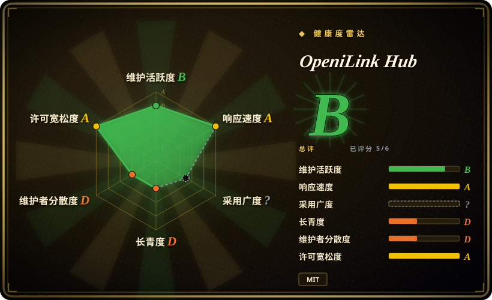

# OpeniLink Hub

一个年轻的自托管 Go／React 控制面，用于管理接入 iLink 的微信 Bot，组合了多 Bot 管理、消息追踪、WebSocket／Webhook 分发、App Registry，以及 SQLite 或 PostgreSQL 持久化；项目明确声明与 iLink 官方团队没有关联或授权关系。

## 何时使用

你在运行多个接入 iLink 的微信 Bot，需要的不只是一个 SDK 收发循环。你希望用同一个 Web 控制台完成扫码绑定、用户管理、Bot 状态、消息历史、链路追踪、AI 回复、WebSocket／Webhook 分发和 App 安装。你还想先用内嵌 SQLite 与本地存储起步，规模扩大后再切到 PostgreSQL 和 S3-compatible storage。

当管理面与 App lifecycle 是决定条件时，才应在 `openilink-sdk-go` 或专用 relay 之上选择 OpeniLink Hub。如果只有一个 integration，并希望自己控制最小信任边界，直接使用 SDK 更合适；Hub 的价值来自集中化，认证、Registry、存储与多用户风险也来自同一处。

## 何时不用

- **你需要官方关联或厂商支持的产品。** 改用企业微信或其他有腾讯文档支持的 API 面；OpeniLink Hub 声明它根据公开 iLink 信息独立开发，与 iLink 官方团队没有关联，也没有获得背书。
- **流程必须在 iLink context window 过期后主动发消息。** 改用 outbound policy 符合需求的腾讯官方通道；Hub 会把超过 24 小时的 context token 判为不可发送，只能在到期前提醒运营者，不能静默续期。
- **你只需要一个窄桥接或嵌入现有服务的 library。** 改用 `openilink-sdk-go`、其他语言 SDK，或 `openilink-tg`；Hub 会额外引入 Web 应用、数据库 schema、认证系统、消息 broker、trace 和 App lifecycle。
- **你想把它当作默认安全的公网多租户服务。** 先用 oauth2-proxy 这类 identity-aware proxy 或 VPN 隔离，并在私有边界完成 bootstrap；公开注册默认启用，首个注册者会成为 `superadmin`，`RP_ORIGIN`／`RP_ID` 必须匹配外部 origin，`SECRET` 默认还是 `change-me-in-production`。
- **你无法审计第三方 integration，也不能让远程 manifest 扩大信任边界。** 改用 pin 版本的 custom Webhook／App，或人工审过的本地服务，不要启用任意 Registry source；Registry record 可以引入远程 App metadata、webhook 与 OAuth endpoint、tools、events 和 scopes。
- **你需要已经积累多年协议与升级历史的平台。** 改用企业微信官方 integration 或其他成熟消息栈；OpeniLink Hub 创建于 2026-03，仍处于 `v0.1.x`，尚未形成长期 compatibility record。
- **你需要不借助 container 或 WSL 的原生 Windows 运行。** 改用 platform-native service，或把相关 SDK 嵌入已有 Windows 应用；项目文档只提供 Linux／macOS binary，以及 Windows 上的 Docker 或 WSL2 路径。

## 横向对比

| 替代品 | 是否收录 | 我们的评价 | 取舍 |
|---|---|---|---|
| `openilink-sdk-go` | 未收录 | 如果只要把 iLink transport 嵌入现有 Go 服务，选 SDK；如果用户、多 Bot、trace、App 和 Web 控制面都是需求，选 OpeniLink Hub。 | SDK 保持较小的进程与信任边界，但持久化、认证、routing 和运维都要自己实现；Hub 提供这些层，也把它们变成你的运维责任。 |
| `openilink-tg` | 未收录 | 如果任务只是专用微信到 Telegram relay，选 `openilink-tg`；如果多个 destination、可安装 App 与集中管理足以支撑一个平台，选 Hub。 | 专用 bridge 更容易审计和运行，却没有 Hub 的 routing 与 marketplace 广度；Hub 能力更完整，复杂度也明显更高。 |
| [WeChat Bot](wechat-bot.zh.md) | 已收录 | 如果要开发者自己操作的 CLI，把多个 IM 通道直接接到多个 LLM backend，选 WeChat Bot；如果更看重持久化多用户管理和 App 分发，选 OpeniLink Hub。 | WeChat Bot 是较轻的 assistant application，但个人微信走非官方 Wechaty 路径；Hub 控制面更广，并承担 iLink、数据库和认证风险。 |
| 企业微信／微信官方 API | 未收录 | 如果官方支持、企业 identity 与有文档的生产契约决定选型，使用企业微信或其他官方 API；只有 iLink Bot 行为与自托管 App plane 的价值高于无官方关联风险时，才选 Hub。 | 官方 API 面向不同的企业或公众账号 workflow，可能限制个人 Bot 行为；Hub routing 更灵活，却继承协议、bootstrap 与 ecosystem 风险。 |

## 技术栈

- **后端：** Go 1.25 单一 `oih` server binary，使用 `gorilla/websocket`、OpeniLink Go SDK、WebAuthn、OAuth／OIDC，以及内部 message broker 与 App dispatcher。
- **前端：** 内嵌 React 19、Vite、TypeScript 和 Tailwind CSS Web 控制台。
- **数据存储：** 默认通过 `modernc.org/sqlite` 使用内嵌 SQLite，也可通过 `pgx` 使用 PostgreSQL；两条路径都有 schema migration。
- **媒体存储：** 通过 `STORAGE_PATH` 使用可选本地 filesystem storage，或使用 MinIO／S3-compatible storage；两者都未配置时回退到 provider CDN proxy。
- **扩展面：** built-in App、custom App、远程 Registry source、WebSocket 与 Webhook event delivery、带 PKCE 的 App OAuth、commands／tools 和 AI auto-reply。
- **可观测性：** 持久化 message、webhook／App log 和逐消息 trace，并通过 Web 控制台与 API 暴露。

## 依赖

- **最小本地部署：** release binary 或 Docker image、浏览器、可写本地数据目录，以及内嵌 SQLite。
- **iLink 连接：** 一个能完成二维码绑定的兼容微信／iLink 账号，并能访问 provider service。
- **公网部署：** HTTPS termination，以及正确配置的 `RP_ORIGIN` 与 `RP_ID`，供 WebAuthn、OAuth callback、媒体 URL 和 browser origin 使用。
- **生产数据库：** 可通过 `DATABASE_URL` 选择 PostgreSQL；单节点最低运维路径仍是 SQLite。
- **媒体：** 可通过 `STORAGE_PATH` 使用本地 filesystem；S3／MinIO 需要 endpoint、access key、secret key、bucket，以及 public／proxy URL 决策。
- **App 与 AI：** 远程 App 可能需要自己的 service、OAuth credential、可达 webhook 和第三方 platform permission；AI reply 需要 OpenAI-compatible endpoint 与 key。

## 运维难度

**私有单节点为中等，公网多用户平台为高。** Binary 加 SQLite 对这组功能来说很简单。生产运维还要处理 HTTPS 与 origin 正确性、数据库 backup 和 migration、媒体 retention、可选 PostgreSQL／S3、Bot reconnect 与 24 小时窗口提醒、OAuth credential、App 与 Registry review、webhook reachability、消息隐私和角色管理。Bootstrap 必须单独处置：配置缺失时 registration 会启用，第一个创建的用户会被提升为 `superadmin`，因此运营者认领并完成 hardening 前不应把服务暴露到公网。

## 健康度与可持续性

- **维护，截至 2026-07：** 仓库创建于 2026-03，在 2026-06-18 发布 `v0.1.36`，默认分支 head 与该 release 一致。从 `v0.1.32` 到 `v0.1.36` 的可见 release 序列说明它在持续迭代，不是只活跃于发布期的仓库。
- **采用：** GitHub 报告约 1.5k star 与 123 fork，几个月内已经获得明显关注。但生产采用、规模与升级成功不能由 star 证明。
- **治理：** 仓库位于 organization 下，也有多名 contributor，但 GitHub contribution count 仍由一名 maintainer 大幅主导。目前没有基金会治理或长期运行记录来降低 bus-factor risk。
- **年龄与 Lindy：** 这是新项目，也建立在新开放的协议面上。当前活跃度是正面信号，但只有几个月，无法评估年龄乘持续维护；快速 `v0.1.x` cadence 证明的是变化速度，不是稳定性。
- **风险姿态：** 决定性风险包括项目明确的无官方关联声明、24 小时发送窗口、首用户 `superadmin` bootstrap、公开注册默认值、WebAuthn origin 配置、远程 App Registry 信任，以及把敏感消息与 credential state 集中到单一服务。

## 存疑（未验证）

- [未验证] 本页没有执行独立生产部署、持续吞吐测试、灾难恢复演练或跨版本升级测试。
- [未验证] 本次没有从官方 protocol specification 核验底层 iLink 面的当前政策稳定性与长期可用性；仓库本身明确声明没有官方关联或背书。
- [未验证] 本次没有逐个审计 Registry App 的 OAuth scope、远程 service、data retention 与 maintainer。启用 Registry 只提供 discovery，不代表完成安全 review。
- [未验证] `v0.1.36` 源码把 `SECRET` 定义为用于 token encryption 的 server secret，默认值为 `change-me-in-production`，但文本级源码检索没有确认 configuration 之外的有效 consumer；它的实际安全作用需要按具体版本复核。
- [推断] 未认领实例暴露到公网会形成 bootstrap takeover risk，因为 registration 默认启用，第一个用户会成为 `superadmin`；运营者应先在私有边界认领实例，再接入公网 routing。
- [推断] 项目早期 release cadence 很快，即使有 version tag 也可能包含 breaking behavior；实读仓库中没有找到 compatibility policy 或长期支持承诺。
