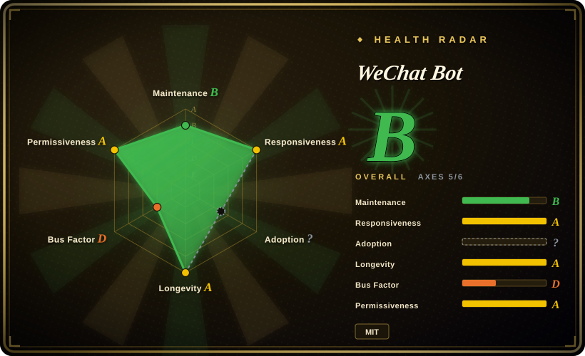

# WeChat Bot

A Node.js CLI that routes WeChat, Lark, Telegram, and WhatsApp messages to multiple LLM or coding-agent backends and can analyze locally captured WeChat data; its personal-WeChat path remains unofficial and account-risky.

## When to use

You're building a self-hosted IM assistant and need one command-line project to bridge several channels to the same provider layer. You want QR-login WeChat replies today, but also want Lark events, Telegram polling, or a WhatsApp webhook without writing every adapter yourself. You also need allowlists, local JSONL capture, optional group or friend analysis, and the ability to switch among Pi, Ollama, OpenAI, Claude, DeepSeek, Kimi, Dify, and other backends.

You choose WeChat Bot over raw Wechaty when the ready-made CLI, provider adapters, OpenCLI passthrough, and analysis commands outweigh the larger dependency and privacy surface. For production workflows where an official enterprise messaging surface is acceptable, use WeCom or official account APIs instead of the personal-WeChat route.

## When NOT to use

- **You need a Tencent-supported production integration.** Use the official WeCom API or WeChat Official Account/Mini Program server APIs instead; this project's personal-WeChat route uses an unofficial Wechaty Web/UOS puppet and the README explicitly warns about account warnings and bans.
- **You cannot risk the logged-in personal account.** Move the workflow to WeCom, Lark, Telegram Bot API, or WhatsApp Cloud API instead; allowlists reduce message scope but do not remove protocol-detection or account-enforcement risk.
- **You only need a reusable conversational-bot framework.** Use Wechaty directly instead; WeChat Bot adds provider adapters, analysis, OpenCLI, channel-specific commands, and project opinions that a library consumer may not want.
- **Your team needs a Python-first multi-channel AI bot.** Evaluate CowAgent instead; WeChat Bot is an ESM JavaScript CLI and its extension points follow the Node.js module layout.
- **You only need an official Telegram or WhatsApp bot.** Use the platform's official SDK or a focused framework instead; carrying Wechaty, Chromium, WeChat providers, and unrelated model adapters adds unnecessary dependencies.
- **Private chat content must not leave the machine.** Use the built-in statistics-only mode or a local Ollama/Pi setup instead of a cloud provider; deep analysis sends recent message samples to the selected service.

## Comparison

| Alternative | In index | Our verdict | Tradeoff |
|---|---|---|---|
| Wechaty | not indexed | Choose Wechaty when you need the lower-level multi-language bot framework and want to design providers and commands yourself; choose WeChat Bot when its CLI, model adapters, and analysis flows match the task. | Wechaty is more reusable and less opinionated; WeChat Bot reaches a working assistant faster but inherits Wechaty and adds a wider dependency and privacy surface. |
| CowAgent | not indexed | Choose CowAgent when a Python-first AI chatbot ecosystem is the deciding factor; choose WeChat Bot when Lark, Telegram, WhatsApp, Pi, and OpenCLI integration matter more. | CowAgent offers a different language ecosystem and broader chatbot product direction; WeChat Bot is a focused Node CLI with strong local-WeChat data commands. |
| WeChatFerry | not indexed | Consider a maintained WeChatFerry fork only when Windows-client injection and local RPC are required; choose WeChat Bot for a Web/UOS puppet and multi-IM adapter design. | WeChatFerry accesses a different client surface but the original repository is archived and version-sensitive; WeChat Bot is more portable but carries Web-protocol account risk. |
| [ItChat](itchat.md) | ✅ | Use ItChat only to study legacy web-WeChat bot code; choose WeChat Bot for a currently maintained multi-channel application. | ItChat is simpler and historically influential but largely unusable on modern accounts; WeChat Bot is active and broader, yet still cannot make unofficial personal-WeChat access safe. |
| [wxpy](wxpy.md) | ✅ | Use wxpy only as a legacy object-API reference; choose WeChat Bot when you need current commands, providers, and non-WeChat channels. | wxpy has an elegant old Python API but is archived on the defunct web protocol; WeChat Bot has more operational surface and ongoing protocol risk. |

## Tech stack

- **Runtime and language:** Node.js 18+ with ECMAScript modules; the repository's primary language is JavaScript.
- **CLI and configuration:** Commander-based `wb` command, dotenv configuration, local JSONL message storage, and subprocess adapters for Pi and OpenCLI.
- **WeChat path:** Wechaty with `wechaty-puppet-wechat4u` in UOS mode, terminal QR rendering, and Chromium or a configured Chrome endpoint.
- **Other channels:** Lark through `lark-cli`, Telegram through the official Bot API with long polling, and WhatsApp through Cloud API webhooks.
- **Provider layer:** adapters for OpenAI/ChatGPT, Claude, DeepSeek, Kimi, Ollama, Dify, Doubao, Tongyi, Xunfei, 302.AI, Pi, and related services.

## Dependencies

- **Required:** Node.js 18+, npm, a populated `.env`, and a supported IM account or bot credential for the selected channel.
- **Personal WeChat:** a phone account that can scan the QR code, Wechaty puppet dependencies, and Chromium; login success and session durability depend on upstream WeChat behavior.
- **Cloud model backends:** provider API keys, available account balance, and network access. Ollama is available as a local alternative.
- **Local WeChat data commands:** OpenCLI and its `wx-cli` package, launched through a configured binary or `npx`.
- **WhatsApp:** a publicly reachable HTTPS webhook and Meta Cloud API credentials; Lark and Telegram likewise require their platform-side app or bot setup.

## Ops difficulty

**Medium, rising to high for personal-WeChat production use.** Installing the CLI and starting one channel is straightforward, and Dockerfiles are provided. Ongoing operation spans several failure domains: QR sessions and Chromium, unofficial WeChat protocol changes, per-provider keys and billing, platform webhooks or event permissions, allowlist correctness, local message retention, and data-egress choices. The application is manageable for a personal or internal assistant, but treating it as a reliable customer-facing WeChat service means accepting a platform dependency the project does not control.

## Health & viability

- **Maintenance, as of 2026-07:** created in 2021, pushed on 2026-07-08, and still adding Telegram and WhatsApp support. The latest 100 commits span at least 2024-07 to 2026-07, so this is an active rather than historical repository.
- **Adoption and contributors:** GitHub reports about 11.2k stars and 1.2k forks, with multiple contributors beyond the owner. Stars do not prove reliability, but the contributor history and multi-year activity are stronger signals than a launch-only repository.
- **Release discipline:** GitHub's latest release is `0.0.2` from 2024-03 while `package.json` declares `1.0.2` and the main branch has much newer features. Users should pin a commit and test it rather than infer compatibility from releases.
- **Age and Lindy:** roughly four and a half years old and still receiving feature work. That age-plus-activity combination is a positive prior for project continuity, but it cannot stabilize the unofficial WeChat protocol beneath it.
- **Risk posture:** the dominant risks are external platform enforcement, sensitive chat-data handling, and dependency drift. The repository license file is MIT, but package metadata disagrees, and the WeChat path depends on an aging Wechaty puppet stack.

## Caveats (unverified)

- [未验证] `LICENSE.md` contains the MIT license, while `package.json` declares `ISC`. This page uses the repository license file as canonical, but redistribution should wait for upstream clarification of the metadata conflict.
- [未验证] The personal-WeChat path uses `wechaty-puppet-wechat4u` with UOS mode, an unofficial protocol surface. The README warns of account warnings or bans; no measured ban rate or safe operating threshold is published.
- [未验证] The README says the underlying Wechaty and padlocal paths have maintenance or stability concerns. Their current maintainer status was not fully audited as part of this page.
- [未验证] Deep `wb analyze` flows send recent chat samples to the selected model or agent backend. Exact sampling, retention, provider logging, and cross-border data handling depend on configuration and the chosen service.
- [推断] Allowlists, local JSONL storage, and local Ollama/Pi can reduce exposure, but they do not guarantee account safety or data confidentiality; operators must define retention, access, consent, and egress rules.
- [推断] The absence of a lockfile in the reviewed tree and the Dockerfile's Node 19 base increase reproducibility and dependency-aging risk; no vulnerability scan was performed here.
