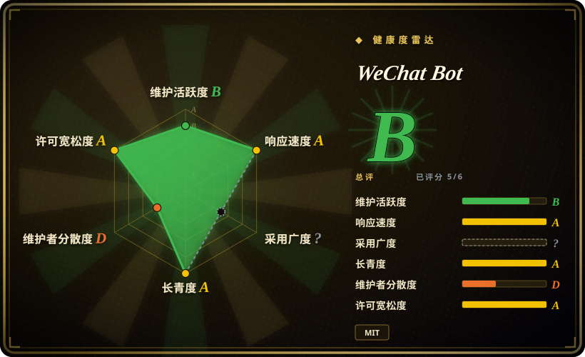

# WeChat Bot

一个 Node.js CLI，把微信、飞书、Telegram、WhatsApp 消息路由到多种 LLM 或 coding-agent 后端，也能分析本地捕获的微信数据；个人微信通道仍是非官方协议，并伴随账号风险。

## 何时使用

你在搭一个自托管 IM 助手，希望用一个命令行项目把多个消息通道接到同一 provider 层。眼下要扫码登录微信自动回复，但也希望接入飞书事件、Telegram polling 或 WhatsApp webhook，而不想逐个重写 adapter。你还需要 allowlist、本地 JSONL 留存、可选的群聊或好友分析，以及在 Pi、Ollama、OpenAI、Claude、DeepSeek、Kimi、Dify 等后端之间切换。

当现成 CLI、provider adapter、OpenCLI passthrough 和分析命令的价值，高于更大的依赖面与隐私面时，才应在 raw Wechaty 之上选择 WeChat Bot。如果生产场景能接受官方企业消息入口，应改用企业微信或公众号 API，不要走个人微信通道。

## 何时不用

- **你需要腾讯官方支持的生产接入。** 改用企业微信 API 或微信公众号／小程序服务端 API；本项目的个人微信通道使用非官方 Wechaty Web/UOS puppet，README 明确警告账号可能收到提示或被封。
- **你不能承受已登录个人号的风险。** 把流程迁到企业微信、飞书、Telegram Bot API 或 WhatsApp Cloud API；allowlist 能缩小消息范围，却不能消除协议识别和账号处置风险。
- **你只需要可组合的对话机器人框架。** 直接使用 Wechaty；WeChat Bot 额外加入 provider adapter、分析、OpenCLI、通道命令和项目级约定，library 使用者未必需要这些。
- **团队需要 Python-first 的多通道 AI bot。** 评估 CowAgent；WeChat Bot 是 ESM JavaScript CLI，扩展点按 Node.js 模块结构组织。
- **你只做官方 Telegram 或 WhatsApp bot。** 改用平台官方 SDK 或专用框架；携带 Wechaty、Chromium、微信 provider 和无关模型 adapter 会增加多余依赖。
- **私人聊天内容不能离开本机。** 使用内置 stats-only 模式或本地 Ollama/Pi，不要调用云端 provider；深度分析会把近期消息样本交给所选服务。

## 横向对比

| 替代品 | 是否收录 | 我们的评价 | 取舍 |
|---|---|---|---|
| Wechaty | 未收录 | 如果要底层多语言 bot framework，并准备自己设计 provider 与命令，选 Wechaty；如果现成 CLI、模型 adapter 和分析流程正好匹配任务，选 WeChat Bot。 | Wechaty 更可复用、观点更少；WeChat Bot 更快落成助手，但继承 Wechaty 后又扩大了依赖与隐私面。 |
| CowAgent | 未收录 | 如果 Python-first AI chatbot 生态是决定条件，选 CowAgent；如果更看重飞书、Telegram、WhatsApp、Pi 和 OpenCLI 集成，选 WeChat Bot。 | CowAgent 提供另一种语言生态和更广的 chatbot 产品方向；WeChat Bot 是专注的 Node CLI，并强化本地微信数据命令。 |
| WeChatFerry | 未收录 | 只有在必须使用 Windows 客户端注入和本地 RPC 时，才评估仍维护的 WeChatFerry 分叉；Web/UOS puppet 加多 IM adapter 则选 WeChat Bot。 | WeChatFerry 接入的是另一种客户端面，但原仓库已归档且强依赖版本；WeChat Bot 可移植性更好，却承担 Web 协议账号风险。 |
| [ItChat](itchat.zh.md) | 已收录 | 只在研究旧网页微信机器人代码时使用 ItChat；需要当前仍维护的多通道应用时，选 WeChat Bot。 | ItChat 更简单，也影响过一代生态，但现代账号基本不可用；WeChat Bot 活跃且更广，却仍无法把非官方个人微信接入变安全。 |
| [wxpy](wxpy.zh.md) | 已收录 | 只把 wxpy 当作旧对象 API 参考；需要当前命令、provider 和非微信通道时，选 WeChat Bot。 | wxpy 的旧 Python API 很优雅，但已归档且依赖失效协议；WeChat Bot 运维面更大，也继续承担协议风险。 |

## 技术栈

- **运行时与语言：** Node.js 18+ 和 ECMAScript modules；仓库主要语言为 JavaScript。
- **CLI 与配置：** 基于 Commander 的 `wb` 命令、dotenv 配置、本地 JSONL 消息存储，以及 Pi 与 OpenCLI 的子进程 adapter。
- **微信通道：** Wechaty 加 UOS 模式的 `wechaty-puppet-wechat4u`，终端二维码渲染，以及 Chromium 或指定 Chrome endpoint。
- **其他通道：** 飞书通过 `lark-cli`，Telegram 使用官方 Bot API long polling，WhatsApp 使用 Cloud API webhook。
- **Provider 层：** 包含 OpenAI/ChatGPT、Claude、DeepSeek、Kimi、Ollama、Dify、豆包、通义、讯飞、302.AI、Pi 等 adapter。

## 依赖

- **必需：** Node.js 18+、npm、填好的 `.env`，以及所选通道对应的 IM 账号或 bot credential。
- **个人微信：** 一个能扫描二维码的手机账号、Wechaty puppet 依赖和 Chromium；登录成功率与会话寿命取决于微信上游行为。
- **云模型后端：** 对应 provider API key、可用余额与网络访问；Ollama 可作为本地替代。
- **本地微信数据命令：** OpenCLI 及其 `wx-cli` 包，通过指定 binary 或 `npx` 启动。
- **WhatsApp：** 公网可达的 HTTPS webhook 和 Meta Cloud API 凭据；飞书与 Telegram 同样需要平台侧 app 或 bot 配置。

## 运维难度

**中等；若把个人微信用于生产则升到高。** 安装 CLI 并启动单个通道并不复杂，仓库也提供 Dockerfile。持续运行却横跨多种故障域：二维码会话和 Chromium、非官方微信协议变化、各 provider 的 key 与计费、平台 webhook 或事件权限、allowlist 正确性、本地消息保留，以及数据是否外发。个人或内部助手尚可管理；若把它当作面向客户的可靠微信服务，就要接受项目无法控制的平台依赖。

## 健康度与可持续性

- **维护，截至 2026-07：** 项目创建于 2021 年，最后 push 为 2026-07-08，仍在加入 Telegram 与 WhatsApp 支持。最近 100 个提交至少跨越 2024-07 到 2026-07，因此它是活跃项目，不是历史代码。
- **采用与贡献者：** GitHub 报告约 11.2k star、1.2k fork，并有 owner 以外的多名贡献者。Star 不能证明可靠性，但贡献者历史与多年活动比只在发布期活跃的仓库更强。
- **发布纪律：** GitHub 最新 release 仍是 2024-03 的 `0.0.2`，而 `package.json` 已声明 `1.0.2`，main branch 功能又更新得多。用户应 pin commit 并自行测试，不要从 release 推断兼容性。
- **年龄与 Lindy：** 项目约四年半，仍持续加功能。年龄与活跃度的组合为连续性提供正向先验，但无法稳定它下面的非官方微信协议。
- **风险姿态：** 决定性风险来自外部平台处置、敏感聊天数据处理和依赖漂移。仓库许可证文件为 MIT，但 package metadata 与之冲突，微信通道也依赖较老的 Wechaty puppet 栈。

## 存疑（未验证）

- [未验证] `LICENSE.md` 是 MIT，而 `package.json` 声明 `ISC`。本页以仓库许可证文件为 canonical，但再分发前应等待上游澄清 metadata 冲突。
- [未验证] 个人微信通道使用 UOS 模式的 `wechaty-puppet-wechat4u`，属于非官方协议面。README 警告账号可能收到提示或被封，但没有发布实测封禁率或安全运行阈值。
- [未验证] README 称底层 Wechaty 与 padlocal 路径存在维护或稳定性问题；本页没有完整审计这些上游的当前维护状态。
- [未验证] 深度 `wb analyze` 流程会把近期聊天样本交给所选 model 或 agent backend。确切采样、保留、provider logging 与跨境数据处理取决于配置和所选服务。
- [推断] Allowlist、本地 JSONL 和本地 Ollama/Pi 可以降低暴露，却不能保证账号安全或数据机密性；运营方仍需定义保留、访问、同意和外发规则。
- [推断] 实读文件树未见 lockfile，Dockerfile 仍以 Node 19 为基础，这会增加复现与依赖老化风险；本次没有执行漏洞扫描。
