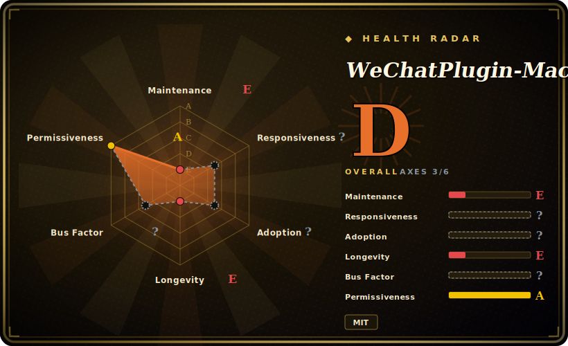

# WeChatPlugin-MacOS

A macOS WeChat **client tweak** (微信小助手) — anti-revoke, auto-reply, remote control, multi-instance, and assorted UI conveniences — by **injecting a plugin into WeChat.app on macOS**. **Read this plainly: it works by patching the WeChat client binary against a *specific* WeChat version, so it breaks whenever WeChat updates; the repo has been idle ~2 years (last pushed 2024-06) and targets old WeChat builds, so on a current WeChat it is almost certainly non-functional.**

## When to use

You're a longtime macOS WeChat power-user who has deliberately **pinned an old WeChat build** — the README targets ancient versions (badges read WeChat 2.3.22; the changelog mentions support up to 3.7.0) — and you want the classic quality-of-life tweaks back: messages that don't disappear when the sender revokes them (防撤回), a keyword auto-reply bot, running two WeChat accounts side-by-side, pin-to-top windows, and the Alfred quick-send workflow. You're comfortable disabling auto-update on WeChat, installing an injected plugin into `WeChat.app`, and you accept that the moment you let WeChat update, the whole thing stops working. In that narrow, frozen-version setup, WeChatPlugin-MacOS is the reference implementation of macOS WeChat tweaks.

Realistically that is the **only** scenario where reaching for it makes sense in 2026: an older, pinned macOS WeChat you never update, on a throwaway or low-stakes account, where you value the tweaks more than stability or account safety. If any of those conditions doesn't hold, see below — this is a museum piece, not something to build on.

## When NOT to use

- **You run a current / auto-updating WeChat.** This is the dominant disqualifier. The plugin **patches the WeChat.app binary for a specific WeChat version**, so **every WeChat update breaks it** — and with the repo idle ~2 years against builds as old as 2.3.x–3.7.x, it is **almost certainly non-functional on whatever WeChat ships today.** Load-bearing: this is not "might need a tweak," it's "the foundation is gone." [推断]
- **You care about the account.** Driving an enhanced/injected WeChat client is **against WeChat's Terms of Service** and carries real **rate-limit / freeze / permanent-ban** risk. Don't point it at an account you can't afford to lose.
- **Security-sensitive context.** You are **injecting third-party code into a messaging client** that holds your private conversations and contacts — a large trust and attack surface (the plugin can read/modify anything WeChat sees). An unmaintained injector amplifies that risk.
- **You're not on macOS.** It is **macOS-only** and patches the desktop WeChat.app; there is nothing here for Windows, mobile, or server-side automation.
- **You need programmatic / supported IM automation.** This is a desktop UI tweak, not an API. For sanctioned automation use **WeCom (企业微信) API** or **WeChat Official Account / Mini-Program** server APIs; for personal-account-style bots, [ItChat](itchat.md) and its successors exist (though they are also dead/fragile and carry the same ToS risk).
- **Production or anything you must keep running.** An unmaintained binary patch against an auto-updating client cannot be a stable dependency.

## Comparison

| Alternative | In index | Our verdict | Tradeoff |
|---|---|---|---|
| WeChatTweak-macOS (Sunnyyoung fork/successor) | 未收录 | Use this page for its stated niche; choose WeChatTweak-macOS (Sunnyyoung fork/successor) when you need the community successor for macOS WeChat tweaks. | The community successor for macOS WeChat tweaks — same anti-revoke/multi-instance class of features, but more recently maintained and with a CLI installer; still a binary patch against a specific WeChat version, so it inherits the same version-fragility and ToS/ban exposure. The more sensible pick if you insist on this approach. |
| [ItChat](itchat.md) | ✅ | Use this page for its stated niche; choose ItChat when you need python library automating WeChat **personal accounts** via the (now-defunct) web protocol. | Python library automating WeChat **personal accounts** via the (now-defunct) web protocol — a programmatic API, not a desktop client tweak. Also effectively dead and platform-blocked; different surface (web protocol vs binary injection), same "abandoned + ToS risk" verdict. |
| Official WeChat (no plugin) | 未收录 | Use this page for its stated niche; choose Official WeChat (no plugin) when you need the supported path: no anti-revoke, no auto-reply, no multi-instance, but it updates cleanly, isn't. | The supported path: no anti-revoke, no auto-reply, no multi-instance, but it updates cleanly, isn't a ban risk, and doesn't inject foreign code into your messenger. The honest default for anyone who values the account. |
| WeCom / Official Account / Mini-Program APIs | 未收录 | Use this page for its stated niche; choose WeCom / Official Account / Mini-Program APIs when you need tencent's **official, sanctioned** automation surfaces. | Tencent's **official, sanctioned** automation surfaces; stable and supported, but they automate enterprise/public-account contexts, not your personal desktop WeChat — a legitimate but different product, not a drop-in. |

## Tech stack

- **Language:** Objective-C — a macOS WeChat.app plugin, i.e. code that runs **inside** the WeChat process.
- **Mechanism:** binary/runtime **patching and injection** into `WeChat.app` (the classic macOS "tweak" pattern — hooking/swizzling WeChat's own Objective-C methods to add anti-revoke, auto-reply, etc.).
- **Surface:** anti-revoke (防撤回), keyword auto-reply, remote control (incl. voice/system control via AppleScript helpers), multi-instance (微信多开), window pin-to-top, conversation tweaks, and an Alfred workflow integration.
- **Coupling:** tightly bound to specific WeChat client versions — README explicitly tracks "support WeChat 2.3.22 / 3.7.0," which is the root of the fragility.

## Dependencies

- **A specific, pinned macOS WeChat.app** — the real dependency. The plugin must match the WeChat version it was built against; you typically must **disable WeChat's auto-update** to keep a compatible build, and a non-App-Store WeChat is generally required.
- **macOS** (desktop) — no other platform applies.
- **Accessibility/automation permissions** for the remote-control features (the README instructs adding WeChat and Script Editor under System Preferences → Security & Privacy → Accessibility).
- **Optional: Alfred** for the quick-send workflow (a separate `wechat-alfred-workflow` repo).
- **Build:** Xcode / an Objective-C toolchain to compile from source, if you don't use a prebuilt install.

## Ops difficulty

**Deceptively low to install, but the real difficulty is keeping it working at all — which you mostly can't.** Installing the plugin into WeChat.app is a guided process (the repo ships an `Install.md`), and the happy path is a few steps. The hard, unwinnable part is **version management**: you must freeze WeChat at a compatible build, refuse every update (WeChat nags and can self-update), and re-patch after any forced upgrade — and since the project stopped tracking new WeChat versions ~2 years ago, there is no maintained build for current WeChat to patch in the first place. There's no server or datastore to run; the entire operational burden is fighting an auto-updating client with an unmaintained patch, which is a losing position.

## Health & viability

- **Maintenance (2026-06): coasting → effectively dead.** Last pushed **2024-06** → roughly **2 years idle**; ~152 open issues, single-maintainer (owner type **User**, `TKkk-iOSer`), not archived but not moving. This is a coasting-to-abandoned project, not an active one. [推断]
- **Inherently version-fragile — the decisive signal.** It **patches an auto-updating client binary** tied to a specific WeChat version. Even a well-maintained project of this kind decays the instant the host app updates; an *un*maintained one against builds as old as 2.3.x–3.7.x is **non-functional on current WeChat by construction.** [推断]
- **Lindy verdict: FAILS in practice.** Created **2017-04** (~9 years old), so on age alone it looks Lindy — but Lindy is **age × still-active**, never age alone. Here it is **long-lived but idle AND structurally doomed** (a patch against a moving target the maintainer stopped chasing). The longevity is *negated*, not earned — the textbook Lindy-failure case. [推断]
- **Governance / bus factor.** Single-maintainer personal repo, no foundation/vendor/successor stewardship — bus factor of one, and the work has stopped. The high star count (~14k) reflects past popularity, not current health. [推断]
- **Risk flags.** Against WeChat ToS (account-ban exposure); security risk of injecting third-party code into a private messaging client; macOS-only; MIT license is the only un-encumbered part of the picture. [推断]

## Caveats (unverified)

- [未验证] "~14.3k stars / 2455 forks / ~152 open issues / 388 watchers" are from the GitHub API as of 2026-06; star/issue/fork counts are date-sensitive and unreliable — treat as indicative only.
- [未验证] "Last pushed 2024-06" is the load-bearing maintenance fact (from the GitHub API `pushed_at`); the repo is **not** marked `archived`, and carries no explicit deprecation notice in its README — "effectively dead / non-functional on current WeChat" is *inferred* from the ~2-year idle plus the version-fragile mechanism, not quoted from an official statement.
- [推断] The "patches/injects into the WeChat.app binary, breaks on WeChat update" mechanism is inferred from the feature set (anti-revoke, multi-instance, in-client UI tweaks) and the README's explicit per-WeChat-version support badges (2.3.22 / 3.7.0); the exact injection technique was not read from source line-by-line.
- [未验证] Whether it functions on *any* still-installable WeChat build today was not empirically tested; the "almost certainly non-functional on current WeChat" claim is an inference from the idle period and the targeted versions.
- [未验证] The WeChatTweak-macOS comparison row (its current maintenance status and feature parity) describes the general landscape and was not freshly re-verified against that repo.
- [推断] Account-ban / ToS-violation and security (code-injection) risks are inferences from the unofficial-injection nature of the tool, not measured rates; severity varies by account and usage.
- [未验证] Dependency and install details (disable-auto-update requirement, non-App-Store WeChat, Accessibility permissions, Xcode build) are from the README and general knowledge of macOS tweaks and were not re-checked against the current source/`Install.md`.
