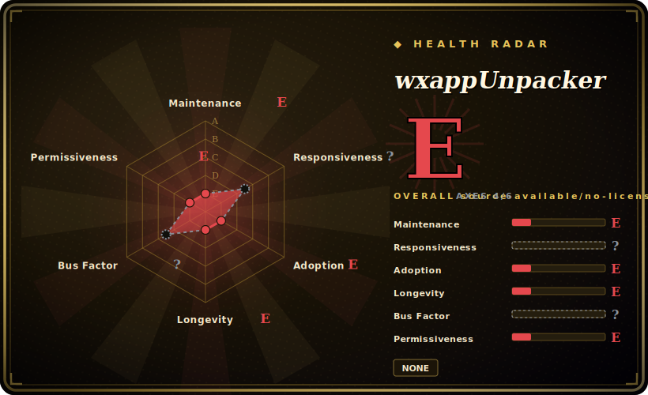

# wxappUnpacker

A WeChat mini-program (微信小程序) `.wxapkg` decompiler/unpacker — except *this particular fork* has been gutted: the `xdmjun/wxappUnpacker` repo now contains a single `README.md` whose entire content is the literal string `del`. It is a tombstone for a tool that lives on only in forks.

## When to use

You're a mobile security researcher (or a developer who lost the source of your *own* WeChat mini-program) holding a `.wxapkg` bundle pulled off a device, and you need to turn that packed blob back into readable `.wxml` / `.wxss` / `.json` / `.js` so you can audit what it does or recover assets. The wxappUnpacker family of Node.js scripts (`wuWxapkg.js`, `wuWxss.js`, `wuWxml.js`, `wuJs.js`) is the canonical community decompiler for exactly this — point it at the package, run the launcher, and it restores the project tree.

But note what you're actually reaching for: **not this repo.** `xdmjun/wxappUnpacker` is an empty shell. If you want working code you must find a maintained fork (the lineage traces back to `qwerty472123/wxappUnpacker`, itself archived/read-only since 2020). Treat this page as a warning marker on a dead entry in the chain, not an install target.

## When NOT to use

- **This repo has no code — there is nothing to install or run.** The sole HEAD commit ("del", 2023-04-08) replaced everything with the string `del`. `language` is null, no LICENSE file, no releases, no tags. Selecting `xdmjun/wxappUnpacker` specifically is a dead end. [未验证]
- **The whole lineage is abandoned.** Upstream `qwerty472123/wxappUnpacker` is archived (read-only) since 2020-04; this fork self-deleted in 2023. Bus factor is effectively zero — no maintainer will fix a `.wxapkg` format change.
- **Deprecated `vm2` dependency.** The preserved fork code depends on `vm2@^3.6.0`, which its own maintainer deprecated after multiple critical sandbox-escape CVEs. Feeding it untrusted package input is a real supply-chain/RCE exposure. [推断]
- **Legal / ToS risk.** Decompiling third-party `.wxapkg` bundles reverse-engineers other people's mini-programs; that typically violates the WeChat platform terms and can infringe the target app's copyright. Defensible only for apps you own or with explicit authorization.
- **No defined license on this fork.** GPL-3.0 is declared only in the forks' `package.json`; `xdmjun` ships no LICENSE file at all, so its redistribution terms are undefined. [未验证]

## Comparison

| Alternative | In index | Our verdict | Tradeoff |
|---|---|---|---|
| qwerty472123/wxappUnpacker (upstream) | 未收录 | Use this page for its stated niche; choose qwerty472123/wxappUnpacker (upstream) when you need the original lineage. | The original lineage; more complete than this gutted fork, but **archived/read-only since 2020** — also unmaintained, just not deleted. |
| Other live forks (SangeCoder / PyCoreDev / yangyang5214) | 未收录 | Use this page for its stated niche; choose Other live forks (SangeCoder / PyCoreDev / yangyang5214) when you need where working code survives. | Where working code survives; PyCoreDev (2023-02) retains full code + `package.json`. None are large or clearly maintained — pick by recency and read the diff yourself. |
| Custom unpack scripts | 未收录 | Use this page for its stated niche; choose Custom unpack scripts when you need the `. | The `.wxapkg` format is documented enough that ad-hoc scripts exist; viable if you only need asset extraction, not full source restore. |

## Tech stack

- **Language:** Node.js (CLI scripts, no build step). Entry scripts `wuWxapkg.js` (package), `wuWxss.js` (CSS), `wuWxml.js` (XML), `wuJs.js` (JS), with `wuLib.js` / `wuRestoreZ.js` helpers and `bingo.sh` / `bingo.bat` launchers. [推断 — reconstructed from a live fork; this repo's own history was overwritten]
- **Parsing/codegen deps:** `cheerio`, `css-tree`, `cssbeautify`, `escodegen`, `esprima`, `js-beautify`, `uglify-es`, and the sandbox runner `vm2`.

## Dependencies

- **Runtime:** Node.js. No services or datastore — it's a batch of file-transforming scripts.
- **Input:** one or more `.wxapkg` package files (which you must obtain separately from a device).
- **Hazard dep:** `vm2` (deprecated, sandbox-escape CVE history) is in the dependency chain (see Caveats).

## Ops difficulty

**N/A for this repo** — there is nothing to operate. For a working fork: **low** (clone, `npm install`, run a script against a file). There is no server, no state, no deployment; it's a one-shot CLI transform. The only real operational hazard is the `vm2` exposure if you process packages you don't trust.

## Health & viability

- **Maintenance (2026-06).** Abandoned — the sole real commit gutted the repo on 2023-04-08; the 2026-06 `updated_at` is a metadata touch, not activity. The upstream `qwerty472123` lineage is archived since 2020. **Dead, not coasting.** [未验证]
- **Governance / bus factor.** Bus factor **0**: deleted by a single User-account owner, upstream frozen. No releases, tags, or active contributors anywhere in the chain.
- **Age × Lindy.** Created 2019-12; the lineage is older (~2020 upstream). Age means nothing here because it is *not active* — Lindy requires old **and** alive, and this fails the second test. [推断]
- **Adoption.** ~2.4k stars / ~1.35k forks accrued to code that no longer exists in this repo; the stars are a fossil of past popularity, not a maintenance signal — exactly the "popular but dead" anomaly to distrust. [未验证]
- **Risk flags.** Voluntary self-deletion (motive unconfirmed, plausibly legal/ToS), undefined license on this fork, deprecated `vm2` in the working forks, and the underlying ToS/copyright exposure of `.wxapkg` decompilation. [推断]

## Caveats (unverified)

- [未验证] The popular "this repo was DMCA'd / taken down" narrative is **unsupported** by metadata: the repo is live (`disabled: false`, `archived: false`), not 404/451. The evidence shows a *voluntary* "del" commit, not a platform takedown.
- [推断] The owner likely scrubbed the repo themselves over legal/ToS concerns, but the motive is unconfirmed.
- [未验证] This repo's original README, supported scope, and exact tech stack were overwritten; function and dependencies here are reconstructed from the `PyCoreDev` fork, which mirrors the `qwerty472123` lineage but may not be byte-identical to what `xdmjun` once shipped.
- [推断] `vm2`'s deprecation and sandbox-escape CVE history are well established; exploitability in this specific usage was not audited.
- [未验证] GPL-3.0-or-later is taken from the forks' `package.json`; the `xdmjun` repo ships no LICENSE file, so its actual terms are undefined.
