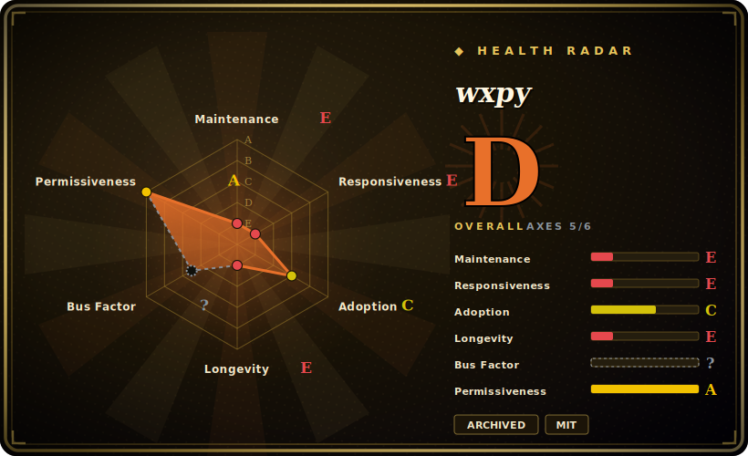

# wxpy

An elegant Python API for WeChat **personal** accounts — a friendly, higher-level wrapper over [ItChat](itchat.md)'s web-WeChat protocol, historically used to build chatbots and account automation. **Read this plainly: the repo was archived in 2019-07 (read-only, abandoned), and the WeChat web (`wx.qq.com`) login protocol it relies on — the very same one ItChat uses — has been largely shut down, so for most accounts wxpy no longer logs in or works at all.** It survives as reference code and nostalgia, not as a tool you can ship today.

## When to use

You're a developer or researcher excavating the older generation of Chinese WeChat-bot projects — a wave of 2017–2019 tutorials, "build a WeChat bot in 30 lines" blog posts, and toy automation repos were written on wxpy because its API was noticeably nicer than raw ItChat (`bot.friends()`, `bot.groups()`, `@bot.register()`, friendly `Chat`/`Friend`/`Group` objects). You've inherited or are studying one of those repos and want to understand the model: how it wrapped the QR-login + `synccheck` long-poll flow into clean Python objects and a decorator-based message router. For *reading and learning from that body of code* — and appreciating a well-designed wrapper API — wxpy is a pleasant, well-documented reference.

That is realistically the only safe reason to reach for it in 2026. If your actual goal is to *run* new WeChat automation, wxpy is the wrong starting point (see below): it is an archived wrapper over a defunct protocol — a museum piece that shows good API taste, not a dependency for a new build.

## When NOT to use

- **You want WeChat automation that actually works today.** This is the dominant reason. wxpy sits on top of ItChat, which sits on WeChat's **web/`wx.qq.com` login protocol** — and Tencent progressively disabled that protocol. **Most accounts, especially newer ones, simply cannot log in through it anymore.** [未验证] The wrapper isn't broken in its own code so much as the platform pulled the rug out from under the layer beneath it.
- **It is archived and abandoned.** The repo was **archived in 2019-07** (GitHub read-only, last pushed ~2019-07, ~7 years frozen), single-maintainer (owner `youfou`). No PRs, no releases, no protocol fixes will ever land — archiving is the maintainer's explicit "this is done" signal.
- **Account-ban / ToS risk.** Driving a *personal* WeChat account through an unofficial reverse-engineered protocol **violates WeChat's Terms of Service** and carries a real risk of the account being **rate-limited, frozen, or permanently banned.** Don't point it at an account you care about.
- **You need a supported path for IM automation.** Use **official** surfaces: the **WeCom (企业微信 / WeChat Work) API** and **WeChat Official Account / Mini-Program** server APIs are the sanctioned, maintained channels. For personal-account-style automation, **wechaty** is the more actively maintained successor abstraction — though it inherits the same upstream-platform and ToS exposure, so adopt it with caution.
- **Production or anything customer-facing.** An archived wrapper on a defunct protocol cannot underpin a product or a business commitment — and unlike its base, it isn't even receiving the dependency drift fixes a coasting project might.

## Comparison

| Alternative | In index | Tradeoff |
|---|---|---|
| [ItChat](itchat.md) | indexed | wxpy's **own base layer** — the lower-level web-WeChat library wxpy wraps. Also abandoned and also non-functional on the dead web protocol; wxpy adds a nicer object API on top but inherits *every* viability problem ItChat has, plus its own 2019 archival. Strictly downstream — no reason to prefer wxpy for new work over either. |
| wechaty | 未收录 | Actively-maintained multi-language (TS/Python/Go/Java) conversational-bot framework with pluggable "puppets"; the de-facto successor for personal-account-style WeChat bots, but still rides on unofficial/3rd-party access channels and the same ToS/ban exposure — pick a puppet carefully. |
| WeCom / Official WeChat Work API | 未收录 | Tencent's **official, sanctioned** enterprise messaging API; stable and supported, but it automates *WeCom* accounts/contacts, not arbitrary personal WeChat accounts — a different (legitimate) surface, not a drop-in replacement. |
| WeChat Official Account / Mini-Program server APIs | 未收录 | Official server-side APIs for *public accounts* and mini-programs; fully supported but a different product surface (broadcast/service accounts), not personal 1:1 IM automation. |

## Tech stack

- **Language:** Python 3 (pure-Python, no native extensions).
- **Built on ItChat:** wxpy is fundamentally a **wrapper over [ItChat](itchat.md)** — it reuses ItChat's web-WeChat mechanism (QR-code login against `wx.qq.com`, session/cookie management, the long-polling `synccheck` message loop) and layers an object model on top. [未验证]
- **API surface:** friendlier abstractions than raw ItChat — `Bot`, `Friend`, `Group`, `MP`, `Chat` objects; `@bot.register(...)` message-handler decorator; search/filter helpers; plus convenience integrations (e.g. Tuling chatbot, puppet-style auto-reply) documented in its era.
- **Capabilities:** send/receive text, images, files; friend and group (chatroom) management — all scoped to a single logged-in personal account.

## Dependencies

- **Runtime:** a Python 3 interpreter plus **ItChat** (its core dependency) and the usual HTTP/QR stack ItChat pulls in (`requests`, terminal-QR rendering). pip-installable. [未验证]
- **The real dependency is a working web-WeChat session** — and *that* is the broken link: it needs Tencent's web-login endpoint to accept your account, which for most accounts it no longer does. Nothing in local dependency management fixes a server-side block.
- **A scannable WeChat account** on a phone to complete QR login each session; sessions are not durable and re-login is frequent.

## Ops difficulty

**Low to run, but that's beside the point — viability, not ops, is the blocker.** Install and a "hello world" auto-reply bot are genuinely a few lines (`bot = Bot()` plus a `@bot.register()` handler), and wxpy's docs were better than most. But the hard part is entirely external: getting the login to succeed *at all* on the defunct web protocol, keeping a flaky session alive, and accepting that the logging-in account is exposed to throttling or banning. There is no server, datastore, or cluster to operate — the difficulty is that the thing it ultimately talks to has mostly been turned off, and no operator effort restores it.

## Health & viability

- **Maintenance (2026-06): archived → dead.** The repo was **archived in 2019-07** (last pushed ~2019-07), making it GitHub read-only — single-maintainer (owner `youfou`), no releases, no triage, no PRs accepted. Archiving is the maintainer's explicit end-of-life flag; this is not "coasting," it is closed.
- **Platform pulled the rug — compounded by its base.** wxpy wraps **ItChat**, and **WeChat largely disabled the web-login protocol both depend on**, so wxpy is *non-functional for most accounts* regardless of its own code. It is abandoned **and** structurally obsolete **and** one layer removed from the protocol break — strictly worse off than the base it sits on. [未验证]
- **Lindy verdict: FAILS, hard.** Created **2017-02** (~9 years old), so on age alone it might look Lindy — but Lindy is **age × still-active**, never age alone. Here it is **long-lived *and* explicitly archived *and* running on a protocol the platform removed** — the textbook case where the age signal is *negated*, not earned. Its longevity is not durability. [推断]
- **Governance / bus factor.** Single-maintainer hobby project, no foundation, vendor, or successor stewardship — bus factor of one, and the repo is frozen, so even that one has formally stepped away. [推断]
- **Risk flags.** Against WeChat ToS; account-ban exposure; unofficial reverse-engineered protocol the vendor actively closes off; depends transitively on an also-abandoned library. MIT license is the only un-encumbered part of the picture. [推断]

## Caveats (unverified)

- [未验证] "~14.3k stars" is from the GitHub repo page as of 2026-06; star counts are date-sensitive and unreliable — treat as indicative only.
- [未验证] "Archived 2019-07 / last pushed ~2019-07" is the load-bearing maintenance fact used throughout this page; the precise archival date and last-commit date should be confirmed against the live repo's GitHub header (the archived banner is the decisive signal regardless of the exact day).
- [未验证] The claim that WeChat **disabled the web-login protocol** so wxpy/ItChat "mostly don't work for new accounts" is widely reported by the community and consistent with both projects' dormancy, but neither repo carries an explicit Tencent deprecation notice — this is inferred from platform behavior, not quoted from an official statement.
- [未验证] "wxpy is a wrapper over ItChat" reflects the project's documented design and the well-known lineage, but the exact dependency surface (which ItChat internals it reuses vs. reimplements) was not re-checked against the current source/`setup.py`.
- [未验证] Comparison rows (wechaty's current activity, exact WeCom/Official-Account API scope) describe the general landscape and were not freshly re-verified against each project's current state.
- [推断] Account-ban / ToS-violation risk is an inference from the unofficial-protocol nature of the tool, not a measured ban rate; severity varies by account and usage.
