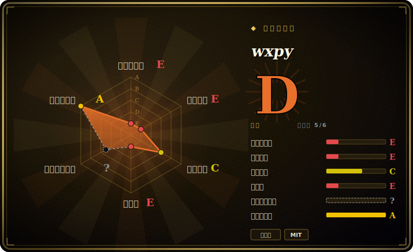

# wxpy

面向微信**个人号**的优雅 Python API——它是在 [ItChat](itchat.zh.md) 网页版微信协议之上更友好、更高层的封装，历史上用来搭聊天机器人和账号自动化。**话说白了：这个仓库已于 2019-07 被 archive（只读、废弃），而它依赖的微信网页版（`wx.qq.com`）登录协议——和 ItChat 用的是同一套——早已被大面积关停，所以对绝大多数账号而言，wxpy 已经登不上、跑不起来了。** 它如今只作为参考代码和怀旧物存在，而不是你今天能拿来交付的工具。

## 何时使用

你是开发者或研究者，正在发掘更早一代的中文微信机器人项目——2017 至 2019 年间有一波教程、“三十行写个微信机器人”的博客和玩具自动化仓库都是用 wxpy 写的，因为它的 API 明显比裸用 ItChat 顺手（`bot.friends()`、`bot.groups()`、`@bot.register()`，以及友好的 `Chat`/`Friend`/`Group` 对象）。你接手或正在研究其中之一，想搞清楚它的模型：它是怎么把扫码登录 + `synccheck` 长轮询流程封装成干净的 Python 对象和一套基于装饰器的消息路由的。就*读懂并从那批代码里学习*、并欣赏一套设计得当的封装 API 而言，wxpy 是一份令人愉快、文档也不错的范本。

这基本上是 2026 年还去碰它的唯一稳妥理由。如果你的真实目标是*运行*新的微信自动化，wxpy 是错误的起点（见下文）：它是一个跑在失效协议之上的、已被 archive 的封装层——展示了良好 API 品味的博物馆藏品，而不是新项目的依赖。

## 何时不用

- **你想要今天还能真正跑起来的微信自动化。** 这是最主要的理由。wxpy 架在 ItChat 之上，ItChat 又架在微信的**网页版 / `wx.qq.com` 登录协议**之上——而腾讯逐步关停了那套协议。**绝大多数账号、尤其是较新的账号，已经根本无法通过它登录。**[未验证] 与其说封装本身坏了，不如说平台把它下面那一层脚下的地抽走了。
- **它已被 archive、已废弃。** 仓库于 **2019-07 被 archive**（GitHub 只读，最后 push 约 2019-07，已冻结约 7 年），单一维护者（owner `youfou`）。不会再有 PR、不会再有发布、不会再有协议修复落地——archive 就是维护者明确发出的“到此为止”信号。
- **封号 / 违反 ToS 的风险。** 用非官方逆向出来的协议去驱动*个人*微信号，是**违反微信服务条款**的，并带有真实的账号**被限流、冻结或永久封禁**风险。别拿你在乎的账号去试。
- **你需要受支持的 IM 自动化路径。** 改用**官方**面：**企业微信（WeCom / WeChat Work）API**，以及**微信公众号 / 小程序**服务端 API，才是受认可、有维护的正规通道。若想要接近个人号风格的自动化，**wechaty** 是维护更活跃的后继抽象——但它继承了同样的上游平台风险和 ToS 风险，需谨慎采用。
- **生产环境或任何面向客户的场景。** 一个跑在已失效协议上、已被 archive 的封装层，撑不起一款产品或一项业务承诺——而且和它的基座不同，它连一个滑行中项目还可能有的依赖漂移修复都不会再收到。

## 横向对比

| 替代品 | 是否收录 | 取舍 |
|---|---|---|
| [ItChat](itchat.zh.md) | 已收录 | wxpy **自己的基座层**——wxpy 封装的那个更底层的网页版微信库。同样已废弃、同样在已死的网页协议上不可用；wxpy 在其上加了一套更好的对象 API，却继承了 ItChat 的*每一个*可持续性问题，外加它自己 2019 年的 archive。严格处于下游——新项目里没有理由用 wxpy 而不用其中任何一个。 |
| wechaty | 未收录 | 维护活跃的多语言（TS/Python/Go/Java）对话机器人框架，采用可插拔的 "puppet"；是个人号风格微信机器人事实上的后继者，但仍依赖非官方 / 第三方接入通道，承担同样的 ToS / 封号风险——选 puppet 要谨慎。 |
| 企业微信 / WeChat Work 官方 API | 未收录 | 腾讯**官方、受认可**的企业消息 API；稳定且有支持，但它自动化的是*企业微信*账号 / 通讯录，而非任意个人微信号——是另一套（合规的）面，并非平替。 |
| 微信公众号 / 小程序服务端 API | 未收录 | 面向*公众号*和小程序的官方服务端 API；完全受支持，但属于另一种产品面（广播 / 服务号），不是个人号的 1:1 IM 自动化。 |

## 技术栈

- **语言：** Python 3（纯 Python，无原生扩展）。
- **架在 ItChat 之上：** wxpy 本质上是对 [ItChat](itchat.zh.md) 的**封装**——它复用 ItChat 的网页版微信机制（对 `wx.qq.com` 扫码登录、管理会话 / cookie、跑长轮询的 `synccheck` 消息循环），并在其上叠加一层对象模型。[未验证]
- **API 面：** 比裸用 ItChat 更友好的抽象——`Bot`、`Friend`、`Group`、`MP`、`Chat` 对象；`@bot.register(...)` 消息处理装饰器；搜索 / 过滤辅助方法；外加在其活跃年代文档里给出的便捷集成（如图灵机器人、puppet 式自动回复）。
- **能力面：** 收发文本、图片、文件；好友与群（chatroom）管理——全部局限在单个已登录的个人号范围内。

## 依赖

- **运行时：** 一个 Python 3 解释器，加上 **ItChat**（它的核心依赖），以及 ItChat 拉进来的常规 HTTP/二维码栈（`requests`、终端二维码渲染）。pip 即可装。[未验证]
- **真正的依赖是一个可用的网页版微信会话**——而*那*正是断掉的一环：它需要腾讯的网页登录端点接受你的账号，而对大多数账号它已不再接受。再怎么管理本地依赖，也修不好服务端的封堵。
- **一个可扫码的微信账号**（在手机上）来完成每次会话的二维码登录；会话不持久，需要频繁重新登录。

## 运维难度

**跑起来很低，但这不是重点——卡点是可持续性，不是运维。** 安装和一个 "hello world" 自动回复机器人确实只要几行（`bot = Bot()` 加一个 `@bot.register()` 处理器），而且 wxpy 的文档比大多数同类都好。但难的部分完全在外部：让登录在这套失效的网页协议上*根本能成功*、维持一个抽风的会话存活，以及接受那个用来登录的账号正暴露在限流或封禁之下。没有服务、数据存储或集群要运维——难点在于它最终要对话的那个东西已基本被关停，而再多的运维投入也无法把它恢复。

## 健康度与可持续性

- **维护（2026-06）：已 archive → 已死。** 仓库于 **2019-07 被 archive**（最后 push 约 2019-07），使其在 GitHub 上只读——单一维护者（owner `youfou`），无发布、无 triage、不接 PR。archive 是维护者明确的生命周期终止标记；这不是“滑行中”，而是已经关闭。
- **平台抽走了地基——还被基座放大。** wxpy 封装的是 **ItChat**，而**微信已大面积关停两者都依赖的网页登录协议**，所以无论 wxpy 自身代码如何，它对大多数账号都是*不可用*的。它既废弃**又**在结构上过时**又**比协议失效层多隔了一层——比它所架的基座处境更糟。[未验证]
- **Lindy 判断：硬性不通过。** 创建于 **2017-02**（约 9 年），单看年龄或许像是 Lindy——但 Lindy 是**年龄 × 仍然活跃**，绝不是单看年龄。这里是**长寿*且*已被显式 archive*且*跑在平台已移除的协议上**——正是年龄信号被*抵消*而非*兑现*的教科书案例。它的长寿不是耐久。[推断]
- **治理 / bus factor。** 单一维护者的爱好项目，没有基金会、厂商或后继接管——bus factor 为一，而且仓库已冻结，连这个一也已正式离场。[推断]
- **风险标记。** 违反微信 ToS；封号风险；非官方逆向协议且被厂商持续封堵；并传递性地依赖一个同样已废弃的库。MIT 许可是整幅图景里唯一没有负担的部分。[推断]

## 存疑（未验证）

- [未验证] “约 14.3k star” 取自 2026-06 的 GitHub 仓库页；star 数对时间敏感且不可靠，仅供参考。
- [未验证] “2019-07 被 archive / 最后 push 约 2019-07” 是本页通篇承重的维护事实；确切的 archive 日期与最后提交日期请对照线上仓库的 GitHub 头部核实（无论确切到哪一天，archived 横幅本身就是决定性信号）。
- [未验证] “微信**关停网页登录协议**导致 wxpy/ItChat 对新账号'基本不可用'” 这一说法被社区广泛报道，也与两个项目的沉寂状态相符，但两个仓库都没有腾讯的显式弃用声明——这是从平台行为推断而来，并非引自官方声明。
- [未验证] “wxpy 是对 ItChat 的封装” 反映了项目的文档化设计和广为人知的脉络，但确切的依赖面（它复用了 ItChat 的哪些内部 vs 自己重新实现）未对照当前源码 /`setup.py` 重新核对。
- [未验证] 对比表各行（wechaty 当前活跃度、企业微信 / 公众号 API 的确切范围）描述的是大致格局，未对各项目当前状态做新一轮核实。
- [推断] 封号 / 违反 ToS 风险是从工具的非官方协议性质做出的推断，而非实测封禁率；严重程度因账号和用法而异。
