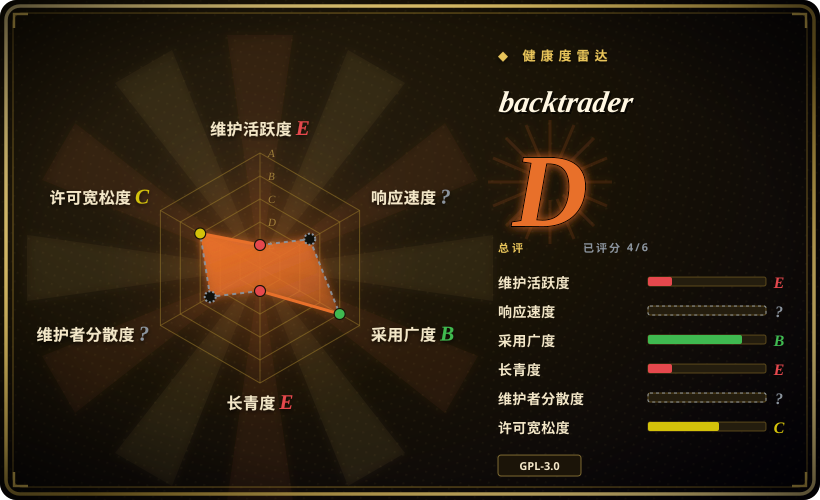

# backtrader

Python Backtesting library for trading strategies

## 何时使用

你正在评估 `investment-finance` 方向的任务，需要把一个真实仓库纳入 oss-atlas 候选，而不是只在 backlog 里看到一个名字。当上游描述贴合任务、许可证和维护画像经核验后可接受，并且采用公共项目比自写一次性方案更合适时，可以把 backtrader 纳入候选。

这是用户指定 backlog 的首版 intake 页面。用它来完成路由和邻近方案对比；在高风险场景依赖它之前，请重新阅读上游 README、许可证、示例和 release 历史。

## 何时不用

- **你今天就需要深度审过的 atlas 页面。** 在本页完成完整语义复核前，优先选横向对比表里更早收录、约束更清楚的页面。
- **许可证是硬约束。** GitHub 返回 `NOASSERTION`；商用、再分发或 vendoring 前必须检查仓库内许可证文件。
- **维护风险不可接受。** 如果项目很年轻、单人维护、star 少、没有版本线或长期安静，请选同分类里更成熟的替代品。
- **你的任务需要更窄的替代品。** 如果另一个页面的“何时不用”已经点名你的约束，优先用那个页面，而不是这个首版入口。
- **你无法核验上游工作流。** 在检查 README、脚本、依赖和外部 API 要求前，不要安装、运行或 vendor 这个仓库。

## 横向对比

| 替代品 | 是否收录 | 我们的评价 | 取舍 |
|---|---|---|---|
| 本分类已收录项目 | ✅ | 如果成熟页面覆盖同一任务且依赖与不用场景更清楚，优先选现有页面。 | 本页补入 backlog 候选；深审完成前，现有页面可能更安全。 |
| 自写实现 | 未收录 | 只有范围很小、长期维护成本低于引入仓库时才自写。 | 少一个依赖，但失去上游修复、文档和生态信号。 |

## 技术栈

- **主要语言：** GitHub 元数据返回为 Python。
- **仓库形态：** `mementum/backtrader`；本首版页面尚未穷尽读取所有依赖清单。
- **默认分支快照：** 最后 push `2024-08-19T17:47:36Z`，archived 为 `false`。

## 依赖

- **运行时依赖：** 本次 intake 未穷尽核验；生产使用前请检查上游依赖清单和文档。
- **外部服务：** 本次 intake 未穷尽核验；请确认是否需要 API key、数据供应商、浏览器、模型供应商、GPU、数据库或队列。
- **运维输入：** 至少依赖该 GitHub 仓库及其发布和更新流程。

## 运维难度

**深度复核前按未知到中等处理。** 请把本页当作有 intake 依据的起点，而不是完整 runbook。library 可能容易试用但仍要 pin 版本；app / framework 可能隐藏数据、服务和部署要求。

## 健康度与可持续性

- **维护快照（2026-07-16）：** GitHub 返回 `archived=false`，`pushed_at=2024-08-19T17:47:36Z`。
- **采用快照：** 2026-07 约 22,458 个 GitHub stars；这是有噪声的信号，低 star 项目只要是真实且相关，也会被纳入。
- **许可证快照：** GitHub 元数据返回 `NOASSERTION`；许可证关键时仍需人工核验许可证文件。
- **Lindy / 治理：** 本次 intake 未完整复核。长期采用前，请继续检查项目年龄、owner 类型、贡献者集中度、release 和 issue 响应。
- **风险信号：** 本页来自 2026-07-16 backlog 的首版生成；语义对比和依赖复核刻意保守。

## 存疑（未验证）

- [未验证] 本页依据公开 GitHub 元数据和用户提供的 intake 清单生成；上游 README、文档、示例、release 和依赖清单仍需深度复核。
- [未验证] 许可证、安装命令、支持的 harness 和运行时要求可能与 GitHub 元数据不同；使用前请在仓库中核验。
- [推断] 横向对比表先从邻近 atlas 分类出发，并不是完整替代品综述；读完上游项目和相邻方案后应继续细化。
