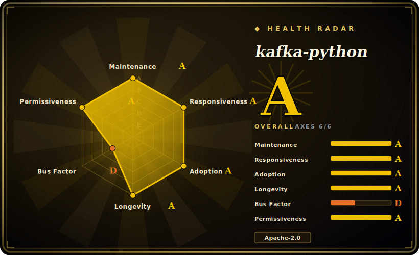

# kafka-python

A pure-Python client library for Apache Kafka — high-level `KafkaConsumer`, `KafkaProducer`, and `KafkaAdminClient` classes plus CLI scripts, with no C/Cython/Rust core so installs are trivial across environments.

## When to use

You're a Python developer who needs to read from or write to Kafka from your app, a data pipeline, or a script, and you want it to *just install* — no librdkafka to compile, no system packages, no wheel-matching gymnastics across your laptop, CI, and a slim container. You `pip install kafka-python`, import `KafkaConsumer('my_topic')`, and iterate over messages as namedtuples; producing is `KafkaProducer().send(...)`. Because it's pure Python, it drops cleanly into PyPy, locked-down environments, and minimal Docker images where building a native extension is a pain. The API is designed to track the official Java client, so consumer groups, dynamic partition assignment, and offset commits work the way you'd expect.

It also fits when you want lightweight admin without a JVM on the box: `kafka-python admin -b localhost:9092 cluster describe` (or `python -m kafka.admin`) replaces a chunk of the Kafka `bin/*.sh` scripts for creating topics, describing clusters, and quick interactive tasks — handy in environments where you don't have a compatible JVM at hand. For raw throughput you can `pip install crc32c` to offload checksumming to an optimized C library without making it a hard dependency.

## When NOT to use

- **Maximum throughput / lowest latency.** A pure-Python client cannot match the `librdkafka`-backed `confluent-kafka-python` for high-volume producing/consuming. If you're saturating links or counting microseconds, use the native client.
- **You need the newest broker features day one.** Protocol/KIP support is implemented in Python and may trail the latest Kafka release; verify your required KIPs/broker version are supported before depending on a brand-new feature. [未验证]
- **Async-native codebases.** The public API is synchronous/iterator-based. The 3.x internals moved toward an async event loop, but if you want a first-class `asyncio` API, `aiokafka` is purpose-built for that.
- **You already run the Confluent stack.** If you're standardized on Confluent Platform/Schema Registry tooling, `confluent-kafka-python` integrates more tightly with that ecosystem (serializers, registry clients).
- **Heavy stream processing.** It's a client, not a stream-processing framework — no Kafka Streams equivalent. For stateful topologies use Faust/Quix/ksqlDB or the JVM Streams API.

## Comparison

| Alternative | In index | Tradeoff |
|---|---|---|
| confluent-kafka-python | 未收录 | Official Confluent client wrapping `librdkafka` (C) — highest throughput/latency and quickest protocol coverage, but needs the native lib and is less trivially portable than pure Python. |
| aiokafka | 未收录 | Native `asyncio` Kafka client (built on kafka-python's lineage); the right pick for async-first apps, narrower surface than the sync client. |
| [kafka-ui](kafka-ui.md) | ✅ | A web UI for cluster management, not a client library — complements rather than competes; different job entirely. |
| Java/Scala official client | 未收录 | The reference implementation with first-class feature support and Kafka Streams, but JVM-only — not an option for a Python service. |
| Sarama (Go) | 未收录 | Mature pure-Go Kafka client; same "no native dep" appeal but for Go, not Python. |

## Tech stack

- **Language:** pure Python, no Cython/C/Rust core (the headline portability claim); Python 3.8+ required for the 3.x line.
- **Components:** `KafkaConsumer`, `KafkaProducer`, `KafkaAdminClient`, plus `kafka-python`/`python -m kafka.*` CLI entry points.
- **3.0 internals:** protocol stack dynamically generated from Apache Kafka JSON message schemas; networking refactored around an event loop with async/await internally; encode/decode optimizations via compiled/cached bytecode (per the README's "What's New in 3.0").
- **Optional native accel:** `crc32c` C library for faster checksums; compression codecs (gzip/snappy/lz4/zstd) may pull optional libs depending on what you enable.

## Dependencies

- **A reachable Kafka cluster** — broker compatibility advertised roughly across the Kafka 0.8 → 4.x range (see the project's compatibility page). [未验证]
- **Core install: none** — pure Python, no external runtime deps for the base case.
- **Optional:** `crc32c` (throughput), compression libraries (snappy/lz4/zstd) if you use those codecs, and security libs for SASL/SSL depending on your auth setup. [未验证]
- **Python 3.8+** for the current major version.

## Ops difficulty

**Low.** It's a library, not a service — `pip install` and you're done; nothing to deploy or operate beyond your own application. The "no native dependency" design is exactly an *ops* win: reproducible installs in CI and slim containers without build toolchains, and it runs on PyPy/locked-down hosts. The operational reality you do own is Kafka client tuning — batching, `acks`, retries, consumer-group rebalancing, and offset-commit semantics — which is inherent to any Kafka client, not specific to this one. The cluster you connect to is the hard thing to run; the client is not.

## Health & viability

- **Maintenance (2026-06) — active.** Releasing briskly: v3.0.6 on **2026-06-25** with several point releases in the same week, and last push **2026-06-27**. The 3.0 line was a substantial refactor (protocol generation, async internals). Clearly **active**, not coasting. Not archived. [推断]
- **Governance / bus factor.** `User`-owned (Dana Powers, `dpkp`) — nominally single-owner, but a long-standing **multi-contributor** project (jeffwidman, mumrah, wizzat and others in the top contributors), so the bus factor is better than a typical solo repo. Still, no foundation backing — direction rests with a small core. [推断]
- **Age × Lindy.** Created **2012-09** (~14 years) and *still actively shipping major versions* ⇒ a **strong Lindy** signal: one of the oldest, most-proven Python Kafka clients, not a newcomer. Old-and-active is the good quadrant. [推断]
- **Adoption.** Widely used historically (~5.9k stars, ~1.5k forks, ubiquitous on PyPI); the very low open-issue count (~15) alongside frequent releases suggests an attentive, on-top-of-it maintenance posture. [未验证]
- **Risk flags.** Main considerations are *performance ceiling* vs native clients and *protocol lag* vs the newest broker features — capability bounds, not health red flags. Apache-2.0, no relicense history found. [推断]

## Caveats (unverified)

- [未验证] ~5.9k stars / ~15 open issues / v3.0.6 (2026-06-25) / last push 2026-06-27 as of 2026-06 — volatile, re-check.
- [未验证] Advertised broker compatibility range (Kafka 0.8 → ~4.x) and exact KIP coverage are from the README/docs; confirm the specific KIP/broker version you need against the compatibility page before depending on it.
- [未验证] Optional compression/security dependency details (snappy/lz4/zstd, SASL/SSL libs) are inferred from typical Kafka-client needs, not enumerated here from the manifest.
- [推断] "Better-than-solo bus factor" is inferred from the contributor list, not a governance document; it remains a `User`-owned repo with a small core.
- [推断] The async/await internals vs a first-class asyncio API distinction (favoring aiokafka for async-first apps) is inferred from the 3.0 notes and ecosystem, not verified by reading the public API surface here.
