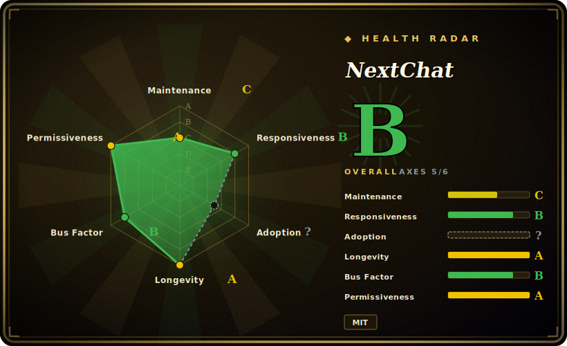

# NextChat

A light, cross-platform (Web/iOS/macOS/Android/Linux/Windows) self-deployable AI chat client that fronts many providers (OpenAI/Claude/Gemini/DeepSeek/Ollama/…) with one-click Vercel deploy and bring-your-own-key.

## When to use

You want a private ChatGPT-style chat UI that you control, fronting whatever model APIs you already pay for, without sending your conversations through a vendor's SaaS. You have an OpenAI key, an Anthropic key, maybe a local Ollama box, and you'd rather not juggle a different app per provider or keep raw keys in a desktop client. You click "Deploy to Vercel", paste your `OPENAI_API_KEY` (and optionally a `CODE` access password so the public URL isn't open to the world), and within minutes you have a fast PWA chat front-end — markdown, prompt templates, local conversation history in the browser, and a model picker that spans OpenAI, Claude, Gemini, DeepSeek, and more. Data lives in your browser's local storage, not a server you have to back up.

You also reach for it as a shareable team deployment in the cheap-and-cheerful sense: a small group fronting a shared gateway or a single set of provider keys behind one `CODE` password, plus the native desktop and mobile builds when people want an app icon instead of a tab. It's the "deploy in five minutes, point it at my keys" option — the floor of self-hosted chat UIs, not a platform you administer.

## When NOT to use

- **You need a multi-user platform with RBAC, per-user accounts, and token quotas.** The community edition is single-user-shaped: one `CODE` password gates the whole instance, with no user accounts, no per-group model access, no usage caps. For centralized admin-over-team governance, use [HiveChat](../team-chat/hivechat.md) or LibreChat. (NextChat does advertise a separate paid Enterprise Edition for permission control; that is not this open-source repo. [未验证])
- **You're deploying the pure front-end and worried about key exposure.** On a static/Vercel deploy where the browser talks to providers, your API key and proxy config can be reachable client-side; the `CODE` password gates access but is not real per-user auth. Put it behind a server-side proxy or gateway, and never expose an unprotected instance with a real key. [未验证]
- **You want an agent framework or orchestration layer.** It's a chat client, not a place to build tools, multi-step agents, or RAG pipelines. It has MCP client support, but it is not an agent runtime — for that, reach for an agent framework.
- **You need a model server.** NextChat runs *no* models; it calls provider APIs (or your Ollama/OpenAI-compatible endpoint). The inference backend is yours to supply.
- **You need a self-hosted knowledge base / document RAG.** No built-in vector store or document ingestion; it's a conversational front-end, not a retrieval platform.
- **You depend on a heavyweight governance/audit story.** Single-vendor open-source project with a fast-moving `main`; conversation history is client-local by default, so there's no central audit log or server-side retention to govern.

## Comparison

| Alternative | In index | Our verdict | Tradeoff |
|---|---|---|---|
| LibreChat | 未收录 | Use this page for its stated niche; choose LibreChat when you need full multi-user platform. | Full multi-user platform — accounts, many auth backends, RAG, assistants, code interpreter; far more capable and far heavier to run. NextChat is a lighter single-deploy client, not a team platform. |
| Lobe Chat | 未收录 | Use this page for its stated niche; choose Lobe Chat when you need comparable polished multi-provider self-hosted UI with plugins, knowledge base, and (in its cloud/DB. | Comparable polished multi-provider self-hosted UI with plugins, knowledge base, and (in its cloud/DB mode) multi-user; broader feature surface, heavier when you turn those on. NextChat stays minimal and browser-local. |
| Open WebUI | 未收录 | Use this page for its stated niche; choose Open WebUI when you need self-hosted UI strong on Ollama/local models with built-in RBAC, users, and pipelines. | Self-hosted UI strong on Ollama/local models with built-in RBAC, users, and pipelines; needs a server + database. NextChat trades that for a static/Vercel deploy with no backend to operate. |
| [HiveChat](../team-chat/hivechat.md) | ✅ | Use this page for its stated niche; choose HiveChat when you need admin-managed team chat: per-group model access, token quotas, Postgres-backed user accounts. | Admin-managed team chat: per-group model access, token quotas, Postgres-backed user accounts. The team-governance answer NextChat's community edition deliberately is not. |
| ChatGPT / Claude.ai (commercial SaaS) | 未收录 | Use this page for its stated niche; choose ChatGPT / Claude.ai (commercial SaaS) when you need zero-ops, vendor-managed, locked to one model family, with the provider holding your data. | Zero-ops, vendor-managed, locked to one model family, with the provider holding your data. NextChat trades that convenience for self-hosting, multi-provider choice, and key/data control. |

## Tech stack

- **Language:** TypeScript (~91%), with CSS/JS and platform packaging.
- **Framework:** Next.js + React; ships as a PWA web app and as native desktop/mobile builds (Tauri for desktop).
- **Storage:** conversation history and settings in browser local storage by default — no required server-side database for the community edition.
- **Providers:** OpenAI, Claude (Anthropic), Gemini (Google), DeepSeek, Baidu, ByteDance, Alibaba, ChatGLM, Groq, Ollama, and OpenAI-compatible endpoints.
- **Extras:** prompt templates/masks, markdown rendering, MCP (Model Context Protocol) client support, artifacts/plugins. [未验证]

## Dependencies

- **Runtime:** to self-host beyond Vercel you run a Node/Next.js process (or the published Docker image); the desktop/mobile apps are standalone builds. No database is required for the community edition.
- **Provider keys (yours to supply):** at minimum `OPENAI_API_KEY`, plus keys/base-URLs for any other providers you enable. NextChat calls these APIs; it does not host models.
- **Access control:** an optional `CODE` environment variable sets an access password for a public deployment — this is the only built-in gate, not per-user auth.
- **Install paths:** one-click Vercel deploy, Docker image, and prebuilt desktop/mobile apps; build from source needs a Node toolchain.

## Ops difficulty

**Low.** This is the project's whole point — the Vercel one-click path gives you a running instance with no server to manage, and the Docker image is a single container with no database. Day-2 burden is mostly: rotating provider keys, setting a strong `CODE` password (and ideally fronting it with a gateway so keys aren't client-reachable), and tracking a fast-moving `main`/release cadence on a single-vendor project. Because state is browser-local, there's nothing to back up server-side — which is also why it doesn't scale into multi-user territory: there's no central data layer to govern. The hard part isn't running NextChat; it's recognizing when "shared password over my keys" has outgrown its limits and you need a real team platform instead.

## Health & viability

- **Maintenance — active but coasting on releases (as of 2026-06).** Repo pushed 2026-05, so the codebase is alive; but the latest tagged release (v2.16.1) is reported 2025-07-29 — roughly a year stale, so you'd be tracking a fast-moving `main` rather than cut releases. Not archived. [未验证]
- **Governance & bus factor — single-vendor, open-core-adjacent.** Organization-owned (the ChatGPTNextWeb / NextChat org), so not literally a single User repo, but it is effectively one vendor's project, and that vendor monetizes a separate paid Enterprise Edition. The OSS community edition's roadmap is theirs to set; treat governance as vendor-controlled, not foundation-style. [推断]
- **Age & Lindy — moderate.** Created 2023-03, ~3 years old and still maintained; old enough to have outlived the first wave of ChatGPT-clone UIs, young enough that this category churns fast. A reasonable but not blue-chip Lindy bet — its durability rests on the vendor's continued interest. [推断]
- **Adoption & ecosystem.** Very high star count (~88k) and broad multi-provider support signal strong mindshare as the "deploy-in-five-minutes" floor of self-hosted chat UIs; but stars overstate active maintenance, and the feature surface is deliberately thin vs. LibreChat/Lobe/Open WebUI.
- **Risk flags — open-core boundary.** The paid Enterprise Edition (permissions/RBAC) is the gated tier; capabilities you might expect (multi-user auth) live behind it, not in this MIT repo. No relicense or CVE history asserted here. The stale-release vs. live-`main` gap is itself a supply-chain/stability flag if you pin to releases.

## Caveats (unverified)

- [未验证] ~88.3k stars, latest release v2.16.1 (2025-07-29), and recent activity (2026-05) are from the GitHub page on 2026-06-28; star counts and dates drift — re-verify against the live repo.
- [未验证] Tauri for the desktop builds, the exact MCP/artifacts/plugins surface, and the precise provider list are taken from the README/repo framing; verify each against the current code before relying on it.
- [未验证] The "key-exposure on pure-frontend deploys" caution reflects how a browser-to-provider static deploy works in general; the exact exposure depends on your deployment topology (server-side proxy vs. direct), so audit your own setup rather than assuming.
- [未验证] A paid Enterprise Edition with permission control is advertised by the project (business@nextchat.dev); it is separate from this MIT open-source repo and its terms were not verified here.
- [推断] "Single-user-shaped community edition" is inferred from the `CODE`-password-only access model and browser-local storage, not from a documented hard limit on concurrent users.
- [推断] Comparison verdicts (LibreChat/Lobe Chat/Open WebUI being broader or heavier) reflect general project positioning, not a benchmarked head-to-head; only HiveChat is indexed here.
