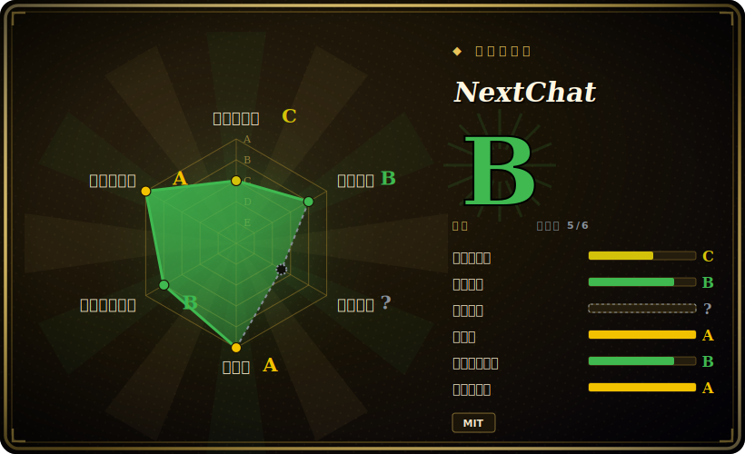

# NextChat

一个轻量、跨平台（Web/iOS/macOS/Android/Linux/Windows）的可自部署 AI 聊天客户端，在前面接住众多服务商（OpenAI/Claude/Gemini/DeepSeek/Ollama/…），支持一键 Vercel 部署和自带 key(BYOK)。

## 何时使用

你想要一个自己掌控的、ChatGPT 风格的私有聊天界面，接住你本来就在付费的那些模型 API，而不把对话送进某家厂商的 SaaS。你手里有一个 OpenAI key、一个 Anthropic key，也许还有一台本地 Ollama，但你不想为每个服务商各开一个 app，也不想把裸 key 塞进桌面客户端。你点一下「Deploy to Vercel」，填进 `OPENAI_API_KEY`（再可选地设一个 `CODE` 访问密码，免得公网 URL 对全世界敞开），几分钟内就有了一个快速的 PWA 聊天前端——markdown、prompt 模板、对话历史存在浏览器本地、一个横跨 OpenAI、Claude、Gemini、DeepSeek 等的模型选择器。数据存在你浏览器的 local storage 里，而不是某个你得操心备份的服务器上。

你也会把它当成「便宜好用」意义上的可共享团队部署：一小撮人共用一套服务商 key 或一个共享网关，后面只用一个 `CODE` 密码挡着；再加上原生桌面和移动端构建，适合那些想要一个 app 图标而非一个标签页的人。它是「五分钟部署、指向我的 key」那一档——自部署聊天 UI 的地板，而不是一个需要你去管理的平台。

## 何时不用

- **你需要带 RBAC、独立用户账号和 token 配额的多用户平台。** 社区版是单用户形态：一个 `CODE` 密码挡住整个实例，没有用户账号、没有按组的模型权限、没有用量上限。要做集中式的「管理员管团队」治理，用 [HiveChat](../team-chat/hivechat.zh.md) 或 LibreChat。（NextChat 确实另外推出了一个收费的企业版做权限控制；那不是这个开源仓库。[未验证]）
- **你部署的是纯前端，又担心 key 暴露。** 在浏览器直连服务商的静态/Vercel 部署里，你的 API key 和代理配置可能在客户端可达；`CODE` 密码只挡访问，不是真正的按用户鉴权。把它放到服务端代理或网关后面，绝不要把带真实 key 的实例无保护地暴露出去。[未验证]
- **你想要一个 agent 框架或编排层。** 它是聊天客户端，不是搭工具、多步 agent 或 RAG 管线的地方。它带 MCP 客户端能力，但不是 agent 运行时——那种需求请用 agent 框架。
- **你需要一个模型服务端。** NextChat *不跑*任何模型；它调用服务商 API（或你的 Ollama/OpenAI 兼容端点）。推理后端得你自己供。
- **你需要自部署的知识库 / 文档 RAG。** 没有内建向量库或文档摄入；它是对话前端，不是检索平台。
- **你依赖一套重型的治理/审计能力。** 单一厂商的开源项目，`main` 推进很快；对话历史默认存在客户端本地，因此没有集中的审计日志或服务端留存可供治理。

## 横向对比

| 替代品 | 是否收录 | 取舍 |
|---|---|---|
| LibreChat | 未收录 | 完整的多用户平台——账号、多种鉴权后端、RAG、assistants、代码解释器；能力强得多，也重得多。NextChat 是更轻的单次部署客户端，不是团队平台。 |
| Lobe Chat | 未收录 | 同样精致的多服务商自部署 UI，带插件、知识库，以及（在其云/DB 模式下）多用户；功能面更宽，开启这些后更重。NextChat 保持极简、浏览器本地。 |
| Open WebUI | 未收录 | 自部署 UI，在 Ollama/本地模型上很强，内建 RBAC、用户和 pipelines；需要服务器 + 数据库。NextChat 用静态/Vercel 部署换掉了这层，没有后端要运维。 |
| [HiveChat](../team-chat/hivechat.zh.md) | ✅ | 管理员托管的团队聊天：按组的模型权限、token 配额、Postgres 支撑的用户账号。正是 NextChat 社区版有意不去做的那个团队治理答案。 |
| ChatGPT / Claude.ai（商业 SaaS） | 未收录 | 零运维、厂商托管、锁定单一模型家族，数据由服务商持有。NextChat 用这份便利换来了自部署、多服务商选择和 key/数据掌控。 |

## 技术栈

- **语言：** TypeScript（约 91%），外加 CSS/JS 和各平台打包。
- **框架：** Next.js + React；以 PWA web app 形态发布，同时提供原生桌面/移动端构建（桌面端用 Tauri）。
- **存储：** 对话历史和设置默认存在浏览器 local storage——社区版不强制要求服务端数据库。
- **服务商：** OpenAI、Claude(Anthropic)、Gemini(Google)、DeepSeek、百度、字节、阿里、ChatGLM、Groq、Ollama，以及 OpenAI 兼容端点。
- **其他：** prompt 模板/masks、markdown 渲染、MCP（Model Context Protocol）客户端能力、artifacts/插件。[未验证]

## 依赖

- **运行时：** 要在 Vercel 之外自部署，你得跑一个 Node/Next.js 进程（或官方 Docker 镜像）；桌面/移动端是独立构建。社区版不需要数据库。
- **服务商 key（你自己供）:** 至少要 `OPENAI_API_KEY`，再加上你要启用的其他服务商的 key/base-URL。NextChat 调这些 API，它不托管模型。
- **访问控制：** 一个可选的 `CODE` 环境变量为公网部署设访问密码——这是唯一的内建闸门，不是按用户鉴权。
- **安装路径：** 一键 Vercel 部署、Docker 镜像，以及预编译的桌面/移动 app；从源码构建需要 Node 工具链。

## 运维难度

**低。** 这正是项目的全部立意——Vercel 一键路径给你一个跑起来的实例，没有服务器要管，Docker 镜像也是单容器、无数据库。Day-2 负担主要是：轮换服务商 key、设一个强 `CODE` 密码（最好再用网关挡在前面，免得 key 在客户端可达），以及跟住这个单一厂商项目快速变动的 `main`/发版节奏。因为状态是浏览器本地的，服务端没什么要备份——这也正是它无法迈进多用户领域的原因：没有可供治理的集中数据层。难的不是把 NextChat 跑起来；难的是认出「共享密码 + 我的 key」何时已经超出了它的能力边界，该换一个真正的团队平台了。

## 健康度与可持续性

- **维护——代码活跃，但发版在原地踏步（截至 2026-06）。** 仓库 2026-05 有推送，代码库是活的；但最近一个 tag 的 release（v2.16.1）据称发布于 2025-07-29——已陈旧约一年，所以你跟的会是快速变动的 `main`，而非剪好的 release。未归档。[未验证]
- **治理与 bus factor——单一厂商，近 open-core。** 由 Organization（ChatGPTNextWeb / NextChat 组织）持有，因此严格说不是单个 User 仓库，但实质上是一家厂商的项目，而该厂商另外靠一个收费的企业版变现。开源社区版的路线图由他们说了算；把治理视作厂商掌控，而非基金会式。[推断]
- **年龄与 Lindy——中等。** 创建于 2023-03，约 3 年，仍在维护；老到熬过了第一波 ChatGPT 克隆 UI，又年轻到这个品类本身换代很快。算是合理但非蓝筹的 Lindy 选择——其存续取决于厂商是否持续投入。[推断]
- **采用与生态。** 极高的 star 数（约 88k）和广泛的多服务商支持，标志着它作为自部署聊天 UI「五分钟部署」地板的强心智占有；但 star 高估了活跃维护程度，且功能面相比 LibreChat/Lobe/Open WebUI 是有意做薄的。
- **风险标记——open-core 边界。** 收费企业版（权限/RBAC）是被门控的那一档；你可能期待的能力（多用户鉴权）藏在它后面，而不在这个 MIT 仓库里。此处不断言重新授权或 CVE 历史。若你 pin 到 release，「陈旧 release vs. 活跃 `main`」这道落差本身就是一个稳定性/供应链标记。

## 存疑（未验证）

- [未验证] ~88.3k star、最新 release v2.16.1（2025-07-29）和近期活动（2026-05）取自 2026-06-28 的 GitHub 页面；star 数和日期会漂移——请对照线上仓库重核。
- [未验证] 桌面端用 Tauri、确切的 MCP/artifacts/插件能力面，以及精确的服务商清单，均取自 README/仓库的表述；依赖前请对照当前代码核实。
- [未验证]「纯前端部署 key 暴露」这一提醒反映的是浏览器直连服务商的静态部署的一般机理；确切的暴露程度取决于你的部署拓扑（服务端代理 vs. 直连），请审计你自己的配置而非默认假设。
- [未验证] 项目宣传有一个带权限控制的收费企业版（business@nextchat.dev）；它独立于这个 MIT 开源仓库，其条款未在此核实。
- [推断]「社区版是单用户形态」是从「只有 `CODE` 密码的访问模型 + 浏览器本地存储」推断出来的，而非来自某个文档化的并发用户硬上限。
- [推断] 对比结论（LibreChat/Lobe Chat/Open WebUI 更宽或更重）反映的是一般项目定位，而非实测的正面对决；此处只有 HiveChat 被收录。
