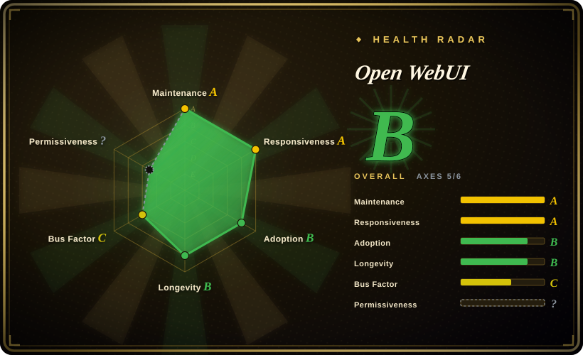

# Open WebUI

An extensible, feature-rich, user-friendly self-hosted AI platform that operates entirely offline and supports Ollama, OpenAI-compatible APIs, and built-in RAG.

## When to use

You're a privacy-conscious developer or small team who wants a self-hosted chat interface for local and remote LLMs. You pick Open WebUI over proprietary cloud services like ChatGPT or Claude web because it keeps your data on your own hardware, supports offline operation, and costs nothing beyond your infrastructure. You pick it over [NextChat](nextchat.md) when you need document upload for RAG, a built-in inference engine, and a broader feature set out of the box; NextChat is lighter and faster to deploy but lacks RAG and many advanced features. You pick it over LibreChat when you want a simpler, offline-first deployment without wrestling with a plugin ecosystem that may add operational complexity. You run it with Docker, connect Ollama for local models or OpenAI-compatible APIs for remote ones, and get a polished web UI with conversation history, community extensibility, and no third-party data leakage.

## When NOT to use

- **If you need advanced RBAC, team quotas, and admin governance** — use [HiveChat](../team-chat/hivechat.md) or a platform like Dify instead of Open WebUI, because Open WebUI is single-user-shaped by default and lacks mature team administration features.
- **If you want zero operational burden** — use ChatGPT, Claude web, or a managed API directly instead of Open WebUI, because Open WebUI requires running and maintaining a Docker container, managing model files, and keeping the app updated.
- **If you need enterprise SSO, audit trails, and SLA guarantees** — use a commercial platform like Azure OpenAI, Dify Enterprise, or a managed LLM service instead of Open WebUI, because Open WebUI lacks enterprise-grade admin dashboards, compliance certifications, and SLA-backed support.
- **If you need a native mobile app experience** — use the ChatGPT or Claude mobile apps instead of Open WebUI, because Open WebUI is web-based and does not offer a dedicated mobile application with native notifications and offline caching.

## Comparison

| Alternative | In index | Our verdict | Tradeoff |
| --- | --- | --- | --- |
| [NextChat](nextchat.md) | ✅ | Lightweight self-deployable chat UI. | NextChat is simpler and faster to deploy; Open WebUI is heavier but has built-in RAG and more features. |
| [HiveChat](../team-chat/hivechat.md) | ✅ | Admin-managed team chat with quotas. | HiveChat is for RBAC team admin; Open WebUI is for personal/small-group use. |
| LibreChat | 未收录 | Another self-hosted chat UI. | LibreChat has a broader plugin ecosystem but is not indexed here. |
| Lobe Chat | 未收录 | Design-focused chat UI. | Lobe Chat emphasizes visual polish and plugin market; Open WebUI emphasizes offline operation. |
| ChatGPT / Claude web apps | 未收录 | Closed-source cloud chat. | Proprietary and require cloud; Open WebUI is self-hosted and works offline. |

## Tech stack

- **Python** — backend and API layer
- **SvelteKit** — frontend framework
- **Docker** — primary deployment method
- **Ollama** — local LLM runtime integration

## Dependencies

- Docker runtime for deployment
- Ollama (for local models) or OpenAI-compatible API keys (for remote models)
- A device or server to host the application
- Optional: vector store for RAG document ingestion

## Ops difficulty

**Low to medium**. A single Docker container handles the core app. The main burden is keeping Ollama model files updated (large downloads) and managing document uploads for RAG. For a single user, it is straightforward; for a small team, you may need to configure authentication and manage resource usage.

## Health & viability

- **Responsiveness**: Cannot be scored — no_traffic.
- **Maintenance**: Very active — pushed daily as of 2026-07, with a responsive issue tracker (242 open issues). [推断]
- **Governance**: Owned by the open-webui organization; appears to have a dedicated team with reasonable bus factor.
- **Backing**: No major corporate backing visible; community-driven with active Discord and sponsor program. [未验证]
- **Adoption**: Very high star count (144k) and fork volume (20k+) for a project created in late 2023. The ~3-year track record is positive but star count may include hype. [推断]
- **Risk flags**: The `NOASSERTION` license metadata needs clarification for commercial use. The project is relatively young (created 2023-10) and the high star count warrants caution about organic vs. hype-driven adoption. [未验证]

## Caveats (unverified)

- [未验证] The GitHub API reports `NOASSERTION` as the license; the actual license terms must be verified before commercial use.
- [未验证] The exact enterprise features and their availability in the open-source edition vs. a potential paid tier are not confirmed.
- [推断] The 144k star count on a ~3-year-old repo may include significant hype-driven growth; verify production adoption in your target environment.
