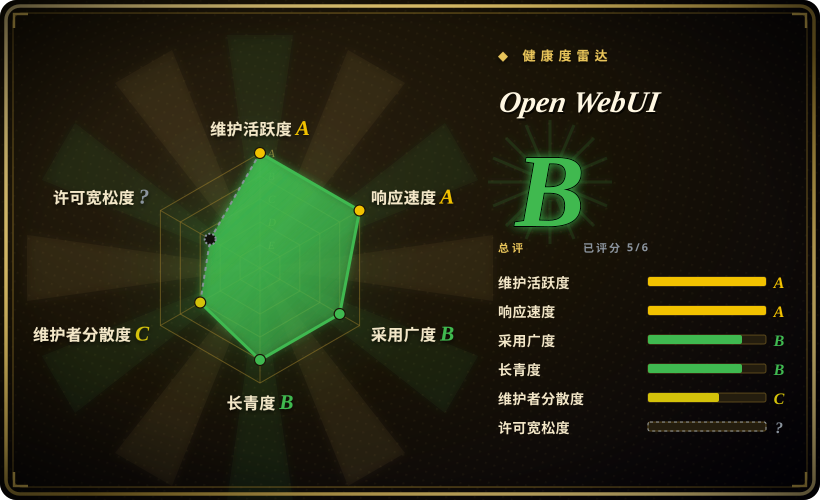

# Open WebUI

一款可扩展、功能丰富、用户友好的自托管 AI 平台，可完全离线运行，支持 Ollama、OpenAI 兼容 API 及内置 RAG。

## 何时使用

你是一位注重隐私的开发者或小团队，想为本地与远程大模型搭建一个自托管聊天界面。你在自己的硬件上运行 Ollama，需要一个精致的 Web UI，支持多模型、文档上传做 RAG、以及对话历史，且不把数据发送到第三方云服务。你想要一个开箱即用、支持 Docker 部署、界面现代、并支持社区插件扩展的方案。

## 何时不用

- **多用户团队管理**——Open WebUI 默认偏单用户；高级 RBAC 和团队配额不是其核心强项。
- **零自托管负担**——你必须运行并维护 Docker 容器、管理模型文件、并持续更新应用。
- **企业 SSO / 合规**——虽然支持 OAuth，但企业级管理后台、审计追踪和 SLA 保障并不存在。
- **原生移动体验**——主要界面是 Web；移动端体验通过浏览器实现。

## 横向对比

| 替代品 | 是否收录 | 我们的评价 | 取舍 |
| --- | --- | --- | --- |
| [NextChat](nextchat.zh.md) | ✅ | 轻量、可自部署的聊天前端。 | NextChat 更轻、部署更快；Open WebUI 更重，但内置 RAG 且功能更多。 |
| [HiveChat](../team-chat/hivechat.zh.md) | ✅ | 管理员统管的团队聊天，带配额。 | HiveChat 面向 RBAC 团队管理；Open WebUI 面向个人 / 小团体使用。 |
| LibreChat | 未收录 | 另一款自托管聊天前端。 | LibreChat 插件生态更广，但尚未收录。 |
| Lobe Chat | 未收录 | 设计优先的聊天前端。 | Lobe Chat 强调视觉精致与插件市场；Open WebUI 强调离线运行。 |
| ChatGPT / Claude 网页版 | 未收录 | 闭源云端聊天。 | 专有且需联网；Open WebUI 可自托管、支持离线。 |

## 技术栈

- **Python**——后端与 API 层
- **SvelteKit**——前端框架
- **Docker**——主要部署方式
- **Ollama**——本地大模型运行时集成

## 依赖

- Docker 运行时用于部署
- Ollama（用于本地模型）或 OpenAI 兼容 API key（用于远程模型）
- 托管应用的设备或服务器
- 可选：向量数据库用于 RAG 文档摄入

## 运维难度

**低到中等**。单个 Docker 容器承载核心应用。主要负担是保持 Ollama 模型文件更新（大体积下载）以及管理 RAG 文档上传。对单用户来说简单；对小团队来说，可能需要配置认证并管理资源使用。

## 健康度与可持续性

- **维护**：非常活跃——截至 2026-07 每日推送，issue tracker 响应积极（242 个 open issue）。[推断]
- **治理**：由 open-webui 组织所有，似乎有专职团队，bus factor 尚可。
- **背书**：未见显著企业背书；社区驱动，Discord 活跃，有赞助计划。[未验证]
- **采用**：star 数极高（144k），fork 量（20k+）可观，对 2023 年末创建的项目而言表现突出。约 3 年的记录是积极信号，但 star 数可能包含炒作成分。[推断]
- **风险旗标**：`NOASSERTION` 许可元数据对商用需澄清。项目相对年轻（2023-10 创建），高 star 数需警惕有机增长与炒作驱动之间的区别。[未验证]

## 存疑（未验证）

- [未验证] GitHub API 返回的许可为 `NOASSERTION`，商用前必须核实实际许可条款。
- [未验证] 开源版与潜在付费版的企业功能及可用性尚未确认。
- [推断] 约 3 年的仓库拥有 144k star，可能包含大量炒作驱动的增长；请在目标环境中验证生产级采用情况。
