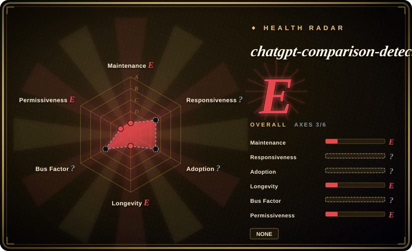

# chatgpt-comparison-detection

Human ChatGPT Comparison Corpus (HC3), Detectors, and more! 🔥

## When to use

You're evaluating a task in the `llm-eval` area and want a real repository in the oss-atlas shortlist rather than an untracked name from a backlog. Reach for chatgpt-comparison-detection when the upstream description matches the job, when its license and maintenance profile are acceptable after verification, and when adopting a public project is preferable to writing a local one-off.

This is a first-pass intake page for a user-requested backlog item. Use it to route selection and compare nearby options, then reread the upstream README, license, examples, and release history before relying on it for high-stakes work.

## When NOT to use

- **You need a deeply reviewed atlas page today.** Prefer an older in-index page from the comparison table until this entry has had a full semantic review.
- **License is a hard constraint.** GitHub reported `NOASSERTION`; inspect the repository license files before commercial use, redistribution, or vendoring.
- **You need a maintained, current AI-text detector benchmark.** The repository is not archived, but the last push in the health snapshot is 2023-12; use a maintained eval runner or build a current benchmark if your detector must cover newer model families.
- **Maintenance risk is unacceptable.** If the project is young, single-maintainer, low-star, unversioned, or quiet, choose a more established substitute in the same category.
- **Your task needs a narrower substitute.** If another page's `When NOT to use` section names your exact constraint, prefer that page over this first-pass entry.
- **You cannot verify the upstream workflow.** Do not install, run, or vendor this repo before checking its README, scripts, dependencies, and any external API requirements.

## Comparison

| Alternative | In index | Our verdict | Tradeoff |
|---|---|---|---|
| [promptfoo](promptfoo.md) | ✅ | Choose promptfoo when you need maintained YAML evals and red-team checks in CI. | promptfoo is an active eval runner; chatgpt-comparison-detection is a corpus/detector resource that looks stale and needs dataset/license review. |
| [Giskard OSS](giskard.md) | ✅ | Choose Giskard when you need an evaluation/testing library for LLM agents. | Giskard is a maintained testing workflow; HC3/detectors are useful as research material but not a general eval platform. |
| Custom detector benchmark | 未收录 | Build your own benchmark when you need current model families, private data, or reproducible detector metrics. | Custom benchmarks fit your threat model but require dataset governance and reproducibility work. |

## Tech stack

- **Python** — GitHub metadata reports Python as the primary language.
- **Corpus and detector resources** — HC3-style human/ChatGPT comparison data and detector code according to the repository description.
- **Evaluation artifacts** — treat it as an AI-text detection/evaluation resource rather than an agent skill.

## Dependencies

- **Python environment** — exact packages are not verified in this taxonomy pass; inspect upstream manifests before running detectors.
- **Datasets / model artifacts** — verify upstream download paths and licenses before redistribution or benchmarking.
- **No agent harness dependency** — it is not indexed as a SKILL.md-style agent skill.

## Ops difficulty

**Medium for reproducible evaluation.** The repo may be easy to inspect, but reliable detector benchmarking needs pinned datasets, model versions, and evaluation splits.

## Health & viability

- **Overall verdict (2026-07-16): E.** The health block caps the page because the repo has no parsed license (`spdx_id: NONE`) and the last push is from 2023-12; treat it as a stale research/dataset reference until a deeper license and maintenance review says otherwise.
- **Maintenance snapshot:** GitHub reports `archived=false` and `pushed_at=2023-12-01T16:03:51Z`; health scores maintenance as E.
- **Adoption snapshot:** ~1,413 GitHub stars as of 2026-07, but no package/download signal was found by the health scorer, so adoption is E. Star count alone should not outweigh stale maintenance and license uncertainty.
- **License snapshot:** `NOASSERTION` from GitHub metadata, and health parsed `spdx_id: NONE`; manual license-file review is a hard gate before reuse or redistribution.
- **Lindy / governance:** longevity is E because the project is old but not recently active; governance is unknown/unattributable in the health block.
- **Risk flags:** stale detector benchmarks can become misleading as model families change, and no-license/source-available status can block practical reuse.

## Caveats (unverified)

- [未验证] This page is generated from public GitHub metadata plus the user-provided intake list; upstream README, docs, examples, releases, and dependency manifests still need deeper review.
- [未验证] License, install commands, supported harnesses, and runtime requirements may differ from GitHub metadata; verify them in the repository before use.
- [推断] The comparison table starts from nearby atlas categories rather than a complete substitute survey; refine it after reading the full upstream project and adjacent alternatives.
- [推断] Because the last push predates many newer LLM releases, detector conclusions may be outdated for current AI-text detection tasks.
