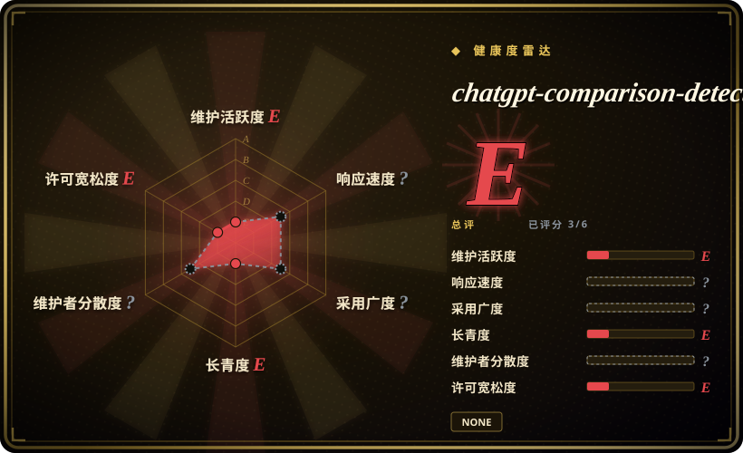

# chatgpt-comparison-detection

Human ChatGPT Comparison Corpus (HC3), Detectors, and more! 🔥

## 何时使用

你正在评估 `llm-eval` 方向的任务，需要把一个真实仓库纳入 oss-atlas 候选，而不是只在 backlog 里看到一个名字。当上游描述贴合任务、许可证和维护画像经核验后可接受，并且采用公共项目比自写一次性方案更合适时，可以把 chatgpt-comparison-detection 纳入候选。

这是用户指定 backlog 的首版 intake 页面。用它来完成路由和邻近方案对比；在高风险场景依赖它之前，请重新阅读上游 README、许可证、示例和 release 历史。

## 何时不用

- **你今天就需要深度审过的 atlas 页面。** 在本页完成完整语义复核前，优先选横向对比表里更早收录、约束更清楚的页面。
- **许可证是硬约束。** GitHub 返回 `NOASSERTION`；商用、再分发或 vendoring 前必须检查仓库内许可证文件。
- **你需要维护中、覆盖当前模型的 AI 文本检测 benchmark。** 健康度快照显示仓库未归档，但最后 push 是 2023-12；如果检测器必须覆盖更新模型族，请改用维护中的 eval runner 或自建当前 benchmark。
- **维护风险不可接受。** 如果项目很年轻、单人维护、star 少、没有版本线或长期安静，请选同分类里更成熟的替代品。
- **你的任务需要更窄的替代品。** 如果另一个页面的“何时不用”已经点名你的约束，优先用那个页面，而不是这个首版入口。
- **你无法核验上游工作流。** 在检查 README、脚本、依赖和外部 API 要求前，不要安装、运行或 vendor 这个仓库。

## 横向对比

| 替代品 | 是否收录 | 我们的评价 | 取舍 |
|---|---|---|---|
| [promptfoo](promptfoo.zh.md) | ✅ | 需要维护中的 YAML eval 和 CI red-team 检查时选 promptfoo。 | promptfoo 是活跃的 eval runner；chatgpt-comparison-detection 是语料 / 检测器资源，看起来较久未维护，且需要复核数据集和许可证。 |
| [Giskard OSS](giskard.zh.md) | ✅ | 需要面向 LLM agents 的评测 / 测试库时选 Giskard。 | Giskard 是维护中的测试工作流；HC3 / detectors 更像研究素材，不是通用 eval 平台。 |
| 自建 detector benchmark | 未收录 | 需要覆盖当前模型族、私有数据或可复现检测器指标时自建 benchmark。 | 自建 benchmark 更贴合你的威胁模型，但要自己处理数据治理和可复现性。 |

## 技术栈

- **Python**——GitHub 元数据返回 Python 为主要语言。
- **语料与检测器资源**——根据仓库描述，包含 HC3 风格的人类 / ChatGPT 对比数据和检测器代码。
- **评测产物**——应视为 AI 文本检测 / 评测资源，而不是 agent skill。

## 依赖

- **Python 环境**——本次 taxonomy pass 未核验确切 package；运行检测器前请检查上游依赖清单。
- **数据集 / 模型产物**——再分发或 benchmark 前，请核验上游下载路径和许可证。
- **无 agent harness 依赖**——本页不再按 SKILL.md 风格 agent skill 收录。

## 运维难度

**可复现评测按中等处理。** 仓库可能容易查看，但可靠检测器 benchmark 需要 pin 数据集、模型版本和评测切分。

## 健康度与可持续性

- **总体判断（2026-07-16）：E。** health block 因为没有解析到许可证（`spdx_id: NONE`）且最后 push 在 2023-12，把该页封顶为 E；在更深许可证和维护复核前，把它当作过期研究 / 数据集参考。
- **维护快照：** GitHub 返回 `archived=false`，`pushed_at=2023-12-01T16:03:51Z`；health 将维护评为 E。
- **采用快照：** 2026-07 约 1,413 个 GitHub stars，但 health 没找到 package / download 信号，所以采用度是 E。star 数不应盖过维护停滞和许可证不确定。
- **许可证快照：** GitHub 元数据返回 `NOASSERTION`，health 解析为 `spdx_id: NONE`；复用或再分发前，人工核验许可证文件是硬门槛。
- **Lindy / 治理：** 项目虽然不新，但近期不活跃，longevity 为 E；governance 在 health block 中仍是 unknown / unattributable。
- **风险信号：** 过期检测器 benchmark 会随着模型族变化而误导判断；无明确 license / source-available 状态也可能阻断实际复用。

## 存疑（未验证）

- [未验证] 本页依据公开 GitHub 元数据和用户提供的 intake 清单生成；上游 README、文档、示例、release 和依赖清单仍需深度复核。
- [未验证] 许可证、安装命令、支持的 harness 和运行时要求可能与 GitHub 元数据不同；使用前请在仓库中核验。
- [推断] 横向对比表先从邻近 atlas 分类出发，并不是完整替代品综述；读完上游项目和相邻方案后应继续细化。
- [推断] 因为最后 push 早于许多更新 LLM release，该检测器对当前 AI 文本检测任务的结论可能已经过时。
