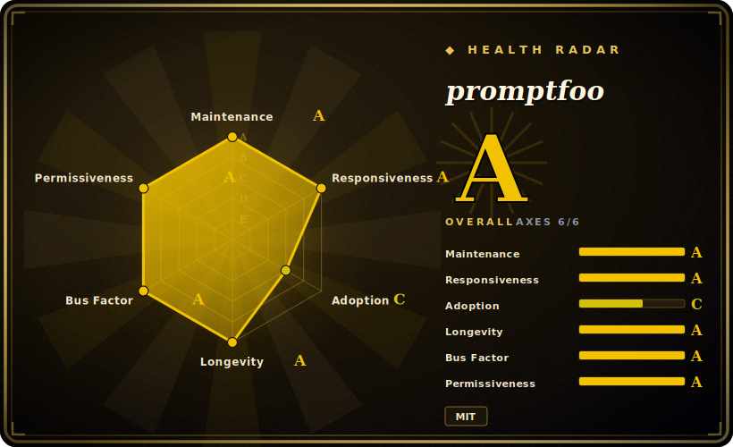

# promptfoo

A local-first CLI + library that turns prompt/model/RAG/agent evaluation into declarative YAML test suites, with a built-in red-teaming/vulnerability scanner and CI/CD hooks.

## When to use

You're an engineer shipping an LLM feature — a support agent, a RAG answer endpoint, a classification prompt — and you're tired of eyeballing outputs in a playground and "looking good enough" to ship. You want a regression suite: a fixed set of inputs, assertions that actually fail the build when a prompt change degrades quality, and a side-by-side view across GPT, Claude, Gemini, and a local Ollama model so you can pick on evidence instead of vibes. promptfoo resolves this by letting you describe the whole eval in a `promptfooconfig.yaml` — prompts, providers, test cases, and assertions (exact match, JSON schema, embedding similarity, or an LLM-as-judge `llm-rubric`) — then running `npx promptfoo eval` locally and `promptfoo view` to inspect a matrix in the browser. Wire the same command into CI and a quality regression fails the PR.

You also reach for it when security review asks "is this agent jailbreakable / will it leak the system prompt / does it do PII the wrong way?" The `redteam` side generates adversarial probes (prompt injection, jailbreaks, harmful-content, PII, and OWASP-LLM-style categories) against your live endpoint and reports which attacks landed — turning ad-hoc pentesting into a repeatable scan you can run before every release. Because evals run on your machine against your own provider keys, your prompts and test data don't have to leave your environment.

## When NOT to use

- **You want a fully managed, team-wide eval platform with hosted dashboards, RBAC, and historical trend storage out of the box.** promptfoo is local-first; cloud sharing/team features exist but the SLA-backed, governed platform is the commercial Promptfoo offering, not the OSS CLI. If you need a turnkey SaaS, weigh LangSmith / Braintrust / Langfuse instead.
- **You're not in a Node toolchain and don't want one.** It's a TypeScript/Node package (Node `^20.20.0 || >=22.22.0`); a `pip install promptfoo` wrapper exists but the engine is Node. If your stack and team are pure-Python and you want native fixtures, DeepEval (未收录) / Python-native harnesses fit the muscle memory better.
- **You need rigorous academic benchmarking across hundreds of standardized tasks** (MMLU/HELM-style leaderboards, statistical reporting). promptfoo is built for *your app's* test cases, not for running canonical benchmark batteries — use lm-evaluation-harness / HELM for that.
- **You expect the red-team scanner to be a compliance guarantee.** It surfaces *findings*, and attack coverage shifts release-to-release; passing a scan is evidence, not proof of safety. Treat results as a moving signal, not a certification.
- **You want zero config and one magic score.** The value is in writing good assertions and test cases; if nobody curates the eval set, you get a green checkmark that means little.

## Comparison

| Alternative | In index | Our verdict | Tradeoff |
|---|---|---|---|
| DeepEval | 未收录 | Use this page for its stated niche; choose DeepEval when you need python-native eval framework (pytest-style, metrics like G-Eval/faithfulness). | Python-native eval framework (pytest-style, metrics like G-Eval/faithfulness); better fit for Python teams and RAG metric depth. promptfoo wins on language-agnostic YAML config, side-by-side model matrix, and integrated red-teaming. |
| Langfuse | 未收录 | Use this page for its stated niche; choose Langfuse when you need tracing/observability + eval platform (self-hostable, with a UI and datasets backend). | Tracing/observability + eval platform (self-hostable, with a UI and datasets backend); strong for production monitoring and trend history. promptfoo is lighter, CLI-first, and red-team-oriented rather than an observability backend. |
| LangSmith | 未收录 | Use this page for its stated niche; choose LangSmith when you need hosted LangChain eval/observability SaaS. | Hosted LangChain eval/observability SaaS; deep LangChain integration and managed dashboards, but proprietary and cloud-centric. promptfoo is OSS, local-first, framework-agnostic. |
| Braintrust | 未收录 | Use this page for its stated niche; choose Braintrust when you need commercial eval/experiment platform with hosted scoring and logging. | Commercial eval/experiment platform with hosted scoring and logging; polished team UX. promptfoo trades the managed platform for an open, self-run CLI. |
| Garak | 未收录 | Use this page for its stated niche; choose Garak when you need dedicated LLM vulnerability scanner (red-team only, Python). | Dedicated LLM vulnerability scanner (red-team only, Python). Overlaps promptfoo's `redteam` scope but isn't a general eval/assertion harness. |
| Giskard | 未收录 | Use this page for its stated niche; choose Giskard when you need OSS testing/red-teaming for ML+LLM with a scan-and-report model. | OSS testing/red-teaming for ML+LLM with a scan-and-report model; broader ML scope, Python-centric. promptfoo is more prompt/CI-workflow focused. |

## Tech stack

- **Language:** TypeScript / Node.js (CLI bins `promptfoo` and `pf`).
- **Core libs (per package.json, v0.121.17):** `commander` (CLI), `express` + `compression`/`cors` (local web viewer server), `drizzle-orm` + `@libsql/client` (local SQLite eval store), `ajv`/`ajv-formats` (JSON-schema assertions), `@anthropic-ai/sdk` and the `ai` SDK plus many provider clients, `@opentelemetry/*` (tracing), `chokidar`/`execa`/`chalk` (CLI plumbing).
- **Config surface:** declarative `promptfooconfig.yaml` (prompts, providers, tests, assertions, `redteam`); also usable as a library / via CI.
- **Assertion types:** deterministic (equals/contains/regex/JSON-schema), similarity (embeddings), and model-graded (`llm-rubric`, LLM-as-judge).

## Dependencies

- **Runtime:** Node.js `^20.20.0 || >=22.22.0` (per `engines`). No database to provision — it uses a local libsql/SQLite file for eval history.
- **Install:** `npm install -g promptfoo`, `brew install promptfoo`, or run zero-install via `npx promptfoo@latest`; a `pip install promptfoo` wrapper also exists (Node still required underneath). [推断]
- **External services:** the LLM provider(s) you evaluate against — you supply API keys (OpenAI/Anthropic/Azure/Bedrock/Google/Ollama/etc.); local models via Ollama need their own runtime.
- **Optional:** an embeddings provider for similarity assertions; cloud account only if you opt into hosted sharing/team features.

## Ops difficulty

**Low.** For the core loop there is effectively nothing to operate: install or `npx`, write a YAML, set provider env keys, run `eval` and `view`. State is a local file, the web UI is a bundled Express server you start on demand, and CI usage is just running the same CLI in a job. Difficulty rises to **low-to-medium** only when you self-host sharing for a team, manage many provider credentials/rate limits in CI, or maintain a large red-team configuration — and your eval costs become real provider API spend, which is the main thing to watch rather than infra.

## Health & viability

- **Maintenance — very active (as of 2026-06).** Repo pushed 2026-06; release cadence is fast (package ~0.121.x, observed 0.121.17 on 2026-06-16). Still pre-1.0 in version numbering, but shipping constantly, not coasting. Not archived. [未验证]
- **Governance & backing — single vendor (Promptfoo).** Organization-owned by the company behind the commercial Promptfoo offering; roadmap is vendor-controlled, not foundation-governed. The OSS CLI is the funded core of a venture-style company, which is good for momentum but ties longevity to the company's commercial trajectory. [推断]
- **Age & Lindy — moderate, but durable for its category.** Created 2023-04, ~3 years old and continuously active — among the earlier and most-adopted OSS LLM-eval tools, so it has outlasted the "weekend eval script" wave. Young in absolute terms, but a reasonable Lindy bet within a fast-moving niche. [推断]
- **Adoption & ecosystem.** ~22k stars, broad provider coverage, CI integrations, and a code-scan action; the README's "used by OpenAI/Anthropic, 10M+ users" claims are vendor marketing, not independently confirmed. Decent docs and an active issue tracker (~361 open) for the project size.
- **Risk flags — open-core.** Local-first OSS CLI under MIT, with the governed/SLA-backed platform (hosted dashboards, RBAC, trend history) reserved for the commercial tier — the usual open-core line to watch if your needs drift toward team governance. No relicense or notable CVE history asserted here.

## Caveats (unverified)

- [未验证] Latest `promptfoo` package version observed as 0.121.17, published 2026-06-16 (separate `code-scan-action` releases version independently, e.g. 0.1.8). Version cadence is fast; re-verify before pinning.
- [未验证] Star count ~22.6k as of 2026-06 — GitHub stars are unreliable and date-sensitive; indicative only.
- [未验证] README states it "Powers LLM apps serving 10M+ users in production" and is "Used by OpenAI and Anthropic" — these are the project's own marketing claims, not independently confirmed here.
- [推断] The `pip install promptfoo` path is a thin wrapper over the Node package; the actual engine and `engines` constraint are Node — confirm against current docs if Python-only deployment matters.
- [推断] Exact red-team attack categories (OWASP-LLM coverage, jailbreak/PII plugins) and supported provider list shift release-to-release; verify the current docs for a specific attack or provider before relying on it.
- [未验证] License read as MIT from repo metadata; comparison rows (DeepEval/Langfuse/LangSmith/Braintrust/Garak/Giskard positioning) are judgment from general knowledge, not benchmarked head-to-head.
