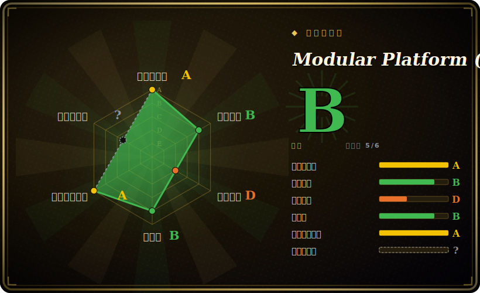

# Modular Platform (MAX + Mojo)

一个厂商自建、垂直整合的 AI 栈，全装在一个仓库里：**MAX**——一个高性能推理/服务引擎，在 GPU 和 CPU 上跑主流开源模型，对外暴露 OpenAI 兼容端点；外加 **Mojo**——一门 Python 超集系统级语言，用来写底层那些高性能 kernel。

## 何时使用

你是 ML 平台工程师，要在一片混杂的 NVIDIA 与 AMD GPU 机群上以高吞吐服务若干开源权重 LLM（Llama、Gemma、Qwen……），而你已经厌倦了为每种加速卡各维护一条服务路径、一套手调 kernel。你用 `pip`/`uv`/`pixi` 装上 Modular，把 MAX 指向其 Model Library 里的一个模型，就得到一个服务该模型的 OpenAI 兼容 REST 端点；或者直接把 Kubernetes 友好的 `max-nvidia-full` / AMD 容器塞进集群。它的卖点是「无需改一行代码，就用业界领先的 GPU 与 CPU 性能跑最主流的开源模型」，抹平硬件差异，让同一套栈同时打 NVIDIA 与 AMD。[未验证]

当你**专门想要 Mojo** 时也会选它——你在写自定义 AI kernel 或算子，想要一门读起来像 Python、却能编译到系统级性能的语言，而不是为热路径掉进 CUDA C++ 或 Triton。在那个世界里，MAX 就是你的 Mojo kernel 插进去的服务运行时。所以「采用」这个决定，本质是赌 Modular 整套垂直整合的栈（编译器 + kernel + 运行时 + 服务），而不是自己把各路最佳组件拼起来。

## 何时不用

- **你不想锁死在一家拿了融资的初创公司的垂直整合平台上。** 这是来自单一公司（Modular Inc.）的 MAX + Mojo + Modular 工具链。服务端点是 OpenAI 兼容的，但 kernel 语言（Mojo）、引擎和路线图全是一个厂商的——一个又深又不可移植的赌注。这是最该犹豫的理由。
- **你今天只是要在 NVIDIA 上服务 LLM。** 成熟、被广泛采用的服务栈早已存在：**vLLM**（PagedAttention、社区庞大）、**TGI**（Hugging Face）、**TensorRT-LLM**（NVIDIA 自家、对 NVIDIA 调得最狠）。它们的生态更大、实战检验更久、治理也比单一厂商的新秀更分散。
- **你想用一门久经验证的语言/工具链写 kernel。** 写自定义 kernel，原生 **PyTorch**（配 `torch.compile`）、**Triton** 或 CUDA 才是成熟、好招人、文档齐全的路径。**Mojo 还很年轻、仍在演进**——语言表面、stdlib 和工具链都还没稳定，把生产 kernel 押在它上面带有语言不成熟的风险。[推断]
- **你需要通用的请求编排 / 多模型路由。** Ray Serve 这类服务框架专注于扩展和组合任意 Python 模型服务；MAX 是引擎，不是通用编排层。
- **端侧 / 边缘推理。** 这是面向服务器级 GPU/CPU 的服务栈；手机、浏览器或嵌入式目标请见 → on-device-ml。

## 横向对比

| 替代品 | 是否收录 | 取舍 |
|---|---|---|
| vLLM | 未收录 | 事实标准的开源 LLM 服务引擎（PagedAttention、continuous batching），社区与模型覆盖极大；偏 NVIDIA、跨 CPU/AMD 的统一叙事较弱，也没有自己的 kernel 语言。 |
| Text Generation Inference (TGI) | 未收录 | Hugging Face 的生产服务器，与 HF 生态贴合紧密；许可证历史有过反复（Apache→HFOIL→Apache），范围比一整套编译器+语言平台窄。 |
| TensorRT-LLM | 未收录 | NVIDIA 自家引擎，在 NVIDIA 硬件上性能顶级；深度锁定 NVIDIA，构建/引擎编译流程更重，无跨厂商抽象。 |
| Ray Serve | 未收录 | 通用 Python 模型服务/编排框架，负责扩展与组合服务；不是手调的单模型推理引擎——是另一层。 |
| 原生 PyTorch（配 Triton） | 未收录 | 服务与自定义 kernel 两头都最默认、最可移植、最好招人的栈；性能要你自己拼，而不是买一个垂直整合的引擎。 |

## 技术栈

- **Mojo**——仓库的主语言：一门 Python 超集系统级语言，用来写 MAX 的 kernel/算子，经一套基于 MLIR/LLVM 的工具链编译到原生性能（见存疑）。
- **MAX**——推理引擎 + 服务运行时：加载开源模型，在 GPU/CPU 上跑，并暴露 **OpenAI 兼容 REST API**。
- **打包/部署面**——可经 `pip`/`conda` 风格管理器（`uv`、`pixi`）安装；提供面向 NVIDIA、AMD 以及统一镜像的 Kubernetes 兼容 Docker 容器（`modular/max-*`）。
- **目标硬件**——NVIDIA 与 AMD GPU 加 CPU；`main` 跟踪 nightly 构建，稳定版走 `max/vX.Y` 发布分支。

## 依赖

- **硬件**——要拿到价值，你需要服务器级加速卡（NVIDIA 或 AMD GPU）；支持 CPU 执行，但性能叙事以 GPU 为中心。
- **模型**——你自带开源权重模型（如来自 Hugging Face / Modular Model Library）；容器会挂载 HF 缓存。
- **运行时/安装**——框架路径需要一个 Python 包管理器环境（`uv`/`pixi`/`pip`），或走容器的 Docker/Kubernetes；宿主机上要有 NVIDIA 或 AMD 的 GPU 驱动/运行时。[推断]
- **工具链（做 Mojo/kernel 用）**——来自本仓库/发行版的 Modular 工具链（Mojo 编译器），不是通用第三方编译器。

## 运维难度

**中。** 服务的顺路径确实顺滑：用包管理器装上、或直接跑预构建的 GPU 容器，指向一个模型，就有了 OpenAI 兼容端点——Kubernetes 就绪的镜像让集群部署很常规。难度上升在于：（1）GPU 机群管理（驱动、NVIDIA 与 AMD 运行时、调度、显存/吞吐调优）；（2）跟一个快速演进的栈——`main` 是 nightly，要稳定就得 pin 住 `max/vX.Y`；（3）任何涉及自定义 Mojo kernel 的活，你是在运维一门还在演进的语言/工具链，而非一个已经定型的。和任何推理引擎一样，运维重量主要在 GPU 和模型生命周期，而非某个数据存储。

## 健康度与可持续性

- **维护（2026-06）。** 最后 push 于 2026-06-28；MAX v26.4.0 于 2026-06-18 发布，按每年多个版本的稳定节奏走——明显**活跃**，而非吃老本。未归档。[推断]
- **治理 / bus factor（2026-06）。** 单一厂商：路线图、语言（Mojo）和引擎全由 **Modular Inc.** 这家拿了融资的初创公司掌控——**不是**基金会（没有 Apache/CNCF/LF 治理）。bus-factor 与商业策略风险集中在一家公司；若 Modular 转向、被收购或弱化这套 OSS 栈，下游用户要承担这份风险。[推断]
- **年龄与 Lindy（2026-06）。** 2023-04 创建（约 3 年）且仍在活跃发布⇒一个**中等**信号：势头是真的，但 **Lindy 偏弱**——还太年轻，谈不上久经验证，相对 vLLM/TensorRT-LLM 这些既有者，其长期存活尚未被证明。用年龄 × 仍活跃来看：活跃是好事，年轻仍意味着未经证明。[推断]
- **许可证 / relicense 与 open-core 风险——关键标记。** 仓库 `LICENSE` 写明 MAX 仓库采用 **Apache-2.0 加 LLVM Exceptions**（GitHub 检测器报 `NOASSERTION` 是因为自定义文件头，并非因为它闭源）。然而仓库内 `Licenses/README.md` 明确说许可证**因产品而异**，并提到某些部分有「**仅供非生产用途的免费版本**」——一个典型的 open-core / source-available 结构。请把「这个平台是开源的」当作**在仓库层面部分为真、但在产品层面有商业门槛**；relicense/功能门控在一家单一商业厂商身上是个活的风险。[未验证]
- **采用度。** 约 26.4k star、约 2.9k fork，对一个约 3 年的项目而言显示出很强的关注度，并有公开的 Model Library、容器镜像和社区例会；但 star 数不是生产采用的证据，真实世界的 LLM 服务仍由既有者主导。[未验证]

## 存疑（未验证）

- [未验证] 截至 2026-06-28（经 GitHub API），约 26.4k star / 约 2.9k fork / 约 261 watcher / 约 1.06k open issue；star 与 issue 数易变且对时间敏感，仅供参考。
- [未验证] 性能宣称（「业界领先的 GPU 与 CPU 性能」「无需改代码」「跨 NVIDIA/AMD 厂商等价」）是项目 README 自己的表述，本页未独立跑 benchmark 验证。
- [未验证] 哪些部分是 Apache-2.0/开源、哪些有商业门槛，以及哪些组件是「仅供非生产用途免费」，由 `Licenses/README.md` 主张，但本页未逐组件穷尽映射——依赖某组件前请对照当前仓库/产品条款核实。
- [推断]「Mojo 语言不成熟/不稳定」是从该语言的年轻（约 2023 年公开发布）和一个 `main` 跟踪 nightly 的快速演进仓库推断而来，并非对某次具体破坏性变更的实测断言。
- [推断] 宿主机运行时/驱动依赖（NVIDIA/AMD GPU 驱动、容器运行时）是从 GPU 容器部署模型推断的，未从某个 manifest 逐条枚举。
- [推断] Mojo→MLIR/LLVM 工具链细节是从该语言的公开描述推断的，本页未从源码读取确切的编译器内部实现。
