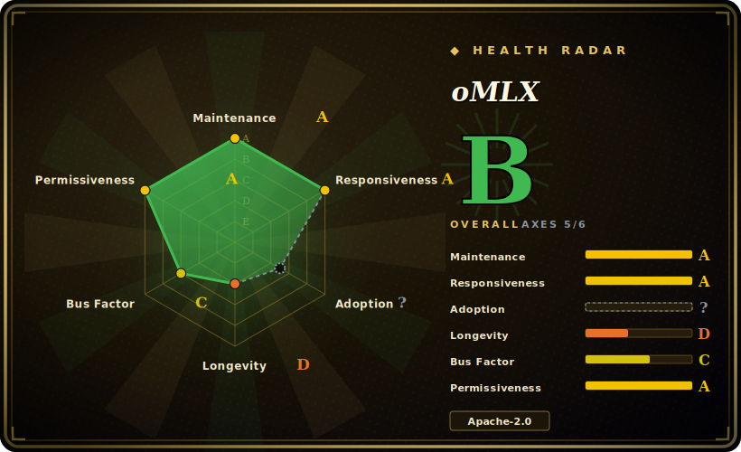

# oMLX

An Apple-Silicon-only LLM inference server (built on Apple's MLX) with continuous batching and a tiered hot-RAM/cold-SSD KV cache, managed from the macOS menu bar — aimed at making local models practical for everyday coding agents like Claude Code.

## When to use

You're a developer on an M-series Mac (M1/M2/M3/M4) who wants to run local LLMs for real coding work — wiring Claude Code, OpenCode, Codex, or Copilot to a local OpenAI-compatible endpoint instead of paying per token. The problem you keep hitting is that naive local servers recompute the KV cache on every request, so long-context coding sessions crawl, and you don't want to babysit a terminal. You install oMLX (a `.dmg` app or `brew install omlx`), point it at a folder of MLX models, and it serves them at `http://localhost:8000/v1` with continuous batching and a **tiered KV cache** that keeps hot blocks in RAM and offloads cold blocks to SSD (safetensors), restoring a matching prefix from disk on the next request — even across a server restart — instead of recomputing it. A native Swift menu-bar app lets you start/stop, pin models, set per-model TTLs, and watch throughput without opening a shell.

You also reach for it when you want one Mac-local server that handles text LLMs, vision-language models, OCR models, embeddings, and rerankers together, with LRU eviction and a memory cap so a laptop doesn't OOM — and an admin dashboard for model download (from HuggingFace), per-model sampling settings, and one-click benchmarks. The whole pitch is "local LLM serving optimized for a single Mac," not cluster-scale serving.

## When NOT to use

- **You need production-grade, battle-tested serving — this is a very young, single-maintainer project.** Created 2026-02 (~4 months old as of 2026-06) with one dominant author; it is **unproven** and has a thin track record. For anything you must rely on, prefer mature stacks: **vLLM**, **TGI**, or **[Modular MAX](modular.md)**. Treat oMLX as promising-but-early. [推断]
- **You're not on Apple Silicon.** oMLX is **macOS-only** and **Apple-Silicon-only** (requires macOS 15.0+ and an M-series chip), built on Apple's MLX. There is no Linux/NVIDIA/AMD path — for server GPUs use vLLM / TGI / TensorRT-LLM / MAX.
- **You're serving at cluster / multi-node scale.** This is a single-machine, single-Mac server with LRU model eviction and a RAM cap — not a horizontally-scaled, multi-GPU fleet engine with autoscaling.
- **SSD-offload caching has tradeoffs you can't accept.** Restoring KV blocks from disk is faster than recompute *on a cache hit*, but it adds I/O latency and SSD wear, and the win depends on prefix-hit rates; on a cold/novel prompt you pay normal prefill. Don't assume the cache is free.
- **You can't independently confirm the claims.** The benchmarks and the "tiered cache survives restart" are the project's own framing, and the **~17k-star count on a ~4-month repo** — while API-verified as a number — is an anomalous popularity signal whose adoption meaning is unverified/suspicious; verify it delivers for your models before betting a workflow on it. [未验证]

## Comparison

| Alternative | In index | Tradeoff |
|---|---|---|
| Ollama | 未收录 | The default Mac/cross-platform local-LLM runner (llama.cpp-based), huge ecosystem and model library; broader OS support but no Apple-MLX backend and a simpler caching story than oMLX's tiered hot/cold KV cache. |
| LM Studio | 未收录 | Polished desktop app for local models on Mac/Win/Linux with an OpenAI-compatible server; closed-source GUI, not an Apple-MLX-native open-source server. |
| mlx-lm (`mlx_lm.server`) | 未收录 | Apple's own MLX LLM toolkit with a minimal OpenAI-compatible server — oMLX is built **on** mlx-lm's BatchGenerator; mlx-lm is lower-level and lacks the menu-bar app, tiered SSD cache, multi-model LRU, and admin dashboard. |
| llama.cpp | 未收录 | The portable C/C++ inference engine (GGUF) running everywhere incl. Macs via Metal; maximally portable and mature, but not MLX-native and no built-in macOS menu-bar/admin management layer. |
| vLLM | 未收录 | The de-facto data-center LLM serving engine (PagedAttention, continuous batching), huge community; NVIDIA/Linux-first — not a Mac/Apple-Silicon local server. |
| Text Generation Inference (TGI) | 未收录 | Hugging Face's production server, tight HF integration and battle-tested at scale; server-GPU oriented, not an on-Mac local stack. |
| SGLang | 未收录 | High-throughput serving engine with RadixAttention prefix caching; server-GPU oriented and more complex to operate, not a single-Mac menu-bar app. |
| [Modular Platform (MAX + Mojo)](modular.md) | ✅ | Vendor-built cross-vendor GPU/CPU serving engine + Mojo kernel language; a far larger, server-class, single-vendor platform — different layer and scale from a Mac-local server. |

## Tech stack

- **Language:** Python 3.10+ (server/engine) plus a native **Swift / SwiftUI** menu-bar app (explicitly *not* Electron).
- **Inference backend:** Apple's **MLX** via **mlx-lm**; continuous batching runs through mlx-lm's `BatchGenerator`.
- **KV cache:** block-based, two-tier cache (hot RAM + cold SSD in **safetensors**) with prefix sharing and Copy-on-Write, described as "inspired by vLLM."
- **API:** OpenAI-compatible REST at `http://localhost:8000/v1`; built-in admin dashboard (`/admin`) for monitoring, model management, chat, benchmark; MCP support optional.
- **Model surface:** text LLMs, VLMs, OCR models, embeddings, rerankers; HuggingFace model downloader built into the dashboard.

## Dependencies

- **Hardware/OS:** an **Apple Silicon** Mac (M1/M2/M3/M4) running **macOS 15.0+ (Sequoia)** — hard requirements, no other platform supported.
- **Runtime:** Python **3.10+**; install via prebuilt `.dmg` app, Homebrew (`brew tap jundot/omlx`), or `pip install -e .` from source. Optional `[mcp]` extra for Model Context Protocol.
- **Models:** you bring **MLX-format** models (e.g. from HuggingFace); the dashboard can download them.
- **Storage:** SSD headroom for the cold KV-cache tier (safetensors blocks); RAM is the binding resource (default cap = system RAM − 8 GB). [推断]

## Ops difficulty

**Low (for its single-Mac scope).** The happy path is a `.dmg` drag-install or `brew install omlx`, then `omlx start` (or `brew services`) and point a client at `localhost:8000/v1`; the menu-bar app handles start/stop, auto-restart on crash, and Sparkle auto-update, and the admin dashboard does model download and per-model settings without restarts. There's no cluster, datastore, or GPU-driver fleet to run. The real operational burden is local and laptop-shaped: managing RAM pressure and model eviction so you don't OOM, tuning the hot/cold cache and SSD usage, and the fact that you're operating a **young, fast-moving project** (dev/rc tags, frequent releases) where behavior can shift release-to-release. There is no multi-node story to operate because there is no multi-node mode.

## Health & viability

- **Maintenance (2026-06).** Last pushed 2026-06-28; v0.4.4 released 2026-06-16 with frequent rc/dev tags — **very active** development, not coasting. Not archived. [推断]
- **Governance / bus factor (2026-06) — flag.** Owner is a **single User account** (`jundot`), and one author dominates commit history (~1.2k commits) with a long tail of small outside contributors. This is a **single-maintainer / high-bus-factor** project: if the author stops, it likely stalls. [推断]
- **Age & Lindy (2026-06) — fails Lindy.** Created **2026-02** (~0.4 years old). Far **too young** to carry any Lindy prior; longevity is entirely unproven regardless of activity. Use age × still-active: active is good, but ~4 months is not a track record. [推断]
- **Adoption — suspicious-popularity flag.** ~17.2k stars on a ~4-month-old single-maintainer repo: the count is API-verified, but its adoption meaning is **anomalous** — that star velocity is wildly out of proportion to the project's age, contributor base, and ~624 open issues / ~91 watchers. Treat the count's **[未验证]** adoption/vetting meaning as suspicious — possibly genuine viral interest in a Mac-local LLM server, possibly a visibility spike — and do **not** read it as production-readiness. [未验证]
- **License & backing.** Apache-2.0 (confirmed via repo badge and GitHub API). No backing org or foundation; funded informally (a "Buy Me a Coffee" link), which compounds the bus-factor risk. No relicense history yet (too young to have one). [推断]

## Caveats (unverified)

- [未验证] ~17.2k stars / ~1.46k forks / ~624 open issues / ~91 watchers as of 2026-06-28 (via GitHub API). The star count itself is API-verified, but its adoption meaning is **anomalous for a ~4-month single-maintainer repo** and flagged as an unverified/suspicious popularity signal — treat as indicative only, not as adoption or quality evidence.
- [未验证] Core claims — continuous batching, the tiered hot-RAM/cold-SSD KV cache "surviving server restarts," prefix-cache hit benefits, "inspired by vLLM" block management, and the published benchmarks — are the project's own README/site framing and were **not independently verified or benchmarked** here.
- [未验证] "Claude Code optimization" (token-count scaling, SSE keep-alive) and the one-click agent integrations are described in the README but not validated against those tools here.
- [推断] SSD-offload latency/wear tradeoffs and the RAM-cap default (system RAM − 8 GB) are inferred from the README's description, not measured.
- [推断] The Apple-Silicon-only / macOS-15+ / Python-3.10+ requirements are taken from README install notes; the precise minimum dependency set is governed by the repo's `pyproject.toml` at build time and not enumerated here.
- [推断] Bus-factor judgment is inferred from owner type (User) and the contributor distribution (one dominant author), not from a stated governance document.
