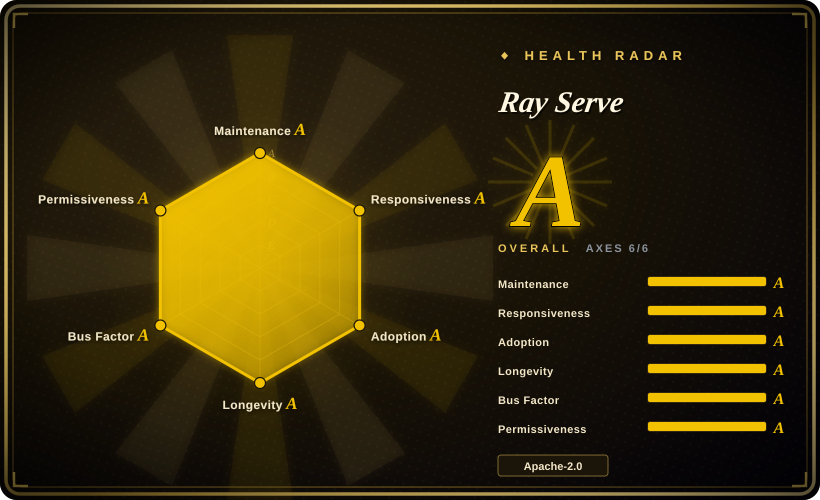

# Ray Serve

A scalable, general-purpose model serving framework built on Ray — designed for composing multiple models (LLMs, sklearn, XGBoost, and more) into distributed deployment graphs with autoscaling, multi-model routing, and Python-native APIs.

## When to use

You're an ML platform engineer at a company that serves a mix of models — not just LLMs, but also scikit-learn classifiers, XGBoost rankers, and custom Python inference functions — and you need to orchestrate them behind a single serving layer. Your team already uses Ray for distributed training, so the actor model and cluster abstractions are familiar. You deploy Ray Serve using `@serve.deployment` decorators to wrap each model as a microservice, compose them into a deployment graph with `.bind()`, and let Ray handle autoscaling from zero to many replicas based on traffic. You also need to mix and match inference backends: some LLM endpoints run on vLLM, others on TGI or TensorRT-LLM, but you want unified routing, traffic splitting, and A/B testing across all of them — Ray Serve sits above the engines as an orchestration layer, not a replacement.

## When NOT to use

- **You only need to serve a single LLM with maximum throughput.** For a single-model, throughput-first LLM serving stack, dedicated inference engines like **vLLM** (PagedAttention), **TensorRT-LLM** (NVIDIA-optimized), or **TGI** are simpler and more performant. Ray Serve adds orchestration overhead you don't need.
- **You don't already know Ray.** Ray Serve is built on Ray's distributed runtime, actor model, and cluster primitives. If your team has no Ray experience, the learning curve is real — you'll be debugging actor failures, placement groups, and resource scheduling before you get to serving. [推断]
- **You want a lightweight, minimal serving layer.** Ray is a heavy distributed system (the full Ray package includes scheduling, object storage, and cluster management). For simple model serving on a single machine or a small fleet, **BentoML** or even plain **FastAPI + Uvicorn** are lighter.
- **You need deep LLM-specific optimizations out of the box.** Ray Serve is a general-purpose serving framework; it does not implement PagedAttention, continuous batching, or KV-cache optimizations itself. Those come from the backend engine you plug in (vLLM, TGI, etc.). If you expect Ray Serve to magically optimize LLM inference, you will be disappointed.
- **You want a fully managed, zero-ops serving platform.** Ray Serve still requires you to run and manage a Ray cluster (on Kubernetes, AWS, GCP, Azure, or bare metal). Anyscale offers a managed Ray option, but the open-source path is self-hosted. If you want a fully managed endpoint with no cluster administration, look at cloud vendor inference services instead.
- **You're not on a Python-centric stack.** Ray Serve is Python-first; while it can proxy to non-Python services, the deployment definitions, routing logic, and autoscaling policies are all Python. If your inference stack is Go, Rust, or C++ native, the impedance mismatch is significant.

## Comparison

| Alternative | In index | Our verdict | Tradeoff |
|---|---|---|---|
| [vLLM](vllm.md) | ✅ | Use Ray Serve when you need multi-model orchestration and autoscaling; choose vLLM when you need a dedicated, high-throughput LLM inference engine. | The de-facto open-source LLM serving engine (PagedAttention, continuous batching), huge community; NVIDIA-first, not an orchestration framework. |
| Text Generation Inference (TGI) | 未收录 | Use Ray Serve when you need general model-serving orchestration; choose TGI when you want Hugging Face's production LLM server with tight HF ecosystem integration. | Hugging Face's production server, tight HF integration; license history wobbled (Apache→HFOIL→Apache), not a general-purpose serving framework. |
| [TensorRT-LLM](tensorrt-llm.md) | ✅ | Use Ray Serve when you need orchestration across many model types; choose TensorRT-LLM when you need NVIDIA's own engine for maximum throughput on NVIDIA hardware. | NVIDIA's own engine, top-tier throughput on NVIDIA hardware; deeply NVIDIA-locked, heavier build workflow, not an orchestration layer. |
| [Modular Platform (MAX + Mojo)](modular.md) | ✅ | Use Ray Serve when you want a general Python model-serving framework with multi-model composition; choose MAX when you want a vendor-built cross-vendor compiler+language platform with its own kernel language. | Vendor-built cross-vendor GPU/CPU serving engine + Mojo kernel language; single-vendor lock-in, not a general-purpose model-serving orchestration framework. |
| [oMLX](omlx.md) | ✅ | Use Ray Serve for datacenter multi-model serving; choose oMLX when you want a Mac (Apple Silicon) local inference server with SSD-tiered KV caching. | Mac-only local server on Apple Silicon with a Swift menu-bar app; not a datacenter multi-model orchestration framework. |
| SGLang | 未收录 | Use Ray Serve when you need general model-serving orchestration; choose SGLang when you specifically need RadixAttention prefix caching and structured-generation optimizations. | High-throughput serving engine with RadixAttention prefix caching; newer, smaller ecosystem, not an orchestration framework. |
| BentoML / OpenLLM | 未收录 | Use Ray Serve when you need Ray-native distributed scaling and deployment graphs; choose BentoML when you want a lighter, container-native model-serving framework. | Lighter, container-native model-serving framework; smaller ecosystem than Ray, less proven at very large scale. |
| KServe | 未收录 | Use Ray Serve when you want a Python-first, code-centric serving framework; choose KServe when you need Kubernetes-native model serving with standard CRDs and tight Kubeflow integration. | Kubernetes-native model serving with standard CRDs and tight Kubeflow integration; more YAML/config-heavy, less Python-native than Ray Serve. |
| FastAPI + Uvicorn | 未收录 | Use Ray Serve when you need distributed autoscaling, multi-model composition, and production-grade serving; choose FastAPI when you want a minimal, lightweight API framework for simple serving. | Minimal, lightweight API framework; not model-serving-specific, no built-in autoscaling or distributed execution. |

## Tech stack

- **Python** — the primary language: deployment definitions (`@serve.deployment`), routing logic, request handling, and composition graphs are all Python-native.
- **Ray** — the underlying distributed computing framework: actors, object store, placement groups, and cluster scheduling provide the foundation for autoscaling and distributed execution.
- **Deployment graph API** — compose multiple deployments with `.bind()` and `.deploy()` to build multi-model inference pipelines.
- **Backend integrations** — can wrap and route to vLLM, TGI, TensorRT-LLM, and other inference engines as backends within a Ray Serve deployment.
- **HTTP / gRPC** — exposes REST and gRPC endpoints for client traffic; supports OpenAI-compatible API patterns when backed by an OpenAI-compatible engine.
- **Kubernetes operator** — Ray provides a KubeRay operator for deploying and managing Ray clusters on Kubernetes.

## Dependencies

- **Ray cluster** — you must run a Ray cluster (single-node for dev, multi-node for production). The cluster needs a head node and worker nodes with sufficient resources.
- **Hardware** — depends on the models you serve. LLM backends need NVIDIA GPUs; sklearn/XGBoost models can run on CPU. Ray itself runs on CPU.
- **Runtime environment** — Python 3.9+; installed via `pip install "ray[serve]"`. The full Ray package is large (includes the distributed runtime).
- **Cluster infrastructure** — for production: Kubernetes (via KubeRay), AWS, GCP, Azure, or bare metal. You bring the cluster and manage it.
- **Models** — you bring your own models; Ray Serve is the serving layer, not a model provider.

## Ops difficulty

**High.** Ray Serve is powerful but operationally demanding:

1. **Ray cluster management** — you are running a distributed system. The head node is a SPOF for metadata; worker nodes join and leave; network partitions and resource fragmentation are real failure modes you must understand and handle.
2. **Resource scheduling complexity** — placement groups, resource bundles, and GPU scheduling in Ray are powerful but finicky. Getting autoscaling policies right (min replicas, max replicas, target latency) requires tuning and production iteration. [推断]
3. **Observability burden** — you need to monitor both Ray's internal metrics (GCS, raylet, object store) and your application-level serving metrics. The Prometheus/Grafana integration exists but requires setup. [推断]
4. **Version coupling** — Ray Serve versions are tightly coupled to Ray core versions. Upgrading Ray for a bug fix or new feature means upgrading the whole cluster, which can be disruptive.
5. **Learning curve** — debugging a distributed serving system requires understanding Ray's actor lifecycle, fault handling, and serialization. This is not "deploy a Docker container and forget."

## Health & viability

- **Maintenance (2026-07).** Ray is extremely active — v2.42.x as of mid-2026, with frequent releases and a large commit volume. Ray Serve is a first-class component of the Ray project, not a side module. Not archived. [推断]
- **Governance / bus factor.** The Ray project is governed by the **Ray Project** community with strong backing from **Anyscale** (the company founded by Ray's creators). This is a **single-vendor-backed open-source** model: the community is open, but the core maintainers and roadmap are closely tied to Anyscale. Higher bus-factor than a pure solo project, but the roadmap is not foundation-independent (no Apache/CNCF/LF umbrella). [推断]
- **Age & Lindy (2026-07).** Ray was first released in 2018 (~8 years old) and has been continuously active; Ray Serve has been a core component since ~2020. This gives a **strong Lindy prior**: the project has survived multiple ML infrastructure cycles, proven itself in production at many companies, and is still actively evolving. Age × still-active = a safer long-term bet than younger alternatives. [推断]
- **Adoption.** ~38k stars for the Ray project (which includes Ray Serve, Ray Train, Ray RLlib, etc.); widely used in production by companies for both training and serving. The ecosystem is large, with documentation, conferences, and commercial support available. [未验证]
- **Risk flags.** Apache-2.0 with no relicense history to date. The main risk is **Anyscale concentration**: if Anyscale changes its commercial strategy, reduces OSS investment, or is acquired, the Ray project's maintenance cadence could shift. There is also a **fast-moving ecosystem risk**: Ray's broad scope (training, serving, RL, data) means the surface area is large and some sub-projects evolve faster than others. [推断]

## Caveats (unverified)

- [未验证] ~38k stars is the count for the entire Ray project (ray-project/ray), not Ray Serve specifically; Ray Serve is a component within the larger repo.
- [未验证] Kubernetes operator details (KubeRay) are from project documentation; the exact operator features and maturity were not independently validated.
- [推断] The full Ray package is large (includes the distributed runtime) is inferred from the pip install description and community reports, not from a measured package size.
- [未验证] Exact autoscaling behavior and cold-start latency from zero replicas are described in documentation but not independently benchmarked.
- [推断] Resource scheduling complexity and "finicky" placement-group behavior are inferred from community discussions and Ray documentation, not from a hands-on production evaluation.
- [推断] The "strong Lindy prior" assessment combines Ray's ~2018 origin with observed continued activity; this is a heuristic judgment, not a measured prediction.
- [推断] Anyscale's commercial strategy risk and the "single-vendor-backed" governance model are inferred from public information about Anyscale's founding and business model, not from a formal governance document.
