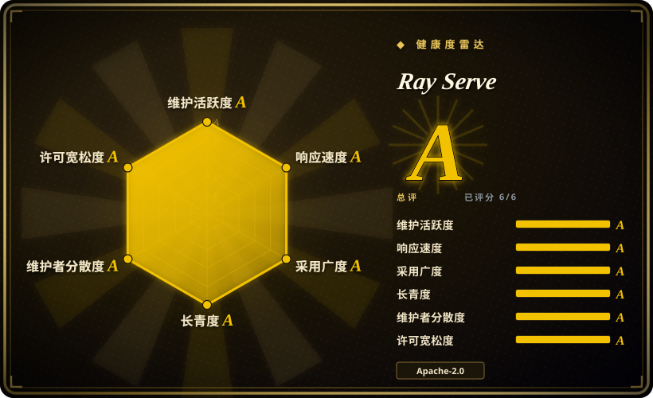

# Ray Serve

基于 Ray 构建的可扩展通用模型服务框架，支持将多种模型（LLM、sklearn、XGBoost 等）组合成分布式部署图，具备自动扩缩容、多模型路由和 Python 原生 API。

## 何时使用

你是一家公司的机器学习平台工程师，公司需要服务多种模型——不只是 LLM，还有 scikit-learn 分类器、XGBoost 排序器以及自定义 Python 推理函数——你需要在单一服务层后面统一编排它们。你的团队已经使用 Ray 做分布式训练，因此 actor 模型和集群抽象对你来说是熟悉的。你用 `@serve.deployment` 装饰器将每个模型封装为微服务，用 `.bind()` 组合成部署图，并让 Ray 根据流量自动从 0 个副本扩到多个副本。你还需要混搭推理后端：有些 LLM 端点跑在 vLLM 上，有些跑在 TGI 或 TensorRT-LLM 上，但你想对所有端点统一做路由、流量拆分和 A/B 测试——Ray Serve 位于引擎之上作为编排层，而不是替代它们。

## 何时不用

- **你只需要以最大吞吐服务单个 LLM。** 对于单模型、吞吐优先的 LLM 服务栈，专用推理引擎如 **vLLM**（PagedAttention）、**TensorRT-LLM**（NVIDIA 优化）或 **TGI** 更简单且性能更高。Ray Serve 增加了你不需要的编排开销。
- **你的团队没有 Ray 经验。** Ray Serve 建立在 Ray 的分布式运行时、actor 模型和集群原语之上。如果团队没有任何 Ray 经验，学习曲线是真实的——在触及服务本身之前，你就要调试 actor 故障、placement group 和资源调度。[推断]
- **你想要轻量、极简的服务层。** Ray 是一个重型分布式系统（完整 Ray 包包含调度、对象存储和集群管理）。对于单机或小规模集群上的简单模型服务，**BentoML** 甚至纯 **FastAPI + Uvicorn** 都更轻量。
- **你期望开箱即用就能获得深度 LLM 优化。** Ray Serve 是通用服务框架；它自身并不实现 PagedAttention、连续批处理或 KV 缓存优化。这些来自你接入的后端引擎（vLLM、TGI 等）。如果你期望 Ray Serve 自动优化 LLM 推理，你会失望。
- **你想要完全托管、零运维的服务平台。** Ray Serve 仍然需要你自己运行和管理 Ray 集群（Kubernetes、AWS、GCP、Azure 或裸金属）。Anyscale 提供托管 Ray 选项，但开源路径是自托管的。如果你想要完全托管、无需集群管理的端点，应考虑云厂商的推理服务。
- **你的技术栈不是 Python 为中心的。** Ray Serve 是 Python 优先；虽然它可以代理到非 Python 服务，但部署定义、路由逻辑和自动扩缩容策略都是 Python 的。如果你的推理栈原生就是 Go、Rust 或 C++，阻抗失配会很严重。

## 横向对比

| 替代品 | 是否收录 | 我们的评价 | 取舍 |
|---|---|---|---|
| [vLLM](vllm.zh.md) | ✅ | 需要多模型编排和自动扩缩容时选 Ray Serve；需要专用高吞吐 LLM 推理引擎时选 vLLM。 | 事实上的开源 LLM 服务引擎（PagedAttention、连续批处理），社区庞大；NVIDIA 优先，不是编排框架。 |
| Text Generation Inference (TGI) | 未收录 | 需要通用模型服务编排时选 Ray Serve；需要 Hugging Face 生产级 LLM 服务器及其紧密生态集成时选 TGI。 | Hugging Face 的生产服务器，HF 生态集成紧密；许可证历史有波动（Apache→HFOIL→Apache），不是通用服务框架。 |
| [TensorRT-LLM](tensorrt-llm.zh.md) | ✅ | 需要跨多种模型类型做编排时选 Ray Serve；需要 NVIDIA 自有引擎在 NVIDIA 硬件上榨取最大吞吐时选 TensorRT-LLM。 | NVIDIA 自有引擎，NVIDIA 硬件上吞吐顶级；深度绑定 NVIDIA，构建流程更重，不是编排层。 |
| [Modular Platform (MAX + Mojo)](modular.zh.md) | ✅ | 需要通用 Python 模型服务框架及多模型组合时选 Ray Serve；需要厂商构建的跨厂商编译器+语言平台及其自有内核语言时选 MAX。 | 厂商构建的跨厂商 GPU/CPU 服务引擎 + Mojo 内核语言；单厂商绑定，不是通用模型服务编排框架。 |
| [oMLX](omlx.zh.md) | ✅ | 数据中心多模型服务选 Ray Serve；需要 Mac（Apple Silicon）本地推理服务器带 SSD 分层 KV 缓存时选 oMLX。 | 仅限 Mac（Apple Silicon）的本地服务器，带 Swift 菜单栏应用；不是数据中心多模型编排框架。 |
| SGLang | 未收录 | 需要通用模型服务编排时选 Ray Serve；需要 RadixAttention 前缀缓存和结构化生成优化时选 SGLang。 | 高吞吐服务引擎，带 RadixAttention 前缀缓存；较新、生态较小，不是编排框架。 |
| BentoML / OpenLLM | 未收录 | 需要 Ray 原生分布式扩缩容和部署图时选 Ray Serve；需要更轻量的容器原生模型服务框架时选 BentoML。 | 更轻量的容器原生模型服务框架；生态比 Ray 小，在超大规模下的验证较少。 |
| KServe | 未收录 | 需要 Python 优先、代码驱动的服务框架时选 Ray Serve；需要 Kubernetes 原生模型服务及标准 CRD、紧密 Kubeflow 集成时选 KServe。 | Kubernetes 原生模型服务，带标准 CRD 和紧密 Kubeflow 集成；更偏重 YAML/配置，不如 Ray Serve 原生 Python。 |
| FastAPI + Uvicorn | 未收录 | 需要分布式自动扩缩容、多模型组合和生产级服务时选 Ray Serve；需要极简轻量 API 框架做简单服务时选 FastAPI。 | 极简轻量 API 框架；不是模型服务专用，没有内置自动扩缩容或分布式执行。 |

## 技术栈

- **Python** — 主要语言：部署定义（`@serve.deployment`）、路由逻辑、请求处理和组合图都是 Python 原生。
- **Ray** — 底层分布式计算框架：actor、对象存储、placement group 和集群调度为自动扩缩容和分布式执行提供基础。
- **部署图 API** — 用 `.bind()` 和 `.deploy()` 组合多个部署，构建多模型推理流水线。
- **后端集成** — 可以在 Ray Serve 部署中封装并路由到 vLLM、TGI、TensorRT-LLM 等推理引擎作为后端。
- **HTTP / gRPC** — 暴露 REST 和 gRPC 端点接收客户端流量；当后端是 OpenAI 兼容引擎时支持 OpenAI 兼容 API 模式。
- **Kubernetes  operator** — Ray 提供 KubeRay operator，用于在 Kubernetes 上部署和管理 Ray 集群。

## 依赖

- **Ray 集群** — 必须运行 Ray 集群（开发用单节点，生产用多节点）。集群需要 head 节点和带足够资源的 worker 节点。
- **硬件** — 取决于服务的模型。LLM 后端需要 NVIDIA GPU；sklearn/XGBoost 模型可以跑在 CPU 上。Ray 本身跑在 CPU 上。
- **运行环境** — Python 3.9+；通过 `pip install "ray[serve]"` 安装。完整 Ray 包体积较大（包含分布式运行时）。
- **集群基础设施** — 生产环境可用：Kubernetes（通过 KubeRay）、AWS、GCP、Azure 或裸金属。集群由你自己提供和管理。
- **模型** — 自带模型；Ray Serve 是服务层，不是模型提供商。

## 运维难度

**高。** Ray Serve 功能强大，但运维上很 demanding：

1. **Ray 集群管理** — 你在运行一个分布式系统。head 节点是元数据的单点；worker 节点会加入和离开；网络分区和资源碎片是你必须理解和处理的真实故障模式。
2. **资源调度复杂性** — Ray 中的 placement group、资源包和 GPU 调度功能强大但很 tricky。把自动扩缩容策略（最小副本数、最大副本数、目标延迟）调对需要反复调优和生产迭代。[推断]
3. **可观测性负担** — 你既要监控 Ray 内部指标（GCS、raylet、对象存储），也要监控应用层服务指标。Prometheus/Grafana 集成存在，但需要自己搭建。[推断]
4. **版本耦合** — Ray Serve 版本与 Ray 核心版本紧密耦合。为了修复 bug 或获得新功能而升级 Ray 意味着升级整个集群，这可能带来中断。
5. **学习曲线** — 调试分布式服务系统需要理解 Ray 的 actor 生命周期、故障处理和序列化。这不是“部署一个 Docker 容器就完事”的事。

## 健康度与可持续性

- **维护（2026-07）。** Ray 极其活跃——截至 2026 年中为 v2.42.x，发布频繁，提交量很大。Ray Serve 是 Ray 项目的一等组件，不是附属模块。未归档。[推断]
- **治理 / 巴士因子。** Ray 项目由 **Ray Project** 社区治理，并得到 **Anyscale**（Ray 创始人创立的公司）强力支持。这是**单一厂商支持的开源**模式：社区开放，但核心维护者和路线图与 Anyscale 紧密绑定。巴士因子比纯个人项目高，但路线图不是基金会独立的（没有 Apache/CNCF/LF 保护伞）。[推断]
- **年龄与 Lindy（2026-07）。** Ray 首次发布于 2018 年（约 8 年历史），持续活跃；Ray Serve 自 ~2020 年起就是核心组件。这带来了**强 Lindy 信号**：项目经历了多个机器学习基础设施周期，已在多家公司的生产环境得到验证，并且仍在积极演进。年龄 × 仍在活跃 = 比年轻替代方案更安全的长期赌注。[推断]
- **采用度。** Ray 项目（包含 Ray Serve、Ray Train、Ray RLlib 等）约 38k star；被多家公司广泛用于生产和训练。生态庞大，有文档、会议和商业支持。[未验证]
- **风险标志。** Apache-2.0，至今无重新许可历史。主要风险是**Anyscale 集中化**：如果 Anyscale 改变商业策略、减少开源投入或被收购，Ray 项目的维护节奏可能发生变化。还有**快速演进生态风险**：Ray 的覆盖范围很广（训练、服务、RL、数据），意味着表面积大，某些子项目演进速度比其他快。[推断]

## 存疑（未验证）

- [未验证] ~38k star 是整个 Ray 项目（ray-project/ray）的数字，不是 Ray Serve 单独的数字；Ray Serve 是更大仓库中的一个组件。
- [未验证] Kubernetes operator 细节（KubeRay）来自项目文档；operator 的具体功能和成熟度未在此独立验证。
- [推断] 完整 Ray 包体积较大（包含分布式运行时）是从 pip 安装描述和社区报告推断的，不是从实测包大小得出的。
- [未验证] 精确的自动扩缩容行为以及从 0 副本冷启动的延迟在文档中有描述，但未经独立基准测试。
- [推断] 资源调度复杂性以及 placement group 的“tricky”行为是从社区讨论和 Ray 文档推断的，不是基于实际生产评估。
- [推断] “强 Lindy 信号”评估结合了 Ray ~2018 年的起源和观察到的持续活跃；这是启发式判断，不是可测量的预测。
- [推断] Anyscale 商业策略风险以及“单一厂商支持”治理模型是从 Anyscale 创立和商业模式的公开信息推断的，不是基于正式治理文件。
