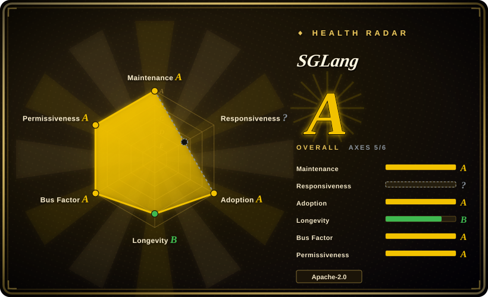

# SGLang

A fast LLM serving engine built around **RadixAttention** — efficient KV cache reuse for multi-turn conversations and structured generation — with strong performance on tool-using agents and structured-output workloads.

## When to use

You're a backend engineer building an AI agent platform that needs to serve LLMs behind an OpenAI-compatible API, and your agents are heavy users of tool calls, JSON-mode structured output, and regex-constrained generation. You keep hitting performance bottlenecks where each tool call round-trip wastes GPU cycles recomputing the same KV cache prefixes, and your structured generation pipeline is slow because the inference engine doesn't natively optimize for constrained decoding. You deploy SGLang, which implements **RadixAttention** — a prefix-aware KV cache management system that reuses attention state across multi-turn conversations and tool-call sequences, cutting redundant prefill computation. Its built-in structured generation engine (JSON-mode, regex constraints, tool-call schemas) is optimized at the kernel level, so agent workloads that mix chat, tool calls, and structured output often run faster than on general-purpose serving engines. The OpenAI-compatible API means your existing clients drop in without changes, and the Python-first surface keeps custom logits processors and sampling hooks accessible.

## When NOT to use

- **You need the widest model coverage and largest community ecosystem.** vLLM has broader model support, more integrations, and a larger contributor base; SGLang's ecosystem is smaller and newer. [推断]
- **You want a simple, single-binary local inference tool.** SGLang is a datacenter serving engine with CUDA kernels and a multi-process architecture; for a laptop or single Mac, Ollama or llama.cpp are far lighter.
- **You need production-grade stability from a long-proven codebase.** SGLang was founded ~2024 and is still in v0.4.x; vLLM has ~2.5 years of production hardening and a larger battle-tested footprint. [推断]
- **You want minimal operational complexity for basic serving.** SGLang's advanced features (RadixAttention, structured generation kernels) add configuration surface; for a straightforward "serve one model on one GPU" use case, vLLM or TGI may be simpler to deploy and tune. [推断]
- **You need non-NVIDIA hardware as a first-class citizen.** SGLang is NVIDIA-centric (CUDA kernels, Triton); AMD and Intel GPU support is newer and less mature. [未验证]
- **You need general request orchestration / multi-model routing.** SGLang is the inference engine, not the orchestration layer; for multi-model A/B testing, canary deployments, or autoscaling, you still need Kubernetes, Ray Serve, or a proxy in front.

## Comparison

| Alternative | In index | Our verdict | Tradeoff |
|---|---|---|---|
| vLLM | 未收录 | Use SGLang when you need RadixAttention prefix caching and structured generation optimizations; choose vLLM for broader model coverage, larger ecosystem, and proven general-purpose serving. | The de-facto open-source LLM serving engine (PagedAttention, continuous batching), huge community and model coverage; NVIDIA-first, fast-moving codebase. |
| Text Generation Inference (TGI) | 未收录 | Use SGLang when you need structured generation and multi-turn KV cache reuse; choose TGI for Hugging Face's production server with tight HF ecosystem integration. | Hugging Face's production server, tight HF ecosystem integration; license history has wobbled (Apache→HFOIL→Apache), smaller community than vLLM. |
| TensorRT-LLM | 未收录 | Use SGLang when you want open-source Python flexibility with structured generation; choose TensorRT-LLM for maximum throughput on NVIDIA hardware with compiled static graphs. | NVIDIA's own engine, top-tier latency on NVIDIA hardware; deeply NVIDIA-locked, complex build/engine-compile workflow, less dynamic model switching. |
| [Modular Platform (MAX + Mojo)](modular.md) | ✅ | Use SGLang for a Python-native open-source serving engine with structured generation; choose MAX when you want a vendor-built cross-vendor compiler+language platform with Mojo kernel language. | Vendor-built cross-vendor GPU/CPU serving engine + Mojo kernel language; single-vendor lock-in, younger community, smaller model coverage than vLLM. |
| [oMLX](omlx.md) | ✅ | Use SGLang for datacenter NVIDIA GPU serving with structured generation; choose oMLX for Apple-Silicon Mac local inference with SSD-tiered KV caching. | Mac-only local server on Apple Silicon with a Swift menu-bar app; not a datacenter multi-GPU engine. |
| Ray Serve | 未收录 | Use SGLang when you need a dedicated LLM inference engine with structured generation; choose Ray Serve for general Python model-serving orchestration and scaling. | General Python model-serving/orchestration framework for scaling and composing services; not a hand-tuned single-model inference engine. |
| Ollama / llama.cpp | 未收录 | Use SGLang for datacenter throughput serving with structured generation; choose Ollama/llama.cpp for lightweight local/edge inference on CPU or consumer GPUs. | Portable C/C++ inference engine (GGUF) running everywhere including Macs and phones; not a datacenter multi-GPU throughput engine. |

## Tech stack

- **Python** — the primary language: model loading, scheduler, API server, structured generation runtime, and user-facing customization surface.
- **CUDA C++ / Triton** — custom GPU kernels for attention and KV cache management; RadixAttention's prefix-aware block reuse is implemented in optimized CUDA.
- **PyTorch** — the underlying tensor framework; models are loaded via PyTorch and run through custom SGLang attention kernels.
- **OpenAI-compatible API** — a FastAPI-based server exposing `/v1/completions`, `/v1/chat/completions`, and `/v1/embeddings` for drop-in compatibility with OpenAI clients.
- **Structured generation engine** — native kernel-level support for JSON-mode, regex constraints, and tool-call schema enforcement. [未验证]
- **Distributed primitives** — tensor parallelism and pipeline parallelism for multi-GPU and multi-node deployments.

## Dependencies

- **Hardware** — NVIDIA GPUs are the primary target (CUDA 11.8+ / 12.1+); AMD support exists but is newer. Server-class GPUs (A100, H100, A10, L4, etc.) are the typical deployment target. CPU-only inference is not the performance story.
- **GPU drivers & runtime** — NVIDIA GPU drivers, CUDA toolkit, and cuDNN on the host; the Python package bundles most CUDA kernels but the host must provide the driver/runtime stack.
- **Runtime environment** — Python 3.9+; installed via `pip` or prebuilt Docker containers. The package is heavy (~GBs of CUDA wheels and PyTorch). [推断]
- **Models** — you bring Hugging Face-compatible models (safetensors or PyTorch checkpoints); SGLang supports thousands of models via automatic Hugging Face `transformers` config detection. [推断]
- **External services (optional)** — for production serving you typically place a load balancer or reverse proxy (nginx, Envoy, Kubernetes ingress) in front; SGLang itself is a single-process server and does not handle TLS, auth, or multi-node routing natively. [推断]

## Ops difficulty

**High.** The "happy path" of `docker run` and pointing at a model is accessible, but production operation is demanding:

1. **GPU fleet management** — driver versions, CUDA compatibility, memory tuning, and multi-GPU topology (NVLink, PCIe) are your responsibility. A single SGLang instance typically owns one or more GPUs exclusively; you manage instance density, not the engine.
2. **Model lifecycle & disk** — model weights are large (tens to hundreds of GB); cold-start download times, disk cache management, and version upgrades across a fleet are significant operational work.
3. **Throughput vs. latency tuning** — SGLang exposes many knobs (batch size, scheduling policy, RadixAttention cache settings) that interact in non-obvious ways. Getting the best throughput for your specific workload distribution requires benchmarking and iteration; defaults are conservative and often leave GPU headroom on the table. [推断]
4. **Version velocity** — with very active development and frequent releases, staying current means regular upgrades, and the API surface shifts. If you need a "set it and forget it" inference runtime with a 12-month stable surface, SGLang's velocity is a liability. [推断]
5. **No built-in HA or multi-node routing** — you run SGLang as a stateful process per GPU/node. High availability, autoscaling, request routing, and model A/B testing are handled by external infrastructure (Kubernetes, a proxy, or a serving framework like Ray Serve), not by SGLang itself.

## Health & viability

- **Maintenance (2026-07).** Very active — frequent releases (v0.4.x as of mid-2026), and a steady stream of merged PRs. The project is clearly in aggressive growth mode, not coasting. Not archived. [推断]
- **Governance / bus factor (2026-07).** Originated from Berkeley/Stanford research groups (the SGLang project and its predecessors). Active community with growing contributor base. Not a single-vendor or foundation project — community-led open source with academic roots. [推断]
- **Backing & longevity (2026-07).** Berkeley/Stanford academic pedigree with strong ties to the LLM systems research community. Growing commercial adoption among AI startups and inference platforms. Founded ~2024, so a **weak-to-moderate Lindy prior** — too young to be considered long-proven, but the academic backing and rapid activity give it momentum. Use age × still-active: active is good, but ~2 years is not a deep track record. [推断]
- **Adoption (2026-07).** ~25k stars and growing fast. Smaller ecosystem than vLLM but expanding rapidly. The structured generation and RadixAttention features have attracted significant attention from the agent-building community. [未验证]
- **Risk flags.** Apache-2.0 with no relicense history to date (2026-07). No CLA requirement. The main risk is **youth fragility** — the project is young, APIs and internal architecture may shift, and the ecosystem is still building out. There is also a **single-language (Python/CUDA) concentration risk** similar to vLLM: deeply tied to the PyTorch/CUDA ecosystem. [推断]

## Caveats (unverified)

- [未验证] ~25k stars and exact production-adoption claims are from public GitHub API and project communications as of 2026-07-01; the star count itself is API-verifiable but its adoption meaning is indicative, not proof of production quality.
- [未验证] Performance claims on structured generation workloads and RadixAttention prefix caching are from the project's README and published benchmarks; not independently verified here.
- [未验证] AMD and Intel GPU support status ("newer, less mature") is inferred from public README/docs and issue-discussion patterns, not from hands-on benchmarks on those platforms.
- [推断] "Often faster than vLLM on tool-using agents" is inferred from published benchmarks and community reports, not from an independent head-to-head benchmark on identical hardware.
- [推断] The "younger than vLLM" assessment and ecosystem size comparison are inferred from GitHub activity and community observation, not from a formal competitive analysis.
- [推断] Governance and bus-factor assessment is inferred from contributor patterns and project origin stories, not from a stated governance document.
- [推断] CPU-only inference support exists but is described as "not the performance story" based on README emphasis and community reports, not from a controlled CPU-vs-GPU benchmark.
