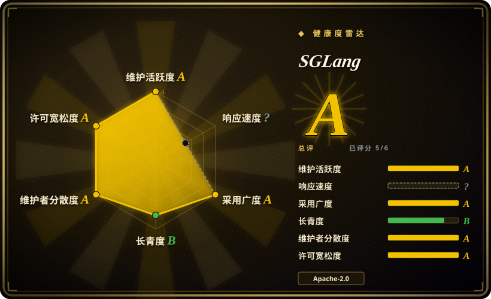

# SGLang

一个围绕 **RadixAttention** 构建的快速 LLM 服务引擎——在多轮对话和结构化生成中实现高效的 KV 缓存复用，在工具调用型 agent 和结构化输出工作负载上表现强劲。

## 何时使用

你是一名后端工程师，正在构建一个需要以 OpenAI 兼容 API 对外服务 LLM 的 AI agent 平台，而你的 agent 大量使用工具调用（tool call）、JSON 模式结构化输出和正则约束生成。你反复撞上性能瓶颈：每次工具调用往返都会浪费 GPU 周期重算相同的 KV 缓存前缀，而你的结构化生成管线因为推理引擎没有原生优化约束解码而跑得很慢。你部署 SGLang，它实现了 **RadixAttention**——一种前缀感知的 KV 缓存管理系统，能在多轮对话和工具调用序列中复用注意力状态，砍掉冗余的 prefill 计算。其内置的结构化生成引擎（JSON 模式、正则约束、工具调用 schema）在 kernel 级别做了优化，因此混合了聊天、工具调用和结构化输出的 agent 工作负载通常比在通用服务引擎上跑得更快。OpenAI 兼容 API 意味着你的现有客户端无需改动即可接入，而 Python 优先的接口也让自定义 logits 处理器和采样钩子保持易用。

## 何时不用

- **你需要最广泛的模型覆盖和最大的社区生态。** vLLM 有更广泛的模型支持、更多集成和更大的贡献者群体；SGLang 的生态更小、更年轻。[推断]
- **你想要一个简单、单二进制的本地推理工具。** SGLang 是一个面向数据中心的 CUDA kernel 服务引擎，带多进程架构；对于单台 Mac 或笔记本，Ollama 或 llama.cpp 要轻量得多。
- **你需要久经检验的生产级稳定性。** SGLang 约 2024 年创立，目前仍在 v0.4.x；vLLM 有约 2.5 年的生产级锤炼和更大的实战检验足迹。[推断]
- **你想要基础服务的最小运维复杂度。** SGLang 的高级功能（RadixAttention、结构化生成 kernel）增加了配置面；对于「在一台 GPU 上服务一个模型」这种简单场景，vLLM 或 TGI 可能更容易部署和调优。[推断]
- **你需要非 NVIDIA 硬件作为一等公民。** SGLang 围绕 NVIDIA 构建（CUDA kernel、Triton）；AMD 和 Intel GPU 支持较新、较不成熟。[未验证]
- **你需要通用的请求编排 / 多模型路由。** SGLang 是推理引擎，不是编排层；对于多模型 A/B 测试、金丝雀发布或自动扩缩容，你仍然需要在前面叠加 Kubernetes、Ray Serve 或代理层。

## 横向对比

| 替代品 | 是否收录 | 我们的评价 | 取舍 |
|---|---|---|---|
| [vLLM](vllm.zh.md) | ✅ | 需要更广模型覆盖、更大生态和经过验证的通用服务时，选 vLLM。 | 事实上的开源 LLM 服务引擎（PagedAttention、continuous batching），社区和模型覆盖极大；NVIDIA 优先，代码库快速迭代。 |
| Text Generation Inference（TGI） | 未收录 | 当你需要结构化生成和多轮 KV 缓存复用时选 SGLang；当你需要 Hugging Face 的生产服务器及其紧密的 HF 生态集成时选 TGI。 | Hugging Face 的生产服务器，紧密的 HF 生态集成；许可证历史曾波动（Apache→HFOIL→Apache），社区规模小于 vLLM。 |
| [TensorRT-LLM](tensorrt-llm.zh.md) | ✅ | 需要在 NVIDIA 硬件上榨取最大吞吐时，选 TensorRT-LLM。 | NVIDIA 自有引擎，在 NVIDIA 硬件上顶级延迟；深度绑定 NVIDIA，构建/引擎编译流程更重，动态模型切换能力较弱。 |
| [Modular Platform（MAX + Mojo）](modular.zh.md) | ✅ | 当你需要带结构化生成的 Python 原生开源服务引擎时选 SGLang；当你需要厂商自建的跨厂商编译器+语言平台及 Mojo kernel 语言时选 MAX。 | 厂商自建的跨厂商 GPU/CPU 服务引擎 + Mojo kernel 语言；单厂商绑定，社区更年轻，模型覆盖不如 vLLM。 |
| [oMLX](omlx.zh.md) | ✅ | 数据中心 NVIDIA GPU 服务带结构化生成选 SGLang；Mac（Apple Silicon）本地推理服务带 SSD 分层 KV 缓存时选 oMLX。 | 仅限 Mac 的 Apple Silicon 本地服务器，带 Swift 菜单栏应用；不是数据中心多 GPU 引擎。 |
| [Ray Serve](ray-serve.zh.md) | ✅ | 需要跨多种模型类型的通用 Python 模型服务编排与扩缩容时，选 Ray Serve。 | 通用 Python 模型服务/编排框架，用于扩展和组合服务；不是手工调优的单模型推理引擎。 |
| Ollama / llama.cpp | 未收录 | 数据中心吞吐服务带结构化生成选 SGLang；轻量级本地/边缘 CPU 或消费级 GPU 推理选 Ollama/llama.cpp。 | 可移植的 C/C++ 推理引擎（GGUF），可在 Mac 和手机等任何地方运行；不是数据中心多 GPU 吞吐引擎。 |

## 技术栈

- **Python** — 主要语言：模型加载、调度器、API 服务器、结构化生成运行时以及面向用户的定制层。
- **CUDA C++ / Triton** — 用于注意力和 KV 缓存管理的自定义 GPU 内核；RadixAttention 的前缀感知块复用以优化 CUDA 实现。
- **PyTorch** — 底层张量框架；模型通过 PyTorch 加载，并经由自定义 SGLang 注意力内核执行。
- **OpenAI 兼容 API** — 基于 FastAPI 的服务器，暴露 `/v1/completions`、`/v1/chat/completions` 和 `/v1/embeddings`，实现与 OpenAI 客户端的即插即用兼容。
- **结构化生成引擎** — 原生 kernel 级支持 JSON 模式、正则约束和工具调用 schema 强制。[未验证]
- **分布式原语** — 张量并行和流水线并行，支持多 GPU 和多节点部署。

## 依赖

- **硬件** — NVIDIA GPU 是主要目标（CUDA 11.8+ / 12.1+）；AMD 支持存在但较新。服务器级 GPU（A100、H100、A10、L4 等）是典型部署目标。纯 CPU 推理不是性能重点。
- **GPU 驱动与运行时** — 主机上需要 NVIDIA GPU 驱动、CUDA toolkit 和 cuDNN；Python 包捆绑了大部分 CUDA 内核，但主机必须提供驱动/运行时栈。
- **运行时环境** — Python 3.9+；通过 `pip` 或预构建 Docker 容器安装。该包体积庞大（约数 GB 的 CUDA wheel 和 PyTorch）。[推断]
- **模型** — 你自带 Hugging Face 兼容模型（safetensors 或 PyTorch checkpoint）；SGLang 通过自动 Hugging Face `transformers` 配置检测支持数千种模型。[推断]
- **外部服务（可选）** — 对于生产服务，通常需要在前面放置负载均衡器或反向代理（nginx、Envoy、Kubernetes ingress）；SGLang 本身是单进程服务器，不原生处理 TLS、认证或多节点路由。[推断]

## 运维难度

**高。** `docker run` 并指向模型的「快乐路径」看似 accessible，但生产运维实则要求很高：

1. **GPU 集群管理** — 驱动版本、CUDA 兼容性、显存调优和多 GPU 拓扑（NVLink、PCIe）都是你的责任。单个 SGLang 实例通常独占一个或多个 GPU；你管理实例密度，而非引擎本身。
2. **模型生命周期与磁盘** — 模型权重体积巨大（数十到数百 GB）；冷启动下载时间、磁盘缓存管理和跨集群的版本升级都是显著的运维工作。
3. **吞吐与延迟调优** — SGLang 暴露大量相互作用的参数（batch size、调度策略、RadixAttention 缓存设置），以非直观的方式交互。为你的特定工作负载分布获取最佳吞吐需要基准测试和迭代；默认值偏保守，通常会在 GPU 上留下余量。[推断]
4. **版本迭代速度** — 非常活跃的开发和频繁发布意味着保持最新需要定期升级，且 API 表面会变动。如果你需要一个「部署后不管」、12 个月稳定表面的推理运行时，SGLang 的速度是负担。[推断]
5. **无内置高可用或多节点路由** — 你以每个 GPU/节点一个状态化进程的方式运行 SGLang。高可用、自动扩缩容、请求路由和模型 A/B 测试由外部基础设施（Kubernetes、代理或 Ray Serve 等服务框架）处理，而非 SGLang 本身。

## 健康度与可持续性

- **维护（2026-07）。** 非常活跃——截至 2026 年中为 v0.4.x，频繁发布，大量已合并 PR。项目明显处于激进增长模式，而非维持状态。未归档。[推断]
- **治理 / 总线因子（2026-07）。** 起源于 Berkeley/Stanford 研究组（SGLang 项目及其前身）。社区活跃，贡献者群体在增长。不是单一厂商或基金会项目——社区主导的开源，带有学术根脉。[推断]
- **背书与 longevity（2026-07）。** Berkeley/Stanford 学术血统，与 LLM 系统研究社区有强联系。在 AI 初创公司和推理平台中 growing commercial adoption。约 2024 年创立，因此 **Lindy 先验偏弱到中等**——太年轻，谈不上久经验证，但学术背书和快速迭代赋予其 momentum。用年龄 × 仍活跃来看：活跃是好事，但约 2 年历史不算深厚 track record。[推断]
- **采用（2026-07）。** 约 25k star 且增速很快。生态比 vLLM 小但快速扩张。结构化生成和 RadixAttention 功能吸引了 agent 构建社区的显著关注。[未验证]
- **风险标志。** 截至 2026-07，Apache-2.0，无重新许可证历史。无需 CLA。主要风险是**年轻脆弱性**——项目年轻，API 和内部架构可能变动，生态仍在建设中。还存在与 vLLM 类似的**单语言（Python/CUDA）集中风险**：深度绑定 PyTorch/CUDA 生态。[推断]

## 存疑（未验证）

- [未验证] 约 25k star 和确切的生产采用声明来自 2026-07-01 的公开 GitHub API 和项目宣传材料；star 数本身可通过 API 验证，但其采用含义仅供参考，不能作为生产质量证明。
- [未验证] 结构化生成工作负载和 RadixAttention 前缀缓存的性能宣称来自项目 README 和公开 benchmark；本页未独立验证。
- [未验证] AMD 和 Intel GPU 支持状态（「较新、较不成熟」）是从公开 README/文档和问题讨论模式推断的，未在相关平台上进行实际基准测试。
- [推断]「在工具调用型 agent 上通常比 vLLM 更快」是从公开 benchmark 和社区报告推断的，未在相同硬件上进行独立 head-to-head 基准测试。
- [推断]「比 vLLM 更年轻」和生态规模对比是从 GitHub 活动和社区观察推断的，非来自正式竞品分析。
- [推断] 治理与总线因子判断是从贡献者模式和项目起源故事推断的，非来自某份治理文档的明文。
- [推断] 纯 CPU 推理支持存在，但基于 README 重点和社区报告被描述为「不是性能重点」，而非来自受控的 CPU-vs-GPU 基准测试。
