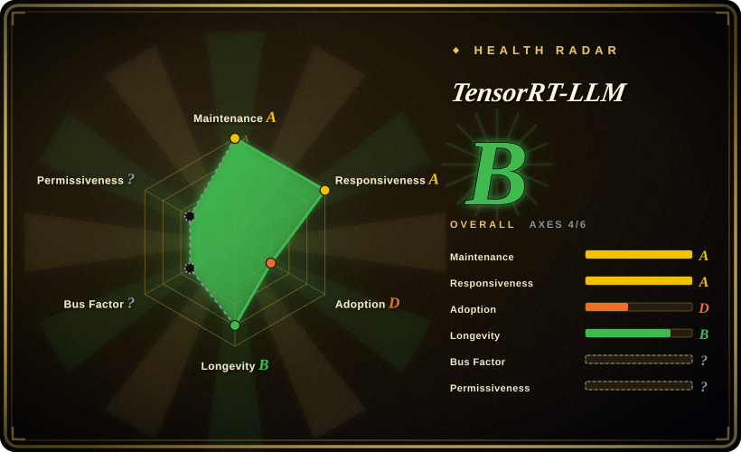

# TensorRT-LLM

NVIDIA's optimized LLM inference engine, built on **TensorRT** — delivering maximum throughput on NVIDIA GPUs through custom CUDA kernels, FP8/INT8 quantization, and aggressive kernel fusion. The Python orchestration layer is open-source (Apache-2.0), but the performance-critical CUDA kernels are closed-source binary blobs.

## When to use

You're an ML infrastructure engineer serving a high-traffic LLM API on a fleet of NVIDIA A100s or H100s, and you've already optimized everything you can with Python-based serving stacks — but your profiling shows you're still leaving GPU FLOPs on the table. You need every last token per second, and you're willing to trade flexibility for raw throughput. You reach for TensorRT-LLM: you compile your model (Llama, Mistral, GPT, Falcon, or one of dozens of supported architectures) into a **TensorRT engine** — a static, fused, GPU-architecture-specific binary that runs NVIDIA's hand-tuned kernels with FP8 or INT8 quantization. The result is a serving endpoint that typically outperforms dynamic Python-based engines on identical NVIDIA hardware, especially at batch sizes where kernel fusion and quantization matter.

## When NOT to use

- **You don't have NVIDIA GPUs.** TensorRT-LLM is **NVIDIA-only** — it requires NVIDIA GPUs, the CUDA toolkit, and the TensorRT SDK. It cannot run on AMD, Intel, or Apple Silicon hardware. For cross-vendor or non-NVIDIA deployments, use **vLLM**, **TGI**, or **Modular MAX**.
- **You need to dynamically swap models or serve many different architectures.** Each model is compiled into a **TensorRT engine**, and the engine is **GPU-architecture-specific** — an engine built for A100 won't run on H100. Recompiling for a new model or GPU architecture takes time and expertise. If you need a dynamic, "load any Hugging Face model" serving experience, **vLLM** or **TGI** are far more flexible.
- **You can't stomach the build complexity.** TensorRT-LLM has a notoriously complex build process: specific CUDA, cuDNN, and TensorRT versions must align, and building from source is painful. Prebuilt containers exist but they are version-locked and large. If your ops team can't manage NVIDIA's dependency stack, this will be a recurring source of friction.
- **You want a fully open-source stack.** The Python orchestration is open-source (Apache-2.0), but the **performance-critical CUDA kernels are closed-source binary blobs** — you cannot inspect, modify, or debug the kernels that make it fast. For a fully open-source inference stack, **vLLM** or **SGLang** are better choices.
- **You need general model-serving orchestration.** TensorRT-LLM is an inference engine, not a request router or autoscaling framework. For multi-model A/B testing, canary deployments, or fleet-wide orchestration, you still need a layer like Kubernetes or **Ray Serve** in front of it.
- **You're running on a single GPU or small scale.** The compilation and tuning overhead is only worth it when the throughput gains amortize across a large GPU fleet. For a single GPU or low-volume serving, **vLLM** or even **Ollama** are simpler and nearly as fast at small batch sizes.

## Comparison

| Alternative | In index | Our verdict | Tradeoff |
|---|---|---|---|
| [vLLM](vllm.md) | ✅ | Use TensorRT-LLM when you need maximum throughput on NVIDIA hardware; choose vLLM when you want open-source flexibility, huge community, and dynamic model loading. | The de-facto open-source LLM serving engine (PagedAttention, continuous batching), huge community and model coverage; NVIDIA-first, less peak-throughput than TensorRT-LLM on identical hardware. |
| Text Generation Inference (TGI) | 未收录 | Use TensorRT-LLM when you need NVIDIA-specific peak throughput; choose TGI when you want Hugging Face's production server with tight HF ecosystem integration. | Hugging Face's production server, tight HF ecosystem integration; license history has wobbled (Apache→HFOIL→Apache), less NVIDIA-specific tuning than TensorRT-LLM. |
| [Modular Platform (MAX + Mojo)](modular.md) | ✅ | Use TensorRT-LLM when you need NVIDIA's own engine and maximum throughput on NVIDIA GPUs; choose MAX when you want a cross-vendor compiler+language platform with its own kernel language. | Vendor-built cross-vendor GPU/CPU serving engine + Mojo kernel language; single-vendor lock-in, younger community, less NVIDIA-specific tuning than TensorRT-LLM. |
| [oMLX](omlx.md) | ✅ | Use TensorRT-LLM for datacenter NVIDIA GPU serving; choose oMLX when you want a Mac (Apple Silicon) local inference server with SSD-tiered KV caching. | Mac-only local server on Apple Silicon with a Swift menu-bar app; not a datacenter multi-GPU engine. |
| [Ray Serve](ray-serve.md) | ✅ | Use TensorRT-LLM when you need a dedicated LLM inference engine; choose Ray Serve when you need general Python model-serving orchestration and scaling across many model types. | General Python model-serving/orchestration framework for scaling and composing services; not a hand-tuned single-model inference engine. |
| [SGLang](sglang.md) | ✅ | Use TensorRT-LLM when you want NVIDIA's compiled-engine peak throughput; choose SGLang when you specifically need RadixAttention prefix caching and structured-generation optimizations. | High-throughput serving engine with RadixAttention prefix caching; newer, smaller ecosystem, less NVIDIA-specific tuning than TensorRT-LLM. |
| Ollama / llama.cpp | 未收录 | Use TensorRT-LLM for datacenter throughput serving; choose Ollama/llama.cpp for lightweight local/edge inference on CPU or consumer GPUs. | Portable C/C++ inference engine (GGUF) running everywhere including Macs and phones; not a datacenter multi-GPU throughput engine. |

## Tech stack

- **Python** — the primary orchestration language: model definition, compilation workflow, engine building, and runtime scheduling.
- **C++** — the runtime execution layer and API bindings; the performance-critical path is C++ calling into NVIDIA's binary kernels.
- **TensorRT** — NVIDIA's deep-learning inference optimizer; TensorRT-LLM is built on top of TensorRT's graph optimization, layer fusion, and kernel auto-tuning.
- **Custom CUDA kernels** — closed-source binary blobs shipped by NVIDIA for attention, MLP, and quantization operations; these are the source of the throughput advantage but are not modifiable.
- **Quantization** — FP8, INT8, and INT4 weight/activation quantization supported through NVIDIA's tools; typically requires calibration or reference weights for accuracy.
- **OpenAI-compatible API** — an optional Python-based server exposing `/v1/completions` and `/v1/chat/completions` for drop-in client compatibility.

## Dependencies

- **Hardware — NVIDIA GPUs only.** Server-class NVIDIA GPUs (A100, H100, A10, L40S, etc.) are the target. Consumer GPUs (RTX 4090, etc.) are supported but not the primary optimization target.
- **GPU drivers & runtime — NVIDIA stack.** NVIDIA GPU drivers, CUDA toolkit (12.x+), cuDNN, and the TensorRT SDK on the host; versions must align with the TensorRT-LLM release.
- **Runtime environment — Python 3.10+** with PyTorch and NVIDIA's CUDA/TensorRT wheels. Prebuilt Docker containers exist but are version-locked and large (~10s of GB). [推断]
- **Models — Hugging Face-compatible checkpoints.** You bring model weights (safetensors or PyTorch checkpoints); TensorRT-LLM compiles them into an engine. The compilation step is mandatory and GPU-architecture-specific.
- **Build toolchain (painful).** Building from source requires matching CUDA, cuDNN, TensorRT, and CMake versions; many teams use the prebuilt containers to avoid this dependency hell. [推断]

## Ops difficulty

**High.** Even the "happy path" of running a prebuilt container is more complex than a Python `pip install`:

1. **Version alignment hell** — CUDA, cuDNN, TensorRT, and TensorRT-LLM versions must match precisely. A mismatch in any one causes cryptic build or runtime errors. Prebuilt containers help but lock you to NVIDIA's release cadence.
2. **Engine compilation is mandatory and slow** — every model must be compiled into a TensorRT engine, and every GPU architecture needs its own engine. An engine for A100 won't run on H100. This means cold-start times are measured in minutes, not seconds, and model updates require recompilation.
3. **GPU fleet heterogeneity is painful** — if you have mixed A100 and H100 nodes, you need separate engine binaries per architecture, or you compile for the lowest common denominator and lose performance.
4. **Tuning expertise required** — getting the best throughput requires tuning batch size, quantization scheme, precision mode (FP16 vs FP8), and kernel fusion settings. The defaults are conservative; extracting peak performance requires NVIDIA-specific knowledge.
5. **No built-in HA, routing, or autoscaling** — TensorRT-LLM is a single-process inference engine. You run it behind a load balancer or inside a Kubernetes pod, but the engine itself does not handle multi-node routing, request queuing, or model A/B testing.

## Health & viability

- **Maintenance (2026-07).** Active development at v0.18.x with regular releases from NVIDIA; the project is clearly maintained, not coasting. Not archived. [推断]
- **Governance / bus factor.** NVIDIA owns the roadmap and the closed-source kernels. The Python layer is open-source (Apache-2.0), but the performance-critical path is a **single-vendor black box**. This is classic NVIDIA: great docs and support while the project is a priority, but NVIDIA's track record with open-source projects is mixed — some thrive, some are quietly deprioritized. [推断]
- **Age & Lindy (2026-07).** TensorRT-LLM is a relatively young project (first released ~2023) built on the much older TensorRT (which dates to 2016). The TensorRT foundation gives it a **moderate Lindy prior** — the optimization technology is proven, but the LLM-specific layer is newer and its long-term commitment from NVIDIA is unproven relative to core TensorRT. [推断]
- **Adoption.** ~11k stars and growing; widely used in NVIDIA's own benchmarks and documentation, and referenced by cloud providers offering NVIDIA GPU instances. However, the real-world adoption outside NVIDIA-curated environments is narrower than vLLM because of the build complexity and NVIDIA-only lock-in. [未验证]
- **Risk flags — key flag.** The **closed-source kernels** are the core value proposition and the core risk: if NVIDIA changes the kernel ABI, drops support for an older GPU architecture, or shifts licensing terms, downstream users have no recourse. The model compilation step also creates a **hardware lock-in** (engine is GPU-architecture-specific) that compounds the vendor lock-in. [推断]

## Caveats (unverified)

- [未验证] ~11k stars count is from GitHub API as of 2026-07-01; star count is indicative only, not proof of adoption or quality.
- [未验证] Exact performance advantage over vLLM on identical hardware is taken from NVIDIA's own benchmarks and community reports; not independently verified here.
- [未验证] The exact set of supported model architectures, quantization schemes, and their accuracy tradeoffs are from the project's README and documentation; not all combinations were independently tested.
- [推断] Build complexity and "version alignment hell" are inferred from community reports, issue discussions, and NVIDIA's own documentation; the precise dependency matrix varies by release.
- [推断] GPU-architecture-specific engine behavior (A100 engine not running on H100) is inferred from TensorRT's documented behavior and NVIDIA's release notes.
- [推断] NVIDIA's "mixed track record with open-source projects" is a heuristic assessment based on historical observation of NVIDIA projects (e.g., certain toolkit deprecations), not a formal governance study.
