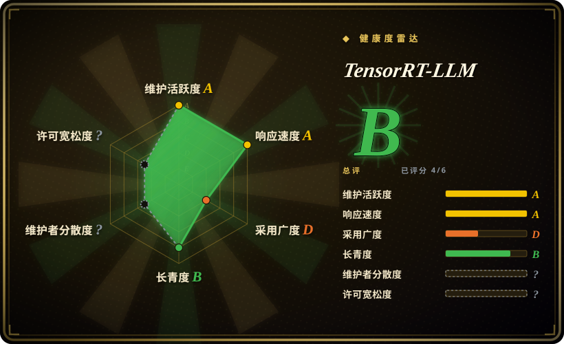

# TensorRT-LLM

NVIDIA 基于 TensorRT 优化的 LLM 推理引擎，通过定制 CUDA 内核、FP8/INT8 量化以及激进内核融合，在 NVIDIA GPU 上提供最大吞吐。Python 编排层是开源的（Apache-2.0），但性能关键的 CUDA 内核是闭源二进制 blob。

## 何时使用

你是一名 ML 基础设施工程师，在 NVIDIA A100 或 H100 集群上提供高流量 LLM API，且已经用基于 Python 的服务栈做了一切优化——但性能分析显示你仍在浪费 GPU FLOPs。你需要榨干每一毫秒的 token 吞吐，并愿意用灵活性换取 raw 性能。你选用 TensorRT-LLM：将模型（Llama、Mistral、GPT、Falcon 或数十种支持架构之一）编译成 **TensorRT engine**——一个静态、融合、GPU 架构特化的二进制文件，运行 NVIDIA 的手调内核，配合 FP8 或 INT8 量化。结果是一个服务端点，在相同 NVIDIA 硬件上通常 outperform 动态基于 Python 的引擎，尤其在批大小足够让内核融合和量化发挥作用的场景。

## 何时不用

- **你没有 NVIDIA GPU。** TensorRT-LLM **仅限 NVIDIA**——需要 NVIDIA GPU、CUDA 工具包和 TensorRT SDK。无法在 AMD、Intel 或 Apple Silicon 上运行。如需跨厂商或非 NVIDIA 部署，请使用 **vLLM**、**TGI** 或 **Modular MAX**。
- **你需要动态切换模型或同时服务多种架构。** 每个模型都要编译成 **TensorRT engine**，且 engine 是 **GPU 架构特化**的——为 A100 编译的 engine 无法在 H100 上运行。为新模型或新 GPU 架构重新编译需要时间和专业知识。如需动态“加载任意 Hugging Face 模型”的服务体验，**vLLM** 或 **TGI** 灵活得多。
- **你的运维团队无法承受构建复杂度。** TensorRT-LLM 的构建过程出了名地复杂：CUDA、cuDNN 和 TensorRT 版本必须精确对齐，从源码构建很痛苦。预构建容器存在，但版本锁定且体积巨大。如果你的运维团队搞不定 NVIDIA 的依赖栈，这会成为反复摩擦的来源。
- **你想要完全开源的栈。** Python 编排层是开源的（Apache-2.0），但 **性能关键的 CUDA 内核是闭源二进制 blob**——你无法查看、修改或调试那些让它变快的内核。如需完全开源的推理栈，**vLLM** 或 **SGLang** 是更好选择。
- **你需要通用模型服务编排。** TensorRT-LLM 是推理引擎，不是请求路由器或自动扩缩容框架。如需多模型 A/B 测试、金丝雀部署或集群级编排，你仍需在其前面加 Kubernetes 或 **Ray Serve** 等层。
- **你只在单卡或小规模上运行。** 编译和调优开销只有在吞吐收益跨大规模 GPU 集群摊销时才值得。对于单卡或低流量服务，**vLLM** 甚至 **Ollama** 更简单，且在小批大小下几乎一样快。

## 横向对比

| 替代品 | 是否收录 | 我们的评价 | 取舍 |
|---|---|---|---|
| [vLLM](vllm.zh.md) | ✅ | 需要 NVIDIA 硬件上最大吞吐时用 TensorRT-LLM；需要开源灵活性、庞大社区和动态模型加载时选 vLLM。 | 事实上的开源 LLM 服务引擎（PagedAttention、连续批处理），庞大社区与模型覆盖；NVIDIA 优先，在相同硬件上峰值吞吐低于 TensorRT-LLM。 |
| Text Generation Inference（TGI） | 未收录 | 需要 NVIDIA 专属峰值吞吐时用 TensorRT-LLM；需要 Hugging Face 生产服务器和紧密 HF 生态集成时选 TGI。 | Hugging Face 的生产服务器，紧密 HF 生态集成；许可证历史有过摇摆（Apache→HFOIL→Apache），NVIDIA 专属调优不如 TensorRT-LLM。 |
| [Modular Platform（MAX + Mojo）](modular.zh.md) | ✅ | 需要 NVIDIA 自家引擎和最大吞吐时用 TensorRT-LLM；需要跨厂商编译器+语言平台及其内核语言时选 MAX。 | 厂商构建的跨厂商 GPU/CPU 服务引擎 + Mojo 内核语言；单厂商绑定，社区更年轻，NVIDIA 专属调优不如 TensorRT-LLM。 |
| [oMLX](omlx.zh.md) | ✅ | 数据中心 NVIDIA GPU 服务用 TensorRT-LLM；需要 Mac（Apple Silicon）本地推理服务带 SSD 分层 KV 缓存时选 oMLX。 | 仅限 Mac 的 Apple Silicon 本地服务器，带 Swift 菜单栏应用；不是数据中心多 GPU 引擎。 |
| [Ray Serve](ray-serve.zh.md) | ✅ | 需要专用 LLM 推理引擎时用 TensorRT-LLM；需要通用 Python 模型服务编排和跨多种模型类型扩缩容时选 Ray Serve。 | 通用 Python 模型服务/编排框架，用于扩缩容和组合服务；不是手调的单模型推理引擎。 |
| [SGLang](sglang.zh.md) | ✅ | 需要 NVIDIA 编译引擎峰值吞吐时用 TensorRT-LLM；需要 RadixAttention 前缀缓存和结构化生成优化时选 SGLang。 | 高吞吐服务引擎，带 RadixAttention 前缀缓存；更新、更小生态，NVIDIA 专属调优不如 TensorRT-LLM。 |
| Ollama / llama.cpp | 未收录 | 数据中心吞吐服务用 TensorRT-LLM；需要轻量本地/边缘 CPU 或消费级 GPU 推理时选 Ollama/llama.cpp。 | 可移植 C/C++ 推理引擎（GGUF），到处运行包括 Mac 和手机；不是数据中心多 GPU 吞吐引擎。 |

## 技术栈

- **Python**——主要编排语言：模型定义、编译工作流、engine 构建和运行时调度。
- **C++**——运行时执行层和 API 绑定；性能关键路径是 C++ 调用 NVIDIA 的二进制内核。
- **TensorRT**——NVIDIA 的深度学习推理优化器；TensorRT-LLM 构建于 TensorRT 的图优化、层融合和内核自动调优之上。
- **定制 CUDA 内核**——NVIDIA 分发的闭源二进制 blob，用于 attention、MLP 和量化操作；这些是吞吐优势的来源，但不可修改。
- **量化**——通过 NVIDIA 工具支持 FP8、INT8 和 INT4 权重/激活量化；通常需要校准或参考权重以保证精度。
- **OpenAI 兼容 API**——可选的基于 Python 的服务器，暴露 `/v1/completions` 和 `/v1/chat/completions`，实现客户端即插即用兼容。

## 依赖

- **硬件——仅限 NVIDIA GPU。** 面向服务器级 NVIDIA GPU（A100、H100、A10、L40S 等）。消费级 GPU（RTX 4090 等）受支持，但不是主要优化目标。
- **GPU 驱动与运行时——NVIDIA 栈。** 主机上的 NVIDIA GPU 驱动、CUDA 工具包（12.x+）、cuDNN 和 TensorRT SDK；版本必须与 TensorRT-LLM 发布版对齐。
- **运行环境——Python 3.10+**，带 PyTorch 和 NVIDIA 的 CUDA/TensorRT wheel。预构建 Docker 容器存在，但版本锁定且体积巨大（数十 GB）。 [推断]
- **模型——Hugging Face 兼容 checkpoint。** 自带模型权重（safetensors 或 PyTorch checkpoint）；TensorRT-LLM 将其编译成 engine。编译步骤是强制的，且 engine 是 GPU 架构特化的。
- **构建工具链（痛苦）。** 从源码构建需要匹配 CUDA、cuDNN、TensorRT 和 CMake 版本；许多团队使用预构建容器来规避这种依赖地狱。 [推断]

## 运维难度

**高。** 即使是运行预构建容器的“快乐路径”，也比 `pip install` 复杂：

1. **版本对齐地狱**——CUDA、cuDNN、TensorRT 和 TensorRT-LLM 版本必须精确匹配。任何一个不匹配都会导致晦涩的构建或运行时错误。预构建容器有帮助，但将你锁定在 NVIDIA 的发布节奏。
2. **Engine 编译是强制且缓慢的**——每个模型都必须编译成 TensorRT engine，且每种 GPU 架构都需要自己的 engine。为 A100 编译的 engine 无法在 H100 上运行。这意味着冷启动时间以分钟而非秒计，模型更新需要重新编译。
3. **GPU 集群异构性很痛苦**——如果你有混合 A100 和 H100 节点，需要每种架构单独的 engine 二进制文件，或者你为最低公分母编译并损失性能。
4. **调优需要专业知识**——获得最佳吞吐需要调整批大小、量化方案、精度模式（FP16 vs FP8）和内核融合设置。默认值偏保守，通常留有余量；榨取峰值性能需要 NVIDIA 专属知识。
5. **无内置高可用、路由或自动扩缩容**——TensorRT-LLM 是单进程推理引擎。你把它跑在负载均衡器后面或 Kubernetes pod 里，但引擎本身不处理多节点路由、请求排队或模型 A/B 测试。

## 健康度与可持续性

- **维护（2026-07）。** 处于 v0.18.x 的活跃开发中，NVIDIA 定期发布；项目显然在维护，非躺平。未归档。 [推断]
- **治理 / 巴士系数。** NVIDIA 掌控路线图和闭源内核。Python 层是开源的（Apache-2.0），但性能关键路径是 **单厂商黑盒**。这是典型的 NVIDIA：项目受重视时文档和支持都很好，但 NVIDIA 对开源项目的记录是 mixed——有些蓬勃发展，有些被悄悄降级。 [推断]
- **年龄与 Lindy（2026-07）。** TensorRT-LLM 是相对年轻的项目（首版约 2023 年发布），构建于更古老的 TensorRT（始于 2016 年）。TensorRT 基础赋予它 **中等 Lindy 先验**——优化技术已被验证，但 LLM 专属层较新，NVIDIA 对其长期承诺相对核心 TensorRT 而言尚未被证实。 [推断]
- **采用度。** ~11k stars 且增长中；在 NVIDIA 自家的基准测试和文档中广泛使用，也被提供 NVIDIA GPU 实例的云服务商引用。但在 NVIDIA 策划环境之外，真实世界的采用比 vLLM 更窄，因为构建复杂度和 NVIDIA 专属绑定。 [未验证]
- **风险标志——关键标志。** **闭源内核** 既是核心价值主张也是核心风险：如果 NVIDIA 更改内核 ABI、弃用旧 GPU 架构支持或调整许可证条款，下游用户没有 recourse。模型编译步骤也制造了 **硬件锁定**（engine 是 GPU 架构特化的），加剧了厂商锁定。 [推断]

## 存疑（未验证）

- [未验证] ~11k stars 计数来自 2026-07-01 的 GitHub API；star 数仅具指示性，不代表采用度或质量。
- [未验证] 在相同硬件上相对 vLLM 的确切性能优势来自 NVIDIA 自家基准测试和社区报告；此处未独立验证。
- [未验证] 支持的模型架构、量化方案及其精度取舍的确切集合来自项目 README 和文档；并非所有组合都经独立测试。
- [推断] 构建复杂度和“版本对齐地狱”是从社区报告、issue 讨论和 NVIDIA 自家文档推断而来；精确依赖矩阵随发布版变化。
- [推断] GPU 架构特化 engine 行为（A100 engine 无法在 H100 运行）是从 TensorRT 的文档行为和 NVIDIA 发布说明推断而来。
- [推断] NVIDIA“对开源项目记录 mixed”是基于历史观察（如某些工具包弃用）的启发式评估，而非正式治理研究。
