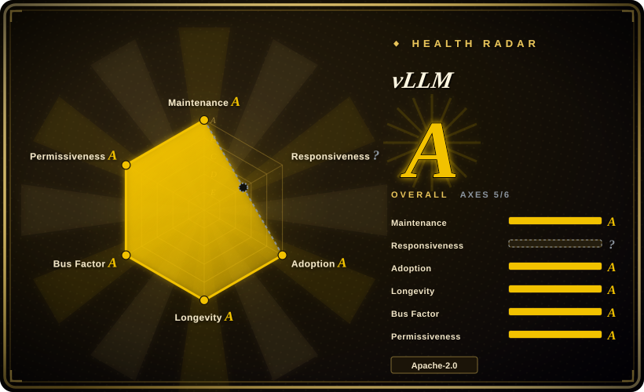

# vLLM

The most popular open-source LLM serving engine, built around **PagedAttention** — a memory-efficient KV cache manager that virtualizes attention state into fixed-size blocks, enabling continuous batching and high GPU utilization for throughput-oriented serving.

## When to use

You're running a production API that needs to serve open-weight LLMs (Llama, Qwen, Mistral, Gemma, …) at high throughput behind an OpenAI-compatible endpoint. Your traffic is bursty and interleaved — users send long prompts and short prompts, some stream tokens and some don't — and you keep hitting GPU memory fragmentation: naive batching leaves holes in the KV cache, so you can't fit as many concurrent requests as the hardware should allow. You deploy vLLM, which virtualizes the KV cache into fixed-size pages (like an OS memory manager) and reclaims blocks when sequences finish, letting you pack requests tightly and sustain far higher throughput than a simple static-batch server. The built-in OpenAI-compatible API (`/v1/chat/completions`) means your existing client code works without changes, and the Python ecosystem makes model customization (custom logits processors, sampling parameters, speculative decoding) accessible without dropping into C++.

You also reach for vLLM when you need tensor-parallel or pipeline-parallel multi-GPU serving, quantization (AWQ, GPTQ, FP8) to squeeze larger models onto fewer GPUs, or prefix caching to avoid re-computing shared system prompts across many requests. The community is enormous, so when a new model drops on Hugging Face, a vLLM integration usually lands within days.

## When NOT to use

- **You need to run on non-NVIDIA hardware as a first-class citizen.** vLLM is deeply NVIDIA-centric (custom CUDA kernels, CUTLASS, Triton). AMD and Intel GPU support exists but is newer, less mature, and lacks the same performance tuning depth. For AMD-first or Intel-first deployments, the maturity gap is real. [未验证]
- **You want a simple, single-binary local inference tool.** vLLM is a large, complex Python codebase with heavy PyTorch/CUDA dependencies and a long dependency tree. For a single Mac or a laptop, Ollama or llama.cpp are far lighter and easier to install. vLLM is a datacenter serving engine, not a desktop convenience tool.
- **You need deep custom kernel modifications without CUDA expertise.** vLLM's performance comes from hand-tuned CUDA kernels and attention implementations. If you need to modify the attention mechanism or add a custom kernel, you are writing CUDA C++ and integrating with vLLM's kernel dispatch layer — a steep learning curve compared to a pure-Python framework.
- **You want a unified serving + orchestration + multi-model routing layer.** vLLM is the inference engine, not the orchestration framework. For multi-model A/B testing, canary deployments, request-level routing, or autoscaling across a fleet, you will still need a separate layer (Kubernetes, Ray Serve, or a proxy like BentoML) in front of vLLM. It does not replace a serving platform.
- **Latency is more critical than throughput.** vLLM optimizes for **throughput** (requests per second, GPU utilization). For ultra-low-latency interactive use cases where every millisecond of time-to-first-token matters, NVIDIA's **TensorRT-LLM** or hand-tuned custom engines often win because they compile a static graph and fuse operators more aggressively; vLLM's dynamic scheduling and Python overhead add latency.
- **You want to avoid fast-moving breakage.** vLLM ships at a furious pace (10+ commits/day, frequent minor releases). New features land quickly, but APIs shift, default behaviors change, and model-support compatibility moves fast. If you need a "set it and forget it" inference runtime with a 12-month stable surface, vLLM's velocity is a liability, not a feature. [推断]

## Comparison

| Alternative | In index | Our verdict | Tradeoff |
|---|---|---|---|
| [Modular Platform (MAX + Mojo)](modular.md) | ✅ | Use vLLM when you want the de-facto open serving engine, huge model coverage, and a Python-native stack; choose MAX when you want a vendor-built cross-vendor compiler+language platform with its own kernel language. | Vendor-built cross-vendor GPU/CPU serving engine + Mojo kernel language; single-vendor lock-in, younger community, smaller model coverage than vLLM. |
| [oMLX](omlx.md) | ✅ | Use vLLM for datacenter NVIDIA GPU serving; choose oMLX when you want a Mac (Apple Silicon) local inference server with SSD-tiered KV caching. | Mac-only local server on Apple Silicon with a Swift menu-bar app; not a datacenter multi-GPU engine. |
| Text Generation Inference (TGI) | 未收录 | Use vLLM when you want the larger community and PagedAttention; choose TGI when you want Hugging Face's production server with tight HF ecosystem integration. | Hugging Face's production server, tight HF ecosystem integration; license history has wobbled (Apache→HFOIL→Apache), smaller community than vLLM. |
| [TensorRT-LLM](tensorrt-llm.md) | ✅ | Use vLLM when you want open-source Python flexibility and dynamic model loading; choose TensorRT-LLM when you need NVIDIA's own engine, top-tier latency on NVIDIA hardware. | NVIDIA's own engine, top-tier latency on NVIDIA hardware; deeply NVIDIA-locked, heavier build/engine-compile workflow, less dynamic model switching. |
| [Ray Serve](ray-serve.md) | ✅ | Use vLLM when you need a dedicated LLM inference engine; choose Ray Serve when you need general Python model-serving orchestration and scaling across many model types. | General Python model-serving/orchestration framework for scaling and composing services; not a hand-tuned single-model inference engine. |
| [SGLang](sglang.md) | ✅ | Use vLLM when you want the proven, widest-adopted engine; choose SGLang when you specifically need RadixAttention prefix caching and structured-generation optimizations. | High-throughput serving engine with RadixAttention prefix caching; newer, smaller ecosystem, less model coverage than vLLM. |
| Ollama / llama.cpp | 未收录 | Use vLLM for datacenter throughput serving; choose Ollama/llama.cpp for lightweight local/edge inference on CPU or consumer GPUs. | Portable C/C++ inference engine (GGUF) running everywhere including Macs and phones; not a datacenter multi-GPU throughput engine. |

## Tech stack

- **Python** — the primary language: model loading, scheduler, API server, and user-facing customization surface (custom logits processors, sampling params, guided decoding).
- **CUDA C++ / Triton** — custom GPU kernels for attention, KV cache management, and quantization; PagedAttention's block-table management is implemented in optimized CUDA.
- **PyTorch** — the underlying tensor framework; models are loaded via PyTorch and run through custom vLLM attention kernels that replace standard PyTorch attention.
- **OpenAI-compatible API** — a FastAPI-based server exposing `/v1/completions`, `/v1/chat/completions`, and `/v1/embeddings` for drop-in compatibility with OpenAI clients.
- **Distributed primitives** — tensor parallelism and pipeline parallelism via PyTorch distributed; supports multi-GPU and multi-node deployments.
- **Prefix caching** — an optional layer that caches the KV blocks of common prefixes (e.g., system prompts) to avoid recomputation on cache hits.

## Dependencies

- **Hardware** — NVIDIA GPUs are the primary target (CUDA 11.8+ / 12.1+); AMD (ROCm) and Intel support are newer. Server-class GPUs (A100, H100, A10, L4, etc.) are the typical deployment target. CPU-only inference exists but is not the performance story.
- **GPU drivers & runtime** — NVIDIA GPU drivers, CUDA toolkit, and cuDNN on the host; the Python package bundles most CUDA kernels but the host must provide the driver/runtime stack.
- **Runtime environment** — Python 3.9–3.12; installed via `pip` (e.g., `pip install vllm`) or prebuilt Docker containers (`vllm/vllm-openai`). The package is heavy (~GBs of CUDA wheels and PyTorch).
- **Models** — you bring Hugging Face-compatible models (safetensors or PyTorch checkpoints); vLLM supports thousands of models via automatic Hugging Face `transformers` config detection and manual model-card registration.
- **External services (optional)** — for production serving you typically place a load balancer or reverse proxy (nginx, Envoy, Kubernetes ingress) in front; vLLM itself is a single-process server and does not handle TLS, auth, or multi-node routing natively. [推断]

## Ops difficulty

**High.** The "happy path" of `docker run vllm/vllm-openai` and pointing at a model is deceptively simple, but production operation is demanding:

1. **GPU fleet management** — driver versions, CUDA compatibility, memory tuning, and multi-GPU topology (NVLink, PCIe) are your responsibility. A single vLLM instance typically owns one or more GPUs exclusively; you manage instance density, not the engine.
2. **Model lifecycle & disk** — model weights are large (tens to hundreds of GB); cold-start download times, disk cache management, and version upgrades across a fleet are significant operational work.
3. **Throughput vs. latency tuning** — vLLM exposes many knobs (max_num_seqs, max_num_batched_tokens, block size, scheduling policy) that interact in non-obvious ways. Getting the best throughput for your specific workload distribution requires benchmarking and iteration; defaults are conservative and often leave GPU headroom on the table.
4. **Version velocity** — with 10+ commits/day and frequent releases, staying current means regular upgrades, and the API surface shifts (new arguments, changed defaults, deprecated features). You will be upgrading vLLM regularly if you want bug fixes and new model support.
5. **No built-in HA or multi-node routing** — you run vLLM as a stateful process per GPU/node. High availability, autoscaling, request routing, and model A/B testing are handled by external infrastructure (Kubernetes, a proxy, or a serving framework like Ray Serve), not by vLLM itself.

## Health & viability

- **Maintenance (2026-07).** Extremely active — 10+ commits/day, very frequent releases (v0.11.x as of mid-2026), and a long tail of merged PRs. The project is clearly in aggressive growth mode, not coasting. Not archived. [推断]
- **Governance / bus factor (2026-07).** Led by a large, distributed team (UC Berkeley / LMSYS origin) with 433 active maintainers and a wide contributor base (~500+ contributors). The governance is **community-led open source** rather than a single vendor or foundation — higher bus-factor than a single-company project, though there is no Apache/CNCF/LF foundation umbrella. [推断]
- **Backing & longevity (2026-07).** Originated from UC Berkeley's Sky Computing Lab and LMSYS (the team behind Chatbot Arena); the PagedAttention paper was published at SOSP 2023. Strong academic pedigree + commercial adoption (many AI startups and cloud providers run vLLM in production). Age (~2.5 years since first release) × still-active gives a **moderate-to-strong Lindy prior**: old enough to have proven itself, young enough to still be innovating rapidly. [推断]
- **Adoption (2026-07).** ~73k stars and very wide production usage — cited as the backend for many inference-as-a-service platforms and internal AI teams. The OpenAI-compatible API, broad model support, and active ecosystem (plugins, Docker images, Helm charts) make it the de-facto open-source standard for LLM serving. Star count is not proof of quality, but the ecosystem density is real. [未验证]
- **Risk flags.** Apache-2.0 with no relicense history to date (2026-07). No CLA requirement. The main risk is **velocity fragility** — the fast pace means APIs and internal architecture shift rapidly, which creates upgrade burden and occasional breaking changes. There is also a **single-language (Python/CUDA) concentration risk**: the project is deeply tied to the PyTorch/CUDA ecosystem; a major PyTorch breaking change or CUDA compatibility shift would affect vLLM directly. [推断]

## Caveats (unverified)

- [未验证] ~73k stars and exact production-adoption claims are from public GitHub API and project communications as of 2026-07-01; the star count itself is API-verifiable but its adoption meaning is indicative, not proof of production quality.
- [未验证] AMD and Intel GPU support status ("newer, less mature") is inferred from public README/docs and issue-discussion patterns, not from a hands-on benchmark on those platforms.
- [未验证] Prefix caching behavior, block-size interactions with scheduling, and the exact set of supported quantization schemes (AWQ, GPTQ, FP8, etc.) are taken from the project's README and documentation; not all combinations were independently tested.
- [推断] "10+ commits/day" and "v0.11.x" velocity are inferred from GitHub activity patterns and release history; the exact daily rate varies and should be checked at the time of evaluation.
- [推断] The steep learning curve for custom CUDA kernel modifications is inferred from the codebase structure (custom CUDA kernels in `csrc/`, kernel dispatch in Python) and maintainer discussions, not from a first-hand kernel-development walkthrough.
- [推断] TensorRT-LLM latency advantage and the "latency vs. throughput" tradeoff are inferred from community benchmarks and NVIDIA's own performance claims, not from an independent head-to-head benchmark on identical hardware.
- [推断] The "moderate-to-strong Lindy prior" assessment combines the project's ~2023 origin date with its observed continued activity; this is a heuristic judgment, not a measured prediction.
- [推断] CPU-only inference support exists but is described as "not the performance story" based on README emphasis and community reports, not from a controlled CPU-vs-GPU benchmark.
