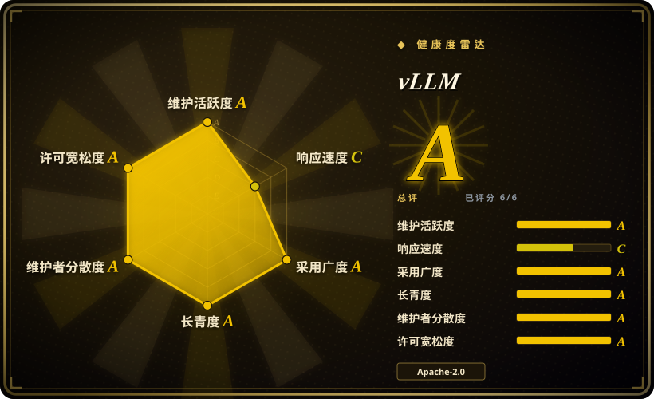

# vLLM

最受欢迎的开源 LLM 服务引擎，核心创新是 **PagedAttention**——一种内存高效的 KV 缓存管理器，将注意力状态虚拟化为固定大小的块，支持连续批处理（continuous batching）与高 GPU 利用率，面向吞吐量优化的推理服务。

## 何时使用

你正在运营一个生产级 API，需要以 OpenAI 兼容端点的方式对外提供开源权重 LLM（Llama、Qwen、Mistral、Gemma 等）的高吞吐服务。你的流量是突发且交错的——用户发送长短不一的 prompt，有些需要流式返回 token，有些则不需要——而你总是被 GPU 内存碎片困扰：朴素的批处理会在 KV 缓存中留下空洞，导致硬件本可以承载的并发请求数远低于理论值。你部署 vLLM，它将 KV 缓存虚拟化为固定大小的页面（类似操作系统内存管理），在序列结束时回收块，让你能紧密地打包请求，从而维持远高于静态批处理服务器的吞吐。内置的 OpenAI 兼容 API（`/v1/chat/completions`）意味着你现有的客户端代码无需改动即可接入，而 Python 生态也让模型定制（自定义 logits 处理器、采样参数、投机解码）无需下沉到 C++ 就能完成。

当你需要张量并行或流水线并行的多 GPU 服务、量化（AWQ、GPTQ、FP8）以在更少 GPU 上运行更大模型、或者前缀缓存以避免在大量请求中重复计算共享的系统 prompt 时，你也会选择 vLLM。社区极其庞大，因此当 Hugging Face 上出现新模型时，vLLM 的集成通常会在几天内落地。

## 何时不用

- **你需要非 NVIDIA 硬件作为一等公民。** vLLM 深度围绕 NVIDIA 构建（自定义 CUDA 内核、CUTLASS、Triton）。AMD 和 Intel GPU 支持存在，但较新、较不成熟，且缺乏同等深度的性能调优。对于以 AMD 或 Intel 为主的部署，成熟度差距是真实存在的。[未验证]
- **你想要一个简单、单二进制的本地推理工具。** vLLM 是一个庞大复杂的 Python 代码库，依赖沉重的 PyTorch/CUDA 和很长的依赖链。对于单台 Mac 或笔记本，Ollama 或 llama.cpp 要轻量得多、也更容易安装。vLLM 是数据中心服务引擎，不是桌面便利工具。
- **你需要深入定制内核但又没有 CUDA 经验。** vLLM 的性能来自手工调优的 CUDA 内核和注意力实现。如果你需要修改注意力机制或添加自定义内核，你要写 CUDA C++ 并与 vLLM 的内核分发层集成——相比纯 Python 框架，学习曲线陡峭得多。[推断]
- **你需要统一的服务 + 编排 + 多模型路由层。** vLLM 是推理引擎，不是编排框架。对于多模型 A/B 测试、金丝雀发布、请求级路由或跨集群的自动扩缩容，你仍然需要在 vLLM 前面叠加一层（Kubernetes、Ray Serve 或 BentoML 等代理）。它不能替代一个完整的 serving 平台。
- **延迟比吞吐更重要。** vLLM 优化的是**吞吐**（每秒请求数、GPU 利用率）。对于超低延迟的交互式场景，每一毫秒的 time-to-first-token 都至关重要，NVIDIA 的 **TensorRT-LLM** 或手工调优的定制引擎通常更优，因为它们编译静态图、更激进地融合算子；vLLM 的动态调度与 Python 开销会增加延迟。[推断]
- **你想避免快速迭代带来的破坏。** vLLM 的迭代速度极快（每天 10+ 次提交，频繁的小版本发布）。新功能快速落地，但 API 会变动、默认行为会改变、模型支持兼容性也快速演进。如果你需要一个“部署后不管”、12 个月稳定表面的推理运行时，vLLM 的速度是负担而非优势。[推断]

## 横向对比

| 替代品 | 是否收录 | 我们的评价 | 取舍 |
|---|---|---|---|
| [Modular Platform (MAX + Mojo)](modular.zh.md) | ✅ | 当你需要事实上的开放服务引擎、巨大模型覆盖和 Python 原生栈时选 vLLM；当你需要厂商构建的跨厂商编译器+语言平台及其内核语言时选 MAX。 | 厂商构建的跨厂商 GPU/CPU 服务引擎 + Mojo 内核语言；单厂商绑定，社区更年轻，模型覆盖不如 vLLM。 |
| [oMLX](omlx.zh.md) | ✅ | 数据中心 NVIDIA GPU 服务选 vLLM；Mac（Apple Silicon）本地推理服务带 SSD 分层 KV 缓存时选 oMLX。 | 仅限 Mac 的 Apple Silicon 本地服务器，带 Swift 菜单栏应用；不是数据中心多 GPU 引擎。 |
| Text Generation Inference (TGI) | 未收录 | 当你需要更大社区和 PagedAttention 时选 vLLM；当你需要 Hugging Face 的生产服务器及其紧密的 HF 生态集成时选 TGI。 | Hugging Face 的生产服务器，紧密的 HF 生态集成；许可证历史曾波动（Apache→HFOIL→Apache），社区规模小于 vLLM。 |
| TensorRT-LLM | 未收录 | 当你需要开源 Python 灵活性和动态模型加载时选 vLLM；当你需要 NVIDIA 自有引擎、在 NVIDIA 硬件上获得顶级延迟时选 TensorRT-LLM。 | NVIDIA 自有引擎，在 NVIDIA 硬件上顶级延迟；深度绑定 NVIDIA，构建/引擎编译流程更重，动态模型切换能力较弱。 |
| [Ray Serve](ray-serve.zh.md) | ✅ | 当你需要专用 LLM 推理引擎时选 vLLM；当你需要跨多种模型类型的通用 Python 模型服务编排与扩缩容时选 Ray Serve。 | 通用 Python 模型服务/编排框架，用于扩展和组合服务；不是手工调优的单模型推理引擎。 |
| [SGLang](sglang.zh.md) | ✅ | 当你需要经过验证、采用最广泛的引擎时选 vLLM；当你特别需要 RadixAttention 前缀缓存和结构化生成优化时选 SGLang。 | 高吞吐服务引擎，带 RadixAttention 前缀缓存；更新、生态更小、模型覆盖不如 vLLM。 |
| Ollama / llama.cpp | 未收录 | 数据中心吞吐服务选 vLLM；轻量级本地/边缘 CPU 或消费级 GPU 推理选 Ollama/llama.cpp。 | 可移植的 C/C++ 推理引擎（GGUF），可在 Mac 和手机等任何地方运行；不是数据中心多 GPU 吞吐引擎。 |

## 技术栈

- **Python** — 主要语言：模型加载、调度器、API 服务器以及面向用户的定制层（自定义 logits 处理器、采样参数、引导解码）。
- **CUDA C++ / Triton** — 用于注意力、KV 缓存管理和量化的自定义 GPU 内核；PagedAttention 的块表管理以优化 CUDA 实现。
- **PyTorch** — 底层张量框架；模型通过 PyTorch 加载，并经由自定义 vLLM 注意力内核执行，这些内核替代了标准 PyTorch 注意力。
- **OpenAI 兼容 API** — 基于 FastAPI 的服务器，暴露 `/v1/completions`、`/v1/chat/completions` 和 `/v1/embeddings`，实现与 OpenAI 客户端的即插即用兼容。
- **分布式原语** — 通过 PyTorch distributed 实现张量并行和流水线并行；支持多 GPU 和多节点部署。
- **前缀缓存** — 可选层，缓存常见前缀（如系统 prompt）的 KV 块，以避免缓存命中时的重复计算。[未验证]

## 依赖

- **硬件** — NVIDIA GPU 是主要目标（CUDA 11.8+ / 12.1+）；AMD（ROCm）和 Intel 支持较新。服务器级 GPU（A100、H100、A10、L4 等）是典型部署目标。纯 CPU 推理存在，但不是性能重点。[未验证]
- **GPU 驱动与运行时** — 主机上需要 NVIDIA GPU 驱动、CUDA toolkit 和 cuDNN；Python 包捆绑了大部分 CUDA 内核，但主机必须提供驱动/运行时栈。
- **运行时环境** — Python 3.9–3.12；通过 `pip` 安装（如 `pip install vllm`）或预构建 Docker 容器（`vllm/vllm-openai`）。该包体积庞大（约数 GB 的 CUDA wheel 和 PyTorch）。[推断]
- **模型** — 你自带 Hugging Face 兼容模型（safetensors 或 PyTorch checkpoint）；vLLM 通过自动 Hugging Face `transformers` 配置检测和手动模型卡注册支持数千种模型。[推断]
- **外部服务（可选）** — 对于生产服务，通常需要在前面放置负载均衡器或反向代理（nginx、Envoy、Kubernetes ingress）；vLLM 本身是单进程服务器，不原生处理 TLS、认证或多节点路由。[推断]

## 运维难度

**高。** `docker run vllm/vllm-openai` 并指向模型的“快乐路径”看似简单，但生产运维实则要求很高：

1. **GPU 集群管理** — 驱动版本、CUDA 兼容性、内存调优和多 GPU 拓扑（NVLink、PCIe）都是你的责任。单个 vLLM 实例通常独占一个或多个 GPU；你管理实例密度，而非引擎本身。
2. **模型生命周期与磁盘** — 模型权重体积巨大（数十到数百 GB）；冷启动下载时间、磁盘缓存管理和跨集群的版本升级都是显著的运维工作。
3. **吞吐与延迟调优** — vLLM 暴露大量相互作用的参数（`max_num_seqs`、`max_num_batched_tokens`、块大小、调度策略），以非直观的方式交互。为你的特定工作负载分布获取最佳吞吐需要基准测试和迭代；默认值偏保守，通常会在 GPU 上留下余量。[推断]
4. **版本迭代速度** — 每天 10+ 次提交、频繁发布，保持最新意味着定期升级，且 API 表面会变动（新参数、默认行为改变、废弃特性）。如果你需要 bug 修复和新模型支持，你会经常升级 vLLM。[推断]
5. **无内置高可用或多节点路由** — 你以每个 GPU/节点一个状态化进程的方式运行 vLLM。高可用、自动扩缩容、请求路由和模型 A/B 测试由外部基础设施（Kubernetes、代理或 Ray Serve 等服务框架）处理，而非 vLLM 本身。

## 健康度与可持续性

- **维护（2026-07）。** 极其活跃——每天 10+ 次提交，非常频繁的发布（截至 2026 年中为 v0.11.x），大量已合并 PR。项目明显处于激进增长模式，而非维持状态。未归档。[推断]
- **治理 / 总线因子（2026-07）。** 由庞大且分布式的团队领导（起源于 UC Berkeley / LMSYS），拥有众多活跃维护者和广泛的贡献者基础（约 500+ 贡献者）。治理模式是**社区主导的开源**，而非单一厂商或基金会——总线因子高于单公司项目，但缺乏 Apache/CNCF/LF 基金会庇护。[推断]
- **背书与 longevity（2026-07）。** 起源于 UC Berkeley 的 Sky Computing Lab 和 LMSYS（Chatbot Arena 的幕后团队）；PagedAttention 论文发表于 SOSP 2023。强大的学术血统 + 商业采用（许多 AI 初创公司和云厂商在生产中使用 vLLM）。年龄（自首次发布约 2.5 年）× 仍然活跃，给出**中等到较强的 Lindy 先验**：足够老以证明自身，又足够年轻以快速创新。[推断]
- **采用（2026-07）。** 约 73k star 和非常广泛的生产使用——被许多推理即服务平台和内部 AI 团队用作后端。OpenAI 兼容 API、广泛的模型支持和活跃的生态（插件、Docker 镜像、Helm chart）使其成为 LLM 服务的事实开源标准。Star 数不是质量证明，但生态密度是真实的。[未验证]
- **风险标志。** 截至 2026-07，Apache-2.0，无重新许可证历史。无需 CLA。主要风险是**速度脆弱性**——快速迭代意味着 API 和内部架构频繁变动，带来升级负担和偶尔的破坏性变更。还存在**单语言（Python/CUDA）集中风险**：项目深度绑定 PyTorch/CUDA 生态；PyTorch 重大破坏性变更或 CUDA 兼容性变动会直接影响 vLLM。[推断]

## 存疑（未验证）

- [未验证] 约 73k star 和确切的生产采用声明来自 2026-07-01 的公开 GitHub API 和项目宣传材料；star 数本身可通过 API 验证，但其采用含义仅供参考，不能作为生产质量证明。
- [未验证] AMD 和 Intel GPU 支持状态（“较新、较不成熟”）是从公开 README/文档和问题讨论模式推断的，未在相关平台上进行实际基准测试。
- [未验证] 前缀缓存行为、块大小与调度的交互关系，以及支持量化方案的确切集合（AWQ、GPTQ、FP8 等）取自项目 README 和文档；并非所有组合都经过独立测试。
- [推断] “每天 10+ 次提交”和“v0.11.x”速度是从 GitHub 活动模式和发布历史推断的；具体日速率会变化，应在评估时核实。
- [推断] 自定义 CUDA 内核修改的陡峭学习曲线是从代码库结构（`csrc/` 中的自定义 CUDA 内核、Python 中的内核分发）和维护者讨论推断的，并非来自第一手的内核开发实践。
- [推断] TensorRT-LLM 延迟优势和“延迟 vs. 吞吐”取舍是从社区基准测试和 NVIDIA 自身性能声明推断的，未在相同硬件上进行独立 head-to-head 基准测试。
- [推断] “中等到较强的 Lindy 先验”评估结合了项目约 2023 年的起源日期和观察到的持续活动；这是启发式判断，而非可量化的预测。
- [推断] 纯 CPU 推理支持存在，但基于 README 重点和社区报告被描述为“不是性能重点”，而非来自受控的 CPU-vs-GPU 基准测试。
