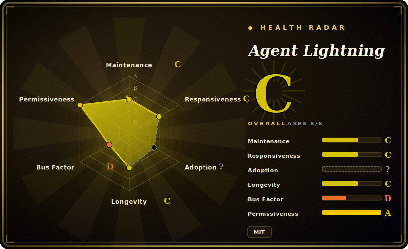

# Agent Lightning

A Microsoft framework that trains and optimizes AI agents — built in *any* framework — with reinforcement learning, prompt optimization, or SFT, by decoupling agent execution from the training backend so existing agent code needs almost no changes.

## When to use

You're an engineer who already shipped a multi-step agent — say a LangChain or AutoGen pipeline that calls tools, retrieves context, and reasons over several turns. It works, but it's *static*: the underlying model never improves from the trajectories your agent actually produces in your domain. You want to fine-tune the policy model on real agent rollouts using RL (e.g. GRPO over end-to-end task reward), but every RL stack you've looked at (verl, TRL) assumes you'll rewrite your agent as a monolithic generation loop, and your agent has branching, tool calls, and multiple LLM steps that don't fit that mold.

Agent Lightning is built for exactly this. It models agent execution as a Markov decision process and uses a hierarchical credit-assignment scheme (LightningRL) to decompose a full multi-step trajectory into per-step training transitions, so you can keep your agent in its native framework. A client/server split runs your agent against an OpenAI-compatible endpoint while the training server (VERL by default, instrumenting vLLM/SGLang for token-level signals) updates the model — letting you turn an existing agent into a trainable one with near-zero code change, and optionally optimize only selected agents in a multi-agent system. If you don't need full RL, it also exposes automatic prompt optimization (APO) and SFT paths over the same traced rollouts.

## When NOT to use

- **You just want to fine-tune a single model on a dataset.** If there's no multi-step agent/tool-use loop, a plain SFT/LoRA trainer ([LLaMA-Factory](llamafactory.md), [Unsloth](unsloth.md), HF TRL) is simpler and lighter.
- **No GPU / no RL infra.** RL training leans on VERL + vLLM/SGLang and meaningful GPU capacity; this is heavyweight compared to single-GPU LoRA SFT. Exact GPU/VRAM minimums vary by model and backend.
- **You want a managed, hosted RL training service.** This is a self-hosted framework, not a SaaS; [ART](art.md) leans more toward an ergonomic batteries-included loop, and Tinker (a supported backend) is the managed option.
- **Early-stage maturity / churn risk.** It's at v0.x with rapidly changing APIs, a preview dashboard, and multiple swappable backends (VERL/Tinker, AgentOps/Weave tracers, MongoDB store). Expect breaking changes and pin versions.
- **You need a single-vendor, fully-integrated path.** The framework-agnostic, multi-backend design means you assemble pieces (tracer + store + training backend + serving) yourself.

## Comparison

| Alternative | In index | Our verdict | Tradeoff |
|---|---|---|---|
| [LLaMA-Factory](llamafactory.md) | ✅ | Use this page for its stated niche; choose LLaMA-Factory when you need broad SFT/DPO/PPO fine-tuning over datasets with a unified config/UI. | Broad SFT/DPO/PPO fine-tuning over datasets with a unified config/UI; not built for decoupling a live multi-step agent into RL transitions. |
| [Unsloth](unsloth.md) | ✅ | Use this page for its stated niche; choose Unsloth when you need fast, memory-efficient single-GPU SFT/LoRA. | Fast, memory-efficient single-GPU SFT/LoRA; an optimization *kernel/trainer*, not an agent-rollout RL orchestrator. |
| [ART](art.md) | ✅ | Use this page for its stated niche; choose ART when you need also RL for agents, but a more opinionated, ergonomic single-loop experience. | Also RL for agents, but a more opinionated, ergonomic single-loop experience; Agent Lightning emphasizes framework-agnostic decoupling + pluggable backends. |
| verl | 未收录 | Use this page for its stated niche; choose verl when you need the underlying distributed RL engine Agent Lightning builds on. | The underlying distributed RL engine Agent Lightning builds on; powerful but expects you to express training as its generation loop rather than wrap a native agent. |
| HF TRL | 未收录 | Use this page for its stated niche; choose HF TRL when you need mature PPO/GRPO/DPO library. | Mature PPO/GRPO/DPO library; dataset/loop-centric, no agent-execution decoupling or multi-step credit assignment out of the box. |
| OpenAI Agents SDK / LangChain (alone) | 未收录 | Use this page for its stated niche; choose OpenAI Agents SDK / LangChain (alone) when you need build and run agents, but don't train the underlying model from rollouts. | Build and run agents, but don't train the underlying model from rollouts — Agent Lightning sits on top to make them trainable. |

## Tech stack

- **Language:** Python (with a TypeScript/JS dashboard frontend).
- **Training backends:** VERL (default, distributed RL); Tinker (managed RL backend, added in v0.3.0); Azure OpenAI for inference/SFT.
- **Serving:** vLLM and SGLang, wrapped behind an async LLM-server abstraction and instrumented for token-level signals.
- **Algorithms:** RL (GRPO/PPO-style via the backend), LightningRL credit assignment, automatic prompt optimization (APO), SFT.
- **Tracing/store:** OpenTelemetry semantic conventions for agents; AgentOps or Weave tracer; Lightning Store (in-process or MongoDB backend) for rollouts.
- **Agent integrations:** LangChain, OpenAI Agents SDK, AutoGen, CrewAI, Microsoft Agent Framework, AgentScope, or raw Python OpenAI calls.

## Dependencies

- `pip install agentlightning` (nightly builds via Test PyPI).
- For RL training: a training backend (VERL or Tinker), a serving engine (vLLM/SGLang), and GPU(s).
- Optional: MongoDB (Lightning Store), AgentOps/Weave (tracing), Azure OpenAI (inference/SFT path).
- The client side (your agent) only needs to talk to an OpenAI-compatible endpoint, so the heavy training deps stay on the server side.

## Ops difficulty

**High.** A full RL setup composes several moving parts — VERL/Tinker training backend, vLLM/SGLang serving, a tracer, a rollout store, and GPU orchestration — plus the client/server split. The decoupling is what makes adoption low-friction for *agent code*, but it shifts complexity into *infra assembly and tuning*. For the lighter APO/SFT paths or a single-node setup, effective difficulty is **medium**. [推断]

## Health & viability

- **Maintenance — active (as of 2026-06).** Repo pushed 2026-04; shipping v0.x with a recent v0.3.0 (reported late 2025). Pre-1.0 with fast API churn, a preview dashboard, and swappable backends — alive and moving, but expect breaking changes between minors. Not archived. [未验证]
- **Governance & backing — Microsoft (corporate research).** Organization-owned under `microsoft`. Big-vendor backing means real engineering capacity and is a longevity positive; the offsetting risk is that corporate research repos can be deprioritized or archived once the research interest moves on — Microsoft has retired such projects before. Roadmap is vendor-controlled. [推断]
- **Age & Lindy — young / unproven.** Created 2025-06, ~1 year old. Too new to have a Lindy track record; the bet rests on Microsoft's continued investment and the agent-RL space maturing, not on longevity. Pin versions and treat it as early-stage.
- **Adoption & ecosystem.** ~17k stars quickly accrued and broad agent-framework integrations (LangChain, AutoGen, CrewAI, AgentScope, OpenAI Agents SDK); but the framework-agnostic, multi-backend design means you assemble tracer + store + training backend + serving yourself — adoption depth (production users) is unverified.
- **Risk flags — v0.x churn + multi-backend assembly.** MIT, no relicense/CVE history asserted. The real flags are API instability at v0.x and dependency on a fast-moving RL stack (VERL/vLLM/SGLang), plus corporate-research abandonment risk noted above.

## Caveats (unverified)

- [未验证] Star count: reported on the order of ~17k GitHub stars (2026-06); star figures in this ecosystem are unreliable and should not drive selection.
- [未验证] v0.3.0 release timing is reported around late December 2025; confirm exact date on the GitHub releases page.
- [未验证] Minimum GPU/VRAM, supported model families, and exact dependency versions vary by backend and are not asserted here.
- [推断] As a v0.x project with multiple swappable backends and a preview dashboard, expect API churn and breaking changes between minor versions.
