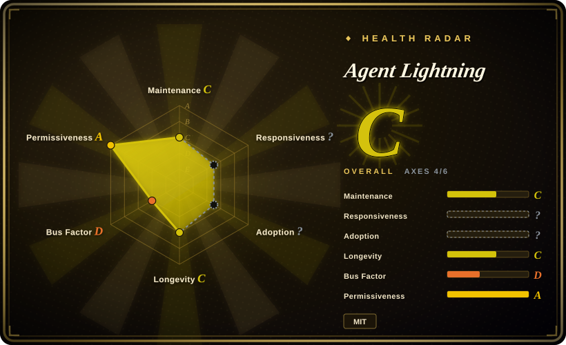

# Agent Lightning

A Microsoft framework that trains and optimizes AI agents — built in *any* framework — with reinforcement learning, prompt optimization, or SFT, by decoupling agent execution from the training backend so existing agent code needs almost no changes.

## When to use

You're an engineer who already shipped a multi-step agent — say a LangChain or AutoGen pipeline that calls tools, retrieves context, and reasons over several turns. It works, but it's *static*: the underlying model never improves from the trajectories your agent actually produces in your domain. You want to fine-tune the policy model on real agent rollouts using RL (e.g. GRPO over end-to-end task reward), but every RL stack you've looked at (verl, TRL) assumes you'll rewrite your agent as a monolithic generation loop, and your agent has branching, tool calls, and multiple LLM steps that don't fit that mold.

Agent Lightning is built for exactly this. It models agent execution as a Markov decision process and uses a hierarchical credit-assignment scheme (LightningRL) to decompose a full multi-step trajectory into per-step training transitions, so you can keep your agent in its native framework. A client/server split runs your agent against an OpenAI-compatible endpoint while the training server (VERL by default, instrumenting vLLM/SGLang for token-level signals) updates the model — letting you turn an existing agent into a trainable one with near-zero code change, and optionally optimize only selected agents in a multi-agent system. If you don't need full RL, it also exposes automatic prompt optimization (APO) and SFT paths over the same traced rollouts.

## When NOT to use

- **You just want to fine-tune a single model on a dataset.** If there's no multi-step agent/tool-use loop, a plain SFT/LoRA trainer ([LLaMA-Factory](llamafactory.md), [Unsloth](unsloth.md), HF TRL) is simpler and lighter.
- **No GPU / no RL infra.** RL training leans on VERL + vLLM/SGLang and meaningful GPU capacity; this is heavyweight compared to single-GPU LoRA SFT. Exact GPU/VRAM minimums vary by model and backend.
- **You want a managed, hosted RL training service.** This is a self-hosted framework, not a SaaS; [ART](art.md) leans more toward an ergonomic batteries-included loop, and Tinker (a supported backend) is the managed option.
- **Early-stage maturity / churn risk.** It's at v0.x with rapidly changing APIs, a preview dashboard, and multiple swappable backends (VERL/Tinker, AgentOps/Weave tracers, MongoDB store). Expect breaking changes and pin versions.
- **You need a single-vendor, fully-integrated path.** The framework-agnostic, multi-backend design means you assemble pieces (tracer + store + training backend + serving) yourself.

## Comparison

| Alternative | In index | Our verdict | Tradeoff |
|---|---|---|---|
| [LLaMA-Factory](llamafactory.md) | ✅ | Choose LLaMA-Factory when you need broad SFT/DPO/PPO fine-tuning over datasets with a unified config/UI. | Broad dataset fine-tuning, not live multi-step agent rollouts. |
| [Unsloth](unsloth.md) | ✅ | Choose Unsloth when fast, memory-efficient single-GPU SFT/LoRA is the bottleneck. | An optimization *kernel/trainer*, not an agent-rollout RL orchestrator. |
| [ART](art.md) | ✅ | Choose ART when you also need RL for agents, but prefer a more opinionated single-loop experience. | Agent Lightning emphasizes framework-agnostic decoupling plus pluggable backends; ART optimizes for ergonomics. |
| verl | 未收录 | Choose verl when you need the underlying distributed RL engine Agent Lightning builds on. | Powerful, but expects you to express training as its generation loop rather than wrap a native agent. |
| HF TRL | 未收录 | Choose HF TRL when you need a mature PPO/GRPO/DPO library for dataset- or loop-centric training. | No agent-execution decoupling or multi-step credit assignment out of the box. |
| OpenAI Agents SDK / [LangChain](../agent-frameworks/workflow-builders/langchain.md) (alone) | 部分已收录 | Choose agent frameworks alone when you only need to build and run agents, not train the underlying model from rollouts. | Agent Lightning sits on top of agent execution to make rollouts trainable; plain frameworks stop at orchestration. OpenAI Agents SDK is not indexed separately. |

## Tech stack

- **Language:** Python (with a TypeScript/JS dashboard frontend).
- **Training backends:** VERL (default, distributed RL); Tinker (managed RL backend, added in v0.3.0); Azure OpenAI for inference/SFT.
- **Serving:** vLLM and SGLang, wrapped behind an async LLM-server abstraction and instrumented for token-level signals.
- **Algorithms:** RL (GRPO/PPO-style via the backend), LightningRL credit assignment, automatic prompt optimization (APO), SFT.
- **Tracing/store:** OpenTelemetry semantic conventions for agents; AgentOps or Weave tracer; Lightning Store (in-process or MongoDB backend) for rollouts.
- **Agent integrations:** LangChain, OpenAI Agents SDK, AutoGen, CrewAI, Microsoft Agent Framework, AgentScope, or raw Python OpenAI calls.

## Dependencies

- `pip install agentlightning` (nightly builds via Test PyPI).
- For RL training: a training backend (VERL or Tinker), a serving engine (vLLM/SGLang), and GPU(s).
- Optional: MongoDB (Lightning Store), AgentOps/Weave (tracing), Azure OpenAI (inference/SFT path).
- The client side (your agent) only needs to talk to an OpenAI-compatible endpoint, so the heavy training deps stay on the server side.

## Ops difficulty

**High.** A full RL setup composes several moving parts — VERL/Tinker training backend, vLLM/SGLang serving, a tracer, a rollout store, and GPU orchestration — plus the client/server split. The decoupling is what makes adoption low-friction for *agent code*, but it shifts complexity into *infra assembly and tuning*. For the lighter APO/SFT paths or a single-node setup, effective difficulty is **medium**. [推断]

## Health & viability

- **Maintenance**: Grade C — 1/13 active weeks in trailing 13; last commit 65 days ago.
- **Responsiveness**: Cannot be scored — no_traffic.
- **Adoption**: Cannot be scored — ambiguous.
- **Longevity**: Grade C — 380 days old.
- **Governance**: Grade D — top-3 contributor share 85.2% (?).
- **Risk / License**: Grade A — MIT license.

## Caveats (unverified)

- [未验证] Star count: reported on the order of ~17k GitHub stars (2026-06); star figures in this ecosystem are unreliable and should not drive selection.
- [未验证] v0.3.0 release timing is reported around late December 2025; confirm exact date on the GitHub releases page.
- [未验证] Minimum GPU/VRAM, supported model families, and exact dependency versions vary by backend and are not asserted here.
- [推断] As a v0.x project with multiple swappable backends and a preview dashboard, expect API churn and breaking changes between minor versions.
