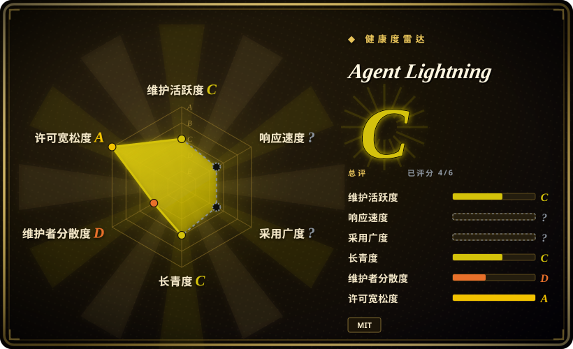

# Agent Lightning

微软出品的框架，把 agent 的执行与训练后端解耦，用强化学习、提示优化或 SFT 来训练和优化*任意框架*构建的 AI agent，现有 agent 代码几乎不用改。

## 何时使用

你是一名工程师，已经上线了一个多步 agent——比如一条 LangChain 或 AutoGen 流水线，会调工具、检索上下文、跨多轮推理。它能跑，但它是*静态*的：底层模型从来没有从你的 agent 在真实业务里实际产出的轨迹中变强过。你想用 RL（比如对端到端任务奖励做 GRPO）在真实 agent rollout 上微调策略模型，但你看过的每个 RL 框架（verl、TRL）都假设你会把 agent 重写成一个单体的生成循环——而你的 agent 有分支、有工具调用、有多个 LLM 步骤，根本套不进那个模子。

Agent Lightning 正是为此而生。它把 agent 执行建模为马尔可夫决策过程，用一套分层的信用分配机制（LightningRL）把一条完整的多步轨迹拆解成逐步的训练 transition，于是你可以让 agent 留在它原生的框架里。一个 client/server 拆分让你的 agent 跑在 OpenAI 兼容端点上，而训练服务端（默认 VERL，对 vLLM/SGLang 做插桩以拿到 token 级信号）负责更新模型——从而几乎零改动地把一个现成 agent 变成可训练的，并且在多 agent 系统里还能只优化你选定的部分 agent。如果你不需要完整 RL，它在同一套 traced rollout 之上也提供自动提示优化（APO）和 SFT 路径。

## 何时不用

- **你只是想在一个数据集上微调单个模型。** 如果没有多步 agent / 工具调用循环，用普通的 SFT/LoRA 训练器（[LLaMA-Factory](llamafactory.zh.md)、[Unsloth](unsloth.zh.md)、HF TRL）更简单更轻。
- **没有 GPU / 没有 RL 基础设施。** RL 训练依赖 VERL + vLLM/SGLang 和可观的 GPU 算力；相比单卡 LoRA SFT 这是重型方案。具体 GPU/显存下限随模型和后端而变。
- **你想要托管的、云端 RL 训练服务。** 这是自托管框架，不是 SaaS；[ART](art.zh.md) 更偏向开箱即用的顺手循环，而 Tinker（受支持的后端之一）才是托管选项。
- **早期成熟度 / 变动风险。** 它处于 v0.x，API 变化快、dashboard 仍是预览版、后端可插拔（VERL/Tinker、AgentOps/Weave tracer、MongoDB store）。预期会有破坏性变更，请锁版本。
- **你需要单一厂商、完全集成的一条龙路径。** 框架无关 + 多后端的设计意味着 tracer + store + 训练后端 + serving 这些零件要你自己拼。

## 横向对比

| 替代品 | 是否收录 | 我们的评价 | 取舍 |
|---|---|---|---|
| [LLaMA-Factory](llamafactory.zh.md) | ✅ | 需要在数据集上做广覆盖 SFT/DPO/PPO 微调，并使用统一配置/UI 时，选 LLaMA-Factory。 | 它擅长数据集微调，不是为在线多步 agent rollout 设计。 |
| [Unsloth](unsloth.zh.md) | ✅ | 快速、省显存的单卡 SFT/LoRA 是瓶颈时，选 Unsloth。 | 它是优化*内核/训练器*，不是 agent rollout 的 RL 编排器。 |
| [ART](art.zh.md) | ✅ | 同样需要面向 agent 的 RL，但更偏好有主张的单循环体验时，选 ART。 | Agent Lightning 强调框架无关的解耦和可插拔后端；ART 更偏易用体验。 |
| verl | 未收录 | 需要 Agent Lightning 所依赖的底层分布式 RL 引擎时，选 verl。 | 它很强，但要你把训练表达成它的生成循环，而不是包住一个原生 agent。 |
| HF TRL | 未收录 | 需要成熟的 PPO/GRPO/DPO 库做数据集或循环中心训练时，选 HF TRL。 | 开箱没有 agent 执行解耦或多步信用分配。 |
| OpenAI Agents SDK / [LangChain](../agent-frameworks/langchain.zh.md)（单用） | 部分已收录 | 只需要构建和运行 agent，而不是从 rollout 训练底层模型时，选单独的 agent 框架。 | Agent Lightning 叠在 agent 执行之上，让 rollout 可训练；普通框架止步于编排。OpenAI Agents SDK 未单独收录。 |

## 技术栈

- **语言：** Python（dashboard 前端用 TypeScript/JS）。
- **训练后端：** VERL（默认，分布式 RL）；Tinker（托管 RL 后端，v0.3.0 新增）；Azure OpenAI 用于推理/SFT。
- **Serving：** vLLM 和 SGLang，封装在异步 LLM-server 抽象后并插桩以拿到 token 级信号。
- **算法：** RL（经后端做 GRPO/PPO 系）、LightningRL 信用分配、自动提示优化（APO）、SFT。
- **追踪/存储：** 面向 agent 的 OpenTelemetry 语义约定；AgentOps 或 Weave tracer；Lightning Store（进程内或 MongoDB 后端）存 rollout。
- **agent 集成：** LangChain、OpenAI Agents SDK、AutoGen、CrewAI、Microsoft Agent Framework、AgentScope，或裸 Python OpenAI 调用。

## 依赖

- `pip install agentlightning`（nightly 构建走 Test PyPI）。
- RL 训练所需：训练后端（VERL 或 Tinker）、serving 引擎（vLLM/SGLang）、GPU。
- 可选：MongoDB（Lightning Store）、AgentOps/Weave（追踪）、Azure OpenAI（推理/SFT 路径）。
- 客户端（你的 agent）只需对接一个 OpenAI 兼容端点，因此重型训练依赖都留在服务端。

## 运维难度

**高。** 一套完整 RL 配置要拼好几个活动部件——VERL/Tinker 训练后端、vLLM/SGLang serving、tracer、rollout store、GPU 编排，外加 client/server 拆分。解耦让 *agent 代码* 的接入摩擦很低，但把复杂度挪到了*基础设施拼装与调优*上。若走更轻的 APO/SFT 路径或单机部署，实际难度为**中**。[推断]

## 健康度与可持续性

- **维护活跃度**：Grade C——最近 13 周中 1 周有提交；最后提交距今 65 天。
- **响应速度**：无法计算——no_traffic。
- **采用广度**：无法计算——ambiguous。
- **长青度**：Grade C——仓库已创建 380 天。
- **治理集中度**：Grade D——前三贡献者占比 85.2%（?）。
- **许可风险**：Grade A——MIT 许可证。

## 存疑（未验证）

- [未验证] Star 数：报告约 ~1.7 万 GitHub stars（2026-06）；本生态的 star 数字不可靠，不应作为选型依据。
- [未验证] v0.3.0 发布时间报告在 2025 年 12 月下旬前后；确切日期以 GitHub releases 页为准。
- [未验证] 最低 GPU/显存、受支持的模型家族、确切依赖版本随后端而变，此处不做断言。
- [推断] 作为带多个可插拔后端和预览版 dashboard 的 v0.x 项目，预期 minor 版本之间会有 API 变动和破坏性变更。
