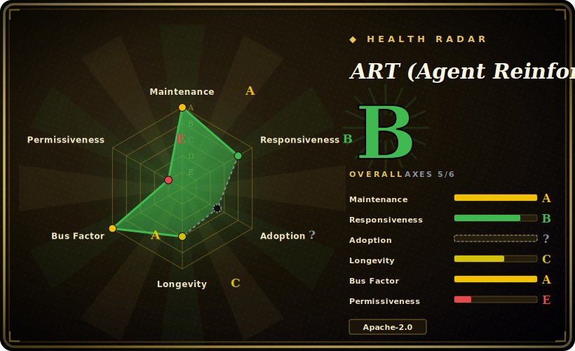

# ART (Agent Reinforcement Trainer)

ART is an open-source framework from OpenPipe for training multi-step LLM agents on real tasks with GRPO reinforcement learning, pairing a client-server training loop with RULER — an LLM-as-judge reward function that needs no labeled data.

## When to use

You're an engineer who has built a multi-step agent — say an email-research agent that issues several tool calls, reads results, and decides what to do next — and prompting plus a bigger base model has plateaued. The agent is right often enough to demo but not reliably enough to ship: it picks the wrong search, gives up early, or hallucinates an answer when the evidence was retrievable. You don't have a labeled dataset of "correct trajectories," and hand-writing a reward function for every failure mode is its own project.

ART is built for exactly this. You keep your agent code in Python and route its model calls through ART's OpenAI-compatible client; ART records each rollout as a *trajectory* (the full multi-turn message sequence). Instead of forcing you to author a reward function, RULER (Relative Universal LLM-Elicited Rewards) generates several trajectories per task and uses an LLM-as-judge to *rank* them relatively — which is enough signal for GRPO, since GRPO only needs relative scores. The server then runs GRPO (on Unsloth/vLLM with LoRA) to produce a new adapter, hot-loads it back into vLLM, and the loop repeats until the agent converges. OpenPipe's own ART·E demo reports a Qwen 2.5 14B email agent reaching parity-or-better with a much larger proprietary model on its task [未验证 — vendor benchmark]. Because the client can run on your laptop while training happens on a GPU box (local or an ephemeral/managed GPU environment), you get "on-the-job" RL without standing up your own training cluster.

## When NOT to use

- **You only need SFT / instruction tuning.** ART is an RL framework for *agentic, multi-step* tasks. If you just want supervised fine-tuning on a static dataset, [LLaMA-Factory](llamafactory.md) or [Unsloth](unsloth.md) are a better fit (and ART builds *on top of* Unsloth anyway).
- **You have no usable reward signal or task environment.** GRPO needs many rollouts that can be scored. If your task can't be executed repeatedly and judged (even by an LLM), RL won't help; you need an evaluable environment first.
- **You can't afford the judge cost.** RULER calls an LLM-as-judge for every group of trajectories. On large runs this API cost is real; the docs suggest cheaper judge models (e.g. Qwen3 32B) to mitigate it [未验证].
- **You need a specific unsupported model.** ART targets vLLM/HF-transformers causal LMs that Unsloth supports; Gemma 3 is explicitly called out as unsupported. Anything outside that envelope is uncertain.
- **You want a turnkey, no-GPU product.** The serverless/managed path lowers ops, but the core flow still assumes GPU training and an agent you instrument yourself. There is also lock-in risk toward the OpenPipe/W&B managed offering if you lean on it.
- **You need a frozen, conservative dependency stack.** It rides a fast-moving stack (vLLM, Unsloth, TRL, torchtune) and ships frequently; breakage from upstream churn is a maintenance consideration [推断].

## Comparison

| Alternative | In index | Our verdict | Tradeoff |
|---|---|---|---|
| [Unsloth](unsloth.md) | ✅ | Use this page for its stated niche; choose Unsloth when you need faster/cheaper LoRA fine-tuning kernels (ART uses it under the hood). | Faster/cheaper LoRA fine-tuning kernels (ART uses it under the hood). Unsloth is the training-efficiency layer; ART adds the agentic GRPO loop + RULER reward orchestration on top. Use Unsloth alone for SFT/single-turn GRPO; use ART for multi-step agents. |
| [agent-lightning](agent-lightning.md) | ✅ | Use this page for its stated niche; choose agent-lightning when you need microsoft's framework to RL-train agents with minimal code changes, decoupling agent execution from. | Microsoft's framework to RL-train agents with minimal code changes, decoupling agent execution from training. Closest conceptual sibling; differs on integration model and reward tooling — ART's headline differentiator is the bundled RULER zero-label reward. |
| [LLaMA-Factory](llamafactory.md) | ✅ | Use this page for its stated niche; choose LLaMA-Factory when you need broad SFT/DPO/PPO fine-tuning toolkit across many models with a config/UI workflow. | Broad SFT/DPO/PPO fine-tuning toolkit across many models with a config/UI workflow. Stronger for general fine-tuning breadth; weaker on the specific "train a deployed multi-step agent from rollouts" loop ART specializes in. |
| HF TRL | 未收录 | Use this page for its stated niche; choose HF TRL when you need the lower-level GRPO/PPO/DPO trainer library ART (and others) build on. | The lower-level GRPO/PPO/DPO trainer library ART (and others) build on. More control and generality, but you assemble the agent rollout loop, reward function, and inference serving yourself. |
| verl | 未收录 | Use this page for its stated niche; choose verl when you need high-throughput, distributed RLHF/RL library aimed at large-scale training. | High-throughput, distributed RLHF/RL library aimed at large-scale training. Scales further but is heavier to operate; less focused on the single-engineer "instrument my agent" ergonomics. |
| torchtune | 未收录 | Use this page for its stated niche; choose torchtune when you need pyTorch-native fine-tuning/RL recipes (ART leans on it in its training stack). | PyTorch-native fine-tuning/RL recipes (ART leans on it in its training stack). A building block, not an agent-RL framework. |

## Tech stack

- **Language/runtime:** Python (PyPI package `openpipe-art`).
- **Algorithm:** GRPO (Group Relative Policy Optimization).
- **Reward:** RULER — LLM-as-judge that relatively ranks/scores 0–1 multiple trajectories per task; no labeled data required.
- **Training/inference:** Unsloth + LoRA for fine-tuning; vLLM for serving the current adapter; TRL and torchtune in the underlying stack.
- **Architecture:** client-server. Client exposes an OpenAI-compatible interface and records trajectories; GPU server runs inference + GRPO training and hot-swaps new LoRA adapters into vLLM.
- **Integrations:** LangGraph, MCP servers (MCP·RL), W&B (managed/serverless training), Langfuse and OpenPipe for observability.

## Dependencies

- Core ML: PyTorch, transformers, PEFT (LoRA).
- Training/serving: Unsloth, vLLM, TRL, torchtune.
- A judge LLM for RULER (can be a cheaper hosted/local model).
- A GPU for the training server (local, cloud, or managed/ephemeral via the W&B path).
- Models: most vLLM/HF-transformers causal LMs that Unsloth supports (Qwen, Llama, GPT-OSS, etc.); Gemma 3 unsupported.

## Ops difficulty

**Medium → high.** The conceptual model (client records trajectories, server trains, adapter hot-reloads) is clean, and the managed/serverless W&B path can take infra off your plate. But self-hosting means operating a GPU training box plus a fast-moving vLLM/Unsloth/TRL stack, instrumenting your own agent and task environment, and managing RULER judge cost and reliability (small group sizes can give inconsistent rankings; `swallow_exceptions=True` is recommended in production). That's meaningfully more than a single-pass SFT job.

## Health & viability

- **Maintenance — active (as of 2026-06).** Repo pushed 2026-06; latest release v0.5.17 reported 2026-03-13, with frequent shipping on a fast-moving stack. Pre-1.0, so expect API movement and breakage from upstream (vLLM/Unsloth/TRL/torchtune) churn. Not archived. [未验证]
- **Governance & backing — single vendor (OpenPipe).** Organization-owned by OpenPipe, a venture-style company whose managed/serverless RL offering (with W&B) is the monetized path. Roadmap and the RULER reward tooling are vendor-driven; longevity is tied to OpenPipe's commercial trajectory, and leaning on the managed path carries lock-in risk. [推断]
- **Age & Lindy — young / unproven.** Created 2025-03, ~1 year old. No Lindy track record yet; this is an early bet on agent-RL becoming mainstream and on OpenPipe sustaining the project, not on durability.
- **Adoption & ecosystem.** ~10k stars and integrations (LangGraph, MCP·RL, W&B, Langfuse); the headline ART·E "beats o3" and "40% cheaper / 28% faster" figures are OpenPipe's own benchmarks/marketing, not independently confirmed. Built on top of Unsloth/vLLM/TRL/torchtune, so it inherits that ecosystem's reach and its instability.
- **Risk flags — vendor lock-in + fast-moving deps.** Apache-2.0, no relicense/CVE history asserted. Real flags: managed-path lock-in toward OpenPipe/W&B, breakage from a fast upstream stack, and v0.x API churn.

## Caveats (unverified)

- ART·E "beats o3 on email retrieval" is an OpenPipe-published benchmark on their own task — treat as [未验证] vendor claim.
- "40% lower cost / 28% faster" figures come from OpenPipe/W&B marketing for the managed path [未验证].
- Star/fork counts in this ecosystem are unreliable; an October-2026-style snapshot showed ~10k stars / ~900 forks and latest release v0.5.17 (2026-03-13) [未验证], dated to when fetched.
- Exact minimum GPU/VRAM requirements are not clearly documented [未验证].
