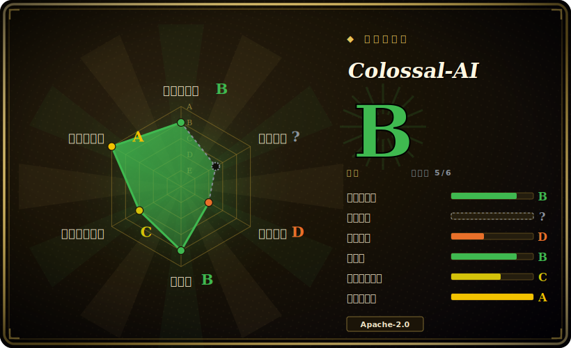

# Colossal-AI

一套分布式深度学习系统，让超大模型在多卡集群上的训练与微调更便宜、更快——把张量 / 流水线 / 序列并行、ZeRO 切分、异构（CPU/NVMe）offload 都收进一层薄薄的 PyTorch 封装里。

## 何时使用

你是 ML 平台工程师或研究工程师，手里有一个多卡集群（一台 8×A100 的机器，或好几台节点），要跑的模型根本套不进单卡、参数高效那一套——一个 30B+ 的 dense LLM 想继续预训练，一次 LoRA 不够用的全参微调，或者一次从头训练，激活和优化器状态早就把单卡显存撑爆了。普通的 `torchrun` + DDP 会把整个模型在每张卡上复制一份，立刻 OOM；你需要把模型、梯度、优化器状态都*切开*，必要时还要往 CPU/NVMe 上溢出一部分。Colossal-AI 把这些切分策略——ZeRO（1~3 级）、张量并行、流水线并行、序列并行，以及 Gemini 式异构 offload——做成可组合的 `plugin`，让你在一个原本普通的 PyTorch 训练循环外面挑选，于是你可以按集群拓扑和显存预算去拨并行度，而不是重写模型。

当瓶颈在*规模和成本*时你会选它：装下一个装不下的模型、在固定卡数上提吞吐，或者压低一次训练所需的硬件。它瞄准的是「我有集群、有大模型」这条赛道——大规模预训练和全参 / 大型微调——而不是「我有一张 4090、跑个 LoRA」那条。混合精度（FP16/BF16）和 auto-parallel / Booster API 的存在，是为了把便利层做薄、同时底下仍然露出 PyTorch。

## 何时不用

- **单卡 LoRA / QLoRA。** 如果你只是在一张消费级 GPU 上对一个模型做参数高效微调，Colossal-AI 的分布式机器纯属累赘——去用 [Unsloth](unsloth.zh.md)（单卡快核）或 [LlamaFactory](llamafactory.zh.md)（配置驱动的 LoRA/QLoRA、带 web UI）。多卡切分才是这个框架存在的全部理由。
- **用老牌方案更划算。** DeepSpeed 和 Megatron-LM 是经受最多实战检验的 ZeRO 与张量 / 流水线并行栈，生产履历最深；PyTorch FSDP 直接*内置*在 PyTorch 里，不用额外框架。如果你团队已经在跑其中之一，Colossal-AI 那点边际便利未必值得再加一个依赖。[推断]
- **没有集群 / 没有基础设施去运维。** 这是重量级分布式系统软件：多节点启动器、NCCL/网络调优、CUDA 工具链版本匹配，还有会和模型结构相互作用的并行配置。没有集群、也没人来运维，搭建成本会远超收益。
- **你要的是推理 / 服务引擎。** Colossal-AI 是*训练*系统。要做高吞吐 LLM 服务，你该用 vLLM / SGLang / TensorRT-LLM，而不是它。
- **你需要一套冻结、保守的依赖栈。** 它跟着一个快速演进的训练生态走，API 和 plugin 行为会跨版本变动，请锁版本并预期 churn。[未验证]

## 横向对比

| 替代品 | 是否收录 | 我们的评价 | 取舍 |
|---|---|---|---|
| DeepSpeed | 未收录 | 当前页用于它的主场景；如果更看重“参考级的 ZeRO / offload 栈（微软）”，再选 DeepSpeed。 | 参考级的 ZeRO / offload 栈（微软）；生产履历最深、生态最广。Colossal-AI 在 ZeRO + offload 上高度重叠，并加上自己的张量 / 流水线 / 序列并行 plugin 和 Booster API；在 DeepSpeed 已经跑起来的地方，它是更稳的默认。 |
| Megatron-LM | 未收录 | 当前页用于它的主场景；如果更看重“NVIDIA 面向超大 transformer 预训练的高性能张量 + 流水线并行”，再选 Megatron-LM。 | NVIDIA 面向超大 transformer 预训练的高性能张量 + 流水线并行；规模化吞吐属顶级，但更底层、更定制。Colossal-AI 想在类似思路之上提供更友好、更可组合的 plugin 面。 |
| PyTorch FSDP | 未收录 | 当前页用于它的主场景；如果更看重“内置于 PyTorch 的全分片数据并行”，再选 PyTorch FSDP。 | 内置于 PyTorch 的全分片数据并行——不用额外框架、原生、支持良好。Colossal-AI 提供更宽的并行菜单（张量 / 流水线 / 序列 + Gemini offload），超出 FSDP 的纯切分，代价是多一个依赖。 |
| [LlamaFactory](llamafactory.zh.md) | ✅ | 当前页用于它的主场景；如果更看重“配置 / UI 驱动、覆盖 100+ 模型的微调（分布式靠包装 DeepSpeed/FSDP）”，再选 LlamaFactory。 | 配置 / UI 驱动、覆盖 100+ 模型的微调（分布式靠包装 DeepSpeed/FSDP）。它更高层、对 SFT/LoRA 更开箱即用；Colossal-AI 是面向大规模 / 全参训练的更底层分布式引擎，而非微调前端。 |
| [Unsloth](unsloth.zh.md) | ✅ | 当前页用于它的主场景；如果更看重“靠自定义核在单卡上做 LoRA/QLoRA 提速、省显存”，再选 Unsloth。 | 靠自定义核在单卡上做 LoRA/QLoRA 提速、省显存。处在光谱另一端：一张卡 vs Colossal-AI 的多卡集群切分——完全是两个问题。 |

## 技术栈

- **语言：** Python，构建在 **PyTorch** 之上。
- **并行策略：** 数据并行、ZeRO（1~3 级）、张量并行、流水线并行、序列并行，以及它们的组合，通过可组合的 `plugin` 来选。
- **内存 / offload：** Gemini 式异构训练——把参数、梯度、优化器状态 offload 到 CPU 和 NVMe，从而训练超过 GPU 显存总量的模型。
- **精度：** 混合精度 FP16 / BF16 训练。
- **API 面：** `Booster` / plugin API，包住一个标准 PyTorch 训练循环，外加针对主流开源模型的示例训练配方。

## 依赖

- **硬件：** NVIDIA CUDA GPU——现实里得是**多张**卡，往往还是多节点，框架才划算；多节点规模下高带宽互联（NVLink / InfiniBand）很关键。
- **核心运行时：** Python + PyTorch，配匹配的 CUDA 工具链；集合通信用 NCCL。最低 Python/PyTorch/CUDA 版本逐版本设定——锁版本前请查仓库。
- **构建：** 部分 CUDA/C++ 核扩展可能在安装时编译，因此从源码构建可能需要 CUDA 工具链（`nvcc`）。
- **集群管线（你自己跑）:** 规模化训练时需要多进程 / 多节点启动器和放 checkpoint 的共享存储。

## 运维难度

**高。** 这是分布式系统软件，难度是这个活儿本身带来的，不是框架的锅。顺路径（单节点、一个并行 plugin）还算好上手，但真正用起来意味着多节点启动与组网、匹配 CUDA/PyTorch/NCCL 版本（老牌的翻车来源），以及挑一套既贴合你模型结构又贴合互联的并行配置（ZeRO 级 × TP × PP × offload）——切错了就悄悄把吞吐压垮或直接 OOM。再加上规模化下的 checkpoint/重启和大型训练惯有的可靠性问题，Colossal-AI 稳稳落在「你需要一个平台 / 基础设施负责人」的区间，和 DeepSpeed、Megatron-LM 同档。

## 健康度与可持续性

- **维护——活跃（截至 2026-06）。** 仓库 2026-05 有推送；约 41k star，在快速演进的训练生态上持续发版。未归档。约 500 个未决 issue 对一个大型分布式系统框架而言是正常负载。[未验证]
- **治理与背书——单一厂商（潞晨/HPC-AI Tech）。** 由 HPC-AI Technology 以 Organization 持有，这家公司在将该项目商业化（Colossal-AI 是其旗舰开源项目）。路线图由厂商驱动；这是公司背书而非基金会项目，存续随公司商业健康而定。[推断]
- **年龄与 Lindy——中到强。** 创建于 2021-10，约 5 年且仍在活跃维护（年龄 × 仍活跃）——老到熬过了多轮 LLM 训练炒作周期，这对基础设施类项目是有意义的 Lindy 信号。没有 DeepSpeed/Megatron-LM 那么根深蒂固，但早已越过「未经检验」阶段。
- **采用与生态。** star 数高，并有针对主流开源模型的示例配方；但它对标的老牌方案（DeepSpeed、Megatron-LM、PyTorch FSDP）生产履历更深，且 Colossal-AI 那点边际便利未必能挤掉一套已经在跑的栈（见「何时不用」）。生产采用深度未经核实。
- **风险标记——厂商依赖 + churn。** Apache-2.0，不断言重新授权/CVE 历史。真正的标记：路线图集中于一家公司，以及跨版本快速变动的 API / plugin 行为（请锁版本）。[未验证]

## 存疑（未验证）

- [未验证] ~41.4k GitHub star 和「2026-05 仍活跃」来自 GitHub 页面；star 数不可靠且对时间敏感——仅供参考，请重新核对仓库。
- [未验证] 支持的并行 plugin、offload 模式和支持模型的确切集合随版本变动；这里列的策略清单是项目的大致表述，而非逐版本保证。
- [推断]「DeepSpeed / Megatron-LM 更经实战检验」是基于它们更长生产历史的成熟度推断，而非对 Colossal-AI 的实测正面对比。
- [未验证] 最低 Python / PyTorch / CUDA 版本，以及核扩展是否在安装时编译，都由当前发行版元数据决定，这里不断言具体数字。
- [推断] 吞吐 / 成本 /「更便宜地训更大模型」的优势高度依赖模型、集群拓扑和所选配置，对任一具体训练都无第一方保证。
