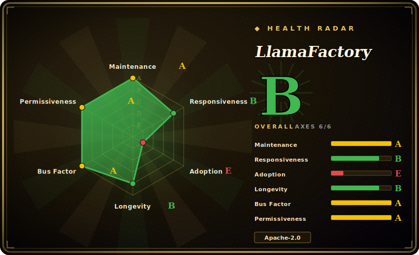

# LlamaFactory

A zero-code, config-driven framework that unifies fine-tuning for 100+ LLMs and VLMs behind a CLI, a Gradio web UI (LlamaBoard), and an OpenAI-compatible API.

## When to use

You're an ML engineer or applied researcher who needs to fine-tune a wide range of open models — say Qwen3 this week, Llama-4 the next, a multimodal Qwen-VL after that — and you don't want to rewrite a bespoke training loop or hunt down a different repo for each architecture. You also want to move between methods (LoRA → QLoRA → full tuning → DPO/PPO) without re-plumbing your data pipeline. LlamaFactory resolves this by exposing one declarative interface: you register a dataset, pick a model and a `stage`/`finetuning_type`, and it dispatches to the right path across 100+ supported models. The same YAML config runs from the CLI (`llamafactory-cli train`) or is editable live in LlamaBoard, so you can prototype in the browser and then commit the config for reproducible runs.

It's also a strong fit when the people doing the tuning aren't full-time training engineers. The LlamaBoard web UI lets you launch SFT or preference-optimization jobs, watch loss curves, and run quick chat evals without touching Python — lowering the barrier for domain experts who want to adapt a model to their data. Under the hood it still leans on the standard Hugging Face stack (transformers/peft/trl) plus accelerators like FlashAttention-2, Unsloth kernels, and vLLM/SGLang for fast inference, so you get the convenience layer without being cut off from the ecosystem's primitives.

## When NOT to use

- **You want maximum single-GPU speed/VRAM efficiency.** [Unsloth](unsloth.md)'s custom Triton kernels are reported to be faster and lighter on a single GPU for the model families it supports; LlamaFactory wraps Unsloth optionally but its own dispatch adds initialization overhead. [未验证] benchmark numbers vary by config.
- **You need agentic / multi-turn RL or reward-from-environment training.** LlamaFactory targets the SFT→preference-optimization (DPO/KTO/ORPO/SimPO/PPO) lane, not rollout-based agent RL — see [ART](art.md) or [Agent Lightning](agent-lightning.md).
- **You want a minimal, auditable training loop you fully own.** The framework abstracts a lot; when something breaks deep in a `stage`/`template` interaction, debugging means tracing through LlamaFactory's dispatch layers on top of transformers/trl. A thinner library (torchtune, HF TRL) may be easier to reason about.
- **Config sprawl / template lock-in.** Behavior is driven by model `template`s and a large config surface; getting a custom chat template or unusual dataset format exactly right can be fiddly, and you're coupled to LlamaFactory's abstractions and release cadence.
- **Bleeding-edge architecture day-one.** New model support depends on a LlamaFactory release wiring up the template/dispatch, which may lag a raw transformers integration.

## Comparison

| Alternative | In index | Our verdict | Tradeoff |
|---|---|---|---|
| [Unsloth](unsloth.md) | ✅ | Use this page for its stated niche; choose Unsloth when you need faster/lower-VRAM on a single GPU via custom kernels. | Faster/lower-VRAM on a single GPU via custom kernels; narrower model/method coverage and weaker multi-GPU story than LlamaFactory's broad-but-heavier dispatch. |
| [ART](art.md) | ✅ | Use this page for its stated niche; choose ART when you need agentic RL (GRPO-style rollouts) for training agents. | Agentic RL (GRPO-style rollouts) for training agents; different problem than LlamaFactory's SFT/preference-tuning focus. |
| [Agent Lightning](agent-lightning.md) | ✅ | Use this page for its stated niche; choose Agent Lightning when you need trains agents from their own execution traces / RL. | Trains agents from their own execution traces / RL; not a general SFT/LoRA toolbox. |
| axolotl | 未收录 | Use this page for its stated niche; choose axolotl when you need YAML-driven, multi-GPU-first with FSDP/DeepSpeed out of the box. | YAML-driven, multi-GPU-first with FSDP/DeepSpeed out of the box; favored for reproducible production runs. LlamaFactory adds a web UI and broader zero-code surface. |
| torchtune | 未收录 | Use this page for its stated niche; choose torchtune when you need lean, native-PyTorch recipes you own end-to-end. | Lean, native-PyTorch recipes you own end-to-end; less batteries-included, no web UI. |
| HF TRL | 未收录 | Use this page for its stated niche; choose HF TRL when you need the lower-level SFT/DPO/PPO library LlamaFactory itself builds on. | The lower-level SFT/DPO/PPO library LlamaFactory itself builds on; more control, more wiring. |
| Swift (ModelScope) | 未收录 | Use this page for its stated niche; choose Swift (ModelScope) when you need comparable broad-coverage tuning framework from the ModelScope ecosystem. | Comparable broad-coverage tuning framework from the ModelScope ecosystem; overlapping scope. |

## Tech stack

- **Language:** Python (≈99% per repo).
- **Core:** Hugging Face `transformers`, `peft`, `trl`, `accelerate`, `datasets`, `torch`.
- **UI/API:** Gradio (LlamaBoard web UI); OpenAI-compatible HTTP API server.
- **Acceleration:** FlashAttention-2, optional Unsloth kernels, optional quantization (bitsandbytes / GPTQ / AWQ), DeepSpeed & FSDP for distributed training, vLLM / SGLang for inference.
- **Methods:** pre-training, SFT, reward modeling, PPO, DPO, KTO, ORPO, SimPO; full / freeze / LoRA / QLoRA / OFT / QOFT.
- **Tracking:** Weights & Biases, SwanLab, TensorBoard.

## Dependencies

- **Runtime:** Python ≥ 3.11; PyTorch ≥ 2.0 (2.6 recommended). CUDA GPU for any real training (CPU only for trivial smoke tests); Ascend NPU supported.
- **Required Python deps (v0.9.5):** `transformers` ≥ 4.49, `peft` ≥ 0.14, `trl` ≥ 0.8.6, `accelerate` ≥ 0.34, `datasets` ≥ 2.16, `torchvision` ≥ 0.15 (versions per PyPI metadata, recommended pins higher).
- **Optional groups:** `deepspeed`, `bitsandbytes`, `vllm`, `flash-attn`, `galore`, `badam`, `awq`/`gptq`, metrics/tracking extras — installed via pip extras (`pip install "llamafactory[...]"`).
- **Install:** `pip install llamafactory`, or the official Docker image `hiyouga/llamafactory`.

## Ops difficulty

**Low-to-medium.** For the happy path — a single GPU, a supported model, LoRA/QLoRA via LlamaBoard or one CLI command — it's among the easiest ways to get a fine-tune running, and the Docker image removes most environment pain. Difficulty rises to **medium** with multi-GPU/distributed setups (DeepSpeed ZeRO stage / FSDP / Ray config interacts with library versions and VRAM, a common source of incompatibility issues), custom chat templates or non-standard dataset formats, and the usual CUDA/flash-attn/bitsandbytes version-matching friction inherent to the PyTorch training ecosystem.

## Health & viability

- **Maintenance — very active (as of 2026-06).** Repo pushed 2026-06; latest release v0.9.5 reported 2026-05-30 with a busy tracker (~1k open issues — high, but proportional to ~72k stars and a fast-adding model matrix). Not archived. [未验证]
- **Governance & bus factor — single maintainer, a real flag.** The repo is **User-owned** (`hiyouga`) yet carries ~72k stars — a classic bus-factor signal: enormous adoption concentrated on one person's account, without a foundation or company structure visible. There is a contributor community, but the named owner sets direction; if that maintainer steps back, continuity is uncertain. [推断]
- **Age & Lindy — moderate, trending strong.** Created 2023-05, ~3 years old and continuously, heavily active — it has become a de-facto default for open-model fine-tuning, which is a strong adoption-driven Lindy signal even at a young absolute age. The durability question is governance (above), not activity.
- **Adoption & ecosystem.** Among the most-used SFT/LoRA front-ends; broad model/method coverage, a web UI (LlamaBoard), Docker image, and reliance on the standard HF stack (transformers/peft/trl) keep it well-connected to the ecosystem rather than a silo.
- **Risk flags — bus factor above all.** Apache-2.0, no relicense/CVE history asserted. The dominant risk is single-maintainer governance on a high-stakes, widely-depended-on repo; secondary risks are template/config lock-in and lag in day-one support for brand-new architectures (see When NOT to use).

## Caveats (unverified)

- [未验证] Reported v0.9.5 release date May 30, 2026; star count ~72.5k as of 2026-06 — GitHub stars in this ecosystem are unreliable and date-sensitive; treat as indicative only.
- [未验证] Specific throughput/VRAM comparisons vs Unsloth/axolotl/torchtune come from third-party blog benchmarks and vary heavily with config, model, and hardware; no first-party guarantee.
- [推断] The exact set of supported models/methods shifts release-to-release; "100+ models" is the project's own framing — verify a specific model's support against the current repo before relying on it.
