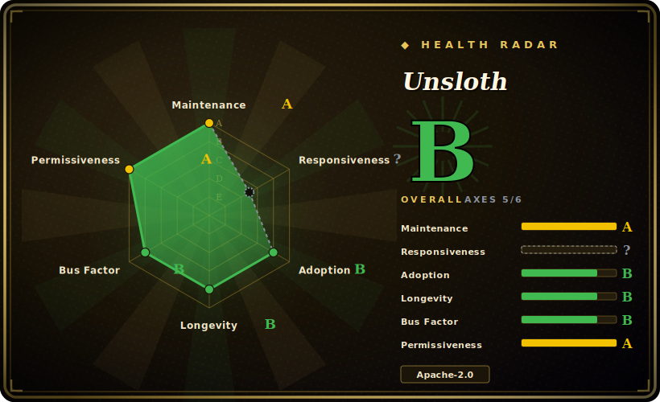

# Unsloth

Drop-in fine-tuning library that rewrites the hot paths of LoRA/QLoRA/RL training with hand-written Triton kernels to train open LLMs ~2x faster with large VRAM savings on a single GPU.

## When to use

You're a developer or solo researcher with a single consumer or workstation GPU (e.g. an RTX 4090, or a free Colab/Kaggle T4) and you want to fine-tune a Llama, Qwen, Mistral, Gemma or gpt-oss model on your own dataset. With stock Hugging Face + PEFT you keep hitting CUDA out-of-memory on QLoRA runs, or a single epoch takes long enough that iteration is painful. Unsloth swaps in its own Triton kernels (RoPE, MLP, attention, padding-free packing) and dynamic 4-bit quantization behind a near drop-in `FastLanguageModel` API, so the same QLoRA job fits in far less VRAM and finishes roughly 2x faster — the vendor cites "up to 2x faster with up to 70% less VRAM," and "80% less VRAM for GRPO" reinforcement-learning runs.

It shines when your constraint is one GPU and your goal is fast, cheap iteration: instruction tuning, domain adaptation, or RL (GRPO/DPO) of reasoning models that the docs claim can run in as little as ~5GB VRAM. Because it sits on top of `transformers`/`trl`, your training script, datasets and exported adapters stay in the familiar Hugging Face ecosystem, and you can export to GGUF/safetensors for downstream inference.

## When NOT to use

- **Multi-GPU / multi-node distributed training.** The open-source core is widely reported to be single-GPU only; multi-GPU scaling is gated behind paid Pro/Enterprise tiers [未验证]. Note the project's own README/site also advertises "Multi-GPU training support" — these claims conflict, so verify against the exact version you install before assuming distributed training works in the free package. If you need FSDP2/DeepSpeed-style sharding today, Axolotl or LLaMA-Factory are safer.
- **Full-parameter fine-tuning of large models.** Unsloth's sweet spot is parameter-efficient (LoRA/QLoRA) tuning that fits one GPU; large-scale full fine-tunes that need sharding fall outside the free single-GPU envelope.
- **Unsupported architectures.** It supports a large but curated model list; a brand-new or exotic architecture may not have optimized kernels until the maintainers add it.
- **Vendor-tier lock-in concerns.** Headline performance numbers (e.g. very high speed/VRAM multipliers) and multi-GPU are tied to commercial tiers; budget for that before committing to a production pipeline.
- **You want a fully config-driven, reproducible team workflow.** Unsloth is library/notebook-first; LLaMA-Factory (YAML + LlamaBoard UI) is more team/repro oriented.
- **Maintenance cadence risk.** It tracks fast-moving model releases on a frequent beta cadence; pin versions, because kernel/model support and APIs shift quickly.

## Comparison

| Alternative | In index | Our verdict | Tradeoff |
|---|---|---|---|
| [LLaMA-Factory](llamafactory.md) | ✅ | Use this page for its stated niche; choose LLaMA-Factory when you need broadest method/model coverage with YAML + web UI and real multi-GPU. | Broadest method/model coverage with YAML + web UI and real multi-GPU; can even use Unsloth as a backend. Unsloth is faster on a single GPU but narrower in workflow/scale. |
| [ART](art.md) | ✅ | Use this page for its stated niche; choose ART when you need agent-first GRPO trainer for multi-step agents (task + reward → RL loop). | Agent-first GRPO trainer for multi-step agents (task + reward → RL loop). Unsloth is a general fine-tuning/RL library, not an agent-trajectory framework. |
| [Agent Lightning](agent-lightning.md) | ✅ | Use this page for its stated niche; choose Agent Lightning when you need decouples agent execution from RL training to add RL to existing agents (LangChain/AutoGen/etc. | Decouples agent execution from RL training to add RL to existing agents (LangChain/AutoGen/etc.) with near-zero code change. Unsloth optimizes the training kernels, not agent orchestration. |
| Axolotl | 未收录 | Use this page for its stated niche; choose Axolotl when you need first-class multi-GPU (FSDP2/DeepSpeed) and strong multimodal support. | First-class multi-GPU (FSDP2/DeepSpeed) and strong multimodal support; the go-to once you outgrow a single GPU. Unsloth wins on single-GPU speed/VRAM. |
| torchtune | 未收录 | Use this page for its stated niche; choose torchtune when you need native-PyTorch recipes with explicit control and `torch. | Native-PyTorch recipes with explicit control and `torch.compile`; narrower model coverage. Unsloth offers higher single-GPU throughput and broader model list. |
| HF TRL | 未收录 | Use this page for its stated niche; choose HF TRL when you need reference SFT/DPO/GRPO trainers from Hugging Face. | Reference SFT/DPO/GRPO trainers from Hugging Face; Unsloth builds on TRL and accelerates it with custom kernels. |

## Tech stack

- **Language:** Python (with a TypeScript Studio UI component).
- **Core acceleration:** hand-written Triton kernels (RoPE, MLP, attention), padding-free packing, dynamic 4-bit quantization; FP8/16-bit/4-bit training paths.
- **Training methods:** LoRA, QLoRA, full fine-tune, and RL (GRPO/DPO) via a near drop-in `FastLanguageModel` API layered over `transformers`/`trl`.
- **Export/inference:** GGUF, LoRA adapters, safetensors; integrates with llama.cpp for inference.
- **Surfaces:** code library (Unsloth Core, Apache-2.0) plus an optional no-code web UI (Unsloth Studio, AGPL-3.0 components) [未验证 on exact licensing split].

## Dependencies

- PyTorch + CUDA (NVIDIA GPU; RTX 30/40/50, Blackwell, DGX cited; macOS and Intel/AMD support reported as expanding) [未验证].
- Triton (kernel compilation).
- Hugging Face `transformers`, `peft`, `trl`, `datasets`, and tokenizers.
- bitsandbytes-style 4-bit quantization stack (Unsloth ships its own dynamic 4-bit variants).
- llama.cpp for GGUF export/inference.

## Ops difficulty

**Low to medium.** For the intended path — one GPU, a Colab/Kaggle/notebook or a single script — it's low: install, swap to `FastLanguageModel`, train. Difficulty rises to medium when you fight CUDA/Triton/PyTorch version matrices on bespoke hardware, or when you try to push past the single-GPU free-tier ceiling (multi-GPU/full fine-tune), where the open-source story is contested and you may need a paid tier.

## Health & viability

- **Maintenance — active (as of 2026-06).** Last repo push 2026-06; ships on a fast beta cadence tracking new model releases. Active, not coasting [未验证]. The flip side is churn: kernel/model support and APIs shift quickly, so pin versions.
- **Governance & backing.** Org-owned (`unslothai/`) — a small VC-funded startup with a commercial Pro/Enterprise tier, not a foundation [推断]. The open-source single-GPU core and the gated multi-GPU/headline-perf tiers share one roadmap controlled by the vendor; viability tracks the company's runway, and the free-vs-paid line can move.
- **Age & Lindy verdict — young but fast-proving (created 2023-11, ~2.5y).** Too young for a strong Lindy prior, but ~67k stars (2026-06) and heavy ecosystem use mean it has cleared the "is anyone using this" bar; treat as an established-but-still-young bet, not a decade-stable one [推断].
- **Risk flags.** Open-core: the most-cited capabilities (multi-GPU, top perf multipliers) are tied to commercial tiers, and the OSS-multi-GPU claim is contested (see Caveats). Mixed licensing — Apache-2.0 core with AGPL-3.0 Studio components [未验证]. Budget for the paid tier before betting a production pipeline on it.

## Caveats (unverified)

- [未验证] Specific speed/VRAM multipliers ("2x faster," "70% less VRAM," "80% less VRAM for GRPO," "~5GB GRPO") are vendor claims; real gains depend on model, sequence length, batch size and GPU. LLM-related performance claims are not guaranteed.
- [未验证] Whether multi-GPU training works in the free Apache-2.0 package is contested: the repo/site advertises multi-GPU, while multiple third-party comparisons state OSS is single-GPU only and gate multi-GPU behind Pro/Enterprise. Verify on your installed version.
- [未验证] Star count cited around 67k (2026-06) from the GitHub page; star counts in this ecosystem are unreliable — treat as indicative only.
- [未验证] Exact supported-model count ("500+") and per-architecture kernel coverage vary by release; check the current docs.
- [未验证] Pricing figures for Pro/Enterprise seen in third-party sources are inconsistent; confirm on the official pricing page.
