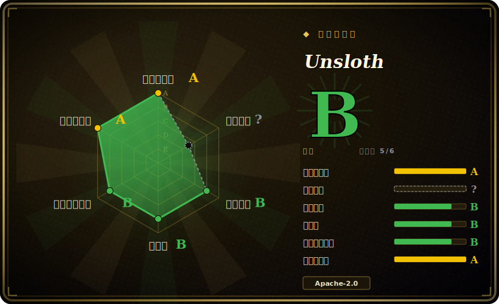

# Unsloth

近乎 drop-in 的微调库，用手写 Triton kernel 重写 LoRA/QLoRA/RL 训练的热点路径，在单张 GPU 上把开源 LLM 训练提速约 2x 并大幅节省显存。

## 何时使用

你是一名开发者或独立研究者，手头只有一张消费级或工作站 GPU（比如 RTX 4090，或免费的 Colab/Kaggle T4），想在自己的数据集上微调 Llama、Qwen、Mistral、Gemma 或 gpt-oss。用原生 Hugging Face + PEFT 时，你的 QLoRA 任务总是撞上 CUDA 显存不足，或者跑一个 epoch 慢到让迭代变得痛苦。Unsloth 在近乎 drop-in 的 `FastLanguageModel` API 背后换上自家 Triton kernel（RoPE、MLP、attention、padding-free packing）和动态 4-bit 量化，于是同一个 QLoRA 任务占用更少显存、速度大约快一倍——官方宣称「最高 2x 提速、最高省 70% 显存」，GRPO 强化学习「省 80% 显存」。

当你的瓶颈是「只有一张卡」、目标是「快速、低成本迭代」时它最合适：指令微调、领域适配，或对推理类模型做 RL（GRPO/DPO）——文档称最低可在约 5GB 显存内跑 GRPO。由于它构建在 `transformers`/`trl` 之上，你的训练脚本、数据集和导出的 adapter 仍留在熟悉的 Hugging Face 生态里，并可导出为 GGUF/safetensors 供下游推理。

## 何时不用

- **多卡 / 多机分布式训练。** 普遍报道开源核心仅支持单卡，多卡扩展被锁在付费 Pro/Enterprise 层 [未验证]。注意项目自己的 README/官网又宣传「支持多卡训练」——两类说法相互冲突，安装前请按你实际拉到的版本核实，别默认免费包能做分布式。若现在就要 FSDP2/DeepSpeed 式分片，Axolotl 或 LLaMA-Factory 更稳。
- **大模型全参微调。** Unsloth 的甜点区是能塞进单卡的参数高效（LoRA/QLoRA）微调；需要分片的大规模全参微调超出了免费单卡范围。
- **不受支持的架构。** 它支持的模型列表很大但是经过筛选的；全新或冷门架构在维护者补上前可能没有优化 kernel。
- **对厂商分层 lock-in 敏感。** 头条性能数字（极高的提速/省显存倍率）和多卡都绑定在商业层；投产前要为此预留预算。
- **想要完全 config 驱动、可复现的团队工作流。** Unsloth 偏库/notebook；LLaMA-Factory（YAML + LlamaBoard UI）更面向团队与复现。
- **维护节奏风险。** 它以高频 beta 节奏紧跟快速更新的模型发布，请锁版本，因为 kernel/模型支持和 API 变动很快。

## 横向对比

| 替代品 | 是否收录 | 我们的评价 | 取舍 |
|---|---|---|---|
| [LLaMA-Factory](llamafactory.zh.md) | ✅ | 当前页用于它的主场景；如果更看重“方法/模型覆盖最广，带 YAML + Web UI 和真正的多卡，甚至可把 Unsloth 当后端”，再选 LLaMA-Factory。 | 方法/模型覆盖最广，带 YAML + Web UI 和真正的多卡，甚至可把 Unsloth 当后端。Unsloth 单卡更快，但工作流/规模更窄。 |
| [ART](art.zh.md) | ✅ | 当前页用于它的主场景；如果更看重“agent-first 的 GRPO 训练器，面向多步 agent（任务+奖励→RL 循环）”，再选 ART。 | agent-first 的 GRPO 训练器，面向多步 agent（任务+奖励→RL 循环）。Unsloth 是通用微调/RL 库，不是 agent 轨迹框架。 |
| [Agent Lightning](agent-lightning.zh.md) | ✅ | 当前页用于它的主场景；如果更看重“把 agent 执行与 RL 训练解耦，近乎零改代码就给现有 agent（LangChain/AutoGen 等）加 RL”，再选 Agent Lightning。 | 把 agent 执行与 RL 训练解耦，近乎零改代码就给现有 agent（LangChain/AutoGen 等）加 RL。Unsloth 优化训练 kernel，不管 agent 编排。 |
| Axolotl | 未收录 | 当前页用于它的主场景；如果更看重“一等公民式多卡（FSDP2/DeepSpeed）+ 强多模态支持”，再选 Axolotl。 | 一等公民式多卡（FSDP2/DeepSpeed）+ 强多模态支持；超出单卡后的首选。Unsloth 在单卡速度/显存上更优。 |
| torchtune | 未收录 | 当前页用于它的主场景；如果更看重“原生 PyTorch recipe，控制更显式、带 `torch”，再选 torchtune。 | 原生 PyTorch recipe，控制更显式、带 `torch.compile`，但模型覆盖更窄。Unsloth 单卡吞吐更高、模型列表更广。 |
| HF TRL | 未收录 | 当前页用于它的主场景；如果更看重“Hugging Face 的 SFT/DPO/GRPO 参考训练器”，再选 HF TRL。 | Hugging Face 的 SFT/DPO/GRPO 参考训练器；Unsloth 构建在 TRL 之上并用自定义 kernel 加速它。 |

## 技术栈

- **语言：** Python（外加 TypeScript 的 Studio UI 组件）。
- **核心加速：** 手写 Triton kernel（RoPE、MLP、attention）、padding-free packing、动态 4-bit 量化；FP8/16-bit/4-bit 训练路径。
- **训练方法：** LoRA、QLoRA、全参微调，以及通过近乎 drop-in 的 `FastLanguageModel`（叠加在 `transformers`/`trl` 上）做 RL（GRPO/DPO）。
- **导出/推理：** GGUF、LoRA adapter、safetensors；与 llama.cpp 集成做推理。
- **形态：** 代码库（Unsloth Core，Apache-2.0）+ 可选的无代码 Web UI（Unsloth Studio，AGPL-3.0 组件）[未验证：具体许可拆分]。

## 依赖

- PyTorch + CUDA（NVIDIA GPU；引用了 RTX 30/40/50、Blackwell、DGX；macOS 与 Intel/AMD 支持据称在扩展中）[未验证]。
- Triton（kernel 编译）。
- Hugging Face `transformers`、`peft`、`trl`、`datasets` 与 tokenizers。
- bitsandbytes 式的 4-bit 量化栈（Unsloth 自带动态 4-bit 变体）。
- llama.cpp 用于 GGUF 导出/推理。

## 运维难度

**低到中。** 走它设计的路径——单卡、一个 Colab/Kaggle/notebook 或单脚本——难度低：装好、换成 `FastLanguageModel`、开训。当你在定制硬件上跟 CUDA/Triton/PyTorch 版本矩阵搏斗、或试图突破单卡免费层天花板（多卡/全参）时，难度升到中——此处开源版的说法存在争议，可能要走付费层。

## 健康度与可持续性

- **维护——活跃（截至 2026-06）。** 仓库最近一次 push 在 2026-06；以紧跟新模型发布的高频 beta 节奏迭代，是活跃而非吃老本 [未验证]。代价是 churn：kernel/模型支持和 API 变动很快，请锁版本。
- **治理与背书。** 组织所有（`unslothai/`）——一家有商业 Pro/Enterprise 层的小型 VC 资助初创，而非基金会 [推断]。开源单卡核心与被锁的多卡/头条性能层共享同一条由厂商掌控的路线图；可持续性取决于公司的现金流，且免费与付费的分界线可能移动。
- **年龄与 Lindy 判断——年轻但快速证明自己（创建于 2023-11，约 2.5 年）。** 太年轻，给不了强 Lindy 先验；但约 67k star（2026-06）加上生态的重度使用，说明它已越过「到底有没有人用」这道坎；当作一个已立足但仍年轻的押注，而非十年稳态的对象 [推断]。
- **风险标记。** 开放核心：最常被引用的能力（多卡、顶级性能倍率）绑定在商业层，且「开源版支持多卡」一说存在争议（见存疑）。混合许可——Apache-2.0 核心加 AGPL-3.0 的 Studio 组件 [未验证]。在把生产流水线押在它上面之前，先为付费层留预算。

## 存疑（未验证）

- [未验证] 具体的提速/省显存倍率（「2x 提速」「省 70% 显存」「GRPO 省 80% 显存」「约 5GB GRPO」）均为厂商宣称；真实收益取决于模型、序列长度、batch 大小和 GPU。LLM 相关性能宣称不作保证。
- [未验证] 免费 Apache-2.0 包是否支持多卡训练存在争议：仓库/官网宣传多卡，而多个第三方对比称开源版仅单卡、把多卡锁在 Pro/Enterprise。请按你安装的版本核实。
- [未验证] GitHub 页面引用的 star 数约 67k（2026-06）；该生态 star 数不可靠，仅作参考。
- [未验证] 确切的「500+」支持模型数与各架构 kernel 覆盖随版本而变；以当前文档为准。
- [未验证] 第三方来源看到的 Pro/Enterprise 价格不一致；以官方定价页为准。
