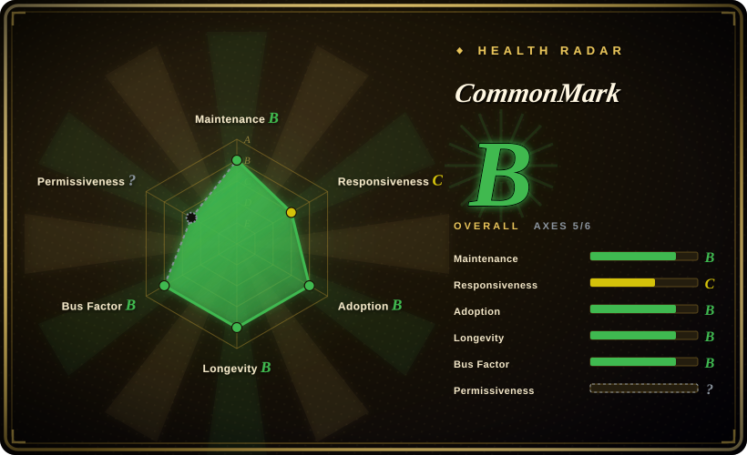

# CommonMark

The official reference implementation of the CommonMark Markdown specification — produces a traversable Concrete Syntax Tree (AST), but is not optimized for production rendering speed.

## When to use

You're building a tool that needs to validate Markdown parser correctness against the spec, or you're writing a research paper on Markdown parsing and need the canonical, spec-compliant baseline. You're a developer building a new Markdown parser or a linter, and you need a guaranteed-conformant reference to compare against. You import commonmark.js, feed it edge-case Markdown, and inspect the AST it produces — knowing that whatever it emits is the "ground truth" against which other parsers are measured. You traverse the concrete syntax tree to analyze document structure, build a custom renderer, or validate that your own parser handles every spec corner case correctly.

It's also the right reach when you're building tools that must guarantee spec compliance — a conformance test harness, a Markdown teaching tool, or any place where "what the spec says" is more important than "how fast can I get HTML".

## When NOT to use

- **You need a fast production Markdown→HTML renderer.** This is a reference implementation, not optimized for speed — marked and markdown-it are both faster for production rendering. [推断]
- **You need GFM features (tables, task lists, strikethrough, autolinks).** commonmark.js is CommonMark-only; GitHub Flavored Markdown is not built-in. [推断]
- **You need a plugin ecosystem.** Unlike markdown-it or remark, there is no plugin architecture — what you see is what you get. [推断]
- **You're rendering untrusted user Markdown without sanitizing.** Like most parsers, commonmark.js does not sanitize its output HTML; raw HTML passes through, so naive use is an XSS hole. You must run the output through a sanitizer yourself.
- **You want a one-call "give me HTML" library.** It gives you an AST; you walk the tree and render it yourself. The built-in HTML renderer is basic and exists mainly for demonstration, not production use.

## Comparison

| Alternative | In index | Our verdict | Tradeoff |
|---|---|---|---|
| [marked](marked.md) | ✅ | Choose marked when you need speed and a simple one-call renderer more than spec-reference behavior. | Fast, low-level Markdown→HTML parser with a tiny API surface; not spec-strict, and you must sanitize output yourself. |
| [markdown-it](markdown-it.md) | ✅ | Choose markdown-it when you need production Markdown→HTML rendering with CommonMark/GFM compliance and plugins. | Strict CommonMark/GFM-compliant, pluggable parser with a rich plugin catalog; heavier than marked and still requires sanitization. |
| [remark](remark.md) | ✅ | Choose remark when you need a full mdast AST pipeline for parsing, transforming, linting, and serializing. | Full mdast AST toolchain with a vast plugin ecosystem; far more powerful but also far heavier — a toolchain, not a one-call renderer. |
| [micromark](micromark.md) | ✅ | Choose micromark when you need the low-level tokenizer underneath remark, not a reference AST parser. | The streaming-oriented CommonMark/GFM tokenizer that powers remark; you build the rendering layer yourself. |
| Pandoc | 未收录 | Choose Pandoc when you need universal document conversion, not just Markdown parsing or conformance tests. | The universal document converter; can read/write dozens of formats, but it's a heavy CLI tool, not a JS library. |
| Goldmark | 未收录 | Choose Goldmark when you need a fast, extensible Markdown parser in Go. | A fast, extensible CommonMark/GFM parser written in Go; not for JS projects. |

## Tech stack

- **Language:** JavaScript (ES modules, runs in Node.js and browsers).
- **Architecture:** Parser produces a Concrete Syntax Tree (AST) as nested objects; you traverse and render the tree yourself. The built-in HTML renderer is minimal and exists mainly for spec validation and demonstration.
- **Spec alignment:** Implements the CommonMark specification exactly; spec version bumps drive package version bumps (v0.31.0 aligns with CommonMark spec 0.31).

## Dependencies

- **Runtime:** none — zero runtime dependencies.
- **Install:** `npm install commonmark`, or load the bundled browser build from a CDN.
- **Output handling:** the library emits an AST; HTML rendering is your responsibility. The package includes a basic HTML renderer, but no output sanitization — you must add DOMPurify or equivalent for untrusted input.

## Ops difficulty

**Low.** It's a library with no server or database to operate. The only real operational concern is that you must build your own rendering and sanitization pipeline on top of the AST if you target production use. No datastore, no runtime, no infra.

## Health & viability

- **Maintenance — stable, low churn.** As a reference implementation tied to the CommonMark spec, releases are driven by spec revisions rather than feature velocity. v0.31.0 aligns with the CommonMark spec version.
- **Governance & bus factor.** Maintained by John MacFarlane (creator of CommonMark and Pandoc), backed by the CommonMark project. Single-author reference implementations are normal for spec projects; the spec itself has broader governance.
- **Age & Lindy verdict — old and still active ⇒ strong Lindy.** The CommonMark project dates to 2014, and the JS reference implementation has been the conformance yardstick for a decade. A spec reference implementation that tracks its spec this closely is a very safe longevity bet.
- **Adoption & ecosystem.** Small community by design — it's a reference tool, not a production renderer. Measured by how many parser test suites depend on it, not by npm download counts.
- **Risk flags — minimal.** BSD-3-Clause license, no relicensing history, no commercial tier. The "risk" is its narrow scope: it will stay a reference implementation, not grow into a full-featured renderer.

## Caveats (unverified)

- [未验证] Exact star count and latest release version as of 2026-07 — verify against the GitHub repo if these matter to your decision.
- [推断] "Slower than marked/markdown-it" is inferred from the project's stated purpose as a reference implementation, not from benchmarks; run your own benchmarks if throughput is a concern.
- [推断] "No GFM support" is based on project documentation; verify if any GFM extensions have been added since the last check.
- [推断] "No runtime dependencies" is the project's own framing; confirm via the current `package.json` for your pinned version.
- [未验证] v0.31.0 alignment with CommonMark spec 0.31 — verify the current spec version and package version in the repo.
- [推断] John MacFarlane's authorship and CommonMark project backing are inferred from public documentation and repo ownership; confirm current maintainers for your evaluation window.
- [推断] "Age × still-active" Lindy assessment is based on the project's public history (CommonMark began ~2014); verify current commit and release cadence if recency matters.
- [推断] The built-in HTML renderer is described as minimal/basic — verify its current capabilities against your rendering needs.
- [推断] "No sanitization" applies to the AST output; any HTML renderer you build on top must include its own sanitization for untrusted input.
