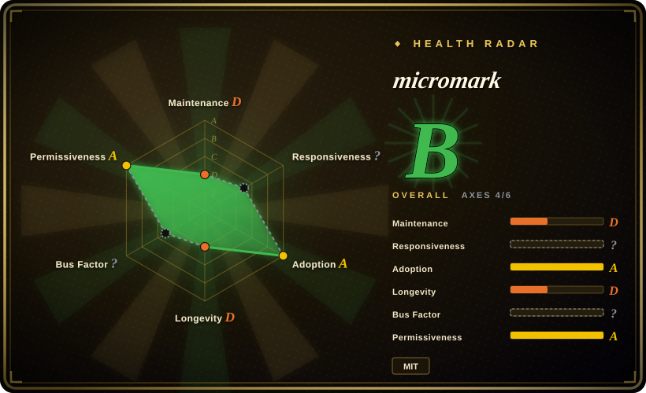

# micromark

A low-level, streaming-friendly CommonMark/GFM tokenizer for JavaScript — the engine underneath the remark/unified ecosystem. It turns Markdown into a token stream, not HTML; you build the rendering layer yourself.

## When to use

You're building a custom Markdown processor — maybe a linting tool, a syntax highlighter, a streaming preview pane, or a converter that emits something other than HTML (JSON, custom AST, PDF markup). You need full control over the tokenization pipeline, not a black-box `parse(src)` call. You want spec-compliant CommonMark and GFM behavior, and you care about correctness over convenience. You reach for micromark, feed it chunks of Markdown incrementally, and receive events you can route into your own rendering, transformation, or analysis layer. The unified collective uses it as the foundation for remark, so the tokenization is battle-tested and correct.

## When NOT to use

- **You just need to render Markdown to HTML.** micromark is a tokenizer, not a renderer. If you want `parse(src)` → HTML string, use [marked](marked.md) or markdown-it. [推断]
- **You want an off-the-shelf Markdown toolchain with plugins.** micromark is a low-level building block. For a full AST pipeline with plugins, linting, and serialization, use [remark](remark.md) or the unified ecosystem instead.
- **You're not comfortable building your own rendering layer.** micromark emits events/tokens; turning those into HTML or any other output format is your job. If you don't want to wire token handlers, a higher-level parser is the better fit.
- **You need the largest plugin ecosystem for Markdown extensions.** markdown-it has a rich catalog of ready-made plugins (footnotes, containers, KaTeX, etc.); micromark's extension surface is lower-level and requires more manual wiring.

## Comparison

| Alternative | In index | Our verdict | Tradeoff |
|---|---|---|---|
| [marked](marked.md) | ✅ | Choose marked when you want a fast, one-call Markdown→HTML renderer with a small API surface. | Fast, low-level Markdown→HTML parser; not spec-strict and requires output sanitization, but the right fit when you need HTML now. |
| [markdown-it](markdown-it.md) | ✅ | Choose markdown-it when you need a strict CommonMark/GFM-compliant, pluggable Markdown→HTML parser with a rich plugin ecosystem. | CommonMark-strict, pluggable architecture with a rich plugin ecosystem; heavier API than marked, but the choice when spec conformance and plugins matter. |
| [remark](remark.md) | ✅ | Choose remark when you need a full mdast AST pipeline for parsing, transforming, linting, and serializing Markdown. | Full mdast AST pipeline built on top of micromark; far more powerful and far heavier — a toolchain, not a raw tokenizer. |
| [CommonMark](commonmark.md) | ✅ | Choose CommonMark when you need the spec's reference implementation instead of the tokenizer layer remark uses. | The spec's own reference implementation; the conformance yardstick, but fewer GFM niceties and not optimized as a production tokenizer. |
| Pandoc | 未收录 | Choose Pandoc when you need a universal document converter across dozens of formats. | Universal document converter; not a JS library, and overkill if you only need Markdown tokenization. |
| Goldmark | 未收录 | Choose Goldmark when you need a fast, extensible Markdown parser in Go. | Fast, extensible Markdown parser in Go; not JavaScript, so choose it for Go projects, not JS/browser stacks. |

## Tech stack

- **Language:** JavaScript (ships as ESM and CJS; distributed on npm).
- **Runtime targets:** Node.js and browsers (the tokenizer runs in both environments).
- **Architecture:** Event-driven tokenizer that emits a stream of tokens/events as it parses Markdown incrementally; designed for streaming input where you may not have the full document in memory at once.
- **Standards:** CommonMark-compliant core with GFM extensions (tables, strikethrough, autolinks, task lists, etc.) available as separate extension packages.
- **Size:** Very small, zero runtime dependencies.

## Dependencies

- **Runtime:** none — micromark is dependency-free by design.
- **Ecosystem:** sits at the base of the unified/remark ecosystem; remark and related packages consume micromark as their tokenizer.
- **Install:** `npm install micromark` (or `micromark-util-*` / `micromark-extension-*` packages for utilities and GFM extensions).

## Ops difficulty

**Low.** It's a library with no runtime services to deploy. The operational burden is limited to understanding its low-level API: you must wire your own token handlers to produce useful output, and you should pin the major version since the tokenizer API is deliberately narrow but may shift across major versions. No datastore, no daemon, no infra.

## Health & viability

- **Maintenance — active (last verified 2026-07).** The v4.0.x line is actively maintained by the unified collective; regular releases keep pace with CommonMark spec evolution and GFM updates.
- **Governance & bus factor.** Maintained by the unified collective (Titus Wormer and contributors), not a single maintainer's free-time project. The unified ecosystem has a long track record of steady, principled maintenance across its many packages.
- **Age & Lindy verdict — young but proven by ecosystem weight.** micromark itself is a more recent rewrite/extraction (the unified ecosystem dates back to ~2015), but it powers remark and the entire unified markdown toolchain, which gives it production-grade credibility despite a modest ~1k star count.
- **Adoption & ecosystem.** Used as the tokenizer for remark, mdast, and the entire unified ecosystem — a significant production dependency even if the direct star count looks small. [推断]
- **Risk flags — minimal.** MIT-licensed, no relicensing history, no open-core gating. The unified collective has a consistent governance model across its packages.

## Caveats (unverified)

- [未验证] ~1k GitHub stars as of 2026-07; star count is low because this is a low-level library, not an end-user tool — verify current count against the repo.
- [未验证] v4.0.x active as of 2026-07; version and release cadence should be verified against the repo's latest tags.
- [推断] "Zero runtime dependencies" is micromark's design intent; confirm against the current `package.json` for your pinned version.
- [未验证] Streaming correctness and incremental parsing behavior for very large documents or edge-case Markdown constructs should be tested against your specific workload if streaming is a hard requirement.
