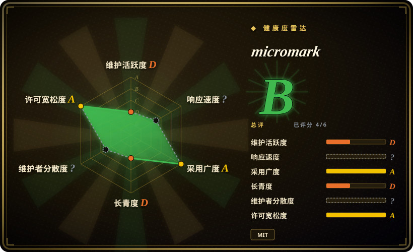

# micromark

一个低层、面向流式处理的 JavaScript CommonMark/GFM 分词器——remark/unified 生态的底层引擎。它把 Markdown 变成 token 流，而非 HTML；渲染层要你自己搭。

## 何时使用

你在构建一个自定义 Markdown 处理器——可能是 linter、语法高亮器、流式预览面板，或者一个输出非 HTML（JSON、自定义 AST、PDF 标记）的转换器。你需要对分词管线拥有完全控制权，而不是一个黑盒的 `parse(src)` 调用。你想要符合规范的 CommonMark 和 GFM 行为，并且更看重正确性而非便利性。你选用 micromark，把 Markdown 分块增量喂进去，收到事件后路由到你自己的渲染、变换或分析层。unified 集体用它作为 remark 的基础，因此这套分词机制经过实战检验且正确。

## 何时不用

- **你只需要把 Markdown 渲染成 HTML。** micromark 是分词器，不是渲染器。如果你要 `parse(src)` → HTML 字符串，请用 [marked](marked.zh.md) 或 markdown-it。[推断]
- **你想要开箱即用的 Markdown 工具链和插件。** micromark 是低层构建块。若要完整的 AST 管线（带插件、lint、序列化），请改用 [remark](remark.zh.md) 或 unified 生态。
- **你不习惯自己搭渲染层。** micromark 输出事件/token；把它们转成 HTML 或其他格式是你自己的事。如果你不想接线 token 处理器，高层的解析器更合适。
- **你需要最大的 Markdown 扩展插件生态。** markdown-it 有丰富的现成插件目录（脚注、容器、KaTeX 等）；micromark 的扩展面更底层，需要更多手工接线。

## 横向对比

| 替代品 | 是否收录 | 我们的评价 | 取舍 |
|---|---|---|---|
| [marked](marked.zh.md) | ✅ | 想要快速、一次调用的 Markdown→HTML 渲染器且 API 面很小时，选 marked。 | 快速、低层 Markdown→HTML 解析器；默认不够规范严格且输出需自行消毒，但当你立刻需要 HTML 时它是对的。 |
| [markdown-it](markdown-it.zh.md) | ✅ | 需要严格遵循 CommonMark/GFM、可插拔、插件生态丰富的 Markdown→HTML 解析器时，选 markdown-it。 | CommonMark 严格、可插拔架构，插件生态丰富；API 比 marked 重，但当规范一致和插件重要时它是首选。 |
| [remark](remark.zh.md) | ✅ | 需要完整的 mdast AST 管线，能解析、变换、lint、序列化 Markdown 时，选 remark。 | 在 micromark 之上构建的完整 mdast AST 管线；强大得多也重得多——是工具链，不是原始分词器。 |
| [CommonMark](commonmark.zh.md) | ✅ | 需要规范参考实现，而不是 remark 使用的 tokenizer 层时，选 CommonMark。 | 规范自己的参考实现；是一致性标尺，但 GFM 便利特性更少，也未针对生产分词做优化。 |
| Pandoc | 未收录 | 需要跨数十种格式的通用文档转换器时，选 Pandoc。 | 通用文档转换器；不是 JS 库，如果你只需要 Markdown 分词，用它过度。 |
| Goldmark | 未收录 | 需要 Go 里快速、可扩展的 Markdown 解析器时，选 Goldmark。 | 快速、可扩展的 Go Markdown 解析器；不是 JavaScript，所以为 Go 项目选它，而非 JS/浏览器栈。 |

## 技术栈

- **语言：** JavaScript（以 ESM 和 CJS 形式分发；走 npm 发布）。
- **运行目标：** Node.js 和浏览器（分词器在两种环境里都能跑）。
- **架构：** 事件驱动的分词器，在解析 Markdown 时增量地输出 token/事件流；针对流式输入设计，你可能不必一次性把整个文档装进内存。
- **标准：** 核心符合 CommonMark；GFM 扩展（表格、删除线、自动链接、任务列表等）以独立扩展包形式提供。
- **体积：** 非常小，零运行时依赖。

## 依赖

- **运行时：** 无——micromark 在设计上就不依赖任何外部库。
- **生态：** 位于 unified/remark 生态的底层；remark 及相关包把它当作自己的分词器消费。
- **安装：** `npm install micromark`（或 `micromark-util-*` / `micromark-extension-*` 包，用于工具和 GFM 扩展）。

## 运维难度

**低。** 它是库，没有要部署的运行时服务。运维负担主要在于理解它的低层 API：你必须自己接线 token 处理器才能产出有用的输出，并建议锁定大版本，因为分词器 API 被刻意做得很窄，但跨大版本仍可能变动。没有数据存储、没有守护进程、没有基础设施。

## 健康度与可持续性

- **维护——活跃（末次验证 2026-07）。** v4.0.x 线由 unified 集体积极维护；规律发布紧跟 CommonMark 规范演进和 GFM 更新。
- **治理与 bus factor。** 由 unified 集体（Titus Wormer 及贡献者）维护，不是单个维护者的业余项目。unified 生态在多个包上拥有长期、稳定、有原则的持续维护记录。
- **年龄与 Lindy 判断——年轻但靠生态重量得到验证。** micromark 本身是一次较新的重构/提取（unified 生态可追溯至约 2015 年），但它驱动 remark 和整个 unified Markdown 工具链，这赋予了它生产级的可信度，尽管 star 数仅约 1k。[推断]
- **采用度与生态。** 作为 remark、mdast 和整个 unified 生态的分词器——是一个重要的生产依赖，即使直接 star 数看起来很小。[推断]
- **风险标记——很少。** MIT 许可，无 relicense 历史，无开放核心锁特性。unified 集体在其包上保持一致的治理模式。

## 存疑（未验证）

- [未验证] 截至 2026-07 约 1k GitHub star；star 数低是因为它是低层库，不是终端用户工具——请对照仓库核实当前数量。
- [未验证] 截至 2026-07 v4.0.x 活跃；版本和发布节奏请对照仓库最新标签核实。
- [推断]“零运行时依赖”是 micromark 的设计意图；请对照你所用版本的 `package.json` 确认。
- [未验证] 超大文档或边界情况 Markdown 构造下的流式正确性与增量解析行为，若流式是硬性需求，请针对你的具体 workload 测试。
