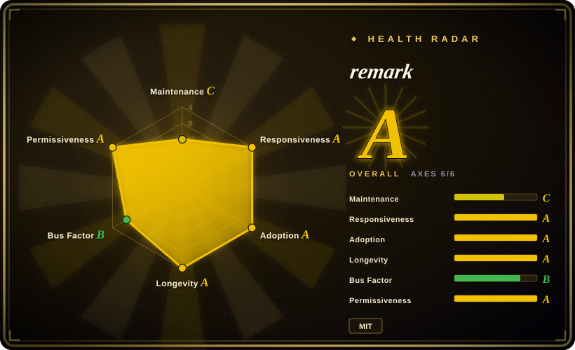

# remark

A markdown processor built on the unified ecosystem — parses Markdown into an AST, runs plugins to transform or lint, and serializes to Markdown, HTML, MDX, or other formats.

## When to use

You're building a documentation pipeline or a static site generator that needs more than "render Markdown to HTML". You want to parse Markdown into a structured AST (mdast), run lint rules (broken links, heading style, prose quality), transform content (inject tables of contents, rewrite image paths, add syntax highlighting), and optionally emit HTML, MDX, or even a different Markdown dialect. You reach for remark because it gives you a full pipeline: `remark().use(remarkGfm).use(remarkLint).process(src)` turns raw Markdown into a validated, transformed document tree that you can serialize however you need. It's the right tool when you need to *programmatically manipulate* Markdown before rendering, not just convert it.

## When NOT to use

- **You just need a one-call "Markdown → HTML" renderer.** remark is a toolchain, not a single function. If you only need to render Markdown strings to HTML and don't care about AST inspection, linting, or plugin transforms, marked or markdown-it is lighter and simpler. [推断]
- **You're not comfortable with AST concepts and plugin composition.** remark requires understanding the unified pipeline (parser → transformer → compiler), mdast node types, and how plugins chain together. The learning curve is real — if your team doesn't have time to learn this model, a simpler parser will ship faster.
- **You need strict CommonMark conformance without plugins.** remark is built on micromark (which is CommonMark-compliant) but the full unified pipeline adds layers; for raw conformance testing or the reference implementation itself, use commonmark.js.
- **You need a universal document converter (not just Markdown).** remark handles Markdown and MDX. If you need to convert between Word, LaTeX, PDF, reStructuredText, and Markdown, Pandoc is the universal tool — not remark.

## Comparison

| Alternative | In index | Our verdict | Tradeoff |
|---|---|---|---|
| [marked](../markdown-tools/marked.md) | ✅ | Use this page for its stated niche; choose marked when you need a fast, zero-dep, one-call Markdown→HTML parser with a tiny API surface. | Fast, zero-dep, one-call Markdown→HTML parser with a tiny API surface; no AST or plugin pipeline, so you can't lint or transform before rendering. |
| markdown-it | 未收录 | Use this page for its stated niche; choose markdown-it when you need a CommonMark-strict, pluggable parser with a large plugin catalog and a simpler API than remark. | CommonMark-strict, pluggable parser with a large plugin catalog; simpler API than remark but still lacks the full AST-transform toolchain of unified. |
| micromark | 未收录 | Use this page for its stated niche; choose micromark when you need the low-level streaming tokenizer underneath remark (e.g., for a custom renderer). | The low-level streaming tokenizer underneath remark; correct and fast, but you build the entire rendering and transform layer yourself. |
| CommonMark reference (commonmark.js) | 未收录 | Use this page for its stated niche; choose commonmark.js when you need the spec's own reference implementation for conformance testing. | The spec's own reference implementation; the conformance yardstick, but no plugin ecosystem and not optimized for production rendering. |
| Pandoc | 未收录 | Use this page for its stated niche; choose Pandoc when you need a universal document converter across dozens of formats (Word, LaTeX, PDF, etc.). | Universal document converter across dozens of formats; a heavyweight binary, not a JS toolchain, and overkill if you only need Markdown manipulation. |

## Tech stack

- **Language:** JavaScript (TypeScript types available; the ecosystem is implemented in modern JS). [推断]
- **Runtime targets:** Node.js and browser (via bundlers); distributed as ESM/CJS on npm.
- **Architecture:** unified pipeline — `remark` wraps `micromark` (parser) and `mdast-util-to-markdown` (compiler) with a plugin-based transformer stage in between. The AST format is mdast (Markdown Abstract Syntax Tree).
- **Ecosystem:** `remark-lint` for linting, `remark-gfm` for GitHub Flavored Markdown, `remark-mdx` for JSX-in-Markdown, `rehype` for HTML output, `remark-frontmatter` for YAML/TOML frontmatter, and hundreds of community plugins.

## Dependencies

- **Runtime:** Node.js ≥ 18 (modern versions) or a bundler for browser use. [未验证]
- **Peer ecosystem:** plugins are installed separately (`remark-lint`, `remark-gfm`, etc.) — the core is small but real projects typically pull in 5–15 plugin packages.
- **Install:** `npm install remark`, then add plugins as needed; ecosystem packages are scoped under `@remarkjs/` or published as `remark-*` on npm.

## Ops difficulty

**Low to medium.** It's a library/toolchain, not a service — no server to deploy. The operational burden is in dependency management: a typical remark pipeline depends on the core plus multiple plugins, each with their own version cycles. You need to track plugin compatibility with the remark/unified major version you pin. The pipeline itself is pure JS, so no runtime infra, but debugging AST transforms can be subtle (inspect the mdast tree with `console.log` or use `unist-util-inspect`).

## Health & viability

- **Maintenance — active.** The unified collective (led by Titus Wormer and contributors) ships regular releases across the ecosystem; remark v15.x is current as of 2026-07. [未验证]
- **Governance & bus factor.** Collective-maintained under the `remarkjs/` GitHub org; the unified ecosystem has a small but dedicated core team with a long track record. Not a single-person project, but not a large foundation either — the collective model spreads risk across several maintainers. [推断]
- **Backing & longevity.** The unified ecosystem has been active since ~2015 (~11 years), with remark itself a core and stable pillar. Age × still-active gives a solid Lindy signal: it's been the default markdown pipeline for major docs tools for years. [推断]
- **Adoption & ecosystem.** Used by Next.js (MDX), Gatsby, Docusaurus, and many documentation sites. The plugin ecosystem is rich and well-documented at unifiedjs.com. [推断]
- **Risk flags — minimal.** MIT-licensed with no relicensing history; no open-core or commercial tier. The main risk is ecosystem complexity: the unified/remark/rehype/mdast family has many moving parts and occasional major-version bumps across multiple packages. [推断]

## Caveats (unverified)

- [未验证] v15.x and ~7k GitHub stars as of 2026-07; verify current version and star count against the repo.
- [未验证] Node.js ≥ 18 requirement for current versions; check the engine field in `package.json` for the version you pin.
- [推断] "Used by Next.js, Gatsby, Docusaurus" is based on public documentation and dependency graphs; confirm for your specific version.
- [推断] The unified ecosystem has been active since ~2015; exact founding date and collective structure details are best verified via the unifiedjs.com site and GitHub org pages.
