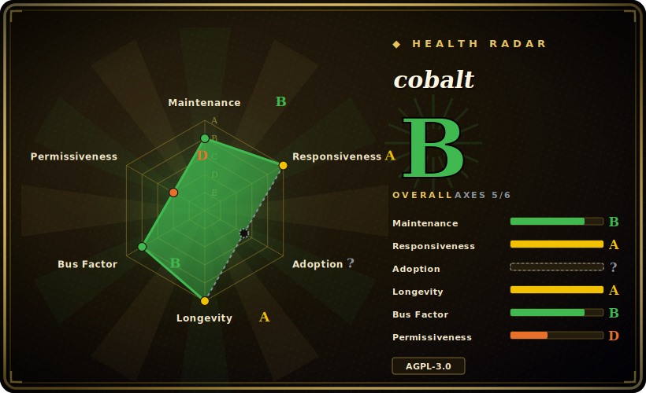

# cobalt

A self-hostable media downloader with a clean web UI and a JSON API — paste a link from many social sites and it hands back the video or audio, with no ads, trackers, or paywalls.

## When to use

You're a self-hoster (or a small team) who wants a friendly, browser-based way to save clips and audio from social platforms — YouTube, TikTok, Instagram, Twitter, Reddit, SoundCloud, Vimeo, and more — without installing a CLI on every machine or teaching non-technical people to run `pip` and command flags. You want a single page where anyone on your network pastes a URL and gets a download, and you don't want that page littered with ads, trackers, or a paywall nudging you toward a "pro" tier. You spin up the cobalt API (the `/api` backend) and the Svelte web frontend (the `/web` directory) with Docker, point the UI at your own API instance, and now you have a private, clean media saver you control — or you skip hosting entirely and use a public instance someone else runs.

You also reach for it when you want a *small JSON API* in front of media extraction rather than a scriptable binary: an internal tool or bot POSTs a URL to your cobalt instance and gets back a direct media link, so the extraction logic lives behind one HTTP endpoint you operate instead of being bundled into every caller. The draw is the product experience — clean UI, simple API, no nonsense — over raw scripting power.

## When NOT to use

- **AGPL-3.0 network copyleft is a problem for you.** This is the sharpest filter. cobalt is AGPL-3.0: if you run a modified version as a *network service* that others interact with, the license requires you to offer those users your modified source. For an internal/personal instance that's usually fine, but if you want to fork it into a closed hosted product, the AGPL obligation follows the service — weigh it before building on top. [推断]
- **You need a scriptable CLI or embeddable library for a pipeline.** cobalt is a *UI/API service*, not a pip-installable downloader you pin in `requirements.txt` and call from cron. For archival jobs, batch ingest, or anything that wants a binary returning files via output templates, use **yt-dlp** or [youtube-dl](youtube-dl.md) instead — they're built for the pipeline, cobalt is built for the browser.
- **Legal / ToS exposure.** Downloading copyrighted media or violating a site's Terms of Service is on you, not the tool. Many target sites prohibit downloading; running a *public* instance that others use can broaden that exposure. Check the law and each site's ToS before standing one up.
- **You can't or won't run the ops.** A self-hosted instance is a service you operate — exposed to the internet it attracts abuse, scraping, and bandwidth costs, so you'll need rate-limiting, monitoring, and probably auth/tokens. If you don't want to run and defend a service, a CLI that "executes and exits" is less to babysit.
- **You depend on one specific site working today.** Like all extractors, cobalt chases sites as they change their players; a given platform can break between updates. Verify the specific site you care about against the current instance, don't assume blanket coverage. [未验证]

## Comparison

| Alternative | In index | Our verdict | Tradeoff |
|---|---|---|---|
| [youtube-dl](youtube-dl.md) | ✅ | Use this page for its stated niche; choose youtube-dl when you need python CLI / library driven by ~1000 per-site extractors. | Python CLI / library driven by ~1000 per-site extractors; built for scripting and pipelines, no service to run — but a command-line tool, not a browser UI, and its upstream release cadence has slowed (yt-dlp is the active successor). |
| yt-dlp | 未收录 | Use this page for its stated niche; choose yt-dlp when you need the actively-maintained youtube-dl fork. | The actively-maintained youtube-dl fork; the de-facto CLI for YouTube extraction with the broadest, fastest-updated site support. A scriptable binary, not a hosted UI/API service like cobalt. |
| you-get | 未收录 | Use this page for its stated niche; choose you-get when you need python command-line downloader with its own site list. | Python command-line downloader with its own site list; simpler UX than yt-dlp but a smaller, less-actively-tracked extractor catalog — still a CLI, not a web service. |
| gallery-dl | 未收录 | Use this page for its stated niche; choose gallery-dl when you need specializes in *image/gallery* sites (boorus, social-media galleries) rather than video/audio. | Specializes in *image/gallery* sites (boorus, social-media galleries) rather than video/audio; complementary to cobalt, not a substitute. |

## Tech stack

- **Frontend:** Svelte web app (the `/web` directory) — the clean single-page UI users paste links into.
- **Backend:** a Node-based JSON API (the `/api` directory) that does the extraction and returns media links; the UI is a client of this API and can be pointed at any instance.
- **Languages:** GitHub reports the repo as predominantly Svelte, with substantial JavaScript and TypeScript — consistent with a Svelte UI plus a JS/TS Node API.
- **Deployment:** Docker images and environment-variable configuration are the documented self-host path.

## Dependencies

- **Runtime (yours to run):** to self-host you operate the API service (and typically the web UI); the documented path uses Docker, so a container runtime is the practical baseline.
- **Configuration:** environment variables configure an instance (e.g. its API URL and operational settings); the web UI must be pointed at an API instance to function.
- **Network:** outbound HTTP(S) to the target sites for extraction, plus an inbound entry point (and ideally a reverse proxy / TLS) if you expose the UI/API beyond localhost.
- **No download client needed by the user:** end users just need a browser — the "dependency" burden is on the operator, not the consumer.

## Ops difficulty

**Medium.** Unlike a CLI that executes and exits, cobalt is a *service you run and keep running*. The happy path is reasonable — Docker plus a handful of environment variables brings up the API and UI — but operating it long-term means the usual service burdens: a reverse proxy and TLS if it's public, monitoring and restarts, and crucially **abuse control**. A publicly reachable downloader is a magnet for scraping and bandwidth abuse, so you'll want rate-limiting and likely API tokens/auth so it isn't an open relay. You also inherit extractor fragility: when a target site changes, you update the instance to keep it working. For a private, localhost-only instance this is light; for a public one, budget for the operational and bandwidth cost.

## Health & viability

- **Maintenance — active (last push ~2026-04, as of 2026-06).** Not archived; ongoing development consistent with chasing site-player changes (an extractor-style downloader has to stay current to keep working) [未验证]. Treat continued activity as load-bearing for this tool class — a stale extractor silently breaks.
- **Governance & backing.** `Org`-owned (`imputnet/cobalt`) — a small team/org behind a public-instance product, not a foundation and not a large vendor [推断]. Roadmap and the official public instance sit with that team; self-hosting insulates you from any single instance going away, which is the main resilience lever here.
- **Age & Lindy verdict — mid-young (created 2022-07, ~4y).** Old enough to have proven the product and accumulated ~41k stars, young enough that there's no decade-long track record; a reasonable-but-not-bulletproof bet whose real fragility is per-site extractor breakage, not project death [推断].
- **Risk flags — AGPL-3.0 network copyleft (load-bearing).** This is the sharpest flag: run a *modified* version as a network service and you owe users your source. Fine for internal/personal instances; a blocker if you want to fork it into a closed hosted product (see When NOT to use / Caveats) [推断]. Plus the legal/ToS exposure inherent to running a public downloader.

## Caveats (unverified)

- [未验证] ~41.3k GitHub stars as of 2026-06 and "active (2026-04)" — star counts and activity dates are time-sensitive and unreliable; treat as indicative and re-check the repo.
- [未验证] Frontend is Svelte (`/web`) and the backend is a Node JSON API (`/api`); the precise backend runtime/framework was inferred from the repo's reported language mix and directory layout, not read from source — verify against the repo.
- [未验证] The set of supported sites (YouTube, TikTok, Instagram, Twitter, Reddit, SoundCloud, Vimeo, VK, …) comes from project framing and changes over time; confirm the specific site you need against the current instance.
- [未验证] "No ads, trackers, or paywalls" is the project's own stated positioning, not independently audited here.
- [推断] AGPL-3.0 network-copyleft obligations for a hosted/modified service are a general reading of the license, not legal advice — consult the LICENSE and counsel if the obligation is load-bearing for your use.
- [推断] Docker + environment-variable configuration is described as the documented self-host path; exact required variables and minimum versions shift release-to-release — follow the repo's current docs.
