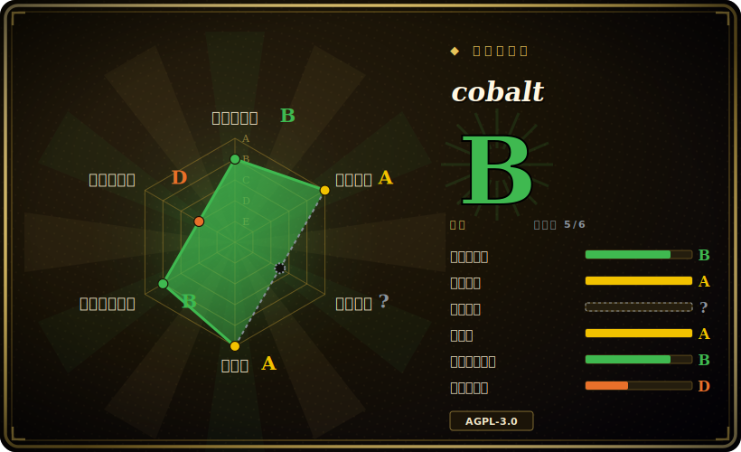

# cobalt

一个可自托管的媒体下载器，带干净的 Web UI 和一个 JSON API——把许多社交站点的链接粘进去，它就把视频或音频还给你，没有广告、追踪器，也没有付费墙。

## 何时使用

你是一个自托管用户（或一个小团队），想要一种友好的、基于浏览器的方式，从社交平台保存片段和音频——YouTube、TikTok、Instagram、Twitter、Reddit、SoundCloud、Vimeo 等等——又不想在每台机器上装 CLI，也不想教不懂技术的人去跑 `pip` 和一堆命令行参数。你想要一个页面：网络里任何人粘进一个 URL 就能拿到下载，而这个页面上不堆广告、不埋追踪器，也没有付费墙把你往“pro”档推。你用 Docker 把 cobalt 的 API（`/api` 后端）和 Svelte 的 Web 前端（`/web` 目录）起起来，把 UI 指向你自己的 API 实例，于是你就有了一个完全自控、干净的媒体保存器——或者你干脆不自己托管，直接用别人跑的公共实例。

当你想要的是在媒体抽取前面放一个*小巧的 JSON API*、而非一个可脚本化的二进制时，你也会选它：某个内部工具或机器人把一个 URL POST 给你的 cobalt 实例，拿回一个直链，于是抽取逻辑藏在一个你运维的 HTTP 端点后面，而不是塞进每个调用方。它的吸引力在于产品体验——干净的 UI、简单的 API、不搞那些花活——而非裸的脚本能力。

## 何时不用

- **AGPL-3.0 的网络 copyleft 对你是个问题。** 这是最锋利的筛子。cobalt 是 AGPL-3.0：如果你把一个修改过的版本作为*网络服务*跑给别人用，许可证要求你向这些用户提供你修改后的源码。对内部/个人实例通常无所谓，但若你想把它 fork 成一个闭源托管产品，AGPL 义务会随服务一并附着——动手前先权衡。[推断]
- **你需要可脚本化的 CLI 或可内嵌的库来做流水线。** cobalt 是一个 *UI/API 服务*，不是能写进 `requirements.txt`、从 cron 调用的 pip 下载器。做归档、批量入库，或任何想要一个能用输出模板返回文件的二进制的场景，请改用 **yt-dlp** 或 [youtube-dl](youtube-dl.zh.md)——它们是为流水线而生，cobalt 是为浏览器而生。
- **法律 / ToS 暴露。** 下载受版权保护的媒体、或违反站点服务条款，责任在你而不在工具。很多目标站点禁止下载；跑一个供别人使用的*公共*实例会放大这种暴露。在搭起来之前，先核对法律和每个站点的 ToS。
- **你跑不动、也不想跑运维。** 自托管实例是一个你要运维的服务——一旦暴露到公网就会招来滥用、爬取和带宽成本，所以你需要限流、监控，很可能还要鉴权/token。如果你不想运维并防守一个服务，那么“执行完就退出”的 CLI 要省心得多。
- **你硬依赖某个具体站点今天还能用。** 和所有抽取器一样，cobalt 也要追着站点改版跑；某个平台可能在两次更新之间就崩了。请对照当前实例核实你在意的那个站点，别假设全面覆盖。[未验证]

## 横向对比

| 替代品 | 是否收录 | 我们的评价 | 取舍 |
|---|---|---|---|
| [youtube-dl](youtube-dl.zh.md) | ✅ | 当前页用于它的主场景；如果更看重“Python CLI / 库，靠约 1000 个按站点划分的 extractor 驱动”，再选 youtube-dl。 | Python CLI / 库，靠约 1000 个按站点划分的 extractor 驱动；为脚本和流水线而生、没有服务要跑——但它是命令行工具而非浏览器 UI，且上游发布节奏已放缓（yt-dlp 才是活跃继任者）。 |
| yt-dlp | 未收录 | 当前页用于它的主场景；如果更看重“youtube-dl 的活跃维护分叉”，再选 yt-dlp。 | youtube-dl 的活跃维护分叉；YouTube 抽取事实上的 CLI，站点支持最广、更新最快。是可脚本化的二进制，而非 cobalt 那样的托管 UI/API 服务。 |
| you-get | 未收录 | 当前页用于它的主场景；如果更看重“Python 命令行下载器，自带站点列表”，再选 you-get。 | Python 命令行下载器，自带站点列表；UX 比 yt-dlp 简单，但 extractor 目录更小、跟进更不积极——同样是 CLI，不是 Web 服务。 |
| gallery-dl | 未收录 | 当前页用于它的主场景；如果更看重“专攻*图片/图集*站点（booru、社交媒体图集），而非视频/音频”，再选 gallery-dl。 | 专攻*图片/图集*站点（booru、社交媒体图集），而非视频/音频；与 cobalt 互补，不是替代。 |

## 技术栈

- **前端：** Svelte Web 应用（`/web` 目录）——用户粘链接进去的那个干净单页 UI。
- **后端：** 一个基于 Node 的 JSON API（`/api` 目录），负责抽取并返回媒体链接；UI 是这个 API 的客户端，可指向任意实例。
- **语言：** GitHub 报告该仓库以 Svelte 为主，并有大量 JavaScript 和 TypeScript——与“Svelte UI + JS/TS 的 Node API”一致。
- **部署：** 文档化的自托管路径是 Docker 镜像加环境变量配置。

## 依赖

- **运行时（你自己跑）:** 要自托管，你得运维 API 服务（通常还有 Web UI）；文档化路径用 Docker，所以容器运行时是实际的基线。
- **配置：** 用环境变量配置一个实例（例如它的 API URL 和运维设置）；Web UI 必须指向一个 API 实例才能工作。
- **网络：** 抽取时到目标站点的出站 HTTP(S)，外加一个入站入口（若要把 UI/API 暴露到 localhost 之外，最好再加反向代理 / TLS）。
- **用户侧无需下载客户端：** 终端用户只要一个浏览器——“依赖”负担落在运维者身上，而非消费者。

## 运维难度

**中。** 不像执行完就退出的 CLI，cobalt 是一个*你要跑起来并持续跑着*的服务。顺路径还算合理——Docker 加上一把环境变量就能把 API 和 UI 起起来——但长期运维意味着常规的服务负担：公网暴露要反向代理和 TLS、监控和重启，尤其是**滥用控制**。一个公网可达的下载器是爬取和带宽滥用的磁石，所以你会想要限流，很可能还要 API token/鉴权，免得它成了开放中继。你还会继承抽取器的脆弱性：目标站点改版时，你得更新实例才能让它继续可用。对一个私有、仅 localhost 的实例，这些很轻；但对公共实例，要给运维和带宽成本留预算。

## 健康度与可持续性

- **维护——活跃（最近一次 push 约 2026-04，截至 2026-06）。** 未归档；持续开发，与「追着站点播放器改版跑」一致（抽取器式下载器必须保持最新才能继续可用）[未验证]。对这一类工具，持续活跃是承重的——过时的抽取器会悄悄失效。
- **治理与背书。** `Org` 所有（`imputnet/cobalt`）——一个跑公共实例产品的小团队/组织，既非基金会也非大厂 [推断]。路线图和官方公共实例都在该团队手里；自托管能让你免受某个单一实例消失的影响，这也是这里主要的韧性杠杆。
- **年龄与 Lindy 判断——中等偏年轻（创建于 2022-07，约 4 年）。** 足够老到已经验证了产品、攒下约 41k star，又年轻到没有十年级别的履历；一个合理但非铁板钉钉的押注，其真正的脆弱点是按站点的抽取器失效，而非项目消亡 [推断]。
- **风险标记——AGPL-3.0 网络 copyleft（承重）。** 这是最锋利的标记：把*修改过*的版本作为网络服务跑，你就欠用户源码。内部/个人实例无所谓；若想把它 fork 成闭源托管产品则是拦路石（见何时不用/存疑）[推断]。此外还有跑公共下载器固有的法律/ToS 暴露。

## 存疑（未验证）

- [未验证] 截至 2026-06 约 41.3k GitHub star、"active (2026-04)"——star 数和活跃日期对时间敏感且不可靠；仅供参考，请重新核对仓库。
- [未验证] 前端为 Svelte(`/web`)，后端为一个 Node JSON API(`/api`)；后端的确切运行时/框架是从仓库报告的语言占比和目录布局推断的，并未读源码核实——请对照仓库验证。
- [未验证] 支持的站点集合（YouTube、TikTok、Instagram、Twitter、Reddit、SoundCloud、Vimeo、VK……）来自项目表述且随时间变化；请对照当前实例确认你需要的那个站点。
- [未验证] “没有广告、追踪器或付费墙”是项目自己的定位说法，此处未独立审计。
- [推断] AGPL-3.0 对托管/修改服务的网络 copyleft 义务是对许可证的一般解读，并非法律意见——若该义务对你的用途至关重要，请查阅 LICENSE 并咨询律师。
- [推断] “Docker + 环境变量配置”被描述为文档化的自托管路径；确切的必需变量和最低版本随版本变动——请以仓库当前文档为准。
