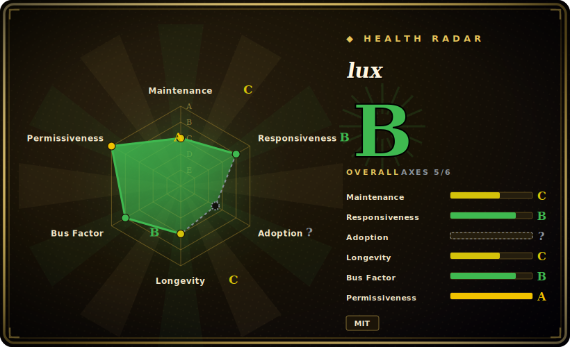

# lux

A fast, simple Go video-download library and CLI (formerly *annie*) — a single static binary with strong coverage of Chinese sites (Bilibili, Douyin, etc.) and parallel multi-segment downloads.

## When to use

You're standing up an ingest box or a teammate's laptop and you want a video downloader that is *one file* — no Python interpreter, no `pip install`, no virtualenv drift to manage across machines. You drop a single static `lux` binary on PATH, point it at a URL, and it resolves formats, downloads segments in parallel, and writes the file. Because it's a Go binary, it cross-compiles cleanly and ships into a slim container or a CI runner without dragging a language runtime along, which is exactly what you want when the download step is one node in a larger pipeline and you'd rather not babysit a Python environment.

You especially reach for it when the sources are **Chinese sites** — Bilibili, Douyin, and similar hosts where lux historically has had sharper, better-maintained extractors than the Western-centric tools. You're archiving a Bilibili series or pulling Douyin clips, you want multi-thread segment downloading for speed, and you want the same binary to behave the same way whether you call it interactively or from a script.

## When NOT to use

- **You need the widest possible site coverage and the freshest extractors.** This is the decisive filter. lux's catalog of supported sites is **smaller** than yt-dlp's, and its extractor fixes ship on a slower cadence — when a site changes its player or signature logic, yt-dlp typically gets patched first. For breadth (and for YouTube specifically), default to yt-dlp / [youtube-dl](youtube-dl.md) and treat lux as the Chinese-sites-and-single-binary specialist. [推断]
- **You're betting on long-term, fast-turnaround maintenance.** Contributions are dominated by a single maintainer (iawia002), and the last *tagged* release (v0.24.1) is from 2024-05 even though master still gets commits — a bus-factor and cadence risk if a heavily-used site breaks and the fix is slow to land. Budget for the breakage cycle.
- **You want a transcoder or a post-processing toolkit.** lux downloads and can merge segments, but it is not an encoder — it shells out to **FFmpeg** for merging and any re-encode/format conversion. If your real need is transcoding, reach for FFmpeg directly; lux is the fetch step, not the media-processing step.
- **JS-heavy / DRM / login-walled sources with no extractor.** Like its peers, it doesn't run a browser or defeat Widevine/PlayReady, solve CAPTCHAs, or rotate identities against rate limits. Sites without a written extractor simply fail.
- **Legal / ToS exposure.** Downloading copyrighted media or violating a site's Terms of Service is on you; many target sites prohibit downloading. Don't build a product on it without checking the law and the ToS.

## Comparison

| Alternative | In index | Our verdict | Tradeoff |
|---|---|---|---|
| [youtube-dl](youtube-dl.md) | indexed | Use this page for its stated niche; choose youtube-dl when you need python CLI with the largest legacy extractor catalog (~1000 sites). | Python CLI with the largest legacy extractor catalog (~1000 sites); broader Western-site coverage, but needs a Python runtime and its upstream tags lag (yt-dlp is the active path). lux trades breadth for a single Go binary and stronger Chinese-site support. |
| yt-dlp | 未收录 | Use this page for its stated niche; choose yt-dlp when you need the de-facto most-active downloader. | The de-facto most-active downloader; widest extractor coverage and fastest fixes, Python-based. Pick it when breadth/currency matters more than shipping a single static binary. |
| [you-get](you-get.md) | indexed | Use this page for its stated niche; choose you-get when you need python downloader also strong on Chinese sites (Bilibili etc. | Python downloader also strong on Chinese sites (Bilibili etc.); similar niche to lux but with a Python runtime instead of a Go binary, and its own separately-curated site list. |
| [cobalt](cobalt.md) | indexed | Use this page for its stated niche; choose cobalt when you need web/API-first, self-hostable *service*. | Web/API-first, self-hostable *service*; clean browser-friendly UX, but it's a server to run rather than a single CLI binary you drop into a script. |

## Tech stack

- **Language:** Go — compiled to a single static binary; usable both as a CLI and as an importable library (`github.com/iawia002/lux`). [未验证]
- **Architecture:** a core downloader plus per-site **extractor** packages; multi-thread/multi-segment downloading with progress reporting on top.
- **Post-processing:** shells out to **FFmpeg** to merge segmented streams and for any format conversion — lux itself does not transcode.
- **Distribution:** prebuilt binaries per OS/arch (GitHub releases), plus `go install` and common package managers.

## Dependencies

- **Runtime:** the single Go binary is the only hard requirement to download. No service, database, or daemon.
- **FFmpeg (optional but commonly needed):** required to merge multi-segment downloads into one file and for format conversion; install it on PATH for most "give me one MP4" workflows. [未验证]
- **Network:** outbound HTTP(S) to target sites; supports cookies and proxy for login-gated or region-shaped content.
- **No backend to run:** it executes and exits — nothing to host.

## Ops difficulty

**Low to run; the maintenance risk is upstream, not operational.** Deployment is trivial — copy one static binary, optionally put FFmpeg on PATH, done; no runtime, no infra, clean to containerize. The real cost is the same fragility every downloader has: when a supported site changes its internals, an out-of-date lux silently errors or returns wrong formats, and lux's slower extractor cadence plus single-maintainer bus factor mean a fix for a niche site may lag. For one-off and Chinese-site-centric jobs this is fine; for load-bearing coverage across many sites, pair it with (or fall back to) a faster-moving tool.

## Health & viability

- **Maintenance — active but slowing; releases lag master (master pushed ~2026-03, last tagged release v0.24.1 2024-05, as of 2026-06).** Not archived and the default branch still receives commits, but the ~2-year gap since the last tagged release against a moving target (sites changing their players) is the signal to watch: verify whether it's genuinely active or coasting before you depend on it for many sites. [推断]
- **Governance & bus factor — single-maintainer `User` repo (iawia002).** Owned by an individual account, not an org or foundation, and contributions are heavily concentrated in the owner (iawia002 ~497 vs the next contributor ~14). That is a real bus-factor flag: roadmap and extractor upkeep depend largely on one person. [推断]
- **Age & Lindy — created 2018 (~8y old), ~31.4k stars: decent age and adoption.** A multi-year, still-getting-commits project clears the basic Lindy bar — the *idea* and codebase have endured (it predates its *annie* rename). But for a downloader the durable risk isn't age, it's **extractor staleness/cadence**: old-and-active is reassuring for the core, not a guarantee any given site still works today.
- **Risk flags — MIT, no relicense history.** Permissive license with no copyleft/relicense friction observed. The standing risks are the cadence/bus-factor above and the general legal/ToS exposure of downloading.

## Caveats (unverified)

- [未验证] ~31.4k GitHub stars as of 2026-06; star counts are date-sensitive and indicative only.
- [未验证] master last pushed ~2026-03 and the last tagged release is v0.24.1 (2024-05) per the repo's releases; the tag-vs-master gap is the key maintenance signal — re-confirm current commit activity and whether newer releases exist before relying on it.
- [推断] "Smaller site coverage and slower extractor updates than yt-dlp" is the widely-held positioning, not a count verified here; check the current supported-sites list and recent extractor commits at decision time.
- [推断] Single-maintainer/bus-factor judgment is inferred from the `User`-owned repo and the contributor-concentration figures (iawia002 ~497 vs next ~14); re-verify the contributor graph if this is load-bearing.
- [未验证] FFmpeg dependency for merging/conversion and the parallel multi-segment download claim come from project docs; confirm against the current README and your own run if either is load-bearing.
- [推断] License is MIT per the repo metadata; confirm the LICENSE file if license terms are load-bearing for your use.
</content>
</invoke>
