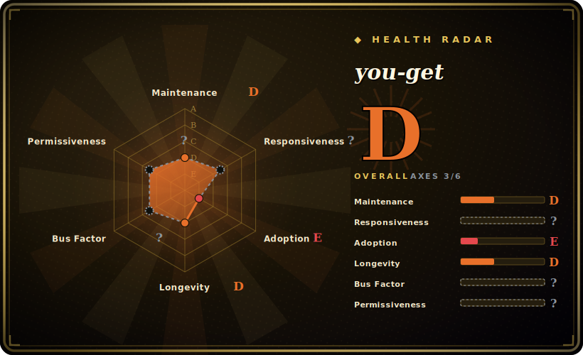

# you-get

A tiny command-line program to download media (video, audio, images) from YouTube and ~100+ other sites, with notably strong coverage of Chinese video hosts (Bilibili, Youku, iQIYI, Tencent, …).

## When to use

You're a Chinese-language researcher or archivist pulling lecture recordings off Bilibili, a few clips from Youku, and the odd iQIYI or Tencent Video page into local files for offline review. The big Western tools either don't carry an up-to-date extractor for these hosts or treat them as second-class, and you don't want to babysit a heavyweight downloader for a one-off grab. You reach for `you-get`: `pip install you-get`, then `you-get <url>` prints the available streams, and `you-get --itag=... <url>` (or just the default) fetches the best one. You add `-i` to inspect formats without downloading, `-o` to set the output directory, and `--playlist` to pull a whole list. It shells out to `ffmpeg` only when segments need merging, so a single MP4 from a single URL needs little more than the interpreter.

You also use it when you want the *smallest* thing that works for a given Chinese site today — the appeal is a compact CLI with a curated site list rather than the exhaustive ~1000-extractor catalog of youtube-dl/yt-dlp. You point it at a URL, it normalizes that site's stream layout into a uniform "list formats → pick → download" flow, and because it's pure Python with nothing to host, it drops straight into a script or a manual session without standing up any infrastructure.

## When NOT to use

- **You need maximum site breadth or the fastest YouTube fixes.** This is the decisive filter. For sheer extractor count and the quickest turnaround when YouTube changes its player/signature code, **yt-dlp** (and to a lesser degree [youtube-dl](youtube-dl.md)) lead; you-get's curated, smaller catalog and slower cadence mean a given non-Chinese site may be unsupported or lag. Default to yt-dlp for breadth and YouTube-critical jobs. [推断]
- **You want guaranteed up-to-the-minute maintenance.** The latest tagged release is 2025-01-04 and commit cadence is lighter than yt-dlp's; a site that recently changed its layout may be broken until someone patches the extractor. Site breakage is the normal failure mode of every tool in this class, but you-get's smaller maintainer pool widens the gap. [推断]
- **You need transcoding / re-encoding.** you-get downloads and (via `ffmpeg`) *merges* segments; it is not a transcoder. If you need to re-encode, change codecs, or do filtering, that's **FFmpeg** directly — you-get just orchestrates the fetch.
- **JS-heavy / DRM-walled sites with no extractor.** It does not drive a browser or execute arbitrary page JavaScript; Widevine/PlayReady DRM, per-request token schemes, or SPA sites without a written extractor will simply fail.
- **Geo-restricted, login-walled, or large-scale scraping.** It can pass a proxy and cookies, but it won't solve CAPTCHAs, rotate identities, or shield you from IP bans; bulk-downloading from one IP gets throttled. Legal/ToS exposure for the media you fetch is your problem, not the tool's.
- **You want a stable library API.** It's primarily a CLI; importing internals is unsupported and changes without notice.

## Comparison

| Alternative | In index | Tradeoff |
|---|---|---|
| [youtube-dl](youtube-dl.md) | ✅ | The classic Python downloader with a ~1000-site extractor catalog; far broader site coverage but slowed maintenance, and historically weaker/less-current on some Chinese hosts than you-get. |
| yt-dlp | 未收录 | The actively-maintained youtube-dl fork; the broadest catalog and fastest YouTube fixes, more options (SponsorBlock, format sorting, aria2c). Pick it for breadth and YouTube-critical jobs; you-get stays appealing for its small footprint and Chinese-site focus. |
| lux | 未收录 | Go single-binary downloader (formerly annie) with its own China-friendly site list; no Python runtime and fast, but a narrower, differently-curated catalog. |
| cobalt | 未收录 | Web/API-first downloader (self-hostable service); clean browser UX, but it's a service to run rather than a pip-installable CLI for scripting. |

## Tech stack

- **Language:** Python (README states Python 3.7.4+, with older 3.5/3.6/3.7 support being phased out). [未验证]
- **Architecture:** a core downloader plus per-site **extractor** modules (`you_get.extractors.*`); each extractor normalizes one site's stream discovery into a common interface.
- **Post-processing:** shells out to `ffmpeg` (≥1.0) to merge/join multi-segment streams; optional `rtmpdump` for RTMP sources. you-get itself does not transcode.
- **Distribution:** PyPI package (`you-get`), a self-contained script, and OS package-manager builds.

## Dependencies

- **Runtime:** a Python interpreter is the only hard requirement to fetch single-file streams. No service, database, or daemon.
- **Optional binaries (yours to install):** `ffmpeg` (≥1.0) — needed whenever a download arrives as multiple segments that must be merged, which is common; `rtmpdump` for RTMP streams.
- **Network:** outbound HTTP(S) to target sites; optionally a proxy (`-x` / `--http-proxy`, SOCKS) and a cookies file for login-gated content.
- **No backend to run:** it executes and exits — nothing to host.

## Ops difficulty

**Low to run, medium *fragility* to keep working.** Installing and invoking it is trivial: `pip install you-get`, one command, done — no infrastructure, and `ffmpeg` on PATH covers the merge cases. The ongoing cost is the same as every downloader in this class: target sites change their stream layout and an outdated extractor silently starts erroring or returning the wrong format. you-get's lighter maintenance cadence relative to yt-dlp means a fix for a freshly-broken site may lag, so the practical maintenance task is staying current (`pip install -U you-get`, or tracking master) and being ready to fall back to another tool for a site that's currently broken. For one-off and Chinese-site grabs this is comfortable; for a long-lived pipeline against many hosts, budget for the breakage cycle.

## Health & viability

- **Maintenance — slow but not dead (last push ~2026-04, last tagged release 2025-01-04, as of 2026-06).** Not archived; the master branch still receives commits, but the tagged-release cadence is light and lags yt-dlp's. For an extractor tool that's the live risk — a freshly-broken site may wait for a patch [推断]. Track master, don't pin the old tag.
- **Governance & bus factor — single-maintainer flag.** `User`-owned (`soimort/you-get`) with ~56k stars: large adoption resting on a small/one-person maintainer pool, which both explains the slower cadence and is itself the bus-factor risk. No foundation or vendor behind it [推断].
- **Age & Lindy verdict — old and still-ticking ⇒ moderate Lindy.** Created 2012 (~14y old) and still committing in 2026: long survival is a real positive signal, but "still-active" here is *thin* (slow releases, light maintainer pool), so it's a moderate rather than strong Lindy bet — safer than an abandoned tool, weaker than the fast-moving yt-dlp.
- **Risk flags.** MIT-licensed, no relicensing/open-core concerns. The standing risks are operational, not legal: extractor staleness for non-Chinese sites and the legal/ToS exposure of downloading. Its differentiated value (strong Chinese-host coverage) is also its niche — breadth-critical jobs default to yt-dlp.

## Caveats (unverified)

- [未验证] ~56.8k GitHub stars as of 2026-06; star counts are date-sensitive and unreliable — indicative only.
- [未验证] Latest release is v0.4.1743 dated 2025-01-04 per the repo; "active" reflects the published release and ongoing repo presence — re-confirm current commit/push activity at decision time, as cadence is lighter than yt-dlp's.
- [未验证] License is MIT — the repo's `LICENSE.txt` is the standard MIT License text (GitHub's UI may surface "NOASSERTION" from its classifier; the file itself is MIT). Confirm the LICENSE file if license terms are load-bearing.
- [未验证] README-stated Python support (3.7.4+, older versions being dropped) and the supported-site list shift over time; verify against the current repo and `you-get` extractor list.
- [推断] "Stronger on Chinese sites than youtube-dl" and "smaller/less-actively-maintained catalog than yt-dlp" are widely-held community positions, not measured here — re-confirm per the specific site you need at decision time.
- [推断] `ffmpeg` is needed specifically for merging segmented streams; whether any given download triggers a merge depends on the site/format — verify for your target.
