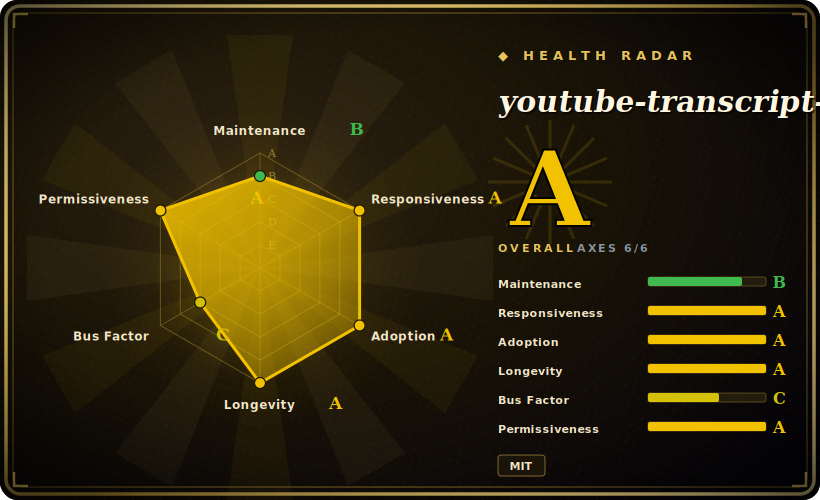

# youtube-transcript-api

A Python library that fetches the transcript/subtitles (including auto-generated ones) for a YouTube video — no API key, no headless browser — by calling the same undocumented endpoint the YouTube web client uses.

## When to use

You're building a pipeline that summarizes or indexes YouTube videos — a RAG corpus, a "TL;DR this talk" bot, a research tool that searches across hundreds of lecture transcripts — and you need the spoken text, not the audio. The official YouTube Data API doesn't hand you full caption text without OAuth and channel ownership, and spinning up Selenium to scrape the player is slow and brittle. You `pip install youtube-transcript-api`, then `YouTubeTranscriptApi().fetch(video_id)` returns the timestamped transcript as plain objects you can immediately feed to an LLM or a formatter (SRT/WebVTT/JSON/text). You can ask for a preferred language list, fall back across manual vs auto-generated tracks, and even have YouTube translate the transcript to another language — all in a few lines, key-free.

It shines as a *building block*: it's the transcript-fetch layer under a larger app, used in notebooks and batch jobs where you want timestamped text out of an ID with minimal ceremony. When you run it from your own machine or a residential IP, the no-auth path "just works."

## When NOT to use

- **Cloud / datacenter IPs without proxies.** YouTube actively blocks requests from AWS/GCP/Azure ranges; from a server you'll hit IP bans and need to route through (residential) proxies — the library has built-in Webshare/generic proxy support precisely because of this, but it's now a *requirement*, not a nicety, for reliable cloud use.
- **You need a stable, contractual API.** This rides an **undocumented** endpoint. The maintainer states plainly there is no guarantee it won't break tomorrow if YouTube changes things — don't build something you can't afford to see break on a YouTube-side change.
- **Age-restricted / login-walled videos.** Cookie/auth-based access for restricted content has been hampered by YouTube API changes and is not reliably available. [未验证]
- **Videos with captions disabled.** If the uploader disabled captions and there's no auto-generated track, there's nothing to fetch — it doesn't transcribe audio itself.
- **ToS-sensitive / high-volume scraping at scale.** Mass extraction against an undocumented endpoint sits in a gray area and invites rate-limiting/blocking; for sanctioned bulk access you'd need a different (often paid/proxied) strategy. [推断]

## Comparison

| Alternative | In index | Our verdict | Tradeoff |
|---|---|---|---|
| yt-dlp (`--write-auto-subs`) | 未收录 | Use this page for its stated niche; choose yt-dlp (--write-auto-subs) when you need the heavyweight downloader can also pull subtitle tracks. | The heavyweight downloader can also pull subtitle tracks; far broader (media + subs from many sites) but heavier and CLI-oriented — this library is a focused, in-process Python call for transcripts only. |
| YouTube Data API v3 (Captions) | 未收录 | Use this page for its stated niche; choose YouTube Data API v3 (Captions) when you need official and contractual, but requires OAuth and (for caption *download*) channel ownership. | Official and contractual, but requires OAuth and (for caption *download*) channel ownership — you generally can't pull arbitrary third-party caption text, which is exactly this library's niche. |
| Selenium / Playwright scraping | 未收录 | Use this page for its stated niche; choose Selenium / Playwright scraping when you need drives a real browser, so it survives some changes the player itself survives, but it's slow, resour. | Drives a real browser, so it survives some changes the player itself survives, but it's slow, resource-heavy, and brittle — this library avoids the browser entirely. |
| OpenAI Whisper (transcribe audio) | 未收录 | Use this page for its stated niche; choose OpenAI Whisper (transcribe audio) when you need generates a transcript from the audio when no caption track exists. | Generates a transcript from the audio when no caption track exists; far more compute and not timestamp-aligned to YouTube's own captions, but works on videos with captions disabled. |

## Tech stack

- **Language:** Python (supports a range of modern 3.x versions; packaged with Poetry).
- **Transport:** plain HTTP requests against YouTube's undocumented web-client transcript endpoint — no headless browser, no official API client.
- **Surface:** an object API (`YouTubeTranscriptApi().fetch(...)`, list/translate transcripts) plus formatters (JSON, WebVTT, SRT, CSV, plain text) and proxy config (Webshare + generic).

## Dependencies

- **Runtime:** Python 3.x and an HTTP stack (`requests`-class). No API key, no browser, no database.
- **Network:** outbound access to YouTube; for cloud/datacenter deployment, a (residential) **proxy** is effectively required to avoid IP blocks.
- **Optional:** Webshare proxy integration is first-class; generic HTTP/HTTPS proxy config is supported.
- **No services to run** — it's an in-process library you import.

## Ops difficulty

**Low to medium.** As a library there's nothing to deploy — `pip install`, import, call. The operational weight is entirely in *staying unblocked*: from a laptop/residential IP it's frictionless; from a server you must wire up and pay for rotating proxies, handle intermittent bans, and be ready to update the package (or wait for a fix) when YouTube changes the endpoint and calls start failing. Treat it as a dependency that can break on someone else's schedule and design retries/fallbacks accordingly.

## Health & viability

- **Maintenance (2026-06).** Last push 2026-05; v1.2.4 released 2026-01 on a steady release cadence through 2025–2026 — **active**. Not archived. The 1.x line is a relatively recent, maintained API.
- **Governance / bus factor.** Single-maintainer project (jdepoix) with a long tail of contributors. Bus-factor risk exists, but the project has absorbed multiple YouTube-side breakages over its lifetime, which is the relevant survival signal here. [推断]
- **Age & Lindy verdict.** ~8 years old (created 2018-04) and still actively maintained ⇒ a **strong Lindy** signal — it has repeatedly survived YouTube changes, which is the best evidence of durability for a tool riding an undocumented endpoint.
- **Adoption.** ~7.8k stars and widely used as the transcript layer in LLM/RAG and research tooling — broad real-world adoption. [未验证]
- **Risk flags.** The structural risk is **not** governance or licensing (clean MIT) — it's the **undocumented-endpoint dependency**: a unilateral YouTube change can break it at any time, and cloud use now depends on third-party proxies.

## Caveats (unverified)

- [未验证] ~7.8k stars and v1.2.4 (2026-01) as of 2026-06 — figures are date-sensitive and indicative only.
- [未验证] Current state of age-restricted/login-walled access is a moving target tied to YouTube API changes; not confirmed working as of this date.
- [推断] ToS/legal posture of high-volume extraction is an inference about an undocumented endpoint, not legal advice or a confirmed YouTube policy citation.
- [推断] "Survives YouTube changes" durability is inferred from the maintenance history, not a guarantee about future breakage.
