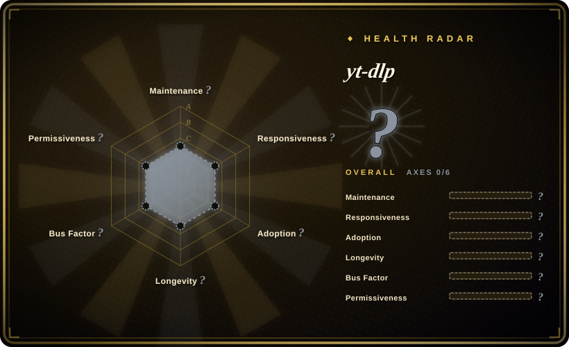

# yt-dlp

A feature-rich command-line audio/video downloader and the actively maintained successor fork of youtube-dl, supporting thousands of sites with faster extractor fixes and modern features.

## When to use

You're building a media pipeline, archiving content, or need to grab a video or audio track from a streaming site for local processing. You want a single CLI tool that understands hundreds of sites out of the box, can select the best quality stream, merge formats, embed subtitles, skip sponsor segments, and run as a cron job or inside a Python script. You reach for yt-dlp instead of youtube-dl because the original upstream has slowed to a crawl on extractor fixes; you pick it over lux because lux is a single-binary Go tool with a narrower site list and slower extractor updates; you choose it over you-get because you-get's extractor catalog is smaller and its maintenance cadence is lower. One pip install, one command, and yt-dlp resolves the URL, picks the formats, and writes the file with a predictable filename template.

## When NOT to use

- **DRM-protected content.** If you need to decrypt Widevine, PlayReady, or FairPlay DRM, use a licensed streaming service or a dedicated DRM tool instead of yt-dlp, because it cannot decrypt protected streams and will fail or return only unencrypted portions.
- **Bulk commercial or ToS-violating use.** If you need a product-grade media-saver service with a web UI, use [cobalt](cobalt.md) instead of yt-dlp, because many sites prohibit downloading in their Terms of Service and youtube-dl itself was subject to a 2020 DMCA takedown (later reinstated).
- **JS-heavy SPAs without an extractor.** If you need to execute arbitrary page JavaScript to reach media, use a headless browser scraper like Puppeteer or Playwright instead of yt-dlp, because it does not run client-side JavaScript and sites that gate media behind per-request token schemes without a written extractor will fail.
- **Geo-restricted or login-walled content at scale.** If you need CAPTCHA solving, identity rotation, or anti-bot protection, use a dedicated scraping platform like [Firecrawl](https://firecrawl.dev) or a residential proxy service instead of yt-dlp, because yt-dlp can only pass cookies and proxies and will not shield you from IP bans.
- **You need a stable library API.** If you need a programmatic API with semver stability, use [youtube-dl](youtube-dl.md) as a more stable (but stale) library or write a dedicated scraper instead of yt-dlp, because yt-dlp's internal APIs and extractor behavior change without notice and are risky as a hard dependency in a shipped product.
- **Live stream capture or very high concurrency.** If you need reliable live HLS/DASH capture or massive parallel jobs, use FFmpeg directly or a dedicated streaming ingestion tool instead of yt-dlp, because its live capture and concurrency support are fragile.

## Comparison

| Alternative | In index | Our verdict | Tradeoff |
|---|---|---|---|
| [youtube-dl](youtube-dl.md) | ✅ | The original upstream project. | youtube-dl is the legacy upstream with slowed releases; yt-dlp is the actively maintained fork with faster fixes and more features. For YouTube and hot sites, default to yt-dlp. |
| [you-get](you-get.md) | ✅ | Tiny Python CLI focused on Chinese sites. | Lighter and simpler than yt-dlp, but a smaller extractor catalog and less active maintenance. |
| [lux](lux.md) | ✅ | Fast single-binary Go downloader. | No Python runtime needed, but a narrower site list and slower extractor updates than yt-dlp. |
| [cobalt](cobalt.md) | ✅ | Self-hostable web-UI + API media saver. | Browser-friendly service, not a scriptable CLI for automation pipelines. |
| gallery-dl | 未收录 | Specialized in image and gallery sites. | Complementary rather than a substitute for video/audio extraction. |

## Tech stack

- **Python** — primary implementation language
- **Per-site extractor classes** — modular plugin architecture for different hosting sites
- **Format selection engine** — chooses best available streams based on user criteria
- **Post-processor pipeline** — shells out to external tools for remux, metadata embedding, and thumbnail conversion

## Dependencies

- **Python interpreter** — the only hard requirement for basic operation
- **Optional ffmpeg** — strongly recommended for audio extraction, format merging, and remuxing (`--extract-audio`, `--merge-output-format`)
- **Optional ffprobe** — for metadata and format probing
- **Network access** — outbound HTTP(S) to target sites; optionally a proxy or cookies file for login-gated content
- **No service to run** — executes and exits; no daemon or database

## Ops difficulty

**Low to run, medium to keep current.** Installation is trivial (`pip install yt-dlp` or a standalone binary). The real ops burden is extractor currency: streaming sites change frequently, and while yt-dlp updates much faster than youtube-dl, you still need to stay on a recent release. For one-off scripts this is fine; for a long-lived automation pipeline, budget for version pinning and periodic updates. The `--update` flag helps, but CI environments should pin and test new versions.

## Health & viability
- **Maintenance**: Grade A — 11/13 active weeks in trailing 13; last commit 0 days ago.
- **Responsiveness**: Grade A — median first-response time 1.1 hours across 6 qualifying issues/PRs.
- **Adoption**: Grade E — 138,250 monthly downloads via conda-forge.org (package: yt-dlp).
- **Longevity**: Grade A — 2075 days old.
- **Governance**: Grade B — top-3 contributor share 77.2% (?).
- **Risk / License**: Grade A — Unlicense license.
## Caveats (unverified)

- The exact count of supported sites ("thousands") shifts over time; verify with `--list-extractors` for your specific target sites.
- SponsorBlock integration and other advanced features may require additional dependencies or configuration not enabled by default.
- [推断] The high star count (174k) reflects both genuine utility and the visibility boost from being the successor to the widely-known youtube-dl project.
- Some extractors for regional or niche sites may be community-contributed and less thoroughly tested than the core YouTube extractor.
