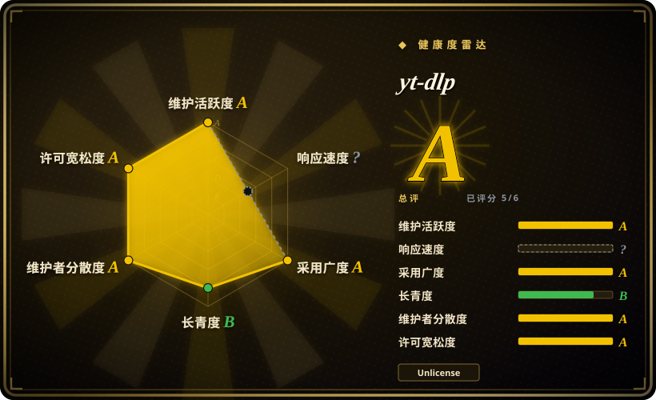

# yt-dlp

一款功能丰富的命令行音视频下载器，是 youtube-dl 的活跃维护分叉，支持数千站点，具备更快的提取器修复和现代化功能。

## 何时使用

你在构建媒体管线、归档内容，或需要从流媒体站点抓取音视频以便本地处理。你想要一个开箱即支持数百站点的 CLI 工具，能自动选择最佳质量流、合并格式、嵌入字幕、跳过赞助片段，并能作为 cron 任务或内嵌在 Python 脚本中运行。你选择 yt-dlp 而不是 youtube-dl，因为原始上游的提取器修复已严重放缓；你选它而不是 lux，因为 lux 是单二进制 Go 工具，站点列表更窄、提取器更新更慢；你选它而不是 you-get，因为 you-get 的提取器目录更小、维护节奏更低。一次 pip 安装，一条命令，yt-dlp 就能解析 URL、选择格式、按可预测的文件名模板写入文件。

## 何时不用

- **DRM 保护内容。**如果你需要解密 Widevine、PlayReady 或 FairPlay DRM，请改用授权流媒体服务或专用 DRM 工具，而不是 yt-dlp，因为它无法解密受保护流，只会失败或仅返回未加密部分。
- **批量商业用途或违反服务条款的使用。**如果你需要产品级带 Web UI 的媒体保存服务，请改用 [cobalt](cobalt.zh.md)，而不是 yt-dlp，因为许多站点在服务条款中禁止下载，youtube-dl 本身也曾在 2020 年遭受 DMCA 下架（后恢复）。
- **无提取器的重度 JS 单页应用。**如果你需要执行任意页面 JavaScript 才能获取媒体，请改用 Puppeteer 或 Playwright 等无头浏览器爬虫，而不是 yt-dlp，因为它不运行客户端 JavaScript，对把媒体藏在按请求令牌方案之后的站点若无书面提取器就会失败。
- **大规模地理限制或登录墙内容。**如果你需要验证码破解、身份轮换或反爬虫保护，请改用 Firecrawl 等专用爬取平台或住宅代理服务，而不是 yt-dlp，因为它只能传递 cookie 和代理，无法屏蔽 IP 封禁。
- **需要稳定的库 API。**如果你需要语义化版本稳定的编程接口，请改用 [youtube-dl](youtube-dl.zh.md) 作为更稳定（但已停滞）的库，或写专用爬虫，而不是 yt-dlp，因为它的内部 API 和提取器行为会不经通知地改变，作为 shipped 产品的硬依赖有风险。
- **直播抓取或极高并发。**如果你需要可靠的直播 HLS/DASH 抓取或大规模并行作业，请改用 FFmpeg 直接调用或专用流媒体采集工具，而不是 yt-dlp，因为它的直播抓取和并发支持很脆弱。

## 横向对比

| 替代品 | 是否收录 | 我们的评价 | 取舍 |
|---|---|---|---|
| [youtube-dl](youtube-dl.zh.md) | ✅ | 原始上游项目。 | youtube-dl 是发布已放缓的 legacy 上游；yt-dlp 是活跃维护分叉，修复更快、功能更多。面向 YouTube 和热门站点时默认用 yt-dlp。 |
| [you-get](you-get.zh.md) | ✅ | 面向中文站点的极简 Python CLI。 | 比 yt-dlp 更轻更简单，但提取器目录更小、维护活跃度更低。 |
| [lux](lux.zh.md) | ✅ | 快速的单二进制 Go 下载器。 | 无需 Python 运行时，但站点列表更窄、提取器更新慢于 yt-dlp。 |
| [cobalt](cobalt.zh.md) | ✅ | 可自托管的 Web UI + API 媒体下载器。 | 面向浏览器的友好服务，不是用于自动化管线的可脚本化 CLI。 |
| gallery-dl | 未收录 | 专注于图像和图库站点。 | 与视频/音频提取互补，而非替代品。 |

## 技术栈

- **Python**——主要实现语言
- **按站点提取器类**——面向不同托管站点的模块化插件架构
- **格式选择引擎**——按用户标准选择最佳可用流
- **后处理管线**——调用外部工具进行 remux、元数据嵌入和缩略图转换

## 依赖

- **Python 解释器**——基本操作的唯一硬性要求
- **可选 ffmpeg**——强烈建议用于音频提取、格式合并和 remux（`--extract-audio`、`--merge-output-format`）
- **可选 ffprobe**——用于元数据和格式探测
- **网络访问**——出站 HTTP(S) 到目标站点；可选代理或 cookie 文件用于登录墙内容
- **无服务需运行**——执行后退出；无守护进程或数据库

## 运维难度

**运行低，保持更新中等。** 安装 trivial（`pip install yt-dlp` 或独立二进制）。真正的运维负担在于提取器时效性：流媒体站点频繁变化，虽然 yt-dlp 比 youtube-dl 更新快得多，你仍需保持较新版本。对一次性脚本没问题；对长期自动化管线，要为版本锁定和定期更新预留预算。`--update` 标志有帮助，但 CI 环境应锁定版本并测试新版本。

## 健康度与可持续性

- **响应速度**：无法计算——no_traffic。
- **维护**：非常活跃——截至 2026-07 每日推送，提交活跃度徽章显示持续速度。该分叉在提取器修复上一直超越原始上游。
- **治理**：由 `yt-dlp` 组织所有；社区驱动，多名维护者。与单人项目相比，组织结构提供了合理的 bus factor。
- **背书**：无显著企业背书可见；由社区捐赠和志愿者 effort 资助。
- **采用**：极受欢迎（174k star），被普遍视为面向 YouTube 提取的 youtube-dl 事实继任者。在脚本、管线和下游工具中大量生产级使用。
- **年龄与 Lindy**：2020 年作为分叉创建（约 6 年），虽年轻但已活过许多炒作周期工具。“长期工具的分叉”血统通过 youtube-dl 的 15 年以上历史赋予其部分 Lindy 资历。
- **风险旗标**：Unlicense（公有领域）——无 copyleft 或 relicense 摩擦。主要风险与所有下载器相同的法律/服务条款风险，以及偶尔与流媒体站点的上游军备竞赛可能导致提取器中断数日。

## 存疑（未验证）

- 支持的站点精确数量（“数千”）随时间变化；请用 `--list-extractors` 核实你的具体目标站点。
- SponsorBlock 集成和其他高级功能可能需要额外依赖或默认未启用的配置。
- [推断] 高 star 数（174k）既反映真实实用性，也得益于作为广为人知的 youtube-dl 项目继任者的曝光加成。
- 某些区域或 niche 站点的提取器可能由社区贡献，测试深度不如核心 YouTube 提取器。
