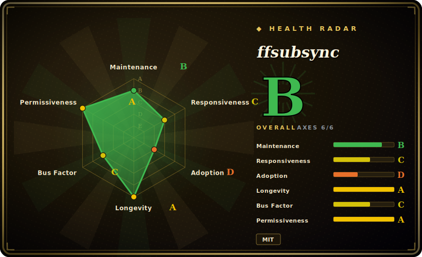

# ffsubsync

A language-agnostic CLI that automatically re-times an out-of-sync subtitle file against the video (or a reference subtitle), aligning speech segments via FFT cross-correlation.

## When to use

You're sitting down to watch a film with a subtitle file you pulled off the internet, and the timing is off by a few seconds — every line lands too early or too late, and manually nudging the offset in your player is a chore that breaks immersion. You don't speak the subtitle's language well enough to eyeball the alignment, and the mismatch is a constant global shift rather than per-line drift. You run `ffs movie.mkv -i subs.srt -o synced.srt`: ffsubsync uses ffmpeg to extract the audio track, runs voice-activity detection to mark where speech happens, discretizes both the audio and the subtitle timeline into 10 ms speech/no-speech windows, and slides them against each other with an FFT to find the offset that maximizes overlap — then writes a corrected SRT. The whole thing is one command, no language model, no manual sync points.

You also reach for it in a batch/automation context — a media server (it's the engine behind some Bazarr/Plex sync workflows) or a script that ingests freshly-downloaded subtitles and auto-corrects timing before filing them. When you have a known-good reference subtitle in the same or another language, you can sync against that instead of decoding audio, which is faster and avoids the ffmpeg audio pass.

## When NOT to use

- **Per-line / variable drift, not a global offset.** ffsubsync excels at a constant shift (and a linear framerate-mismatch stretch). The README is explicit that handling breaks/splits *inside* the content (ad-break gaps, scene cuts present in one but not the other) is left to future work — patchy, region-by-region desync won't be fixed cleanly.
- **No ffmpeg available.** Audio-based sync requires ffmpeg on the PATH; in a locked-down environment where you can't install it, you're limited to reference-subtitle mode (which needs a correct subtitle to begin with).
- **Non-SRT-centric pipelines.** Output is SRT-oriented; if your workflow is built on ASS/SSA with styling/positioning you care about, expect to convert and lose or re-apply formatting. [未验证]
- **You need transcription or translation.** It does not generate subtitles from audio and does not translate — it only re-times existing text. For speech-to-text use Whisper-class tools.
- **Silent / music-only or speech-sparse content.** VAD-based alignment leans on speech presence; long stretches with little dialogue give the FFT little signal to lock onto. [推断]

## Comparison

| Alternative | In index | Our verdict | Tradeoff |
|---|---|---|---|
| alass | 未收录 | Use this page for its stated niche; choose alass when you need rust subtitle aligner that explicitly handles *split* synchronization (variable offsets across the f. | Rust subtitle aligner that explicitly handles *split* synchronization (variable offsets across the file) — stronger for ad-break/scene desync, ffsubsync's known weak spot. |
| Bazarr | 未收录 | Use this page for its stated niche; choose Bazarr when you need a subtitle *management* service for Sonarr/Radarr that finds and downloads subs (and can call ffsubs. | A subtitle *management* service for Sonarr/Radarr that finds and downloads subs (and can call ffsubsync to sync) — orchestration layer, not the alignment algorithm itself. |
| Subtitle Edit (sync features) | 未收录 | Use this page for its stated niche; choose Subtitle Edit (sync features) when you need full GUI subtitle editor with manual + automatic sync, OCR, and format conversion. | Full GUI subtitle editor with manual + automatic sync, OCR, and format conversion; far broader, but interactive and Windows-centric rather than a scriptable one-shot CLI. |
| OpenAI Whisper | 未收录 | Use this page for its stated niche; choose OpenAI Whisper when you need generates subtitles from audio (transcription), a different job. | Generates subtitles from audio (transcription), a different job — useful when you have *no* subtitle file; overkill and lossy when you already have correct text that's merely mistimed. |

## Tech stack

- **Language:** Python 3.6+.
- **Audio extraction:** ffmpeg (external binary), wrapped via `ffmpeg-python`.
- **Core algorithm:** voice-activity detection (WebRTC VAD) to build a speech/no-speech binary signal, then FFT-based cross-correlation (`numpy`) to find the offset — O(n log n).
- **Subtitle parsing:** the `srt` library; CLI/UX via `argparse`, `rich`, `tqdm`.
- **Optional:** a `[torch]` extra for an alternative (neural) VAD path.

## Dependencies

- **Runtime:** Python 3.6+ and an **ffmpeg** binary on PATH (the one hard external dependency for audio-based sync).
- **Python packages:** numpy, ffmpeg-python, webrtcvad, srt, rich, tqdm (pulled in by `pip install ffsubsync`).
- **Optional:** `pip install ffsubsync[torch]` adds PyTorch for the alternative VAD — heavyweight, only if you need it.
- **No services / no database** — it's a one-shot local CLI.

## Ops difficulty

**Low.** It's a `pip install` + an ffmpeg dependency, invoked as a single command per file; there's nothing to run as a service, no state, no datastore. The only friction is ensuring ffmpeg is present and on PATH, and (for batch use) wrapping the CLI in a loop or letting a host like Bazarr drive it. The `[torch]` extra is the only place install weight balloons. No upgrade/operational burden beyond keeping the pip package current.

## Health & viability

- **Maintenance (2026-06).** Last push 2026-06; v0.5.0 was tagged 2026-06-17, with prior releases through 2024–2025 — **active**, releasing on an irregular but live cadence. Not archived.
- **Governance / bus factor.** Single-maintainer project (smacke) with a handful of outside contributors (some from the Bazarr/subliminal ecosystem). Bus-factor risk is real: the roadmap and releases hinge on one person. [推断]
- **Age & Lindy verdict.** ~7 years old (created 2019-02) and still shipping ⇒ a **moderate-to-strong Lindy** signal — long enough to be proven for its narrow job, and it remains the de-facto open-source audio sync tool.
- **Adoption.** ~7.8k stars and used as the sync engine in downstream media tooling (Bazarr/Plex-adjacent workflows) — healthy adoption for a single-purpose utility. [未验证]
- **Risk flags.** No relicense history; MIT throughout. The main fragility is bus factor (one maintainer) and the unaddressed "splits within content" limitation, not licensing or governance.

## Caveats (unverified)

- [未验证] ~7.8k stars and v0.5.0 (2026-06-17) as of 2026-06 — star/version figures are date-sensitive; treat as indicative.
- [未验证] Exact handling of ASS/SSA styling on round-trip is inferred from the SRT-centric design, not confirmed against the current code.
- [推断] Speech-sparse content weakening VAD alignment is an inference from how FFT-on-speech alignment works, not a measured failure mode.
- [推断] Single-maintainer bus-factor risk is inferred from the contributor distribution, not a statement about the maintainer's commitment.
