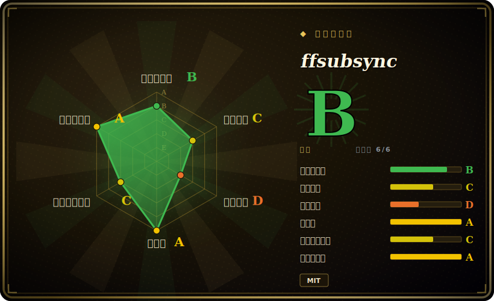

# ffsubsync

一个语言无关的命令行工具，把时间轴对不上的字幕文件自动重新对齐到视频（或一份参考字幕）上，靠 FFT 互相关来对齐语音段。

## 何时使用

你坐下来准备看一部电影，手里这份从网上扒来的字幕时间轴整体偏了几秒——每一行不是早出来就是晚出来，在播放器里手动挪偏移量既麻烦又破坏观影沉浸感。你对字幕那门语言又没熟到能凭眼睛对齐，而这次错位是一个恒定的全局平移，而非逐行漂移。你跑 `ffs movie.mkv -i subs.srt -o synced.srt`：ffsubsync 用 ffmpeg 抽出音轨，跑语音活动检测（VAD）标出哪里有人说话，把音频和字幕时间线都离散成 10 毫秒的「有语音/无语音」窗口，再用 FFT 把两者相互滑动，找出让重叠最大化的那个偏移量——然后写出一份校正后的 SRT。整件事就一条命令，不需要语言模型，也不用手动打同步点。

你也会在批处理/自动化场景里用它——某个媒体服务器（它是部分 Bazarr/Plex 同步流程背后的引擎），或一个脚本：吃进刚下载好的字幕，在归档前自动校正时间轴。当你手头有一份同语言或他语言的已知良好参考字幕时，你可以改成对它同步，这样更快，也省掉了解码音频那一步。

## 何时不用

- **逐行 / 变动漂移，而非全局偏移。** ffsubsync 擅长恒定平移（以及线性的帧率失配拉伸）。README 明确说，处理内容*内部*的断裂/切分（一边有另一边没有的广告间隙、场景剪辑）留待未来——零碎的、分区段错位它修不干净。
- **没有 ffmpeg 可用。** 基于音频的同步要求 PATH 上有 ffmpeg；在装不了它的受限环境里，你只能退回参考字幕模式（而那需要先有一份正确字幕）。
- **非 SRT 为中心的流程。** 输出以 SRT 为主；如果你的流程建立在 ASS/SSA、且在意样式/定位，预期要转换并丢失或重新套用格式。[未验证]
- **你要转写或翻译。** 它不从音频生成字幕，也不翻译——只重新对齐已有文本。语音转文字请用 Whisper 一类工具。
- **静默 / 纯音乐或语音稀疏的内容。** 基于 VAD 的对齐依赖语音存在；大段几乎没有对白的内容，给 FFT 的信号太少，锁不住。[推断]

## 横向对比

| 替代品 | 是否收录 | 取舍 |
|---|---|---|
| alass | 未收录 | Rust 写的字幕对齐器，明确处理*切分式*同步（文件内多段不同偏移）——在广告断点/场景错位这类 ffsubsync 的弱项上更强。 |
| Bazarr | 未收录 | 面向 Sonarr/Radarr 的字幕*管理*服务，负责查找和下载字幕（并能调用 ffsubsync 来同步）——是编排层，不是对齐算法本身。 |
| Subtitle Edit（同步功能） | 未收录 | 完整的图形界面字幕编辑器，带手动 + 自动同步、OCR、格式转换；面广得多，但偏交互、偏 Windows，而非可脚本化的一次性 CLI。 |
| OpenAI Whisper | 未收录 | 从音频*生成*字幕（转写），是另一种活——当你*没有*字幕文件时有用；当你已经有正确文本、只是时间错了时，它既杀鸡用牛刀又有损。 |

## 技术栈

- **语言：** Python 3.6+。
- **音频抽取：** ffmpeg（外部二进制），经 `ffmpeg-python` 包装。
- **核心算法：** 语音活动检测（WebRTC VAD）构建「有语音/无语音」二值信号，再用基于 FFT 的互相关（`numpy`）求偏移——O(n log n)。
- **字幕解析：** `srt` 库；CLI/交互用 `argparse`、`rich`、`tqdm`。
- **可选：** 一个 `[torch]` extra，提供另一条（神经网络）VAD 路径。

## 依赖

- **运行时：** Python 3.6+ 以及 PATH 上的一个 **ffmpeg** 二进制（基于音频同步时唯一的硬外部依赖）。
- **Python 包：** numpy、ffmpeg-python、webrtcvad、srt、rich、tqdm（`pip install ffsubsync` 会一并拉入）。
- **可选：** `pip install ffsubsync[torch]` 加入 PyTorch 用于替代 VAD——很重，仅在需要时装。
- **无服务 / 无数据库**——它是一次性的本地 CLI。

## 运维难度

**低。** 就是 `pip install` 加一个 ffmpeg 依赖，按文件逐个以单条命令调用；没有服务要跑、没有状态、没有数据存储。唯一的摩擦是确保 ffmpeg 存在且在 PATH 上，以及（批量用时）用循环包住 CLI，或让 Bazarr 这类宿主来驱动它。`[torch]` extra 是安装体积唯一会膨胀的地方。除了保持 pip 包更新外，没有额外的升级/运维负担。

## 健康度与可持续性

- **维护（2026-06）。** 最后 push 于 2026-06；v0.5.0 于 2026-06-17 打标，此前在 2024–2025 间也有发布——处于**活跃**，节奏不规律但仍在动。未归档。
- **治理 / bus factor。** 单一维护者项目（smacke），外加少数外部贡献者（部分来自 Bazarr/subliminal 生态）。bus-factor 风险真实存在：路线图和发布都系于一人。[推断]
- **年龄与 Lindy 判断。** 约 7 年（2019-02 创建）且仍在发布⇒ **中到强 Lindy** 信号——够久、对它那件窄活已被验证，且它仍是事实上的开源音频同步工具。
- **采用度。** 约 7.8k star，并作为同步引擎被下游媒体工具（Bazarr/Plex 周边流程）使用——对一个单一用途工具来说采用度健康。[未验证]
- **风险标记。** 无 relicense 历史；全程 MIT。主要脆弱点是 bus factor（单一维护者）与未解决的「内容内部切分」限制，而非许可或治理。

## 存疑（未验证）

- [未验证] 截至 2026-06 约 7.8k star、v0.5.0（2026-06-17）——star/版本数字对时间敏感，仅供参考。
- [未验证] ASS/SSA 样式往返转换的确切处理，是从以 SRT 为中心的设计推断而来，未对照当前代码核实。
- [推断] 语音稀疏内容会削弱 VAD 对齐，是从「基于语音的 FFT 对齐」原理推断，而非实测失败模式。
- [推断] 单一维护者的 bus-factor 风险，是从贡献者分布推断，并非对维护者投入程度的判断。
