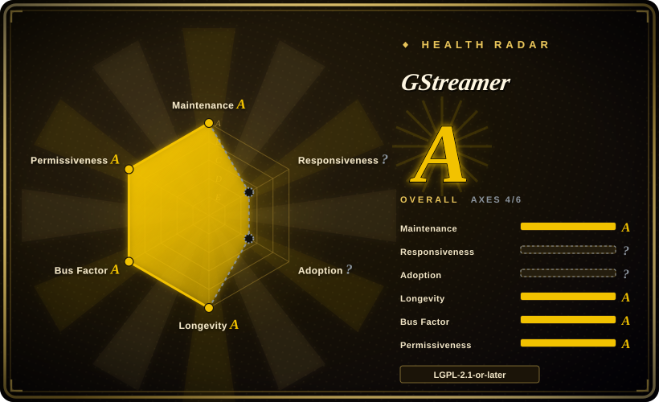

# GStreamer

A pipeline-based multimedia framework for building real-time audio/video processing applications — not a CLI tool, but a graph of pluggable elements you wire together in code.

## When to use

You're an embedded Linux engineer building an in-car infotainment system that must capture camera feeds, apply overlays, encode to H.264, and stream to a display — all with sub-frame latency and a tight CPU budget. You need fine-grained control over every stage: when buffers arrive, how they pass through filters, when they hit the encoder, and how the pipeline handles format negotiation between heterogeneous hardware. You don't want to shell out to a CLI per frame; you want a persistent, hot media graph running inside your application. You reach for GStreamer: you create a `GstPipeline`, add `v4l2src` → `videoconvert` → `x264enc` → `rtmpsink` elements, link their pads, set properties on the fly, and handle bus messages for EOS and errors. The same framework lets you swap the camera source for a network stream, or the encoder for a hardware-accelerated `vaapih264enc`, without rewriting the pipeline structure.

You also reach for it when you're a desktop developer building a GTK media player and want GObject-integrated media handling with play/pause/seek state machines. GStreamer's `playbin` and `decodebin` auto-plug elements for you, and its deep integration with GLib/GObject fits naturally into a GNOME/GTK app. You also reach for it when you need real-time audio processing — VoIP pipelines, DAW effects chains, or broadcast mixing — where sample-accurate synchronization and low-latency routing matter more than batch transcode throughput.

## When NOT to use

- **You just need to transcode a batch of files.** Use FFmpeg CLI instead. GStreamer is a programming framework, not a shell tool; writing a GStreamer pipeline in C/Python/Rust to do what `ffmpeg -i in -c:v libx264 out` does is massive overkill.
- **You want a quick one-liner or script without learning a new API.** GStreamer's learning curve is steep. You must understand elements, pads, bins, caps negotiation, bus messages, and state changes. Budget days or weeks, not minutes.
- **You're building a non-linear video editor (NLE).** GStreamer has editing primitives, but it is not a timeline editor. For multitrack cutting, effects authoring, and compositing, use an NLE framework like MLT/Shotcut or a dedicated editor.
- **You need end-user transcoding with presets.** HandBrake (GUI + CLI) is built for that; GStreamer is a library/framework for developers.
- **You're on Windows and want native media plumbing.** DirectShow and Media Foundation are the native Windows media frameworks; GStreamer runs on Windows but is not the idiomatic choice for Windows-only apps.
- **You just need audio routing on a Linux desktop.** For simple desktop audio (app-to-speaker, app-to-app), PulseAudio or PipeWire is the right layer. JACK is the right layer for pro-audio low-latency. GStreamer sits above them as the processing framework, not the audio server.

## Comparison

| Alternative | In index | Our verdict | Tradeoff |
|---|---|---|---|
| [FFmpeg](ffmpeg.md) | ✅ | Use FFmpeg for CLI batch transcoding, format conversion, and universal decode/encode. | FFmpeg is the universal CLI + library; GStreamer is a pipeline graph framework. FFmpeg excels at one-shot transformations; GStreamer excels at real-time, persistent, application-embedded pipelines. GStreamer often uses FFmpeg/libav codecs under the hood via plugins. |
| [HandBrake](handbrake.md) | ✅ | Use HandBrake for end-user preset-driven transcoding (GUI + CLI). | Built on FFmpeg/x264/x265; great for "rip to MP4/MKV" UX, not a library or pipeline framework. |
| [MLT](mlt.md) / Shotcut | 部分已收录 | Use MLT/Shotcut for NLE editing/compositing with a timeline model. | Multimedia framework for editing; sits above FFmpeg for codec work. Reach for it when you need an editor, not a real-time pipeline. |
| AWS Elemental MediaConvert | 未收录 | Use cloud transcoders for managed, elastic, pay-per-minute transcoding. | SaaS, not a self-hosted framework. Zero ops but vendor lock-in and per-minute cost. Often FFmpeg-derived internally. |
| VLC | 未收录 | Use VLC for a standalone media player with broad format support. | End-user player, not a framework for building your own app. |
| JACK / PulseAudio | 未收录 | Use JACK/PulseAudio for Linux desktop audio routing and pro-audio low-latency. | Audio servers, not video pipelines. GStreamer can use them as sinks but is a higher-level processing framework. |
| DirectShow / Media Foundation | 未收录 | Use Windows native frameworks for Windows-only media apps. | Windows-native; GStreamer is cross-platform but not the idiomatic Windows choice. |

## Tech stack

- **Language:** C (core), with GObject type system for element introspection and property binding.
- **Bindings:** Python (gst-python), Rust (gstreamer-rs), Java (gst1-java-core), JavaScript (GJS), Vala, C++.
- **Plugin architecture:** Everything is a plugin — sources, sinks, filters, codecs, muxers. Plugins are shared libraries loaded at runtime.
- **Core abstractions:** Elements (processing nodes), Pads (connection points), Bins/Pipelines (containers that manage state and linking), Buses (message passing for errors/EOS/state changes).
- **Auto-plugging:** `decodebin` and `playbin` auto-instantiate and link elements based on stream caps.
- **Hardware integration:** VAAPI, VA-API, VideoToolbox (macOS), DXVA/D3D11 (Windows), OpenMAX, V4L2 M2M.

## Dependencies

- **Core runtime:** GLib/GObject (GStreamer is deeply tied to the GLib ecosystem).
- **Build:** Meson build system, C toolchain, GLib development headers.
- **Optional codec/libs (selected via plugins):** FFmpeg/libav (via gst-libav), x264, x265, libvpx, libaom, libopus, etc. License of the final application depends on which plugins you load.
- **Platform-specific:** V4L2 (Linux video capture), ALSA/PulseAudio/PipeWire/JACK (Linux audio), Core Audio (macOS), DirectSound/WASAPI (Windows), OpenGL/Vulkan for GPU processing.
- **Note:** Some plugins are GPL-licensed; the LGPL-2.1+ core stays clean only if you avoid GPL plugins or comply with GPL terms.

## Ops difficulty

**Medium-High.** As a framework embedded in your application, "ops" means build integration and runtime plugin management: (1) **Plugin hell** — the right plugin must be present on the target system; missing plugins produce cryptic "no such element" errors at runtime. You must control the plugin set in your deployment (static linking, custom builds, or strict package manifests). (2) **Version coupling** — GStreamer releases are monolithic (1.x with matching -base, -good, -bad, -ugly, -libav packages), and mixing versions breaks ABI. (3) **Debugging complexity** — pipeline graphs, caps negotiation, pad linking, and state-machine transitions are opaque; you need `GST_DEBUG` logging, `gst-launch-1.0` prototyping, and `dot` graph dumps to diagnose issues. (4) **Memory and latency tuning** — buffer pools, thread scheduling, and queue depths need tuning for real-time constraints. The framework is stable, but operating it well in production requires expertise.

## Health & viability

- **Maintenance — very active, long-lived (since ~2001).** Regular releases (1.26.x as of 2026-07), continuous development by the GStreamer team. One of the most mature and consistently maintained multimedia frameworks.
- **Governance & bus factor — dedicated team under freedesktop.org.** Not a single maintainer; the GStreamer project has a core team with sustained contributions. Backed by the freedesktop.org infrastructure, not a single vendor's roadmap.
- **Age & Lindy verdict — ~25 years old and still active ⇒ extremely strong Lindy signal.** A framework that has survived multiple paradigm shifts (desktop → mobile → embedded → streaming) and remains the default choice for Linux embedded media. This is one of the safest longevity bets in the multimedia space.
- **Adoption & ecosystem — embedded Linux standard.** Widely used in automotive (IVI), set-top boxes, IoT cameras, and GTK desktop apps. Strong plugin ecosystem (good/bad/ugly/libav). Good documentation and a large body of community knowledge.
- **Risk flags — plugin licensing is the main trap.** The core is LGPL-2.1+, but the `-bad` and `-ugly` plugin sets contain GPL-licensed and patent-encumbered codecs. Some plugins also depend on FFmpeg/libav, inheriting its LGPL/GPL build complexity. Verify your plugin set before distributing proprietary binaries. No relicense history concerns.

## Caveats (unverified)

- [未验证] Exact active contributor count and bus-factor breakdown for the GStreamer core team as of 2026-07.
- [未验证] Specific plugin licensing within `-bad` and `-ugly` sets may vary by version and distro packaging; verify against your target's package manifest.
- [推断] GStreamer's dominance in "embedded Linux" is inferred from its prevalence in automotive and set-top-box documentation; actual market share is not publicly quantified.
- [推断] The "often uses FFmpeg/libav under the hood" claim applies to the gst-libav plugin set; native GStreamer plugins exist for many codecs and do not require FFmpeg.
