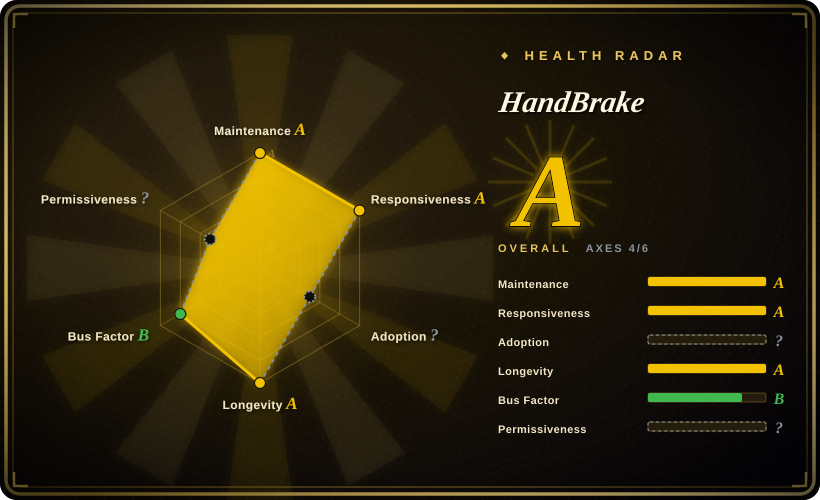

# HandBrake

Open-source video transcoder for converting video from nearly any format to modern, widely supported codecs — built on FFmpeg, x264, and x265 with a preset-driven GUI and a matching `HandBrakeCLI` command-line tool.

## When to use

You're a media archivist with a stack of DVDs and Blu-rays to convert into a modern, compressed library. You want a tool that handles the whole workflow — source scanning, title selection, subtitle/audio track picking, and output to a standard MP4 or MKV file with H.264/H.265 video and AAC/AC3 audio. You don't want to hand-craft FFmpeg command lines or write shell scripts. You fire up HandBrake, pick a preset ("Fast 1080p30", "HQ 2160p60 4K"), adjust a few knobs if needed, and queue up a batch of sources. The built-in GUI gives you a live preview of output settings, and for bulk jobs you switch to `HandBrakeCLI` to script the same presets headlessly. HandBrake shines when you need reliable, repeatable transcoding from optical media or file sources to a small set of modern output profiles without needing the full format flexibility of raw FFmpeg.

## When NOT to use

- **You need a programmable library to embed in an application.** HandBrake is an end-user application, not a library. Use FFmpeg's `libav*` or GStreamer's pipeline API instead.
- **You need complex filtergraphs or custom pixel/audio processing.** HandBrake's filter surface is intentionally narrow — deinterlace, denoise, crop/scale, and subtitle burn-in — compared to FFmpeg's `-vf`/`-af` filtergraph language.
- **You need format flexibility beyond MP4/MKV/WebM with H.264/H.265/AV1/VP9 and AAC/AC3/FLAC/Opus.** HandBrake is opinionated about output formats; it won't output ProRes, MPEG-2, or raw YUV the way FFmpeg will.
- **You need live streaming or real-time encoding for a broadcast pipeline.** HandBrake is file-to-file; it doesn't do streaming, adaptive-bitrate ladders, or low-latency pipelines.
- **You ship a proprietary, closed-source binary.** HandBrake is GPL-2.0-or-later and links GPL encoders (x264, x265). [推断]
- **You need a video editor with timeline, cuts, transitions, and multitrack compositing.** HandBrake transcodes entire titles; it doesn't edit. Use MLT/Shotcut or an NLE.

## Comparison

| Alternative | In index | Our verdict | Tradeoff |
|---|---|---|---|
| [FFmpeg](ffmpeg.md) | ✅ | Choose FFmpeg when you need the universal codec/format swiss-army-knife, library embedding, or custom filtergraphs. | The universal codec/format swiss-army-knife with limitless filtergraphs and library embedding; far steeper learning curve and no built-in GUI, but you control every knob. |
| [MLT](mlt.md) / Shotcut | 部分已收录 | Choose MLT/Shotcut when you need a timeline-based non-linear video editor or compositing framework. | Timeline-based NLE/compositing framework; sits above FFmpeg for actual codec work. Reach for it when you need editing, not just transcoding. |
| [GStreamer](gstreamer.md) | ✅ | Choose GStreamer when you need a composable pipeline framework for app-embedded or live-streaming media. | Composable pipeline framework for app-embedded or live-streaming media; steeper programming model, but more flexible for real-time and device pipelines than a file-to-file transcoder. |
| AWS Elemental MediaConvert / cloud transcoders | 未收录 | Choose cloud transcoders when you need elastic, managed, pay-per-minute transcoding without ops burden. | Managed, pay-per-minute transcoding services; zero ops and elastic scale, but vendor lock-in, per-minute cost, and a SaaS — not a repository you self-host. |
| VLC | 未收录 | Choose VLC when you need a media player with occasional conversion features, not a dedicated transcoder. | Primarily a media player; its conversion/export features are a side dish, not the main course. Use it for occasional one-off exports, not batch archival workflows. |

## Tech stack

- **Language:** C (core engine) with platform-specific GUI toolkits (GTK on Linux, Cocoa on macOS, UWP/WPF on Windows).
- **Core encoders:** FFmpeg/libavcodec (decode), x264 (H.264), x265 (H.265), SVT-AV1 (AV1), VP9, Theora.
- **Muxers:** MP4, MKV, WebM output via libavformat.
- **Filters:** Built-in deinterlace, denoise, crop, scale, rotate, and subtitle burn-in — a subset of FFmpeg's filtergraph capabilities exposed through a simplified UI.
- **Optical media:** libdvdread/libdvdnav (DVD), libbluray (Blu-ray), with optional libdvdcss for CSS-encrypted discs.

## Dependencies

- **Runtime:** FFmpeg libraries (libavcodec, libavformat, libavfilter, libswscale, libavutil), x264/x265/SVT-AV1 encoder libraries, libdvdread/libdvdnav/libbluray for optical media.
- **Optional:** libdvdcss for decrypting CSS-protected DVDs (may have legal restrictions in some jurisdictions).
- **Build:** autotools/cmake-based build system; builds the GUI and `HandBrakeCLI` from the same source tree.
- **Platform support:** Windows, macOS, Linux. Official binaries are distributed for all three.

## Ops difficulty

**Low.** HandBrake is a desktop application: download, install, and run. No server to configure, no database to manage, no daemon to keep alive. For CLI batch workflows, `HandBrakeCLI` is a single binary that takes preset JSON files or command-line flags. The main operational concern is keeping up with releases to pick up encoder improvements and security fixes; there's no network service or persistent state to back up.

## Health & viability

- **Maintenance:** Active, with regular releases (v1.9.x as of 2026-07). The project has been continuously maintained since 2003. [推断]
- **Governance:** Community-driven, not backed by a single vendor or foundation. Core team of approximately 3–5 maintainers. [推断]
- **Backing:** No major corporate backing; sustained by community contributions and donations. [推断]
- **Adoption:** Widely used for DVD/Blu-ray archival and personal media conversion. ~21k GitHub stars. [推断]
- **Risk flags:** GPL-2.0+ license is well-established. No relicense history. No notable recent CVEs. [推断]

## Caveats (unverified)

- [未验证] The exact number of active core maintainers is not confirmed from public sources.
- [推断] HandBrake links GPL-licensed encoders (x264, x265), so any derivative binary distribution is GPL.
- [推断] The project has been continuously maintained since 2003, but its governance model is volunteer-driven without foundation backing.
